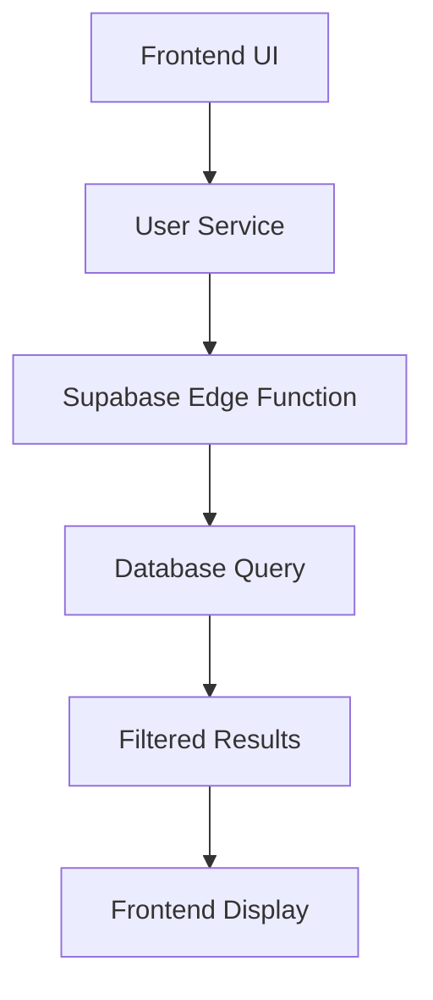

# Role Filter Implementation Design

## Overview

This design document outlines the implementation of role filtering functionality in the Supabase Edge Function for the user management system. The goal is to allow filtering users by role through query parameters while maintaining backward compatibility.

## Current Implementation Analysis

### Backend Function (`supabase/functions/users/index.ts`)
- Currently implements role filtering with a default value of 'user'
- When no role parameter is provided, it defaults to showing only users with the 'user' role
- This prevents showing all users when no specific role filter is desired

### Frontend Service (`src/lib/user-service.ts`)
- Implements role filtering in the `getUsers` method
- Passes role parameter to the backend function through query parameters
- Supports 'user', 'admin', 'manager', and 'all' role values

### Frontend UI (`src/pages/admin/AdminUsersPage.tsx`)
- Provides UI controls for role filtering
- Allows selection of specific roles or 'all' to show users of all roles
- Currently initializes the role filter to 'user' by default, which may not align with the desired behavior of showing all users when no filter is explicitly selected

## Problem Statement

The current implementation has a logical issue where:
1. When no role parameter is provided, it defaults to showing only 'user' role users
2. When 'all' role is selected in the UI, it's passed to the backend but not properly handled
3. This prevents administrators from viewing all users regardless of role

## Proposed Solution

### Backend Changes (`supabase/functions/users/index.ts`)

1. Remove the default 'user' role assignment
2. Only apply role filtering when a role parameter is explicitly provided
3. Treat 'all' as a special value that bypasses role filtering entirely

### Implementation Details

```javascript
// Current implementation (problematic)
const role = searchParams.get('role') || 'user';
if (role && role !== 'all') {
  query = query.eq('role', role);
}

// Proposed implementation
const role = searchParams.get('role');
if (role && role !== 'all') {
  query = query.eq('role', role);
}
// When role is 'all' or not provided, no role filter is applied
```

This change ensures that:
- When no role parameter is provided, all users are returned
- When role='all' is specified, all users are returned
- When a specific role is provided (user, admin, manager), only users with that role are returned

## Architecture

### Data Flow


### Component Interaction
1. User selects role filter in Admin UI
2. `useUsers` hook calls `UserService.getUsers` with filters
3. `UserService` makes request to Supabase Edge Function with query parameters
4. Edge Function applies appropriate filters based on parameters
5. Database returns filtered results
6. Frontend displays filtered user list

## API Specification

### Query Parameters
| Parameter | Type | Description | Example Values |
|-----------|------|-------------|----------------|
| role | string | Filter users by role | 'user', 'admin', 'manager', 'all' |
| search | string | Search in name or email | 'john', 'company.com' |
| status | string | Filter by user status | 'active', 'inactive', 'all' |
| sortBy | string | Sort field | 'created_at', 'name', 'email' |
| sortOrder | string | Sort direction | 'asc', 'desc' |
| page | number | Page number | 1, 2, 3... |
| limit | number | Items per page | 10, 20, 50... |

### Filter Logic
1. When `role` parameter is not provided: Show all users (no role filter)
2. When `role` parameter is 'all': Show all users (no role filter)
3. When `role` parameter is a specific role ('user', 'admin', 'manager'): Show only users with that role

## Implementation Plan

### Phase 1: Backend Function Update
1. Modify the role filtering logic in `supabase/functions/users/index.ts`
2. Update the count query to match the new filtering logic
3. Test with different role parameter values

### Specific Code Changes

In the GET /users endpoint, change the role filtering logic from:

```javascript
// Apply role filter - default to 'user' if not specified
const role = searchParams.get('role') || 'user';
if (role && role !== 'all') {
  query = query.eq('role', role);
}
```

to:

```javascript
// Apply role filter - only filter when role is explicitly specified and not 'all'
const role = searchParams.get('role');
if (role && role !== 'all') {
  query = query.eq('role', role);
}
```

Similarly, update the count query logic to match this new behavior.

### Phase 2: Testing
1. Test with no role parameter (should show all users)
2. Test with role='all' (should show all users)
3. Test with role='user' (should show only users with 'user' role)
4. Test with role='admin' (should show only users with 'admin' role)
5. Test with role='manager' (should show only users with 'manager' role)

### Phase 3: Frontend Verification
1. Verify that UI controls work correctly with updated backend
2. Test pagination with different role filters
3. Ensure backward compatibility with existing code

## Security Considerations

1. Maintain existing authentication and authorization checks
2. Ensure only admin users can access the users endpoint
3. Validate all input parameters to prevent injection attacks
4. Maintain proper CORS headers

## Testing Strategy

### Unit Tests
1. Test role filtering logic with different parameter values:
   - No role parameter (should return all users)
   - role='all' (should return all users)
   - role='user' (should return only users with 'user' role)
   - role='admin' (should return only users with 'admin' role)
   - role='manager' (should return only users with 'manager' role)
2. Test combination of role filter with other filters (search, status)
3. Test edge cases (invalid role values, missing parameters)

### Integration Tests
1. Test end-to-end flow from UI to database
2. Test pagination with different role filters
3. Test sorting with different role filters

### Manual Testing
1. Verify UI behavior with different role selections
2. Test performance with large datasets
3. Verify error handling and edge cases

## Expected Behavior After Implementation

After implementing the changes, the following behavior is expected:

1. When no role parameter is provided in the request, all users regardless of role will be returned
2. When role='all' is specified, all users regardless of role will be returned
3. When role='user' is specified, only users with the 'user' role will be returned
4. When role='admin' is specified, only users with the 'admin' role will be returned
5. When role='manager' is specified, only users with the 'manager' role will be returned

## Frontend Recommendation

To align with the new backend behavior, consider updating the initial role filter value in `AdminUsersPage.tsx`:

```javascript
// Current initialization
role: "user", // Add default role filter

// Recommended initialization
role: "all", // Show all users by default
```

This change would make the UI behavior match the backend behavior where no role filter shows all users.

## Backward Compatibility

The proposed changes maintain backward compatibility:
1. Existing code that passes specific role values will continue to work
2. The 'all' role value will now work as expected
3. Missing role parameters will now show all users instead of just 'user' role users

## Rollback Plan

If issues are discovered after deployment:
1. Revert the changes to `supabase/functions/users/index.ts`
2. Restore the previous default role filtering behavior
3. Monitor application logs for any related errors

## Conclusion

This design addresses the core issue where role filtering was not working as expected due to a default 'user' role being applied even when no role filter was specified. The proposed solution maintains backward compatibility while providing the expected behavior for all role filter scenarios. The changes are minimal and focused, reducing the risk of introducing new issues.