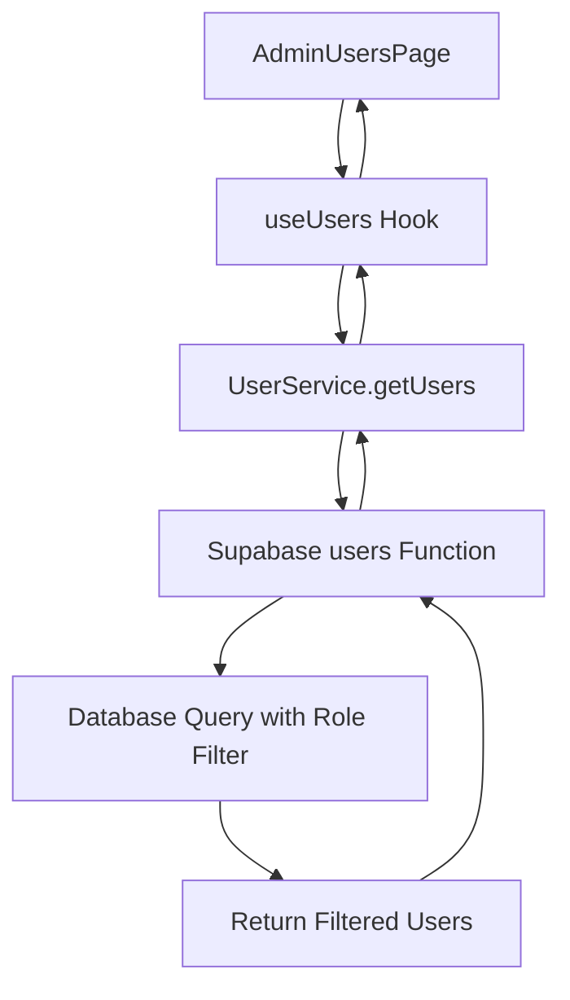

# Admin User Filtering Design Document

## Overview

This document outlines the design for implementing user filtering on the admin users page to display only regular users (role = 'user') who registered through the user registration page, excluding admins and managers.

## Requirements

- Filter users to show only those with role = 'user'
- Exclude admins and managers from the user list
- Maintain existing search and pagination functionality
- Keep the UI/UX consistent with the current implementation

## Architecture

### Current Implementation

The current admin users page (`/src/pages/admin/AdminUsersPage.tsx`) fetches users through the `useUsers` hook which calls the `UserService.getUsers()` method. This method invokes the Supabase `users` function which queries the `profiles` table without any role filtering.

### Proposed Changes

1. Add role filtering to the backend `users` Supabase function
2. Modify the frontend to pass the role filter parameter
3. Update the UI to include role-specific filtering controls

## Implementation Plan

### Backend Changes

1. **Modify Supabase Users Function** (`/supabase/functions/users/index.ts`)
   - Add role filtering to the GET endpoint
   - Default to filtering by role = 'user' when no role filter is specified
   - Allow overriding the filter through query parameters

2. **Database Query Update**
   - Add `.eq('role', 'user')` condition to the profiles query
   - Support optional role parameter for flexibility

### Frontend Changes

1. **Update UserService** (`/src/lib/user-service.ts`)
   - Add role parameter to `getUsers` method
   - Pass role parameter to the Supabase function call

2. **Update useUsers Hook** (`/src/hooks/useUsers.ts`)
   - Add role parameter to the hook
   - Default to 'user' role filter

3. **Update AdminUsersPage** (`/src/pages/admin/AdminUsersPage.tsx`)
   - Modify the useUsers hook call to include role filter
   - Add UI controls for role filtering if needed

4. **Update UsersTable Component** (`/src/components/admin/UsersTable.tsx`)
   - No changes required as filtering is handled at the data level

## Implementation Details

### Backend Implementation

The Supabase users function will be modified to include role-based filtering in the GET endpoint. By default, the function will filter to show only users with role = 'user'. The implementation will:

1. Add role filtering to the database query
2. Default to filtering by role = 'user' when no role filter is specified
3. Allow overriding the filter through query parameters for flexibility

### Frontend Implementation

The frontend implementation will involve updating three key components:

1. **UserService Update**
   - Add role parameter to the getUsers method
   - Pass the role parameter to the Supabase function call

2. **useUsers Hook Update**
   - Add role parameter to the hook interface
   - Set default role filter to 'user' to show only regular users

3. **AdminUsersPage Update**
   - Modify the useUsers hook call to include the role filter
   - Set the default role filter to 'user' to exclude admins and managers

### Data Flow

The data flow will be updated to include role-based filtering:
1. AdminUsersPage requests users with role filter
2. useUsers hook passes filter parameters to UserService
3. UserService calls Supabase function with role parameter
4. Supabase function queries database with role filter
5. Database returns only users with specified role
6. Results are displayed in the AdminUsersPage

## Security Considerations

- The filtering is performed server-side to prevent clients from accessing unauthorized data
- Only admins can access the users function, maintaining proper access controls
- The default role filter ensures that regular users cannot accidentally access admin or manager lists

## Testing Plan

1. **Backend Testing**
   - Verify that the users function returns only users with role = 'user' by default
   - Test role parameter override functionality
   - Confirm that admins and managers are excluded from the default user list

2. **Frontend Testing**
   - Verify that the AdminUsersPage displays only regular users
   - Test search and pagination functionality with role filtering
   - Confirm that UI controls work as expected

3. **Integration Testing**
   - Test end-to-end flow from admin page to database query
   - Verify that performance is not significantly impacted by additional filtering
   - Confirm that error handling works correctly

## Rollout Plan

1. Deploy backend changes to Supabase functions
2. Update frontend code in the following order:
   - UserService
   - useUsers hook
   - AdminUsersPage
3. Test in development environment
4. Deploy to production
5. Monitor for any issues

## Future Enhancements

- Add UI controls to allow admins to switch between viewing different user roles
- Implement additional filtering options (e.g., registration date, activity status)
- Add export functionality for filtered user lists