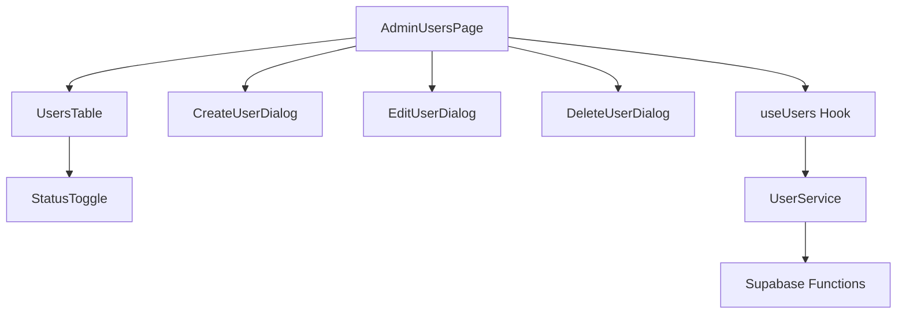
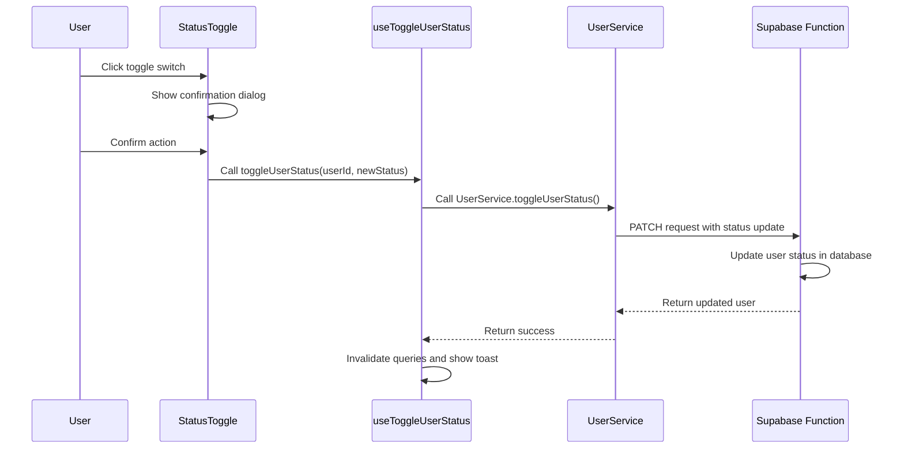

# Admin User Management Fix Design Document

## 1. Overview

This document outlines the design and implementation plan to fix the issues with the admin user management functionality in the Lovable Rise application. The identified problems include:

1. User activation/deactivation not working properly
2. User deletion functionality not working
3. Adding new users not functioning correctly
4. Filtering and search functionality issues

## 2. Current Architecture

The admin user management system consists of the following components:

### Component Structure


### Data Flow
1. AdminUsersPage fetches users via useUsers hook
2. useUsers hook calls UserService methods
3. UserService makes requests to Supabase functions
4. Supabase functions interact with the database
5. Responses are returned back through the chain

## 3. Identified Issues

### 3.1 User Activation/Deactivation Issues
- The StatusToggle component shows a confirmation dialog but the actual toggle functionality may not be working
- The useToggleUserStatus hook may not be properly updating the user status

### 3.2 User Deletion Issues
- The DeleteUserDialog calls the deleteUser method but it only deactivates users instead of actually deleting them
- The Supabase function for DELETE method only updates status to "inactive"

### 3.3 User Creation Issues
- The CreateUserDialog form submission may not be properly sending data to the backend
- Validation errors might not be properly handled

### 3.4 Filtering Issues
- Filter functionality in AdminUsersPage may not be properly passing filter parameters to the backend
- The Supabase function doesn't implement filtering logic

## 4. Proposed Solutions

### 4.1 Fix User Activation/Deactivation


### 4.2 Fix User Deletion
Modify the deleteUser function in UserService to properly delete users:

1. Update the Supabase function to actually delete users instead of just deactivating them
2. Add proper error handling for deletion failures
3. Ensure the UI properly reflects deletion success/failure

### 4.3 Fix User Creation
Improve the createUser flow:

1. Ensure all form data is properly validated before submission
2. Handle API errors appropriately in the UI
3. Show proper loading states during creation process

### 4.4 Fix Filtering
Implement proper filtering in both frontend and backend:

1. Pass filter parameters from AdminUsersPage to the useUsers hook
2. Update the Supabase function to handle filtering parameters
3. Implement search, status filter, and sorting functionality

## 5. Implementation Plan

### 5.1 Backend Changes (Supabase Functions)

#### Update users function to support filtering:
```typescript
// In supabase/functions/users/index.ts
// GET method with filtering support
if (req.method === 'GET' && !userId) {
  const url = new URL(req.url)
  const searchParams = url.searchParams
  
  let query = supabaseClient
    .from('profiles')
    .select('*')
  
  // Apply search filter
  const search = searchParams.get('search')
  if (search) {
    query = query.or(`name.ilike.%${search}%,email.ilike.%${search}%`)
  }
  
  // Apply status filter
  const status = searchParams.get('status')
  if (status && status !== 'all') {
    query = query.eq('status', status)
  }
  
  // Apply sorting
  const sortBy = searchParams.get('sortBy') || 'created_at'
  const sortOrder = searchParams.get('sortOrder') || 'desc'
  query = query.order(sortBy, { ascending: sortOrder === 'asc' })
  
  // Apply pagination
  const page = parseInt(searchParams.get('page') || '1')
  const limit = parseInt(searchParams.get('limit') || '10')
  const offset = (page - 1) * limit
  query = query.range(offset, offset + limit - 1)
  
  const { data: users, error } = await query

  if (error) {
    console.log('Users fetch error:', error)
    return new Response(
      JSON.stringify({ error: 'Failed to fetch users' }),
      { 
        status: 500, 
        headers: { ...corsHeaders }
      }
    )
  }

  return new Response(
    JSON.stringify({ users }),
    { 
      headers: { ...corsHeaders }
    }
  )
}
```

#### Update DELETE method to actually delete users:
```typescript
// DELETE /users/:id - delete user completely
if (req.method === 'DELETE' && userId) {
  // First delete auth user
  const { error: authError } = await supabaseClient.auth.admin.deleteUser(userId)
  
  if (authError) {
    console.log('Auth user deletion error:', authError)
    return new Response(
      JSON.stringify({ error: 'Failed to delete user authentication' }),
      { 
        status: 500, 
        headers: { ...corsHeaders }
      }
    )
  }
  
  // Then delete profile
  const { data: user, error: profileError } = await supabaseClient
    .from('profiles')
    .delete()
    .eq('id', userId)
    .select()
    .maybeSingle()

  if (profileError) {
    console.log('Profile deletion error:', profileError)
    return new Response(
      JSON.stringify({ error: 'Failed to delete user profile' }),
      { 
        status: 500, 
        headers: { ...corsHeaders }
      }
    )
  }

  return new Response(
    JSON.stringify({ user }),
    { 
      headers: { ...corsHeaders }
    }
  )
}
```

### 5.2 Frontend Changes

#### Update UserService to properly pass filter parameters:
```typescript
// In src/lib/user-service.ts
static async getUsers(
  filters: UserFilters = {},
  pagination: PaginationParams = { page: 1, limit: 10 }
): Promise<UsersResponse> {
  try {
    // Build query parameters
    const queryParams = new URLSearchParams();
    
    // Add filters
    if (filters.search) queryParams.append('search', filters.search);
    if (filters.status && filters.status !== 'all') queryParams.append('status', filters.status);
    if (filters.sortBy) queryParams.append('sortBy', filters.sortBy);
    if (filters.sortOrder) queryParams.append('sortOrder', filters.sortOrder);
    
    // Add pagination
    queryParams.append('page', pagination.page.toString());
    queryParams.append('limit', pagination.limit.toString());
    
    const response = await supabase.functions.invoke("users", {
      method: "GET",
      headers: { 
        "Content-Type": "application/json",
        "Authorization": `Bearer ${(await supabase.auth.getSession()).data.session?.access_token}`
      },
      body: JSON.stringify({
        ...filters,
        ...pagination,
      }),
    });

    if (response.error) {
      throw new Error(response.error.message || "Failed to fetch users");
    }

    return response.data;
  } catch (error) {
    console.error("Error fetching users:", error);
    throw new Error(error instanceof Error ? error.message : "Failed to fetch users");
  }
}
```

#### Fix the useUsers hook to properly pass parameters:
```typescript
// In src/hooks/useUsers.ts
export function useUsers(filters: UserFilters = {}, pagination: PaginationParams = { page: 1, limit: 10 }) {
  return useQuery({
    queryKey: userQueries.list(filters, pagination),
    queryFn: () => UserService.getUsers(filters, pagination),
    staleTime: 5 * 60 * 1000, // 5 minutes
    gcTime: 10 * 60 * 1000, // 10 minutes (formerly cacheTime)
  });
}
```

## 6. Testing Strategy

### 6.1 Unit Tests
- Test UserService methods with mock data
- Test useUsers hook functionality
- Test form validation in CreateUserDialog and EditUserDialog

### 6.2 Integration Tests
- Test complete flow from UI to backend for user creation
- Test user activation/deactivation functionality
- Test user deletion functionality
- Test filtering and search functionality

### 6.3 Manual Testing
- Verify all CRUD operations work correctly
- Test edge cases like invalid inputs
- Verify proper error handling and user feedback
- Test responsive design on different screen sizes

## 7. Security Considerations

1. Ensure only admin users can access user management functions
2. Validate all input data on both frontend and backend
3. Implement proper error handling to avoid exposing sensitive information
4. Use proper authentication tokens for all API requests

## 8. Performance Considerations

1. Implement proper pagination to avoid loading too many users at once
2. Use query caching to reduce unnecessary API calls
3. Optimize database queries in Supabase functions
4. Implement loading states for better user experience

## 9. Error Handling

1. Display user-friendly error messages for all failure cases
2. Log errors appropriately for debugging
3. Implement retry mechanisms for transient failures
4. Provide clear feedback for successful operations
