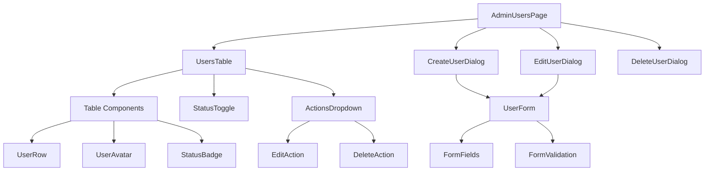
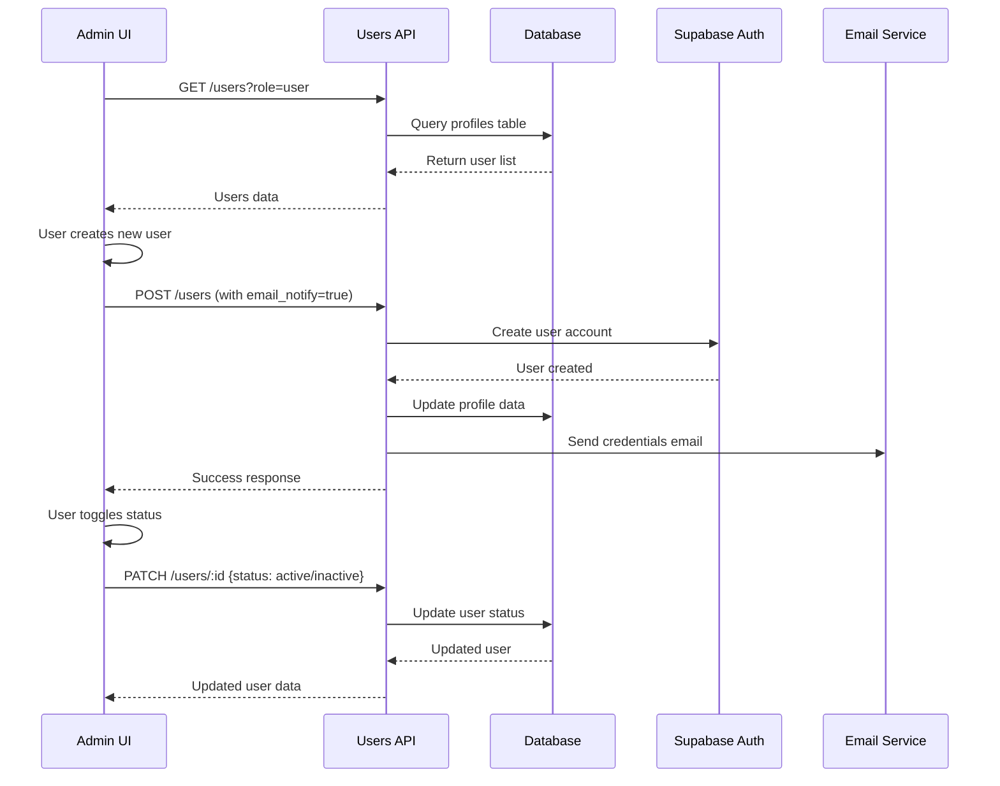
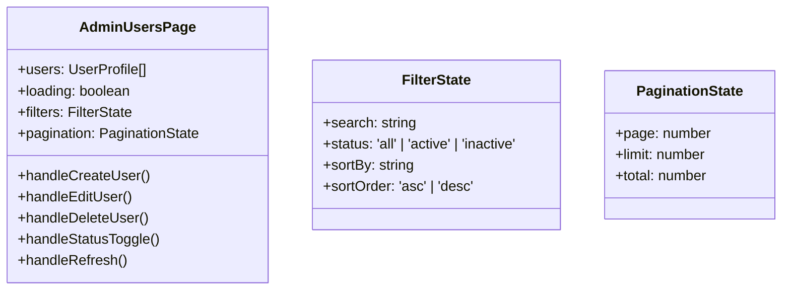
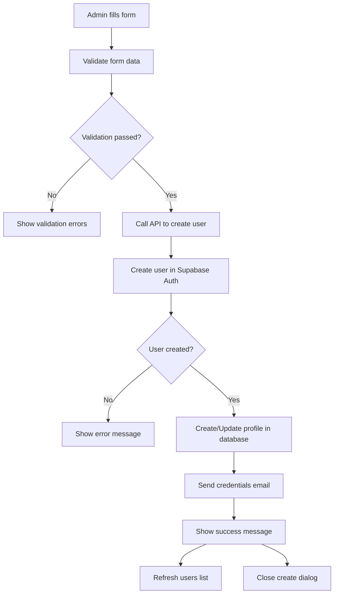
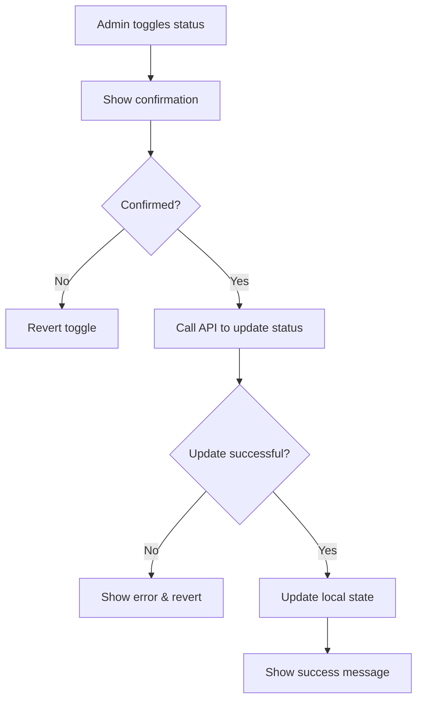

# Admin User Management System Design

## Overview

This design document outlines the implementation of a comprehensive user management system for the admin dashboard. The system will allow administrators to view, create, edit, and manage users with the "user" role through a modern table interface with internationalization support.

## Technology Stack & Dependencies

### Frontend Technologies
- **React 18** with TypeScript for component development
- **React Router DOM** for navigation and routing
- **Tailwind CSS** for styling with shadcn/ui components
- **Lucide React** for icons
- **Tanstack React Query** for data fetching and caching
- **React Hook Form** with Zod validation for form handling
- **Sonner** for toast notifications

### Backend Technologies
- **Supabase Edge Functions** for API endpoints
- **PostgreSQL** with Row Level Security (RLS)
- **Supabase Auth** for user authentication and creation

### Internationalization
- **React i18next** for multi-language support (Ukrainian/English)

## Architecture

### Component Architecture



### Data Flow Architecture



### API Endpoints Reference

#### GET /users
- **Purpose**: Retrieve all users with role "user"
- **Query Parameters**: 
  - `role=user` (filter by role)
  - `page` (pagination)
  - `limit` (items per page)
- **Response Schema**:
```typescript
{
  users: Array<{
    id: string;
    email: string;
    name: string;
    phone?: string;
    status: 'active' | 'inactive';
    role: 'user';
    created_at: string;
    updated_at: string;
    avatar_url?: string;
  }>;
  total: number;
  page: number;
  limit: number;
}
```

#### POST /users
- **Purpose**: Create new user with role "user"
- **Request Schema**:
```typescript
{
  email: string;
  password: string;
  name: string;
  phone?: string;
  role: 'user';
  notify_by_email: boolean;
}
```
- **Response Schema**:
```typescript
{
  user: UserProfile;
  message: string;
}
```

#### PATCH /users/:id
- **Purpose**: Update user information
- **Request Schema**:
```typescript
{
  name?: string;
  phone?: string;
  status?: 'active' | 'inactive';
}
```

#### DELETE /users/:id
- **Purpose**: Soft delete user (set status to inactive)
- **Response**: Updated user with inactive status

### Data Models & ORM Mapping

#### User Profile Model
```typescript
interface UserProfile {
  id: string;
  email: string;
  name: string;
  phone?: string;
  role: 'user' | 'admin' | 'manager';
  status: 'active' | 'inactive';
  created_at: string;
  updated_at: string;
  avatar_url?: string;
}
```

#### Database Schema
```sql
-- Profiles table (existing)
CREATE TABLE public.profiles (
  id UUID NOT NULL REFERENCES auth.users(id) ON DELETE CASCADE,
  email TEXT NOT NULL UNIQUE,
  name TEXT NOT NULL,
  phone TEXT,
  role public.user_role NOT NULL DEFAULT 'user',
  status public.user_status NOT NULL DEFAULT 'active',
  avatar_url TEXT,
  created_at TIMESTAMP WITH TIME ZONE NOT NULL DEFAULT now(),
  updated_at TIMESTAMP WITH TIME ZONE NOT NULL DEFAULT now(),
  PRIMARY KEY (id)
);
```

## Component Specifications

### AdminUsersPage Component

Main container component that manages the users list page state and navigation.



#### Key Features:
- Real-time data fetching with React Query
- Search and filter functionality
- Pagination support
- Bulk operations support
- Export functionality

### UsersTable Component

Data display component using the existing Table UI components.

#### Table Structure:
| Column | Type | Description | Sortable |
|--------|------|-------------|----------|
| Customer | Avatar + Name | User profile with avatar | Yes |
| Status | Toggle Switch | Active/Inactive status | Yes |
| Email Address | Text | User email | Yes |
| Phone | Text | Phone number | No |
| Created | Date | Registration date | Yes |
| Actions | Dropdown | Edit/Delete actions | No |

#### Status Toggle Component
```typescript
interface StatusToggleProps {
  userId: string;
  status: 'active' | 'inactive';
  onToggle: (userId: string, newStatus: 'active' | 'inactive') => void;
  disabled?: boolean;
}
```

### Form Components

#### CreateUserForm
```typescript
interface CreateUserFormData {
  email: string;
  password: string;
  name: string;
  phone?: string;
  notify_by_email: boolean;
}
```

#### EditUserForm
```typescript
interface EditUserFormData {
  name: string;
  phone?: string;
  email: string; // readonly
}
```

#### Form Validation Schema
```typescript
const createUserSchema = z.object({
  email: z.string().email('Invalid email address'),
  password: z.string().min(8, 'Password must be at least 8 characters'),
  name: z.string().min(2, 'Name must be at least 2 characters'),
  phone: z.string().optional(),
  notify_by_email: z.boolean().default(true)
});

const editUserSchema = z.object({
  name: z.string().min(2, 'Name must be at least 2 characters'),
  phone: z.string().optional(),
  email: z.string().email().readonly()
});
```

## Routing & Navigation

### Route Structure
```
/admin/users - Main users list page
/admin/users/create - Create new user page (modal alternative)
/admin/users/:id/edit - Edit user page (modal alternative)
```

### Route Integration
The users management will be integrated into the existing admin menu structure:

```typescript
// Add to admin menu items
{
  id: 'users',
  title: 'Users',
  path: '/users',
  page_type: 'list',
  icon_name: 'users',
  section_type: 'main',
  order_index: 2
}
```

## State Management

### React Query Integration

#### Query Keys Structure
```typescript
const userQueries = {
  all: ['users'] as const,
  lists: () => [...userQueries.all, 'list'] as const,
  list: (filters: UserFilters) => [...userQueries.lists(), filters] as const,
  details: () => [...userQueries.all, 'detail'] as const,
  detail: (id: string) => [...userQueries.details(), id] as const,
};
```

#### Custom Hooks
```typescript
function useUsers(filters: UserFilters) {
  return useQuery({
    queryKey: userQueries.list(filters),
    queryFn: () => fetchUsers(filters),
    staleTime: 5 * 60 * 1000, // 5 minutes
  });
}

function useCreateUser() {
  const queryClient = useQueryClient();
  
  return useMutation({
    mutationFn: createUser,
    onSuccess: () => {
      queryClient.invalidateQueries({ queryKey: userQueries.lists() });
      toast.success('User created successfully');
    },
    onError: (error) => {
      toast.error(error.message);
    },
  });
}
```

### Local State Management
- Form state managed by React Hook Form
- UI state (modals, filters) managed by React useState
- Global user list state managed by React Query

## API Integration Layer

### Service Layer Architecture

```typescript
class UserService {
  static async getUsers(filters: UserFilters): Promise<UsersResponse> {
    const params = new URLSearchParams({
      role: 'user',
      ...filters
    });
    
    const response = await supabase.functions.invoke('users', {
      method: 'GET',
      headers: { 'Content-Type': 'application/json' },
    });
    
    if (response.error) throw new Error(response.error.message);
    return response.data;
  }
  
  static async createUser(userData: CreateUserData): Promise<UserProfile> {
    const response = await supabase.functions.invoke('users', {
      method: 'POST',
      body: JSON.stringify({
        ...userData,
        role: 'user',
        email_confirm: true // Skip email confirmation for admin-created users
      }),
    });
    
    if (response.error) throw new Error(response.error.message);
    return response.data.user;
  }
  
  static async updateUser(id: string, data: UpdateUserData): Promise<UserProfile> {
    const response = await supabase.functions.invoke(`users/${id}`, {
      method: 'PATCH',
      body: JSON.stringify(data),
    });
    
    if (response.error) throw new Error(response.error.message);
    return response.data.user;
  }
  
  static async deleteUser(id: string): Promise<UserProfile> {
    const response = await supabase.functions.invoke(`users/${id}`, {
      method: 'DELETE',
    });
    
    if (response.error) throw new Error(response.error.message);
    return response.data.user;
  }
}
```

### Error Handling Strategy

```typescript
class ApiError extends Error {
  constructor(
    message: string,
    public status: number,
    public code?: string
  ) {
    super(message);
    this.name = 'ApiError';
  }
}

function handleApiError(error: unknown): ApiError {
  if (error instanceof ApiError) return error;
  
  if (error && typeof error === 'object' && 'message' in error) {
    return new ApiError(error.message as string, 500);
  }
  
  return new ApiError('An unexpected error occurred', 500);
}
```

## Business Logic Layer

### User Creation Workflow



### Status Toggle Workflow



### Email Notification System

When an admin creates a user, the system sends an email with login credentials:

```typescript
interface EmailTemplate {
  to: string;
  subject: string;
  html: string;
  text: string;
}

function generateWelcomeEmail(user: UserProfile, password: string): EmailTemplate {
  return {
    to: user.email,
    subject: 'Welcome to MarketGrow - Your Account Details',
    html: `
      <h2>Welcome to MarketGrow!</h2>
      <p>Your account has been created by an administrator.</p>
      <p><strong>Login Credentials:</strong></p>
      <p>Email: ${user.email}</p>
      <p>Password: ${password}</p>
      <p>Please login and change your password on first access.</p>
    `,
    text: `Welcome to MarketGrow! Your login credentials: Email: ${user.email}, Password: ${password}`
  };
}
```

## Styling Strategy

### Design System Integration

The user management interface follows the existing design system:

#### Color Scheme
- **Primary**: Emerald (#10b981) for active states and CTAs
- **Success**: Green for active status indicators
- **Warning**: Yellow for inactive status indicators
- **Destructive**: Red for delete actions

#### Component Styling
```typescript
// Status badge styles
const statusVariants = {
  active: "bg-green-100 text-green-800 border-green-200",
  inactive: "bg-yellow-100 text-yellow-800 border-yellow-200"
};

// Action button styles
const actionVariants = {
  edit: "text-blue-600 hover:text-blue-800",
  delete: "text-red-600 hover:text-red-800"
};
```

### Responsive Design

#### Breakpoint Strategy
- **Mobile (sm)**: Stack table content, show essential columns only
- **Tablet (md)**: Show condensed table with dropdown actions
- **Desktop (lg+)**: Full table layout with all columns

#### Mobile Table Adaptation
```typescript
const mobileColumns = [
  { key: 'customer', label: 'User' },
  { key: 'status', label: 'Status' },
  { key: 'actions', label: 'Actions' }
];

const desktopColumns = [
  { key: 'customer', label: 'Customer' },
  { key: 'status', label: 'Status' },
  { key: 'email', label: 'Email Address' },
  { key: 'phone', label: 'Phone' },
  { key: 'created', label: 'Created' },
  { key: 'actions', label: 'Actions' }
];
```

## Internationalization

### Language Support

#### Supported Languages
- **Ukrainian (uk)**: Primary language
- **English (en)**: Secondary language

#### Translation Keys Structure
```typescript
const translations = {
  uk: {
    users: {
      title: 'Користувачі',
      create: 'Додати користувача',
      edit: 'Редагувати користувача',
      delete: 'Видалити користувача',
      status: {
        active: 'Активний',
        inactive: 'Неактивний'
      },
      table: {
        customer: 'Клієнт',
        status: 'Статус',
        email: 'Електронна пошта',
        phone: 'Телефон',
        created: 'Створено',
        actions: 'Дії'
      },
      actions: {
        edit: 'Редагувати',
        delete: 'Видалити',
        view: 'Переглянути'
      },
      form: {
        name: 'Ім\'я',
        email: 'Електронна пошта',
        password: 'Пароль',
        phone: 'Телефон',
        notifyByEmail: 'Надіслати дані на пошту'
      }
    }
  },
  en: {
    users: {
      title: 'Users',
      create: 'Add User',
      edit: 'Edit User',
      delete: 'Delete User',
      status: {
        active: 'Active',
        inactive: 'Inactive'
      },
      table: {
        customer: 'Customer',
        status: 'Status',
        email: 'Email Address',
        phone: 'Phone',
        created: 'Created',
        actions: 'Actions'
      },
      actions: {
        edit: 'Edit',
        delete: 'Delete',
        view: 'View'
      },
      form: {
        name: 'Name',
        email: 'Email',
        password: 'Password',
        phone: 'Phone',
        notifyByEmail: 'Send credentials by email'
      }
    }
  }
};
```

### Dynamic Language Switching
```typescript
function useUserTranslations() {
  const { t, i18n } = useTranslation();
  
  return {
    t: (key: string) => t(`users.${key}`),
    currentLanguage: i18n.language,
    changeLanguage: i18n.changeLanguage
  };
}
```

## Testing Strategy

### Unit Testing

#### Component Tests
```typescript
describe('UsersTable', () => {
  it('should render user list correctly', () => {
    const mockUsers = createMockUsers();
    render(<UsersTable users={mockUsers} />);
    
    expect(screen.getByText(mockUsers[0].name)).toBeInTheDocument();
    expect(screen.getByText(mockUsers[0].email)).toBeInTheDocument();
  });
  
  it('should handle status toggle', async () => {
    const mockUser = createMockUser({ status: 'active' });
    const onToggle = jest.fn();
    
    render(<StatusToggle user={mockUser} onToggle={onToggle} />);
    
    await user.click(screen.getByRole('switch'));
    expect(onToggle).toHaveBeenCalledWith(mockUser.id, 'inactive');
  });
});
```

#### Service Tests
```typescript
describe('UserService', () => {
  it('should fetch users with correct filters', async () => {
    const mockResponse = { users: [], total: 0 };
    mockSupabase.functions.invoke.mockResolvedValue({ data: mockResponse });
    
    const result = await UserService.getUsers({ role: 'user' });
    
    expect(mockSupabase.functions.invoke).toHaveBeenCalledWith('users', {
      method: 'GET',
      headers: { 'Content-Type': 'application/json' }
    });
    expect(result).toEqual(mockResponse);
  });
});
```

### Integration Testing

#### E2E User Workflows
```typescript
describe('User Management E2E', () => {
  it('should complete full user creation workflow', async () => {
    // Navigate to users page
    await page.goto('/admin/users');
    
    // Click create user button
    await page.click('[data-testid="create-user-btn"]');
    
    // Fill form
    await page.fill('[name="name"]', 'Test User');
    await page.fill('[name="email"]', 'test@example.com');
    await page.fill('[name="password"]', 'testpassword123');
    
    // Submit form
    await page.click('[type="submit"]');
    
    // Verify user appears in table
    await expect(page.locator('text=Test User')).toBeVisible();
    await expect(page.locator('text=test@example.com')).toBeVisible();
  });
});
```

### Performance Testing

#### Load Testing Scenarios
- List 1000+ users with pagination
- Rapid status toggles
- Concurrent user operations
- Search and filter performance

#### Metrics to Monitor
- Initial page load time (< 2s)
- Table rendering time (< 500ms)
- API response time (< 1s)
- Memory usage during operations

## Error Handling & Edge Cases

### Error Scenarios

#### Network Errors
```typescript
function handleNetworkError(error: Error) {
  toast.error(t('errors.networkError'), {
    action: {
      label: t('actions.retry'),
      onClick: () => queryClient.refetchQueries()
    }
  });
}
```

#### Validation Errors
```typescript
function handleValidationError(errors: ValidationError[]) {
  errors.forEach(error => {
    toast.error(`${error.field}: ${error.message}`);
  });
}
```

#### Permission Errors
```typescript
function handlePermissionError() {
  toast.error(t('errors.insufficientPermissions'));
  navigate('/admin/dashboard');
}
```

### Edge Cases

1. **Empty State**: No users with "user" role exist
2. **Large Dataset**: 10,000+ users with pagination
3. **Concurrent Modifications**: Multiple admins editing same user
4. **Network Interruption**: Offline state handling
5. **Invalid Data**: Corrupted user profiles
6. **Email Delivery Failure**: Credential email not sent

### Fallback Strategies

#### Offline Support
```typescript
function useOfflineUsers() {
  const [offlineUsers, setOfflineUsers] = useLocalStorage('offline-users', []);
  const isOnline = useOnlineStatus();
  
  return {
    users: isOnline ? queryUsers.data : offlineUsers,
    isOffline: !isOnline,
    syncWhenOnline: () => {
      if (isOnline) {
        queryClient.refetchQueries();
      }
    }
  };
}
```

## Security Considerations

### Authentication Requirements
- Admin role verification on every API call
- JWT token validation
- Session timeout handling

### Authorization Matrix

| Role | View Users | Create Users | Edit Users | Delete Users | Change Status |
|------|------------|--------------|------------|--------------|---------------|
| Admin | ✅ | ✅ | ✅ | ✅ | ✅ |
| Manager | ❌ | ❌ | ❌ | ❌ | ❌ |
| User | ❌ | ❌ | ❌ | ❌ | ❌ |

### Data Validation
- Server-side validation for all inputs
- SQL injection prevention through parameterized queries
- XSS protection through input sanitization
- Rate limiting on API endpoints

### Privacy Protection
- Password hashing with bcrypt
- Secure email transmission
- GDPR compliance for user data
- Audit logging for admin actions

## Performance Considerations

### Optimization Strategies

#### Frontend Optimizations
- Virtual scrolling for large user lists
- Debounced search input (300ms)
- Memoized table components
- Lazy loading of user avatars
- Optimistic UI updates

#### Backend Optimizations
- Database indexing on frequently queried fields
- Pagination with cursor-based approach
- Caching of user queries (5 minutes)
- Bulk operations for status updates
- Connection pooling

#### Caching Strategy
```typescript
const cacheConfig = {
  usersList: {
    staleTime: 5 * 60 * 1000, // 5 minutes
    cacheTime: 10 * 60 * 1000, // 10 minutes
  },
  userDetail: {
    staleTime: 2 * 60 * 1000, // 2 minutes
    cacheTime: 5 * 60 * 1000, // 5 minutes
  }
};
```

### Monitoring & Analytics

#### Key Metrics
- User management page views
- User creation success rate
- Average response time
- Error rate by operation type
- Admin user activity patterns

#### Performance Monitoring
```typescript
function trackUserOperation(operation: string, duration: number) {
  analytics.track('admin_user_operation', {
    operation,
    duration,
    timestamp: Date.now(),
    userAgent: navigator.userAgent
  });
}
```