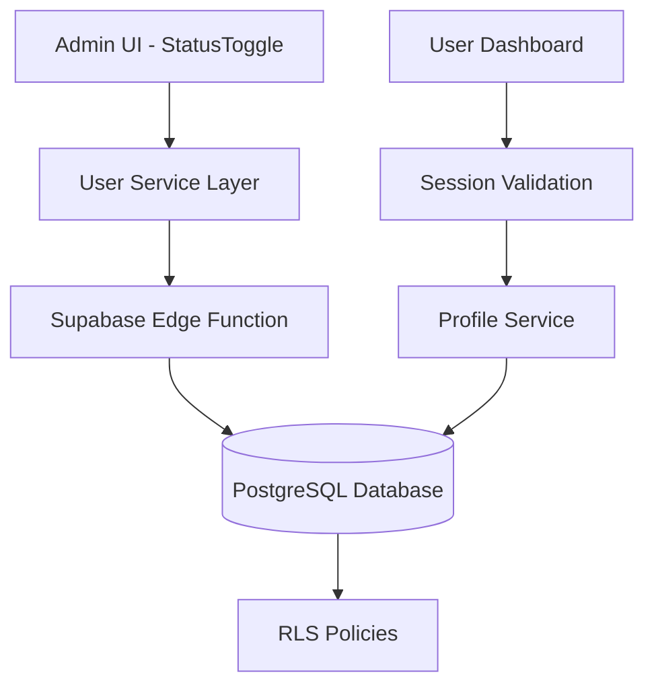

# API Request Handling for User Activation/Deactivation

## Overview

This document outlines the design and implementation of API request handling for user activation/deactivation functionality in the MarketGrow application. The system allows administrators to toggle user status between "active" and "inactive", with appropriate access control and user experience considerations.

## Architecture

The implementation follows a layered architecture with clear separation of concerns:

1. **UI Layer**: React components for user interaction
2. **Service Layer**: Business logic and API communication
3. **API Layer**: Supabase Edge Functions for backend operations
4. **Database Layer**: PostgreSQL with Row Level Security (RLS)



## API Endpoints Reference

### User Status Update Endpoint

**Endpoint**: `PATCH /functions/v1/users/{userId}`

**Headers**:
- `Authorization: Bearer <ADMIN_JWT_TOKEN>`
- `apikey: <SUPABASE_ANON_KEY>`
- `Content-Type: application/json`

**Request Body**:
```json
{
  "status": "active" | "inactive"
}
```

**Response**:
```json
{
  "user": {
    "id": "string",
    "email": "string",
    "name": "string",
    "phone": "string",
    "role": "user" | "admin" | "manager",
    "status": "active" | "inactive",
    "created_at": "string",
    "updated_at": "string"
  }
}
```

## Data Models

### User Profile Model

| Field | Type | Description |
|-------|------|-------------|
| id | string (UUID) | Unique user identifier |
| email | string | User's email address |
| name | string | User's full name |
| phone | string (optional) | User's phone number |
| role | enum | User role (user, admin, manager) |
| status | enum | Account status (active, inactive) |
| created_at | string (ISO date) | Account creation timestamp |
| updated_at | string (ISO date) | Last update timestamp |

## Business Logic Layer

### User Status Toggle Flow

1. **Admin Action**: Admin toggles user status in the admin panel
2. **Client Validation**: Validate admin permissions and user existence
3. **API Request**: Send PATCH request to users function with new status
4. **Backend Processing**: Update user profile in database
5. **Response Handling**: Update UI with success/failure feedback

### Access Control Implementation

The system implements role-based access control (RBAC) with the following rules:

1. Only users with "admin" role can modify user status
2. Admins cannot deactivate their own accounts
3. Status changes are logged for audit purposes

### Session Validation for Inactive Users

When a user's status is set to "inactive":
1. User is immediately logged out of all sessions
2. Any subsequent login attempts are blocked
3. User receives a notification about account deactivation

## Middleware & Interceptors

### Authentication Header Handling

The system uses a centralized helper function `getAuthHeaders()` to determine the appropriate authentication headers:

The system uses a centralized helper function to determine the appropriate authentication headers based on the user's session status. For authenticated users, it uses the Authorization header with a Bearer token. For anonymous requests, it uses the apikey header with the Supabase anonymous key.

### Error Handling

The system implements comprehensive error handling for various scenarios:

1. **Network Errors**: Retry mechanism with exponential backoff
2. **Authentication Errors**: Redirect to login with appropriate messaging
3. **Authorization Errors**: Display permission denied messages
4. **Validation Errors**: Show user-friendly validation messages

## Security Considerations

### Token Management

1. **JWT Validation**: All requests to protected endpoints validate JWT tokens
2. **Role Verification**: Backend functions verify admin role before processing status changes
3. **Session Refresh**: Automatic session refresh for expiring tokens

### Row Level Security

PostgreSQL RLS policies ensure that:
1. Users can only view their own profiles
2. Admins can view and modify all user profiles
3. Status changes are properly audited

## User Experience

### Admin Interface

The admin interface provides:
1. Toggle switch for quick status changes
2. Visual indicators for active/inactive status
3. Confirmation dialogs for status changes
4. Immediate feedback on operation success/failure

### User Notification

When a user's account is deactivated:
1. User receives a toast notification on their next action
2. User is redirected to login page with deactivation message
3. User cannot access dashboard or protected routes

## Testing Strategy

### Unit Tests

1. **Status Toggle Functionality**
   - Test active → inactive transition
   - Test inactive → active transition
   - Verify database updates

2. **Access Control**
   - Test non-admin access denial
   - Test admin access approval
   - Verify proper error responses

3. **Session Handling**
   - Test active user session continuation
   - Test inactive user session termination
   - Verify login blocking for inactive users

### Integration Tests

1. **End-to-End Flow**
   - Admin logs in
   - Admin navigates to user management
   - Admin deactivates a user
   - User attempts to log in
   - User is blocked with appropriate message

2. **API Contract Testing**
   - Validate request/response formats
   - Test error scenarios
   - Verify proper HTTP status codes

## Implementation Details

### Frontend Implementation

The frontend implementation uses React components and services:

1. **StatusToggle Component**: UI component for toggling user status
2. **UserService**: Service layer for API communication
3. **UserProtected Route**: Route protection for user dashboard

### Backend Implementation

The backend implementation uses Supabase Edge Functions:

1. **Users Function**: Handles PATCH requests for user updates
2. **Role Verification**: Ensures only admins can modify user status
3. **Profile Updates**: Updates user profile with new status

### Database Implementation

The database implementation uses PostgreSQL with:

1. **Profiles Table**: Stores user profile information including status
2. **RLS Policies**: Controls access to profile data
3. **Audit Triggers**: Logs status changes for compliance