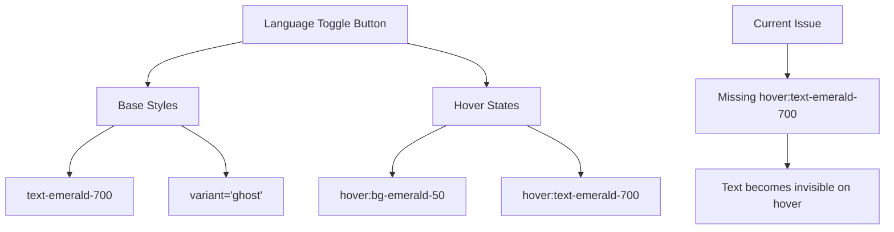
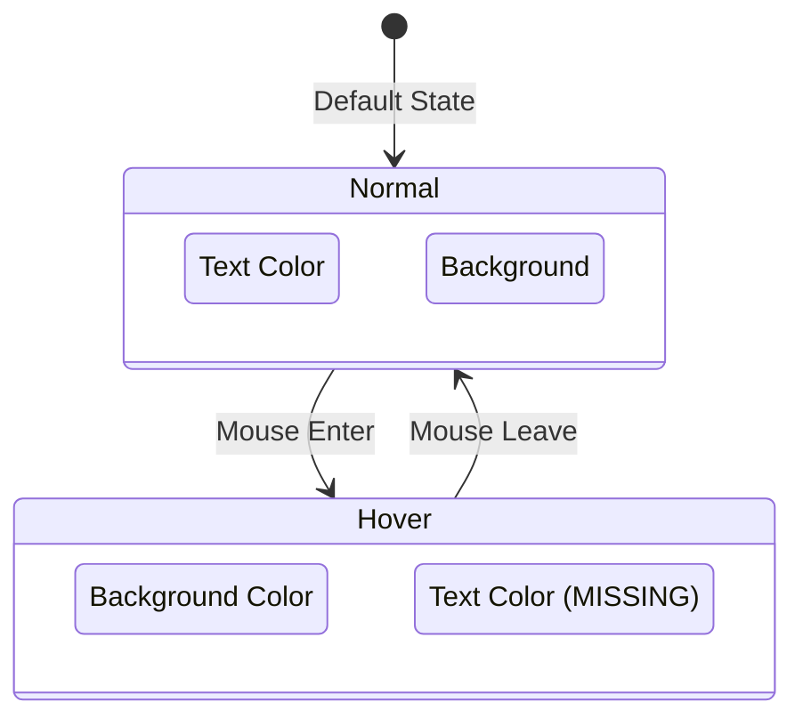

# Button Hover Text Color Fix Design

## Overview

Fix the text color visibility issue on language toggle buttons (UA/EN) in authentication pages where the emerald text becomes white on hover, making it invisible to users.

## Problem Analysis

### Current Issue
- On the UserRegister page, the language toggle button has emerald text (`text-emerald-700`)
- When hovering, the button gets emerald background (`hover:bg-emerald-50`) 
- The text color is not explicitly maintained on hover, causing it to inherit the default hover text color (white)
- This makes the "UA" or "EN" text invisible when users hover over the button

### Affected Components
- `/src/pages/UserRegister.tsx` - Language toggle button (line ~156)

### Already Fixed Components
- `/src/pages/UserAuth.tsx` - Already has `hover:text-emerald-700`
- `/src/pages/UserForgotPassword.tsx` - Already has `hover:text-emerald-700`

## Technology Stack Context

### Frontend Framework
- **React 18** with TypeScript
- **Tailwind CSS** for styling
- **shadcn/ui** component library

### Styling System
- Emerald color scheme for branding consistency
- Hover states follow design system conventions
- Color hierarchy: `text-emerald-700` → `hover:text-emerald-700`

## Component Architecture

### Language Toggle Button Pattern


### Button State Diagram


## Design Specifications

### Color Consistency Requirements
| State | Background | Text Color | Visual Result |
|-------|------------|------------|---------------|
| Normal | transparent | `text-emerald-700` | Green text on transparent |
| Hover | `hover:bg-emerald-50` | `hover:text-emerald-700` | Green text on light green bg |

### Button Class Structure
```
className="text-emerald-700 hover:bg-emerald-50 hover:text-emerald-700"
```

### Accessibility Considerations
- Maintain sufficient color contrast ratio (4.5:1 minimum)
- Ensure text remains readable in all states
- Consistent hover behavior across all authentication pages

## Implementation Strategy

### Code Changes Required

#### UserRegister.tsx Fix
**Location**: `/src/pages/UserRegister.tsx` (approximately line 156)

**Current Code**:
```jsx
<Button 
  type="button" 
  variant="ghost" 
  onClick={() => setLang(lang === "uk" ? "en" : "uk")}
  className="text-emerald-700 hover:bg-emerald-50"
>
  {lang === "uk" ? "EN" : "UA"}
</Button>
```

**Fixed Code**:
```jsx
<Button 
  type="button" 
  variant="ghost" 
  onClick={() => setLang(lang === "uk" ? "en" : "uk")}
  className="text-emerald-700 hover:bg-emerald-50 hover:text-emerald-700"
>
  {lang === "uk" ? "EN" : "UA"}
</Button>
```

### Consistency Verification
Ensure all authentication pages follow the same pattern:

1. **UserAuth.tsx** ✅ - Already correct
2. **UserForgotPassword.tsx** ✅ - Already correct  
3. **UserRegister.tsx** ❌ - Needs fix

## Testing Requirements

### Manual Testing
1. Navigate to `/user-register` page
2. Hover over the UA/EN button in top-right corner
3. Verify text remains visible and green colored
4. Test in both Ukrainian and English modes
5. Verify consistent behavior across browsers

### Cross-Page Consistency Testing
1. Test hover states on all authentication pages:
   - `/user-auth` (login)
   - `/user-register` (registration)
   - `/user-forgot-password` (password reset)
2. Verify identical visual behavior across all pages

### Browser Compatibility
- Chrome/Chromium
- Firefox
- Safari
- Edge

## User Experience Impact

### Before Fix
- Users experience poor usability when hovering over language toggle
- Text disappears on hover, causing confusion
- Inconsistent behavior across authentication pages

### After Fix
- Consistent hover behavior across all authentication pages
- Clear visual feedback when hovering over language toggle
- Improved accessibility and user experience
- Maintains brand color consistency

## Quality Assurance

### Code Review Checklist
- [ ] Verify className includes `hover:text-emerald-700`
- [ ] Confirm consistency with other authentication pages
- [ ] Test hover states in both light/dark themes (if applicable)
- [ ] Validate Tailwind CSS class syntax

### Regression Testing
- [ ] Verify existing functionality remains intact
- [ ] Test language switching functionality
- [ ] Confirm button click behavior unchanged
- [ ] Validate responsive design on mobile devices