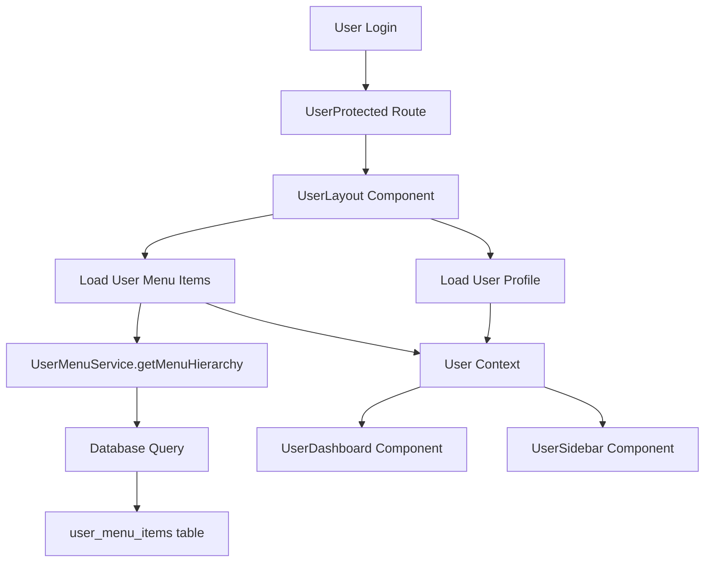

# User Dashboard Load Issue Analysis

## Overview

This document analyzes the issue where the user dashboard (`/user/dashboard`) appears empty after login. The problem seems to be related to the loading of menu items from the `user_menu_items` table, which was previously working but is now failing to display.

## Architecture

### Component Structure

1. **UserProtected Route** (`/src/pages/UserProtected.tsx`)
   - Handles authentication validation
   - Redirects unauthenticated users to login
   - Redirects admin/manager users to admin interface

2. **UserLayout Component** (`/src/components/UserLayout.tsx`)
   - Loads user profile and menu items
   - Manages sidebar state (collapsed/expanded)
   - Provides user context to child components

3. **UserDashboard Component** (`/src/pages/UserDashboard.tsx`)
   - Displays dashboard content
   - Receives user and menuItems via context from UserLayout

4. **UserSidebar Component** (`/src/components/UserSidebar.tsx`)
   - Renders navigation menu
   - Displays default menu items and user custom menu items

5. **UserMenuService** (`/src/lib/user-menu-service.ts`)
   - Handles all operations related to user menu items
   - Fetches menu items from database
   - Organizes menu items in hierarchical structure

### Data Flow



## Database Schema

The `user_menu_items` table stores user-specific menu items:

```sql
CREATE TABLE public.user_menu_items (
  id SERIAL PRIMARY KEY,
  user_id UUID NOT NULL REFERENCES public.profiles(id) ON DELETE CASCADE,
  title TEXT NOT NULL,
  path TEXT NOT NULL,
  parent_id INTEGER REFERENCES public.user_menu_items(id) ON DELETE CASCADE,
  order_index INTEGER NOT NULL DEFAULT 0,
  is_active BOOLEAN NOT NULL DEFAULT true,
  page_type TEXT DEFAULT 'content' CHECK (page_type IN ('content', 'form', 'dashboard', 'list', 'custom')),
  content_data JSONB DEFAULT '{}'::jsonb,
  template_name TEXT,
  meta_data JSONB DEFAULT '{}'::jsonb,
  icon_name TEXT,
  description TEXT,
  created_at TIMESTAMP WITH TIME ZONE NOT NULL DEFAULT now(),
  updated_at TIMESTAMP WITH TIME ZONE NOT NULL DEFAULT now(),
  UNIQUE(user_id, path)
);
```

### Key Features
- **Foreign Key Relationship**: Links to `profiles` table via `user_id`
- **Hierarchical Structure**: Supports nested menu items via `parent_id`
- **Row Level Security**: Users can only access their own menu items
- **Default Menu Items**: Created automatically for new users via database trigger

## Identified Issues

### 1. Route Configuration Issue
The primary issue is that the `/user` route doesn't automatically redirect to the dashboard. Users need to navigate to `/user/dashboard` explicitly.

### 2. Menu Loading Problem
User menu items are not loading properly in the dashboard. Based on the code analysis:

1. **UserLayout** calls `UserMenuService.getMenuHierarchy(userId)` to load menu items
2. **UserMenuService.getMenuHierarchy** calls `this.getUserMenuItems(userId, true)` to fetch active menu items
3. **UserMenuService.getUserMenuItems** queries the database for menu items with `is_active = true`

### 3. Potential Root Causes

#### Route Configuration
The `/user` route should redirect to `/user/dashboard` to provide a better user experience.

#### Database Query Issue
The query in `UserMenuService.getUserMenuItems` might be failing:
```typescript
let query = supabase
  .from('user_menu_items')
  .select('*')
  .eq('user_id', userId);

if (activeOnly) {
  query = query.eq('is_active', true);
}

const { data, error } = await query.order('order_index');
```

#### RLS Policy Issue
The Row Level Security policy might be preventing access to menu items:
```sql
CREATE POLICY "Users can manage their own menu items" ON public.user_menu_items
  FOR ALL TO authenticated
  USING (auth.uid() = user_id);
```

#### Session/Authentication Issue
The user session might not be properly established when loading menu items, causing RLS to fail.

#### Default Menu Creation Issue
The database trigger that creates default menu items might not be working:
```sql
CREATE TRIGGER create_default_user_menu_trigger
  AFTER INSERT ON public.profiles
  FOR EACH ROW
  EXECUTE FUNCTION public.create_default_user_menu();
```

## Business Logic Analysis

### Menu Item Loading Process

1. **User Authentication**: User logs in and session is validated
2. **Profile Loading**: User profile is fetched from `profiles` table
3. **Menu Loading**: Menu items are fetched from `user_menu_items` table
4. **Hierarchy Building**: Menu items are organized in hierarchical structure
5. **Rendering**: Menu items are passed to UserSidebar and UserDashboard components

### Default Menu Items
When a new user is created, the following default menu items should be created:
- Dashboard (`/dashboard`)
- Profile (`/profile`)
- My Menu (`/my-menu`)

## Solution

To fix the user dashboard loading issue, we need to:

1. Add a redirect from `/user` to `/user/dashboard` in the route configuration
2. Ensure menu items are properly loaded when the dashboard is accessed
3. Verify that the database trigger for creating default menu items is working correctly

## Testing

### Unit Tests for UserMenuService

```typescript
// Test fetching user menu items
describe('UserMenuService.getUserMenuItems', () => {
  it('should fetch active menu items for a user', async () => {
    const userId = 'test-user-id';
    const menuItems = await UserMenuService.getUserMenuItems(userId);
    expect(menuItems).toBeInstanceOf(Array);
  });

  it('should fetch all menu items when activeOnly is false', async () => {
    const userId = 'test-user-id';
    const menuItems = await UserMenuService.getUserMenuItems(userId, false);
    expect(menuItems).toBeInstanceOf(Array);
  });
});

// Test menu hierarchy building
describe('UserMenuService.getMenuHierarchy', () => {
  it('should organize menu items in hierarchical structure', async () => {
    const userId = 'test-user-id';
    const menuHierarchy = await UserMenuService.getMenuHierarchy(userId);
    expect(menuHierarchy).toBeInstanceOf(Array);
  });
});
```

### Integration Tests

```typescript
// Test complete user dashboard loading
describe('User Dashboard Loading', () => {
  it('should load user profile and menu items', async () => {
    // Mock authentication
    // Load user profile
    // Load menu items
    // Verify both are loaded correctly
  });

  it('should display default menu items for new users', async () => {
    // Create new user
    // Verify default menu items are created
    // Verify menu items are loaded in UI
  });
});