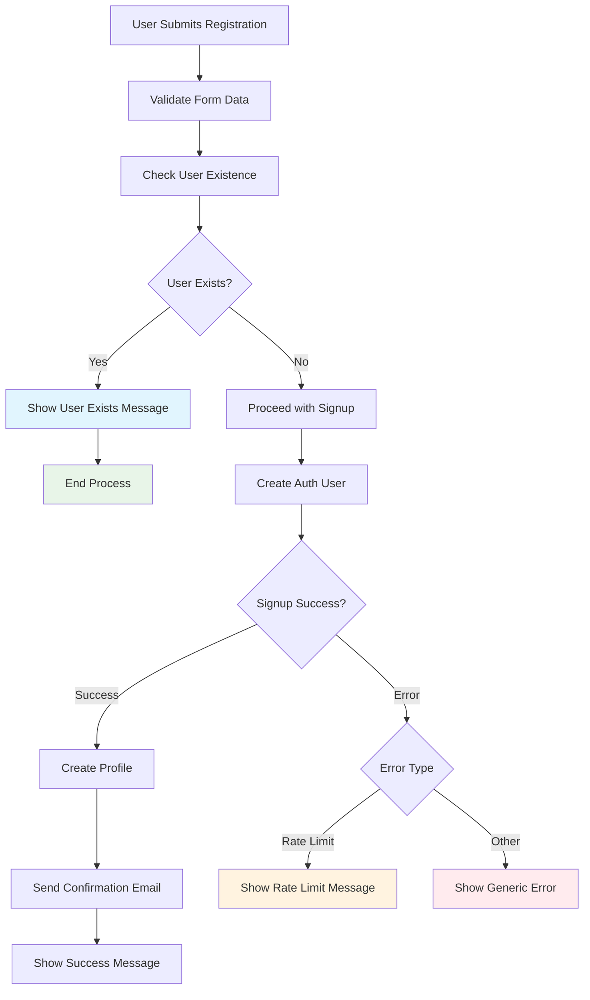
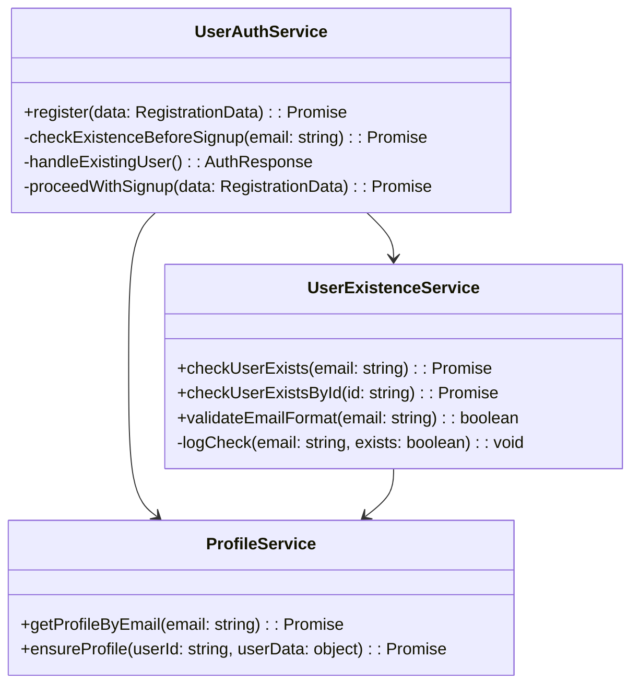
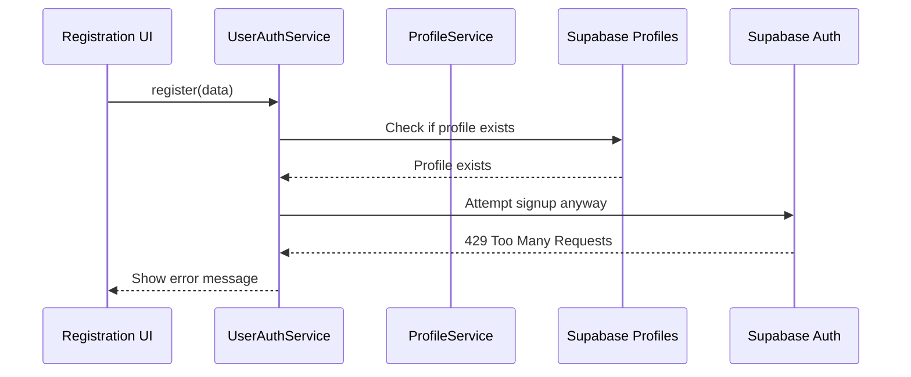
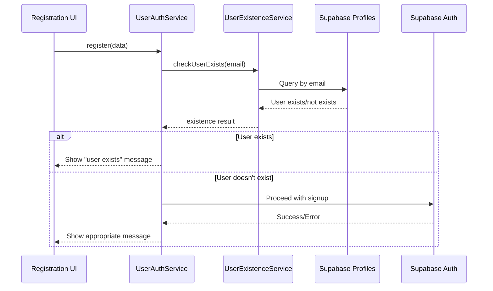
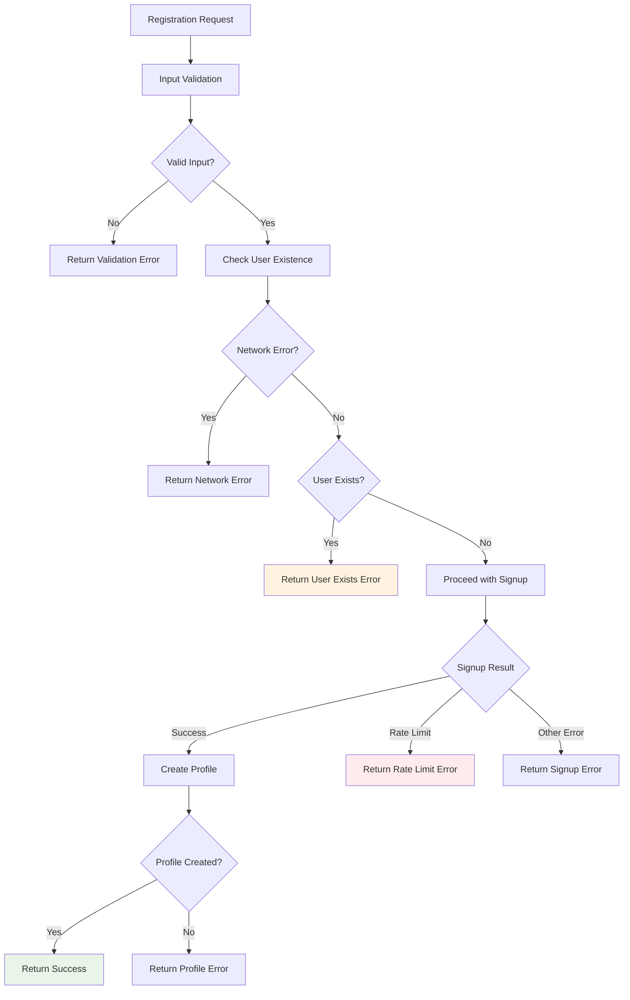
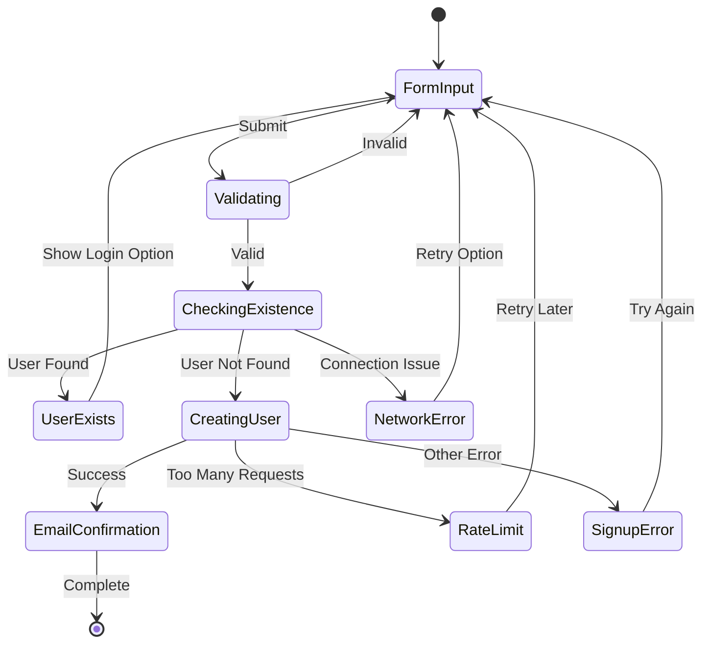

# User Existence Check Enhancement Design

## Overview

This design addresses the inefficient user registration flow where the system currently makes unnecessary signup requests to Supabase Auth even when users already exist. The current implementation performs a profile check but still proceeds with the signup attempt, resulting in 429 "Too Many Requests" errors and poor user experience.

## Current Problem Analysis

### Current Flow Issues
1. **Redundant API Calls**: System checks user existence in profiles table, but still attempts Supabase Auth signup
2. **Rate Limiting**: Unnecessary signup attempts trigger 429 errors from Supabase Auth
3. **Poor UX**: Users see generic error messages instead of clear "user already exists" feedback
4. **Resource Waste**: Unnecessary database operations and API calls

### Current Implementation in UserAuthService
```typescript
// Current inefficient approach
const { data: existingUser, error: checkError } = await supabase
  .from('profiles')
  .select('email')
  .eq('email', data.email)
  .maybeSingle();

if (existingUser) {
  return { user: null, session: null, error: 'email_exists' };
}

// Still proceeds with signup even after finding user exists
const { data: authData, error: signUpError } = await supabase.auth.signUp({...});
```

## Architecture Enhancement

### Enhanced Registration Flow



### User Existence Check Service



## Implementation Strategy

### 1. User Existence Check Service

Create a dedicated service for user existence validation:

```typescript
interface UserExistenceCheck {
  exists: boolean;
  profile?: UserProfile;
  authUser?: boolean;
}

class UserExistenceService {
  // Primary method for checking user existence
  static async checkUserExists(email: string): Promise<UserExistenceCheck>
  
  // Check if user exists in auth but not in profiles
  static async checkAuthUserExists(email: string): Promise<boolean>
  
  // Comprehensive existence check across both auth and profiles
  static async comprehensiveUserCheck(email: string): Promise<UserExistenceCheck>
}
```

### 2. Enhanced UserAuthService Registration

Modify the registration flow to prevent unnecessary signup attempts:

```typescript
class UserAuthService {
  static async register(data: RegistrationData): Promise<AuthResponse> {
    // 1. Validate input data
    // 2. Check user existence FIRST
    // 3. Return early if user exists
    // 4. Only proceed with signup if user doesn't exist
    // 5. Handle all error cases appropriately
  }
}
```

### 3. ProfileService Enhancement

Extend ProfileService with email-based queries:

```typescript
class ProfileService {
  // Add email-based profile lookup
  static async getProfileByEmail(email: string): Promise<UserProfile | null>
  
  // Batch existence check for multiple emails
  static async checkMultipleUsersExist(emails: string[]): Promise<Map<string, boolean>>
}
```

## Data Flow Optimization

### Before Enhancement


### After Enhancement


## Error Handling Strategy

### Comprehensive Error Management



### Error Response Structure

```typescript
interface RegistrationError {
  type: 'validation' | 'user_exists' | 'network' | 'rate_limit' | 'signup_failed' | 'profile_failed';
  message: string;
  code: string;
  retryable: boolean;
  suggestedAction?: string;
}
```

## User Experience Improvements

### Enhanced Error Messages

| Error Type | Current Message | Enhanced Message |
|------------|----------------|------------------|
| User Exists | Generic error | "An account with this email already exists. Please sign in instead." |
| Rate Limit | Generic error | "Too many registration attempts. Please try again in a few minutes." |
| Network Error | Generic error | "Network connection issue. Please check your connection and try again." |
| Validation Error | Field-specific | Clear, actionable validation messages |

### UI Flow Enhancement



## Performance Optimizations

### Caching Strategy
- Cache user existence results for short periods (5 minutes)
- Implement intelligent cache invalidation
- Use browser sessionStorage for temporary caching

### Database Query Optimization
- Use indexed email lookups
- Implement query result caching
- Add database connection pooling

### Network Request Optimization
- Implement request debouncing for rapid successive checks
- Add retry logic with exponential backoff
- Use request deduplication for concurrent identical requests

## Testing Strategy

### Unit Testing Coverage
- User existence check accuracy
- Error handling for all scenarios
- Cache behavior validation
- Network failure simulation

### Integration Testing
- End-to-end registration flow
- Database consistency checks
- Rate limiting behavior
- Cross-browser compatibility

### Performance Testing
- Concurrent user registration load testing
- Database performance under load
- Cache effectiveness measurement
- Response time optimization validation

## Implementation Priority

### Phase 1: Core Enhancement
1. Implement UserExistenceService
2. Update UserAuthService registration logic
3. Add comprehensive error handling
4. Update UI error messages

### Phase 2: Optimization
1. Add caching mechanisms
2. Implement performance optimizations
3. Add detailed logging and monitoring
4. Enhance user experience flows

### Phase 3: Advanced Features
1. Add batch user existence checking
2. Implement advanced rate limiting
3. Add predictive user existence checking
4. Optimize for mobile performance

## Monitoring and Analytics

### Key Metrics to Track
- Registration success rate improvement
- Reduction in unnecessary API calls
- User experience satisfaction scores
- Error rate by type and frequency

### Logging Strategy
- Log all user existence checks
- Track registration flow completion rates
- Monitor API response times
- Alert on error rate spikes

## Security Considerations

### Data Protection
- Ensure user existence checks don't leak sensitive information
- Implement rate limiting on existence checks
- Add CSRF protection for registration endpoints
- Validate all input data before processing

### Privacy Compliance
- Minimal data exposure in error messages
- Comply with GDPR requirements for user data
- Implement proper data retention policies
- Add audit logging for compliance