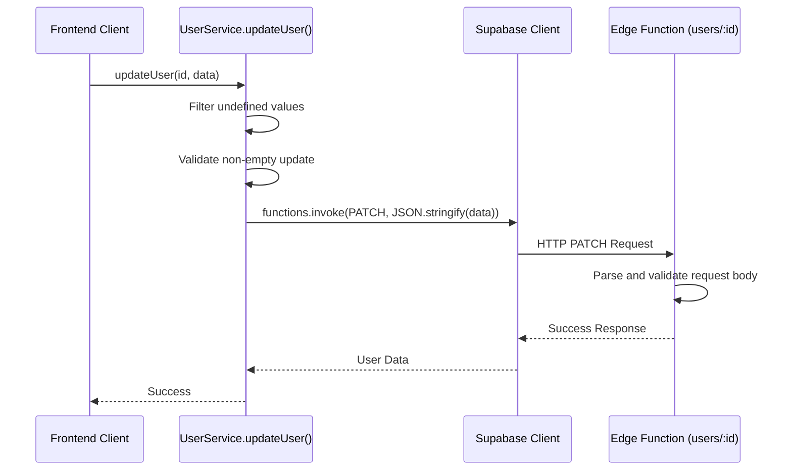

# Debug User Service PATCH Request Issue

## Overview

This document analyzes and provides a solution for the "Request body is required and cannot be empty" error occurring in the `UserService.updateUser` method when making PATCH requests to the Supabase Edge Function.

## Problem Analysis

### Error Details
- **Error Message**: "Request body is required and cannot be empty"
- **Debug Info**: `{bodyText: "", bodyLength: 0}`
- **Location**: `user-service.ts` in the `updateUser` method
- **Method**: PATCH request to `users/${id}` endpoint

### Root Cause

The issue occurs in the Supabase Edge Function (`supabase/functions/users/index.ts`) where it validates that the request body is not empty:

```typescript
if (!body || Object.keys(body).length === 0) {
  return new Response(JSON.stringify({ error: 'No fields provided for update' }), { 
    status: 400, 
    headers: corsHeaders 
  });
}
```

Despite the frontend code in `user-service.ts` sending a valid JSON string, the Edge Function is receiving an empty body. This indicates a mismatch between what the frontend is sending and what the backend is receiving.

### Code Analysis

#### Frontend (user-service.ts)
```typescript
// Filter out undefined values but allow null values (which are valid for clearing fields)
const cleanData = Object.fromEntries(
  Object.entries(data).filter(([_, value]) => value !== undefined)
);

// Ensure we always send a valid JSON object, even if empty
const requestData = Object.keys(cleanData).length > 0 ? cleanData : {};

const response = await supabase.functions.invoke(`users/${id}`, {
  method: "PATCH",
  headers: await getAuthHeaders(),
  body: JSON.stringify(requestData), // Always send valid JSON string
});
```

The frontend code appears correct - it ensures that `requestData` is always an object (even if empty) and stringifies it properly.

#### Backend (supabase/functions/users/index.ts)
```typescript
if (req.method === 'PATCH' && userId) {
  const contentType = req.headers.get('Content-Type') || '';
  if (!contentType.includes('application/json')) {
    return new Response(JSON.stringify({ error: 'Content-Type must be application/json' }), { 
      status: 400, 
      headers: corsHeaders 
    });
  }

  let body: { name?: string; phone?: string; phone?: string; role?: string; status?: string };
  try { 
    body = await req.json(); 
  } catch (err) {
    return new Response(JSON.stringify({ error: 'Request body must be valid JSON' }), { 
      status: 400, 
      headers: corsHeaders 
    });
  }

  if (!body || Object.keys(body).length === 0) {
    return new Response(JSON.stringify({ error: 'No fields provided for update' }), { 
      status: 400, 
      headers: corsHeaders 
    });
  }
  // ... rest of implementation
}
```

## Solution Approach

The issue is likely related to how the request body is being processed or transmitted. Possible causes include:

1. **Content-Type Header Issues**: The Edge Function expects `application/json` but might not be receiving it correctly
2. **Body Parsing Problems**: The body might be getting consumed or lost in transit
3. **Supabase Client Behavior**: The Supabase client might be modifying the request in an unexpected way

## Recommended Fix

The fix should ensure that the request body is properly sent and received. Here are the steps to implement:

1. **Enhance the frontend to explicitly check for empty requests**:
   - Validate that we're sending meaningful data
   - Provide better error handling for empty update requests

2. **Improve the Edge Function to better handle edge cases**:
   - Add more detailed logging to understand what's being received
   - Improve body parsing error handling

3. **Ensure proper Content-Type handling**:
   - Verify that the Content-Type header is correctly set and sent

## Implementation Plan

### Frontend Changes (user-service.ts)

1. Add validation to prevent sending empty update requests
2. Improve error handling and logging
3. Ensure proper Content-Type header is set

### Backend Changes (supabase/functions/users/index.ts)

1. Add detailed logging to see what's being received
2. Improve error messages for better debugging
3. Add additional validation for edge cases

## Detailed Implementation

### Frontend Fix (user-service.ts)

The primary issue is in the `updateUser` method where we need to validate that there are actual fields to update before sending the request:

```typescript
/** Обновление пользователя */
static async updateUser(id: string, data: UpdateUserData): Promise<UserProfile> {
  if (!id) throw new ApiError("User ID is required", 400);
  
  // Validate session before operation
  const sessionValidation = await SessionValidator.ensureValidSession();
  if (!sessionValidation.isValid) {
    throw new ApiError("Invalid session: " + (sessionValidation.error || "Session expired"), 401);
  }

  // Filter out undefined values but allow null values (which are valid for clearing fields)
  const cleanData = Object.fromEntries(
    Object.entries(data).filter(([_, value]) => value !== undefined)
  );

  // NEW: Check if there are any fields to update
  if (Object.keys(cleanData).length === 0) {
    throw new ApiError("No fields provided for update", 400);
  }

  // Log the request for debugging
  console.log("UserService.updateUser called with:", { id, cleanData });

  const response = await supabase.functions.invoke(`users/${id}`, {
    method: "PATCH",
    headers: await getAuthHeaders(),
    body: JSON.stringify(cleanData),
  });

  console.log("UserService.updateUser response:", response);

  if (response.error) throw new ApiError(response.error.message || "Failed to update user");
  return response.data.user;
}
```

### Backend Fix (supabase/functions/users/index.ts)

Improve the PATCH endpoint to add better logging and error handling:

```typescript
// ---------------- PATCH /users/:id ----------------
if (req.method === 'PATCH' && userId) {
  const contentType = req.headers.get('Content-Type') || '';
  if (!contentType.includes('application/json')) {
    return new Response(JSON.stringify({ error: 'Content-Type must be application/json' }), { 
      status: 400, 
      headers: corsHeaders 
    });
  }

  // NEW: Log raw request information for debugging
  const contentLength = req.headers.get('Content-Length') || '0';
  console.log('PATCH /users/:id request info:', {
    contentType,
    contentLength,
    userId,
    headers: Object.fromEntries(req.headers.entries())
  });

  let body: { name?: string; phone?: string; role?: string; status?: string };
  try { 
    body = await req.json(); 
    console.log('Parsed body:', body); // NEW: Log parsed body
  } catch (err) {
    return new Response(JSON.stringify({ error: 'Request body must be valid JSON' }), { 
      status: 400, 
      headers: corsHeaders 
    });
  }

  // Enhanced validation with better error message
  if (!body || Object.keys(body).length === 0) {
    return new Response(JSON.stringify({ 
      error: 'No fields provided for update',
      debug: { body, keys: body ? Object.keys(body) : null }
    }), { 
      status: 400, 
      headers: corsHeaders 
    });
  }

  const { name, phone, role, status } = body;
  const updateData: any = {};
  if (name !== undefined) updateData.name = name;
  if (phone !== undefined) updateData.phone = phone;
  if (role !== undefined) updateData.role = role;
  if (status !== undefined) updateData.status = status;

  // NEW: Log update data
  console.log('Update data:', updateData);

  const { data: user, error } = await serviceClient
    .from('profiles')
    .update(updateData)
    .eq('id', userId)
    .select()
    .maybeSingle();
    
  if (error) {
    console.error('Update error:', error);
    return new Response(JSON.stringify({ error: `Update error: ${error.message}` }), { 
      status: 500, 
      headers: corsHeaders 
    });
  }
  
  if (!user) {
    return new Response(JSON.stringify({ error: 'User not found' }), { 
      status: 404, 
      headers: corsHeaders 
    });
  }

  return new Response(JSON.stringify({ user }), { headers: corsHeaders });
}
```

## Flow Diagram



## Testing Plan

### Unit Tests

1. Test `updateUser` with valid data
2. Test `updateUser` with empty data (should throw client-side error)
3. Test `updateUser` with only undefined values (should throw client-side error)
4. Test `updateUser` with mixed valid/undefined values (should filter correctly)

### Integration Tests

1. Test PATCH request with valid JSON body
2. Test PATCH request with empty JSON object `{}`
3. Test PATCH request with missing Content-Type header
4. Test PATCH request with invalid JSON

### Manual Testing

1. Update user profile fields through the admin UI
2. Verify that empty updates are properly handled
3. Check browser console for logging
4. Check Edge Function logs for debugging information

## Conclusion

The "Request body is required and cannot be empty" error occurs because the Edge Function correctly rejects empty update requests, but the frontend was not validating this condition before sending the request. The fix involves:

1. Adding client-side validation to prevent sending empty update requests
2. Improving error handling and logging on both frontend and backend
3. Enhancing the debugging capabilities to quickly identify similar issues in the future

This approach ensures that:
- Users get immediate feedback when trying to submit empty updates
- Developers can easily debug similar issues with enhanced logging
- The system follows the principle of failing fast for invalid requests
- Both frontend and backend are consistent in their handling of update requests