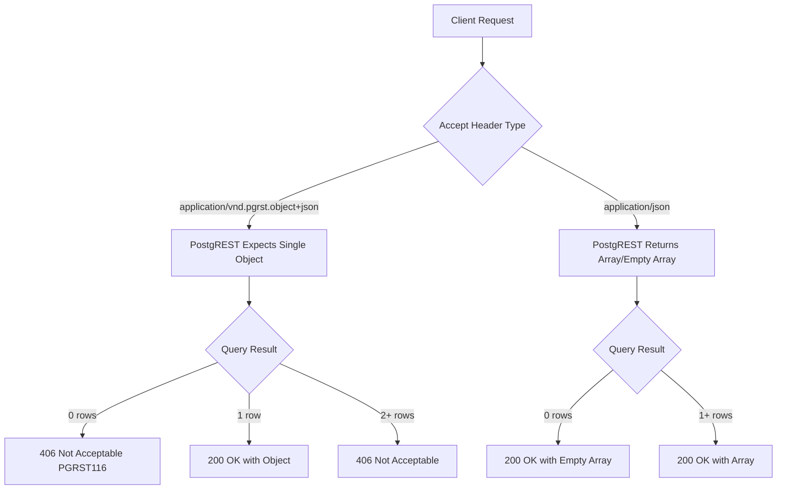
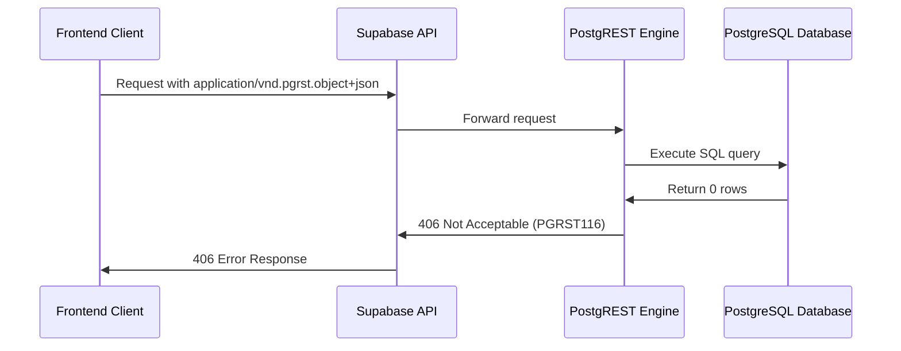

# Fix PostgREST 406 Error (PGRST116) Design

## Overview

The application is experiencing HTTP 406 "Not Acceptable" errors with PostgREST error code PGRST116 ("The result contains 0 rows") when making requests to Supabase REST API endpoints. This occurs when using the `application/vnd.pgrst.object+json` Accept header with queries that may return empty results, particularly when using the `.single()` method in Supabase client calls.

**Root Cause**: PostgREST's `application/vnd.pgrst.object+json` content type expects exactly one object in the response. When a query returns 0 rows or multiple rows, it triggers a 406 error instead of returning an empty result or array.

## Repository Type Detection

**Frontend Application** - React-based frontend with TypeScript, using Supabase as backend service provider. The application uses Supabase client libraries for database interactions and authentication.

## Architecture

### Problem Analysis



### Current Implementation Issues

The codebase contains multiple instances where `.single()` is used with Supabase queries:

1. **Profile Fetching in Edge Functions**: Using `.single()` without handling potential empty results
2. **User Menu Service**: `.single()` calls that may return PGRST116 errors
3. **Authentication Service**: Profile lookups using `.single()` method
4. **Admin Components**: Direct profile queries with `.single()`

### Error Propagation Flow



## API Integration Strategy

### Header Configuration Standards

#### Recommended Headers for Different Query Types

| Query Type | Accept Header | Supabase Method | Expected Result |
|------------|---------------|-----------------|-----------------|
| Single Required Record | `application/json` | `.maybeSingle()` | Object or null |
| Single Optional Record | `application/json` | `.maybeSingle()` | Object or null |
| Multiple Records | `application/json` | `.select()` | Array (empty or populated) |
| Count/Aggregate | `application/json` | `.select()` | Array with single object |

#### Error Handling Patterns

```typescript
// ❌ Problematic Pattern
const { data, error } = await supabase
  .from('profiles')
  .select('*')
  .eq('id', userId)
  .single(); // May cause PGRST116

// ✅ Recommended Pattern
const { data, error } = await supabase
  .from('profiles')
  .select('*')
  .eq('id', userId)
  .maybeSingle(); // Returns null instead of error
```

## Data Models & Client Configuration

### Supabase Client Configuration

The current client configuration in `src/integrations/supabase/client.ts` uses default headers, which should be updated to handle PostgREST behavior properly.

#### Updated Client Configuration

```typescript
export const supabase = createClient<Database>(SUPABASE_URL, SUPABASE_PUBLISHABLE_KEY, {
  auth: {
    storage: localStorage,
    persistSession: true,
    autoRefreshToken: true,
  },
  global: {
    headers: {
      'Accept': 'application/json',
      'Content-Type': 'application/json'
    }
  }
});
```

### Edge Function Header Standards

All edge functions should use consistent CORS and content-type headers:

```typescript
const corsHeaders = {
  'Access-Control-Allow-Origin': '*',
  'Access-Control-Allow-Headers': 'authorization, x-client-info, apikey, content-type, accept',
  'Content-Type': 'application/json'
}
```

## Business Logic Layer Fixes

### Profile Service Layer

#### Current Profile Fetching Issues

Multiple components fetch user profiles using `.single()` which can cause 406 errors:

1. `getUserWithPermissions()` functions in edge functions
2. `AdminLayout.tsx` profile loading
3. `user-auth-service.ts` profile operations
4. `AdminAuth.tsx` profile verification

#### Standardized Profile Service

```typescript
class ProfileService {
  static async getProfile(userId: string): Promise<UserProfile | null> {
    const { data, error } = await supabase
      .from('profiles')
      .select('*')
      .eq('id', userId)
      .maybeSingle();
    
    if (error && error.code !== 'PGRST116') {
      throw error;
    }
    
    return data;
  }
  
  static async requireProfile(userId: string): Promise<UserProfile> {
    const profile = await this.getProfile(userId);
    if (!profile) {
      throw new Error('Profile not found');
    }
    return profile;
  }
}
```

### Menu Service Fixes

#### User Menu Service Updates

The `user-menu-service.ts` contains several `.single()` calls that need updating:

```typescript
// Update getMenuItem method
static async getMenuItem(itemId: number, userId: string): Promise<UserMenuItem | null> {
  const { data, error } = await supabase
    .from('user_menu_items')
    .select('*')
    .eq('id', itemId)
    .eq('user_id', userId)
    .maybeSingle();

  if (error && error.code !== 'PGRST116') {
    throw error;
  }

  return data;
}
```

#### Edge Function Query Updates

All edge functions need query method updates:

1. **auth-me/index.ts**: Change profile fetch to use `.maybeSingle()`
2. **users/index.ts**: Update admin permission checks
3. **menu/index.ts**: Fix getUserWithPermissions function
4. **menu-content/index.ts**: Handle empty menu item results
5. **permissions/index.ts**: Update permission fetching logic

## Error Handling & Recovery

### Centralized Error Handling

#### PostgREST Error Detection

```typescript
function isPostgRESTEmptyError(error: any): boolean {
  return error?.code === 'PGRST116' || 
         error?.message?.includes('The result contains 0 rows');
}

function handlePostgRESTError(error: any): any {
  if (isPostgRESTEmptyError(error)) {
    return null; // Convert empty result error to null
  }
  throw error; // Re-throw other errors
}
```

#### Unified Error Response Format

```typescript
interface APIErrorResponse {
  error: string;
  code?: string;
  details?: any;
}

function createErrorResponse(message: string, code?: string, status = 500): Response {
  return new Response(
    JSON.stringify({ 
      error: message, 
      code,
      timestamp: new Date().toISOString()
    }),
    { 
      status, 
      headers: corsHeaders 
    }
  );
}
```

### Frontend Error Boundaries

#### API Error Handling

```typescript
class APIService {
  static async handleResponse<T>(response: Response): Promise<T> {
    if (!response.ok) {
      if (response.status === 406) {
        // Handle PostgREST 406 errors specifically
        const errorData = await response.json().catch(() => ({}));
        if (errorData.code === 'PGRST116') {
          return null as T; // Convert to null for empty results
        }
      }
      throw new Error(`HTTP ${response.status}: ${response.statusText}`);
    }
    return response.json();
  }
}
```

## Component Architecture Updates

### AdminLayout Component Updates

The `AdminLayout.tsx` component needs profile loading fix:

```typescript
useEffect(() => {
  const loadUserProfile = async () => {
    try {
      const { data: userData } = await supabase.auth.getUser();
      const user = userData.user;
      
      if (user?.id) {
        const profile = await ProfileService.getProfile(user.id);
        if (profile) {
          setUserProfile({
            email: user.email || '',
            name: profile.name || '',
            role: profile.role || 'user',
            avatarUrl: profile.avatar_url?.trim() || '',
          });
        }
      }
    } catch (error) {
      console.error('Error loading user profile:', error);
    }
  };

  loadUserProfile();
}, []);
```

### Authentication Flow Updates

Update authentication-related components to handle profile lookup failures gracefully:

1. **AdminAuth.tsx**: Handle missing profiles during login
2. **UserProfile.tsx**: Update profile fetching logic
3. **AdminPersonal.tsx**: Fix avatar and profile updates

## Testing Strategy

### Unit Tests for Error Handling

```typescript
describe('PostgREST Error Handling', () => {
  test('should handle PGRST116 error gracefully', async () => {
    const mockError = { code: 'PGRST116', message: 'The result contains 0 rows' };
    
    const result = handlePostgRESTError(mockError);
    expect(result).toBeNull();
  });
  
  test('should throw non-PGRST116 errors', async () => {
    const mockError = { code: 'PGRST001', message: 'Other error' };
    
    expect(() => handlePostgRESTError(mockError)).toThrow();
  });
});
```

### Integration Tests

```typescript
describe('Profile Service Integration', () => {
  test('should return null for non-existent profile', async () => {
    const profile = await ProfileService.getProfile('non-existent-id');
    expect(profile).toBeNull();
  });
  
  test('should throw error for requireProfile with non-existent user', async () => {
    await expect(ProfileService.requireProfile('non-existent-id'))
      .rejects
      .toThrow('Profile not found');
  });
});
```

### Edge Function Testing

Verify that all edge functions handle empty results properly:

```bash
# Test auth-me with non-existent user
curl -X GET "https://ehznqzaumsnjkrntaiox.supabase.co/functions/v1/auth-me" \
  -H "Authorization: Bearer invalid-token" \
  -H "Accept: application/json"

# Expected: 401 Unauthorized, not 406
```

## Implementation Phases

### Phase 1: Core Client Configuration
1. Update Supabase client default headers
2. Implement ProfileService with proper error handling
3. Update all `.single()` calls to `.maybeSingle()`

### Phase 2: Edge Function Updates
1. Fix auth-me endpoint profile fetching
2. Update users endpoint admin checks
3. Fix menu and menu-content endpoints
4. Update permissions endpoint queries

### Phase 3: Frontend Component Updates
1. Update AdminLayout profile loading
2. Fix authentication flow components
3. Update user menu service
4. Implement centralized error handling

### Phase 4: Testing & Validation
1. Unit tests for error handling
2. Integration tests for profile service
3. End-to-end testing of authentication flows
4. Performance testing of updated queries