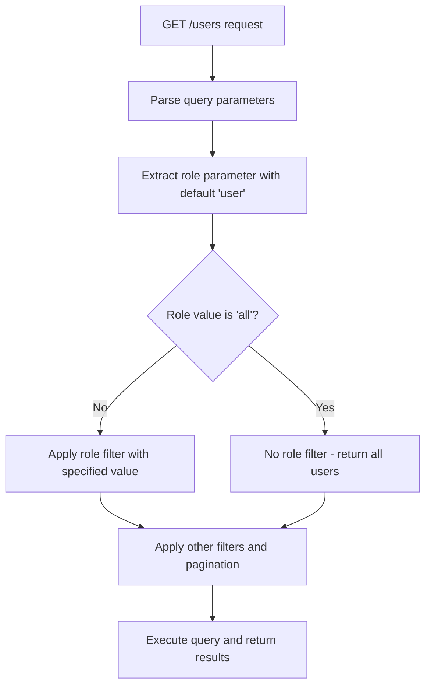

# Fix for User Role Filtering in Supabase Users Function

## Overview
This document describes the issue and solution for fixing the role filtering functionality in the Supabase Edge Function that handles user management. Currently, the function always returns users with the 'user' role regardless of the role parameter passed in the query string.

## Problem Description
When making a request to the users function with a specific role parameter:
- Direct REST API call: `https://ehznqzaumsnjkrntaiox.supabase.co/rest/v1/profiles?select=*&role=eq.user` correctly returns only users with the 'user' role
- Function call: `https://ehznqzaumsnjkrntaiox.supabase.co/functions/v1/users?role=user&page=1&limit=10` incorrectly returns all users (including admin and manager roles)

The issue is in the GET handler of the users function which hardcodes the role filter to 'user' instead of using the role parameter from the query string.

## Current Implementation Analysis

### Users Function - GET Handler (Current)
```typescript
// ---------------- GET /users ----------------
if (req.method === 'GET' && !userId) {
  const page = parseInt(url.searchParams.get('page') || '1')
  const limit = parseInt(url.searchParams.get('limit') || '10')
  const offset = (page - 1) * limit
  const sortBy = url.searchParams.get('sortBy') || 'created_at'
  const sortOrder = url.searchParams.get('sortOrder') || 'desc'
  const search = url.searchParams.get('search')

  // ВСЕГДА фильтруем по role='user' - This is the problem!
  let query = supabaseClient.from('profiles').select('*', { count: 'exact' }).eq('role', 'user')

  if (search) query = query.or(`name.ilike.%${search}%,email.ilike.%${search}%`)

  query = query.order(sortBy, { ascending: sortOrder === 'asc' }).range(offset, offset + limit - 1)

  const { data: users, error, count } = await query
  if (error) return new Response(JSON.stringify({ error: error.message }), { status: 500, headers: corsHeaders })

  return new Response(JSON.stringify({ users, total: count ?? 0, page, limit }), { headers: corsHeaders })
}
```

The issue is on this line:
```typescript
// ВСЕГДА фильтруем по role='user'
let query = supabaseClient.from('profiles').select('*', { count: 'exact' }).eq('role', 'user')
```

This line always filters by `role='user'` regardless of the role parameter passed in the query string. The function needs to extract the role parameter from the query string and apply filtering based on its value.

## Solution Design

### Updated Users Function - GET Handler
The solution involves modifying the GET handler to:
1. Extract the role parameter from the query string
2. Apply role filtering based on the parameter value:
   - If `role` is not provided or is 'user', filter by `role='user'`
   - If `role` is 'admin', filter by `role='admin'`
   - If `role` is 'manager', filter by `role='manager'`
   - If `role` is 'all', don't apply any role filter (return all users)
3. Maintain all existing functionality (pagination, search, sorting)

### Flowchart of Updated Logic


## Implementation Steps

### 1. Modify Users Function GET Handler
The fix requires updating the GET handler in `/supabase/functions/users/index.ts` to:
1. Extract the `role` parameter from the URL search parameters
2. Apply conditional filtering based on the role parameter value
3. Maintain all existing functionality (pagination, search, sorting)

The key change is replacing the hardcoded role filter:
```typescript
// ВСЕГДА фильтруем по role='user'
let query = supabaseClient.from('profiles').select('*', { count: 'exact' }).eq('role', 'user')
```

With dynamic role filtering based on the query parameter:
```typescript
// Extract role parameter from query string, default to 'user'
const role = url.searchParams.get('role') || 'user'

// Build query with conditional role filtering
let query = supabaseClient.from('profiles').select('*', { count: 'exact' })

// Apply role filter based on parameter
if (role && role !== 'all') {
  query = query.eq('role', role)
}
// If role is 'all', no role filter is applied
```

### 2. Ensure Count Query Consistency
The count query used for pagination must apply the same role filtering to ensure accurate pagination results:
```typescript
// For accurate pagination, we also need to apply the same filters to the count query
let countQuery = supabaseClient.from('profiles').select('*', { count: 'exact', head: true })
if (role && role !== 'all') {
  countQuery = countQuery.eq('role', role)
}
if (search) countQuery = countQuery.or(`name.ilike.%${search}%,email.ilike.%${search}%`)
const { count } = await countQuery
```

## Expected Behavior After Fix

| Request URL | Expected Result |
|-------------|-----------------|
| `GET /functions/v1/users?role=user` | Returns only users with role = "user" |
| `GET /functions/v1/users?role=admin` | Returns only users with role = "admin" |
| `GET /functions/v1/users?role=manager` | Returns only users with role = "manager" |
| `GET /functions/v1/users?role=all` | Returns all users regardless of role |
| `GET /functions/v1/users` | Returns only users with role = "user" (default behavior) |
| `GET /functions/v1/users?role=invalid` | Returns only users with role = "invalid" (if such role exists in DB) or empty result |

## Validation and Testing

### Manual Validation Steps
1. Deploy the updated function to the Supabase environment
2. Test each role filter parameter:
   - `GET /functions/v1/users?role=user` - Should return only users with role = "user"
   - `GET /functions/v1/users?role=admin` - Should return only users with role = "admin"
   - `GET /functions/v1/users?role=manager` - Should return only users with role = "manager"
   - `GET /functions/v1/users?role=all` - Should return all users regardless of role
   - `GET /functions/v1/users` - Should return only users with role = "user" (default behavior)
3. Verify pagination still works correctly with each role filter
4. Verify search functionality is unaffected by role filtering
5. Verify sorting functionality is unaffected by role filtering

### Automated Testing
Create integration tests that validate:
- Role parameter parsing and handling
- Correct query building based on role parameter
- Default behavior when role parameter is missing
- Proper error handling for database errors
- Consistent response format across all role filters

### Regression Testing
- Confirm existing admin functionality is unaffected
- Verify POST/PATCH/DELETE operations still require admin permissions
- Test edge cases (invalid role parameters, etc.)
- Validate that the fix doesn't impact other Supabase functions

## Security Considerations
- The function already requires admin authentication for write operations
- Read operations (GET) are accessible with the anon key but properly filtered by role
- No additional security concerns introduced by this change

## Backward Compatibility
- Default behavior (when no role parameter is provided) remains the same
- Existing frontend code that relies on the default behavior will continue to work
- New functionality is additive and doesn't break existing integrations