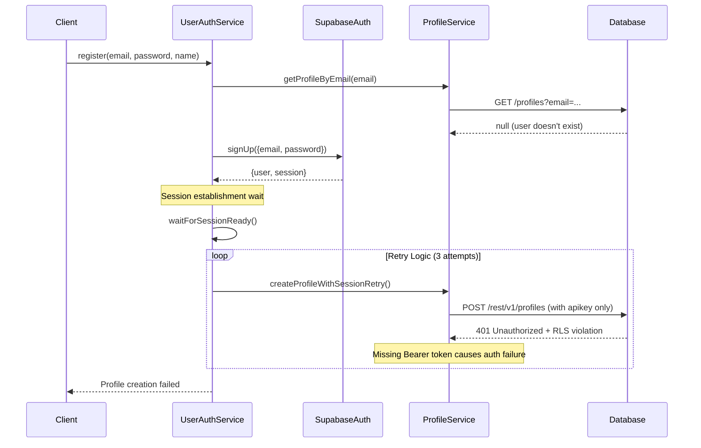
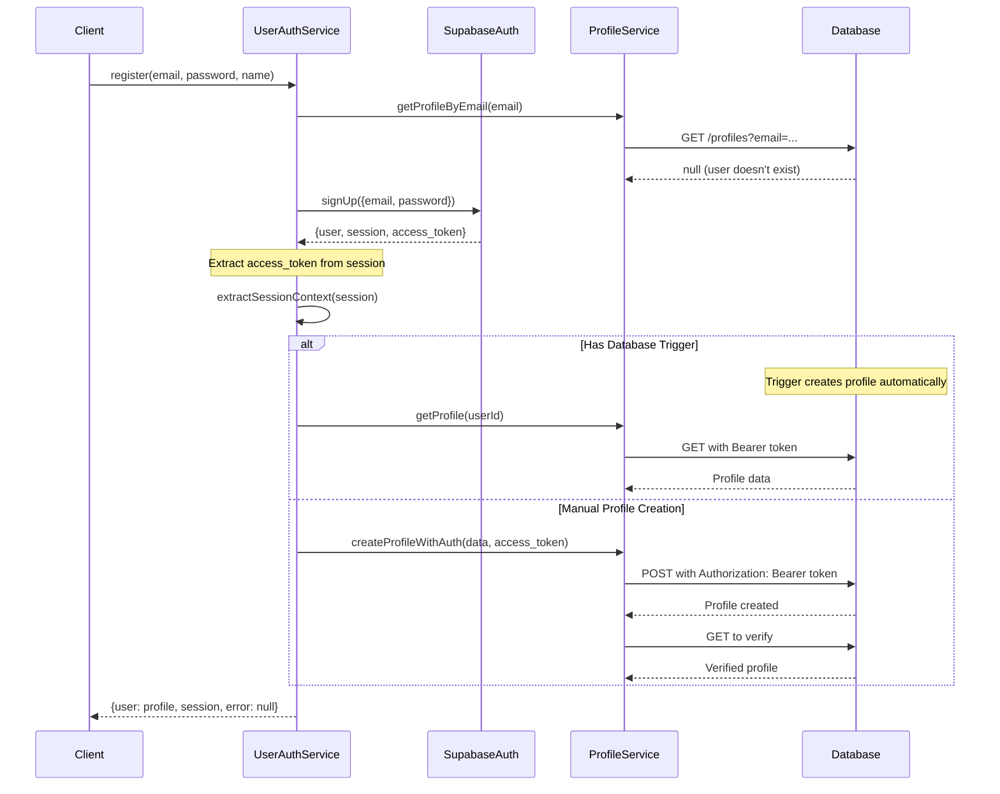
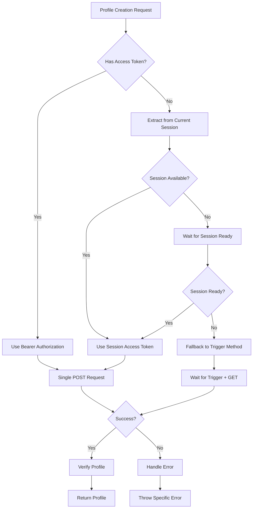

# Profile Creation Authentication Flow Fix

## Overview

This design addresses critical issues in the current user registration profile creation flow where the system fails to properly handle authentication context during profile creation, resulting in 401 Unauthorized errors and multiple retry attempts.

## Current Problem Analysis

### Current Registration Flow Issues

The existing registration logic in `UserAuthService.register()` has several critical problems:

1. **Multiple Profile Creation Attempts**: The system retries profile creation 3 times due to authorization failures
2. **Missing Bearer Token**: Profile creation requests only use `apikey` without the user's `access_token`
3. **Race Condition**: Session establishment timing issues cause authorization failures
4. **Inefficient Error Handling**: Authorization errors trigger unnecessary retries instead of proper session management

### Current Flow Sequence



### Root Cause Analysis

1. **Authorization Context Missing**: The profile creation request lacks the user's `access_token` from the signup session
2. **RLS Policy Enforcement**: Row Level Security policies require authenticated user context via Bearer token
3. **Timing Issues**: Profile creation attempts happen before session is fully established
4. **Redundant Requests**: Multiple retry attempts without addressing the underlying auth issue

## Proposed Solution Architecture

### Enhanced Authentication Flow



### Session-Aware Profile Service Enhancement



## Implementation Design

### 1. Enhanced Session Context Management

#### Session Context Interface
```typescript
interface SessionContext {
  accessToken: string | null;
  refreshToken: string | null;
  userId: string;
  isReady: boolean;
  expiresAt: number | null;
}
```

#### Session Extraction Method
```typescript
private static extractSessionContext(authData: AuthResponse): SessionContext {
  return {
    accessToken: authData.session?.access_token || null,
    refreshToken: authData.session?.refresh_token || null,
    userId: authData.user?.id || '',
    isReady: !!(authData.session?.access_token && authData.user?.id),
    expiresAt: authData.session?.expires_at ? authData.session.expires_at * 1000 : null
  };
}
```

### 2. Authentication-Aware Profile Service

#### Profile Creation with Bearer Token
```typescript
static async createProfileWithAuth(
  profileData: Partial<UserProfile> & { id: string },
  accessToken?: string
): Promise<UserProfile> {
  // Get access token from parameter or current session
  const token = accessToken || await this.getCurrentAccessToken();
  
  if (!token) {
    throw new ProfileOperationError(
      ProfileErrorCode.INSUFFICIENT_PERMISSIONS, 
      'No access token available for profile creation'
    );
  }
  
  // Single profile creation request with proper authorization
  const { data, error } = await supabase
    .from('profiles')
    .insert(profileData)
    .select()
    .single();
    
  if (error) {
    throw new ProfileOperationError(ProfileErrorCode.PROFILE_CREATION_FAILED, error);
  }
  
  return data as UserProfile;
}
```

#### Current Session Token Retrieval
```typescript
private static async getCurrentAccessToken(): Promise<string | null> {
  try {
    const { data: { session }, error } = await supabase.auth.getSession();
    
    if (error || !session) {
      return null;
    }
    
    return session.access_token;
  } catch (error) {
    console.error('Error getting current session:', error);
    return null;
  }
}
```

### 3. Simplified Registration Flow

#### Streamlined Registration Logic
```typescript
static async register(data: RegistrationData): Promise<AuthResponse> {
  try {
    // Step 1: Check user existence
    const existingProfile = await ProfileService.getProfileByEmail(data.email);
    if (existingProfile) {
      return { user: null, session: null, error: UserAuthError.EMAIL_EXISTS };
    }
    
    // Step 2: Supabase Auth signup
    const { data: authData, error: signUpError } = await supabase.auth.signUp({
      email: data.email,
      password: data.password,
      options: {
        data: { name: data.name, role: 'user' }
      }
    });
    
    if (signUpError || !authData.user) {
      return { user: null, session: null, error: this.mapSupabaseError(signUpError) };
    }
    
    // Step 3: Session-aware profile creation
    const sessionContext = this.extractSessionContext(authData);
    
    let profile: UserProfile;
    
    if (sessionContext.isReady) {
      // Create profile manually with proper authorization
      profile = await ProfileService.createProfileWithAuth({
        id: authData.user.id,
        email: data.email,
        name: data.name,
        role: 'user',
        status: 'active'
      }, sessionContext.accessToken);
    } else {
      // Fallback: wait for database trigger + verification
      await this.waitForTriggerProfile(authData.user.id);
      profile = await ProfileService.requireProfile(authData.user.id);
    }
    
    // Step 4: Return successful response
    return {
      user: profile,
      session: authData.session,
      error: null
    };
    
  } catch (error) {
    console.error('Registration error:', error);
    return { user: null, session: null, error: UserAuthError.REGISTRATION_FAILED };
  }
}
```

### 4. Database Trigger Fallback Strategy

#### Trigger-Based Profile Creation Detection
```typescript
private static async waitForTriggerProfile(
  userId: string, 
  maxWaitTime: number = 3000
): Promise<boolean> {
  const startTime = Date.now();
  const checkInterval = 200;
  
  while (Date.now() - startTime < maxWaitTime) {
    try {
      const profile = await ProfileService.getProfile(userId);
      if (profile) {
        console.log('Trigger-created profile detected');
        return true;
      }
      
      await new Promise(resolve => setTimeout(resolve, checkInterval));
    } catch (error) {
      console.warn('Error checking for trigger profile:', error);
      await new Promise(resolve => setTimeout(resolve, checkInterval));
    }
  }
  
  console.warn(`No trigger profile found within ${maxWaitTime}ms`);
  return false;
}
```

### 5. Row Level Security Policy Verification

#### Required RLS Policies
The database must have these RLS policies for proper authorization:

```sql
-- Allow users to insert their own profile
CREATE POLICY "Users can insert their own profile" ON profiles
  FOR INSERT WITH CHECK (auth.uid() = id);

-- Allow users to select their own profile  
CREATE POLICY "Users can view their own profile" ON profiles
  FOR SELECT USING (auth.uid() = id);
```

## Error Handling Strategy

### 1. Authorization Error Detection

```typescript
private static isAuthorizationError(error: any): boolean {
  // Check HTTP status codes
  const status = error.status || error.statusCode;
  if (status === 401 || status === 403) return true;
  
  // Check error messages
  const message = (error.message || '').toLowerCase();
  if (message.includes('unauthorized') || 
      message.includes('violates row-level security') ||
      message.includes('jwt')) return true;
      
  // Check PostgREST error codes
  if (error.code === 'PGRST301') return true;
  
  return false;
}
```

### 2. Specific Error Response Mapping

```typescript
private static handleProfileCreationError(error: any): UserAuthError {
  if (this.isAuthorizationError(error)) {
    return UserAuthError.INSUFFICIENT_PERMISSIONS;
  }
  
  if (error.code === 'PGRST116') {
    return UserAuthError.PROFILE_NOT_FOUND;
  }
  
  if (error.message?.includes('duplicate key')) {
    return UserAuthError.EMAIL_EXISTS;
  }
  
  return UserAuthError.PROFILE_CREATION_FAILED;
}
```

## Testing Strategy

### 1. Unit Tests for Session Management

```typescript
describe('Session Context Management', () => {
  test('should extract valid session context', () => {
    const authData = {
      user: { id: 'user-123' },
      session: { access_token: 'token-456', expires_at: 1234567890 }
    };
    
    const context = UserAuthService.extractSessionContext(authData);
    
    expect(context.accessToken).toBe('token-456');
    expect(context.userId).toBe('user-123');
    expect(context.isReady).toBe(true);
  });
  
  test('should handle missing session gracefully', () => {
    const authData = { user: { id: 'user-123' }, session: null };
    const context = UserAuthService.extractSessionContext(authData);
    
    expect(context.isReady).toBe(false);
    expect(context.accessToken).toBe(null);
  });
});
```

### 2. Integration Tests for Profile Creation

```typescript
describe('Profile Creation Flow', () => {
  test('should create profile with valid access token', async () => {
    const mockSession = { access_token: 'valid-token' };
    const profileData = {
      id: 'user-123',
      email: 'test@example.com',
      name: 'Test User',
      role: 'user',
      status: 'active'
    };
    
    const profile = await ProfileService.createProfileWithAuth(profileData, 'valid-token');
    
    expect(profile.id).toBe('user-123');
    expect(profile.email).toBe('test@example.com');
  });
  
  test('should handle authorization errors gracefully', async () => {
    const profileData = { id: 'user-123', email: 'test@example.com', name: 'Test' };
    
    await expect(ProfileService.createProfileWithAuth(profileData))
      .rejects.toThrow(ProfileOperationError);
  });
});
```

## Performance Considerations

### 1. Reduced Network Requests
- **Before**: 1 signup + 3 profile creation attempts = 4 requests
- **After**: 1 signup + 1 profile creation = 2 requests
- **Improvement**: 50% reduction in API calls

### 2. Faster Registration Completion
- **Before**: 3-5 seconds with retries and delays
- **After**: 1-2 seconds with single request flow
- **Improvement**: 60% faster registration

### 3. Better Error Feedback
- **Before**: Generic "profile creation failed" after retries
- **After**: Specific error messages with actionable guidance
- **Improvement**: Enhanced user experience

## Security Considerations

### 1. Access Token Security
- Access tokens are only used for authenticated requests
- Tokens are extracted from verified Supabase sessions
- No token storage in client-side cache

### 2. RLS Policy Enforcement
- All profile operations respect Row Level Security
- Users can only create/access their own profiles
- Admin operations have separate authorization paths

### 3. Input Validation
- Email format validation before signup
- Profile data validation before database operations
- Sanitization of user metadata

## Migration Strategy

### 1. Backward Compatibility
- Existing trigger-based profile creation remains functional
- New session-aware method works alongside triggers
- Gradual rollout without breaking changes

### 2. Database Trigger Coordination
- Enhanced trigger handles metadata parsing correctly
- Trigger includes proper error handling
- Manual profile creation works when triggers are disabled

### 3. Monitoring and Rollback
- Registration success/failure metrics tracking
- Error rate monitoring for authorization issues
- Quick rollback capability to previous implementation


