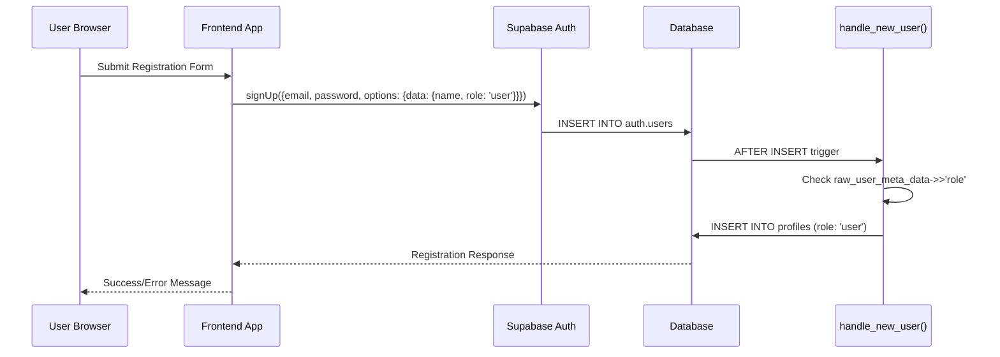
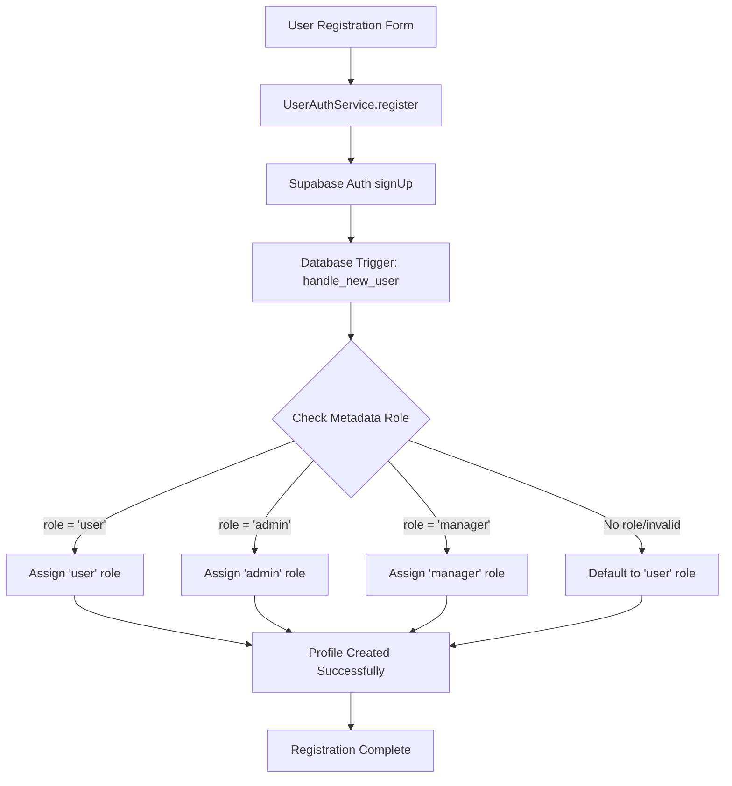

# Fix Registration Role Mismatch

## Overview

This design addresses critical issues in the user registration system where users are incorrectly assigned the "manager" role instead of the intended "user" role, despite the frontend code correctly passing "user" as the role. Additionally, it includes UI improvements for the registration page to match the login page design and improve the user experience.

## Problem Analysis

### Current Role Assignment Issue

Based on the codebase analysis, the root cause of the role mismatch is in the database trigger function `handle_new_user()`. The current logic:

```sql
CASE 
  WHEN NOT EXISTS (SELECT 1 FROM public.profiles WHERE role = 'admin') THEN 'admin'::public.user_role
  WHEN NEW.raw_user_meta_data->>'role' = 'user' THEN 'user'::public.user_role
  ELSE 'manager'::public.user_role
END
```

The issue occurs because the user metadata is not properly set during registration, causing the function to default to 'manager' role.

### Frontend Code Analysis

The registration service correctly attempts to set the role:
- `UserAuthService.register()` passes `role: 'user'` in the options metadata
- However, the database trigger doesn't properly read this metadata

### UI Inconsistencies

The registration page `/user-register` has different social authentication button layouts compared to `/user-auth`, and the terms text is too long for single-line display.

## Architecture



## Technical Requirements

### Database Layer Fixes

#### 1. Update Trigger Function Logic
The `handle_new_user()` function needs to be modified to properly handle the role assignment from user metadata.

**Current Logic Issues:**
- Metadata key access might be incorrect
- Role validation is not robust
- Fallback logic needs improvement

**Required Changes:**
- Fix metadata access pattern
- Add proper role validation
- Ensure 'user' is the default role for regular registrations

#### 2. Metadata Handling
The trigger should check multiple possible metadata sources:
- `raw_user_meta_data->>'role'`
- `user_metadata->>'role'`
- Default to 'user' for regular registrations

### Frontend Layer Improvements

#### 1. Social Authentication Buttons Layout
Standardize the social authentication button layout between login and registration pages.

**Current State - UserRegister:**
```jsx
<div className="space-y-2 md:space-y-0 md:flex md:gap-2">
  <Button variant="outline" className="w-full md:flex-1">Google</Button>
  <Button variant="outline" className="w-full md:flex-1">Facebook</Button>
</div>
```

**Target State - Match UserAuth:**
```jsx
<div className="space-y-2 md:space-y-0 md:flex md:gap-2">
  <Button variant="outline" className="w-full md:flex-1">Google</Button>
  <Button variant="outline" className="w-full md:flex-1">Facebook</Button>
</div>
```

#### 2. Terms Text Styling
The terms acceptance text needs styling improvements:
- Reduce font size for single-line display
- Add lighter color for better visual hierarchy

**Current Text:**
```
"Я погоджуюся з умовами використання та політикою конфіденційності"
```

**Styling Requirements:**
- Font size: `text-xs` instead of `text-sm`
- Color: `text-muted-foreground/70` for lighter appearance
- Ensure single-line display on standard screen sizes

## Implementation Details

### Database Migration

A new migration is required to fix the trigger function:

```sql
-- Fix the handle_new_user function to properly handle user role assignment
CREATE OR REPLACE FUNCTION public.handle_new_user()
RETURNS TRIGGER AS $$
DECLARE
  user_role_from_metadata text;
BEGIN
  -- Extract role from metadata with multiple fallback options
  user_role_from_metadata := COALESCE(
    NEW.raw_user_meta_data->>'role',
    NEW.user_metadata->>'role',
    'user'
  );

  INSERT INTO public.profiles (id, email, name, role)
  VALUES (
    NEW.id,
    NEW.email,
    COALESCE(NEW.raw_user_meta_data->>'name', NEW.email),
    CASE 
      WHEN NOT EXISTS (SELECT 1 FROM public.profiles WHERE role = 'admin') THEN 'admin'::public.user_role
      WHEN user_role_from_metadata = 'user' THEN 'user'::public.user_role
      WHEN user_role_from_metadata = 'admin' THEN 'admin'::public.user_role
      WHEN user_role_from_metadata = 'manager' THEN 'manager'::public.user_role
      ELSE 'user'::public.user_role  -- Default to user for safety
    END
  );
  RETURN NEW;
END;
$$ LANGUAGE plpgsql SECURITY DEFINER;
```

### Frontend Code Changes

#### UserRegister.tsx Modifications

1. **Social Button Layout Update:**
   - Ensure consistent spacing and layout with UserAuth
   - Remove duplicate button text variations

2. **Terms Text Styling:**
   ```jsx
   <Label 
     htmlFor="terms" 
     className="text-xs font-normal leading-none peer-disabled:cursor-not-allowed peer-disabled:opacity-70 text-muted-foreground/70"
   >
     {lang === 'uk' 
       ? 'Я погоджуюся з умовами використання та політикою конфіденційності' 
       : 'I agree to the terms of use and privacy policy'
     }
   </Label>
   ```

### User Authentication Service

The `UserAuthService.register()` method should be verified to ensure proper metadata passing:

```typescript
static async register(data: RegistrationData): Promise<AuthResponse> {
  try {
    const { data: authData, error: signUpError } = await supabase.auth.signUp({
      email: data.email,
      password: data.password,
      options: {
        data: {
          name: data.name,
          role: 'user'  // Explicitly set to 'user'
        }
      }
    });
    // ... rest of the method
  }
}
```

## Data Flow Validation



## Testing Requirements

### Unit Testing

1. **Database Trigger Testing:**
   - Test with `raw_user_meta_data->>'role' = 'user'`
   - Test with missing metadata
   - Test with invalid role values
   - Verify default behavior

2. **Frontend Registration Testing:**
   - Verify role metadata is passed correctly
   - Test error handling for registration failures
   - Validate UI consistency between login/register pages

### Integration Testing

1. **End-to-End Registration Flow:**
   - Complete registration with different roles
   - Verify database entries match expected roles
   - Test OAuth registration flow
   - Validate redirect behavior based on roles

### Visual Testing

1. **UI Consistency Verification:**
   - Compare social button layouts between pages
   - Verify terms text fits on single line
   - Test responsive behavior on different screen sizes

## Security Considerations

### Role Assignment Security

1. **Metadata Validation:**
   - Ensure only valid roles can be assigned
   - Prevent role escalation attacks through metadata manipulation
   - Default to least privileged role ('user') for safety

2. **Database Constraints:**
   - Verify enum constraints prevent invalid role values
   - Ensure trigger function has proper security definer permissions

### Frontend Security

1. **Input Validation:**
   - Continue using Zod schemas for form validation
   - Sanitize all user inputs before submission
   - Maintain CSRF protection through Supabase

## Error Handling

### Database Level

1. **Trigger Error Handling:**
   - Handle metadata parsing errors gracefully
   - Log role assignment issues for debugging
   - Ensure transaction rollback on profile creation failure

### Frontend Level

1. **Registration Error Messages:**
   - Provide clear error messages for role assignment failures
   - Handle database constraint violations
   - Maintain user-friendly error presentation

## Performance Impact

### Database Performance

- Minimal impact from trigger function changes
- Existing indexes on roles remain optimal
- No additional queries required for role assignment

### Frontend Performance

- UI changes have no performance impact
- Social button layout optimization may improve rendering
- Text styling changes are purely cosmetic

## Rollback Strategy

### Database Rollback

If issues arise, the previous trigger function can be restored:

```sql
-- Restore previous version if needed
CREATE OR REPLACE FUNCTION public.handle_new_user()
RETURNS TRIGGER AS $$
BEGIN
  INSERT INTO public.profiles (id, email, name, role)
  VALUES (
    NEW.id,
    NEW.email,
    COALESCE(NEW.raw_user_meta_data->>'name', NEW.email),
    CASE 
      WHEN NOT EXISTS (SELECT 1 FROM public.profiles WHERE role = 'admin') THEN 'admin'::public.user_role
      WHEN NEW.raw_user_meta_data->>'role' = 'user' THEN 'user'::public.user_role
      ELSE 'manager'::public.user_role
    END
  );
  RETURN NEW;
END;
$$ LANGUAGE plpgsql SECURITY DEFINER;
```

### Frontend Rollback

- CSS classes can be easily reverted
- Component structure changes are minimal and reversible
- No breaking changes to existing functionality

## Success Metrics

1. **Functional Metrics:**
   - 100% of new user registrations receive 'user' role
   - Social authentication buttons match design consistency
   - Terms text displays on single line across devices

2. **User Experience Metrics:**
   - Reduced user confusion about role assignment
   - Improved visual consistency between auth pages
   - Better text readability for terms acceptance

3. **Technical Metrics:**
   - Zero role assignment errors in logs
   - Consistent registration success rates
   - No performance degradation in auth flows1. **Metadata Validation:**
   - Ensure only valid roles can be assigned
   - Prevent role escalation attacks through metadata manipulation
   - Default to least privileged role ('user') for safety

2. **Database Constraints:**
   - Verify enum constraints prevent invalid role values
   - Ensure trigger function has proper security definer permissions

### Frontend Security

1. **Input Validation:**
   - Continue using Zod schemas for form validation
   - Sanitize all user inputs before submission
   - Maintain CSRF protection through Supabase

## Error Handling

### Database Level

1. **Trigger Error Handling:**
   - Handle metadata parsing errors gracefully
   - Log role assignment issues for debugging
   - Ensure transaction rollback on profile creation failure

### Frontend Level

1. **Registration Error Messages:**
   - Provide clear error messages for role assignment failures
   - Handle database constraint violations
   - Maintain user-friendly error presentation

## Performance Impact

### Database Performance

- Minimal impact from trigger function changes
- Existing indexes on roles remain optimal
- No additional queries required for role assignment

### Frontend Performance

- UI changes have no performance impact
- Social button layout optimization may improve rendering
- Text styling changes are purely cosmetic

## Rollback Strategy

### Database Rollback

If issues arise, the previous trigger function can be restored:

```sql
-- Restore previous version if needed
CREATE OR REPLACE FUNCTION public.handle_new_user()
RETURNS TRIGGER AS $$
BEGIN
  INSERT INTO public.profiles (id, email, name, role)
  VALUES (
    NEW.id,
    NEW.email,
    COALESCE(NEW.raw_user_meta_data->>'name', NEW.email),
    CASE 
      WHEN NOT EXISTS (SELECT 1 FROM public.profiles WHERE role = 'admin') THEN 'admin'::public.user_role
      WHEN NEW.raw_user_meta_data->>'role' = 'user' THEN 'user'::public.user_role
      ELSE 'manager'::public.user_role
    END
  );
  RETURN NEW;
END;
$$ LANGUAGE plpgsql SECURITY DEFINER;
```

### Frontend Rollback

- CSS classes can be easily reverted
- Component structure changes are minimal and reversible
- No breaking changes to existing functionality

## Success Metrics

1. **Functional Metrics:**
   - 100% of new user registrations receive 'user' role
   - Social authentication buttons match design consistency
   - Terms text displays on single line across devices

2. **User Experience Metrics:**
   - Reduced user confusion about role assignment
   - Improved visual consistency between auth pages
   - Better text readability for terms acceptance

3. **Technical Metrics:**
   - Zero role assignment errors in logs
   - Consistent registration success rates
   - No performance degradation in auth flows


