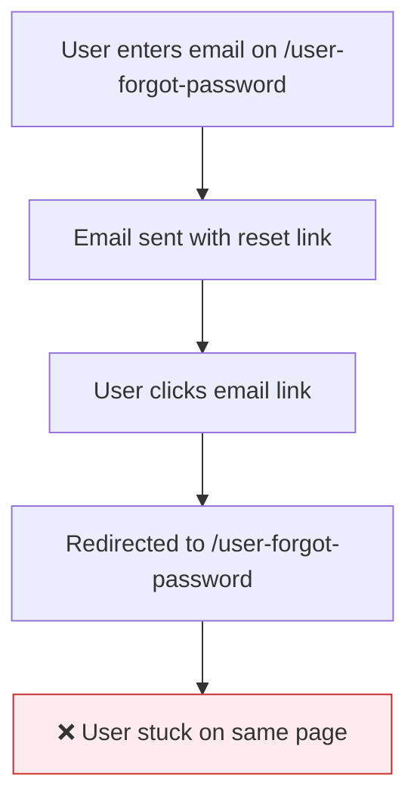
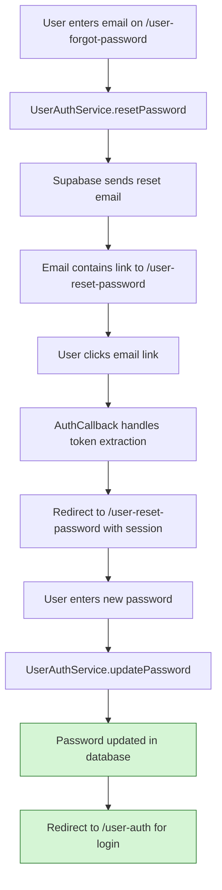
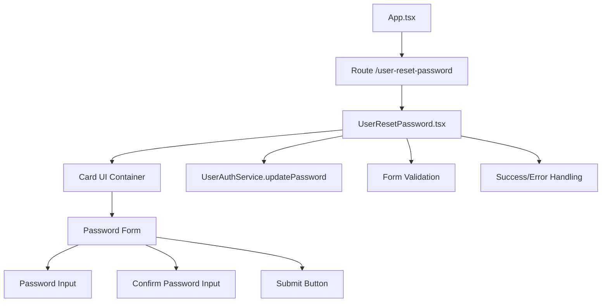
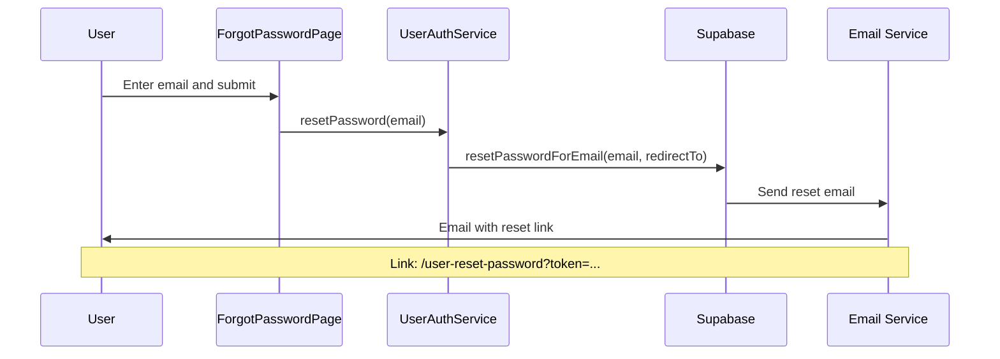
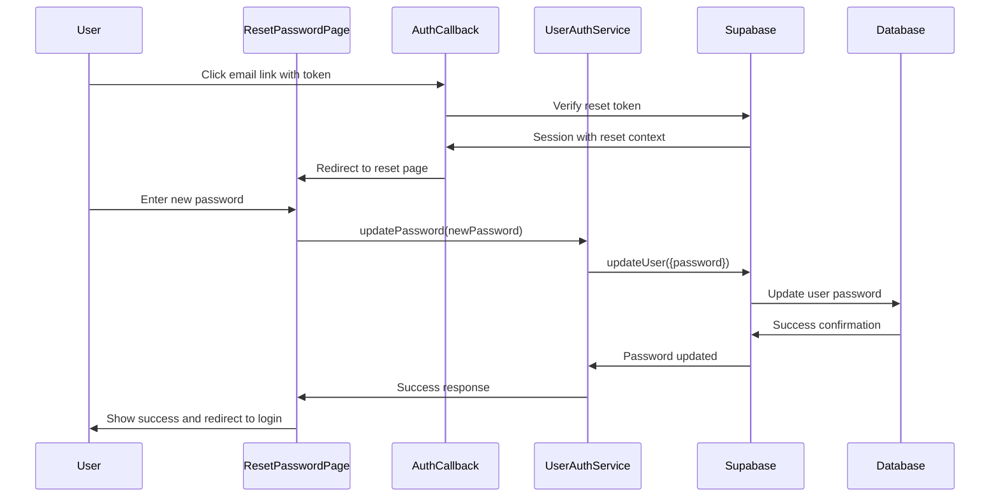

# Forgot Password Flow Fix - Design Document

## Overview

This document outlines the design for fixing the password reset flow in the MarketGrow application. Currently, users initiate password reset on `/user-forgot-password`, receive an email with a reset link, but are incorrectly redirected back to the forgot password page instead of a password reset form. The solution involves creating a new password reset page and updating the authentication flow.

## Problem Analysis

### Current Flow Issues
- Password reset email redirects to `/user-forgot-password` instead of a dedicated reset page
- No dedicated page exists for users to enter their new password
- Missing token handling for password reset verification
- Incomplete password update functionality in the authentication flow

### Current Implementation


## Solution Design

### Target Flow


## Architecture

### Component Architecture

#### New UserResetPassword Component
```typescript
interface UserResetPasswordProps {
  // No props - uses auth context for session validation
}

interface UserResetPasswordState {
  loading: boolean;
  password: string;
  confirmPassword: string;
  errors: Record<string, string>;
  resetSuccess: boolean;
}
```

#### Component Hierarchy


### Authentication Flow Updates

#### Modified UserAuthService Methods

**Updated resetPassword Method:**
```typescript
static async resetPassword(data: ResetPasswordData): Promise<{ success: boolean; error: string | null }> {
  try {
    const { error } = await supabase.auth.resetPasswordForEmail(data.email, {
      redirectTo: `${window.location.origin}/user-reset-password`  // Changed redirect URL
    });
    // ... error handling
  }
}
```

**Enhanced updatePassword Method:**
```typescript
static async updatePassword(password: string): Promise<{ success: boolean; error: string | null }> {
  try {
    const { error } = await supabase.auth.updateUser({
      password: password
    });
    // ... error handling and validation
  }
}
```

### Data Flow

#### Password Reset Initialization


#### Password Reset Completion


## Implementation Details

### 1. Route Configuration

**Updated App.tsx routing:**
```typescript
// Add new route for password reset
<Route path="/user-reset-password" element={<UserResetPassword />} />
```

### 2. UserResetPassword Component Structure

**Component Layout:**
- Matches UserRegister.tsx visual design
- Two-panel layout with marketing content (left) and form (right)
- Responsive design with mobile-first approach
- Language toggle in top-right corner

**Form Fields:**
- New Password (password input with validation)
- Confirm Password (password input with match validation)
- Submit button with loading state

**Validation Schema:**
- Uses existing `updatePasswordSchema` from user-auth-schemas.ts
- Password minimum 8 characters
- Passwords must match
- Real-time validation feedback

### 3. Authentication Flow Integration

**Session Validation:**
- Component checks for valid session on mount
- Redirects to login if no valid session
- Validates that session has password reset context

**Error Handling:**
- Network errors with retry mechanism
- Invalid session redirects
- Password validation errors
- Success state with auto-redirect

### 4. UI/UX Considerations

**Visual Design:**
- Consistent with existing authentication pages
- Lock/key icon for password reset context
- Success state with checkmark icon
- Loading states during password update

**User Feedback:**
- Toast notifications for success/error states
- Form validation messages
- Progress indication during submission
- Clear success message with next steps

### 5. Internationalization

**Translation Keys:**
```typescript
// New translation keys needed
'reset_password_title': 'Reset Your Password' | 'Скинути пароль'
'reset_password_desc': 'Enter your new password below' | 'Введіть новий пароль нижче'
'new_password': 'New Password' | 'Новий пароль'
'confirm_new_password': 'Confirm New Password' | 'Підтвердіть новий пароль'
'password_updated': 'Password updated successfully' | 'Пароль успішно оновлено'
'update_password_button': 'Update Password' | 'Оновити пароль'
```

## Security Considerations

### Token Validation
- Supabase handles token validation automatically
- Session-based password updates ensure security
- No manual token handling required in frontend

### Password Security
- Minimum 8-character password requirement
- Password confirmation to prevent typos
- Secure transmission via HTTPS
- No password storage in component state after submission

### Session Management
- Reset tokens have limited validity period
- Session cleared after password update
- User must re-authenticate with new password

## Testing Strategy

### Unit Testing
```typescript
// Test password reset form validation
describe('UserResetPassword', () => {
  it('validates password requirements');
  it('validates password confirmation match');
  it('handles successful password update');
  it('handles authentication errors');
  it('redirects after successful reset');
});
```

### Integration Testing
- End-to-end password reset flow
- Email link clicking and redirection
- Cross-browser compatibility
- Mobile responsiveness

### Error Scenarios
- Invalid/expired reset tokens
- Network failures during password update
- Concurrent password reset attempts
- Session timeout during reset process

## Migration Checklist

### Code Changes
- [ ] Create `UserResetPassword.tsx` component
- [ ] Add route configuration in `App.tsx`
- [ ] Update `resetPassword` redirect URL in `UserAuthService`
- [ ] Add translation keys for password reset
- [ ] Update `AuthCallback` to handle reset token context

### Testing
- [ ] Unit tests for new component
- [ ] Integration tests for password reset flow
- [ ] Manual testing of email flow
- [ ] Cross-browser testing

### Deployment
- [ ] Update environment configuration if needed
- [ ] Deploy frontend changes
- [ ] Test production email delivery
- [ ] Monitor error rates post-deployment

## Validation Criteria

### Functional Requirements
✅ User can initiate password reset from forgot password page
✅ User receives email with correct reset link
✅ Reset link redirects to dedicated password reset page
✅ User can enter and confirm new password
✅ Password is updated in database
✅ User is redirected to login page after successful reset

### Non-Functional Requirements
✅ Page loads within 2 seconds
✅ Mobile-responsive design
✅ Internationalization support (EN/UA)
✅ Accessibility compliance
✅ Secure password handling
✅ Error recovery mechanisms