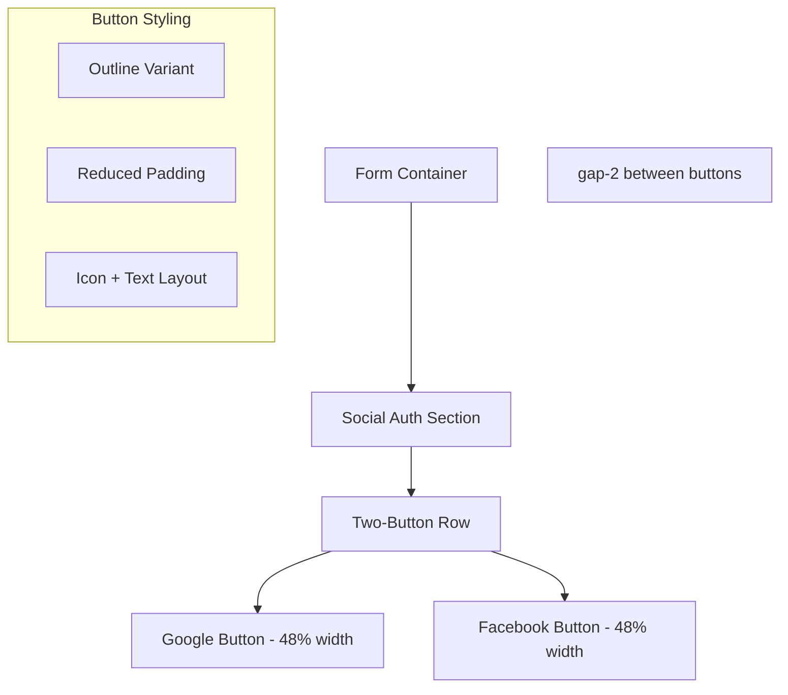
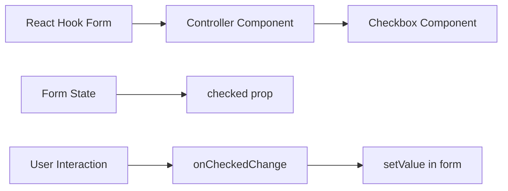
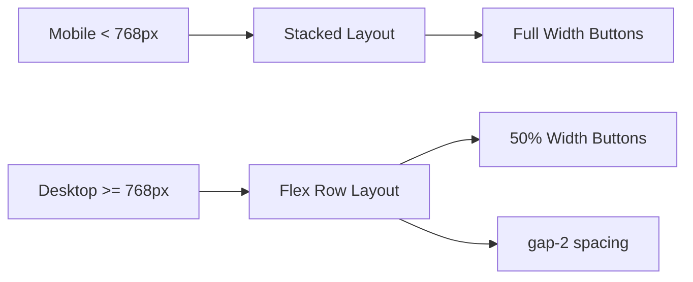

# Form Button Styling and Bug Fix Design

## Overview
This design addresses two main issues in the authentication forms:
1. **Button Layout Enhancement**: Modify social authentication buttons (Google and Facebook) to display side-by-side with reduced width on registration and login pages
2. **Registration Form Bug Fix**: Resolve the checkbox validation issue where users receive "необхідно прийняти умови" error even when terms are accepted

## Current State Analysis

### Authentication Pages Structure
Both UserAuth.tsx and UserRegister.tsx share similar layouts:
- Social authentication buttons (Google, Facebook) currently display as full-width stacked buttons
- Registration form uses React Hook Form with Zod validation
- Checkbox validation is handled through form registration but has validation binding issues

### Identified Issues
1. **Button Styling**: Social auth buttons occupy full width and stack vertically
2. **Checkbox Bug**: Registration form checkbox registration doesn't properly bind the boolean value
3. **Responsive Design**: Current layout doesn't optimize button spacing on different screen sizes

## Button Layout Enhancement Design

### Desktop Layout (md and larger)


### Mobile Layout (sm and smaller)
- Maintain stacked full-width buttons for better touch targets
- Ensure adequate spacing between buttons

### Implementation Strategy
| Component | Current State | Target State |
|-----------|---------------|--------------|
| Button Container | `space-y-2` with full-width buttons | `flex gap-2` for desktop, `space-y-2` for mobile |
| Individual Buttons | `w-full` class | `flex-1` for desktop, `w-full` for mobile |
| Responsive Behavior | Single layout | Conditional classes based on screen size |

## Checkbox Validation Bug Fix

### Root Cause Analysis
The checkbox registration in UserRegister.tsx uses spread operator incorrectly:
```tsx
<Checkbox 
  id="terms" 
  {...registerForm("acceptTerms")}  // Issue: Checkbox expects different props
  disabled={loading}
/>
```

### Technical Problem
React Hook Form's register function returns `onChange`, `onBlur`, `name`, and `ref` props, but Checkbox component expects:
- `checked` boolean value
- `onCheckedChange` callback function

### Solution Architecture


## Component Modifications

### UserAuth.tsx Changes
- Replace social button container with responsive flex layout
- Add conditional classes for mobile/desktop rendering
- Maintain existing button functionality and styling

### UserRegister.tsx Changes  
- Implement identical button layout changes as UserAuth
- Replace direct checkbox registration with Controller wrapper
- Fix checkbox value binding and validation

### Responsive Design Strategy


## Implementation Details

### Button Container Responsive Classes
```css
/* Mobile-first approach */
.social-buttons {
  @apply space-y-2 md:space-y-0 md:flex md:gap-2
}

.social-button {
  @apply w-full md:flex-1
}
```

### Checkbox Controller Implementation
Replace direct registration with React Hook Form Controller:
- Properly handle boolean value conversion
- Maintain validation error display
- Ensure accessibility with proper labeling

### Validation Error Handling
- Preserve existing error message display logic
- Maintain internationalization for error messages
- Keep consistent styling with other form errors

## Testing Considerations

### Button Layout Testing
- Verify button alignment on various screen sizes
- Test touch targets on mobile devices
- Validate button spacing and visual hierarchy

### Checkbox Functionality Testing
- Test form submission with checkbox checked/unchecked
- Verify error message display in both languages
- Validate form reset and re-submission scenarios

### Responsive Testing Breakpoints
| Breakpoint | Button Layout | Expected Behavior |
|------------|---------------|-------------------|
| < 768px | Stacked | Full-width buttons, adequate touch targets |
| >= 768px | Side-by-side | Equal-width buttons with gap |
| >= 1024px | Side-by-side | Maintained proportions |

## Accessibility Considerations

### Button Accessibility
- Maintain keyboard navigation between buttons
- Preserve screen reader announcements
- Ensure sufficient color contrast

### Checkbox Accessibility  
- Maintain proper label association
- Preserve keyboard navigation
- Keep error announcements for screen readers

## Performance Impact

### Bundle Size Impact
- Minimal impact from Controller import
- No additional dependencies required
- Existing component styling maintained

### Runtime Performance
- Controller adds minimal React reconciliation overhead
- Form validation performance unchanged
- No impact on page load times

This design ensures improved user experience through better button layout and resolves the critical registration form bug while maintaining responsive design principles and accessibility standards.