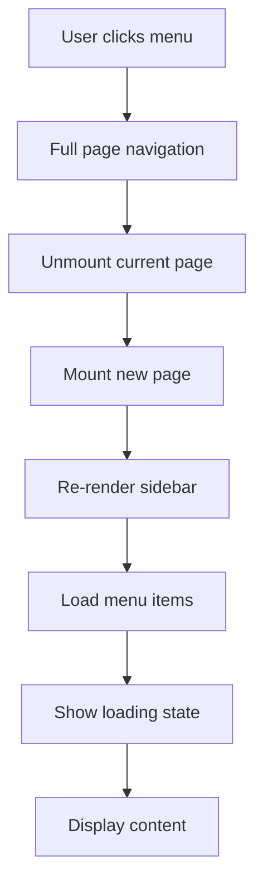
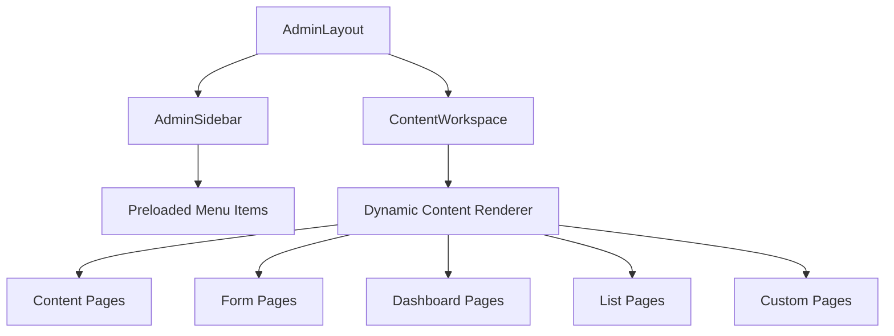
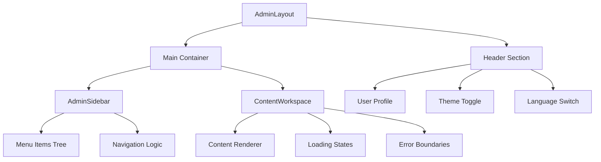
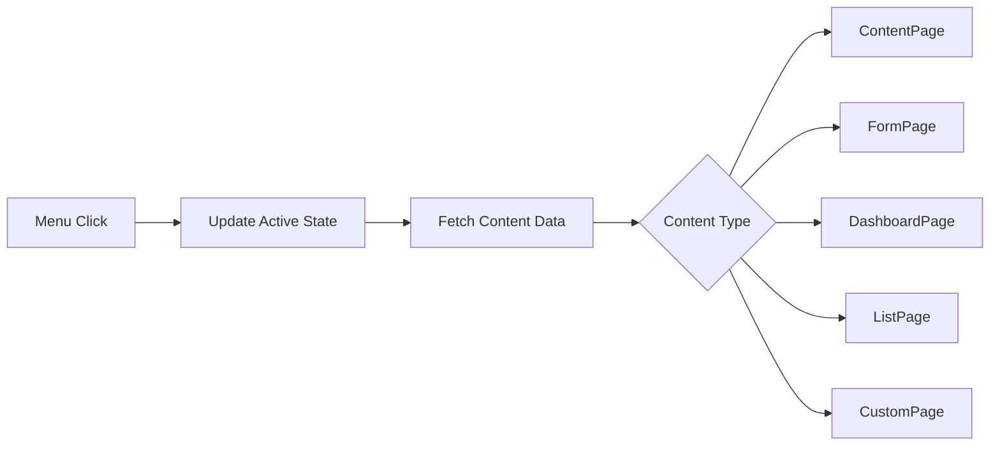
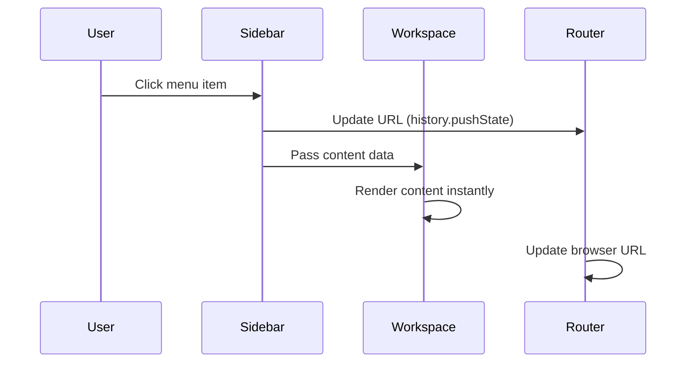
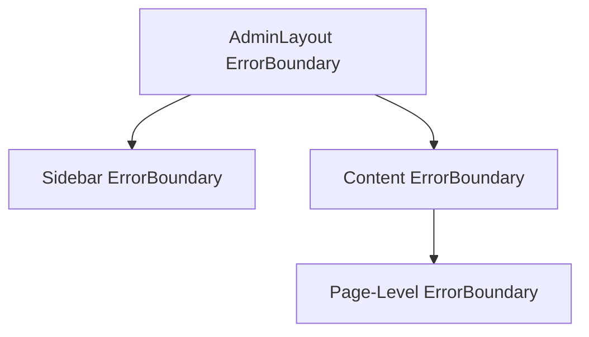

# Menu Page Rendering Design

## Overview

This design document outlines the implementation of a seamless single-page admin interface where menu navigation renders content in a main workspace area without full page reloads, visible loading states, or menu disappearance. The solution transforms the current full-page routing approach into a persistent sidebar with dynamic content rendering.

## Current State Analysis

### Existing Issues
- Each admin page renders as a separate full-page component
- Menu sidebar renders independently on each page
- Visible loading states during navigation
- Menu items loading process is visible to users
- No persistent workspace layout

### Current Architecture


## Proposed Architecture

### Unified Layout Pattern
The new architecture implements a master-detail pattern where the admin interface consists of:
- **Persistent Layout Container**: Never unmounts, contains sidebar and workspace
- **Sidebar Component**: Preloaded menu items, remains visible
- **Content Workspace**: Dynamic content area that updates without page transitions



## Component Architecture

### AdminLayout Component
Central layout container that wraps all admin functionality:



### Menu State Management
Implement centralized menu state to prevent reload issues:

| State | Description | Trigger |
|-------|-------------|---------|
| `menuItems` | Complete menu tree structure | Initial load |
| `activeMenuItem` | Currently selected menu item | Navigation |
| `menuLoading` | Menu items fetch status | Initial load only |
| `contentLoading` | Content loading state | Content changes |

### Content Rendering Strategy
Dynamic content rendering based on menu item configuration:



## Technical Implementation

### State Management Pattern
Implement React Context for admin state management:

```typescript
interface AdminContextState {
  menuItems: MenuItemData[];
  activeMenuItem: MenuItemData | null;
  menuLoading: boolean;
  contentLoading: boolean;
  setActiveMenuItem: (item: MenuItemData) => void;
}
```

### Preloading Strategy
Menu items and initial content preloading to eliminate loading states:

| Phase | Action | Implementation |
|-------|--------|----------------|
| Admin Entry | Preload menu items | Single API call on AdminLayout mount |
| Navigation | Prefetch content | Background loading on menu hover |
| Content Switch | Instant rendering | Cached content or optimistic updates |

### Route Management
Maintain URL synchronization without full page routing:



### Loading State Optimization
Implement progressive loading with skeleton UI:

| Element | Loading Strategy | Fallback |
|---------|------------------|----------|
| Menu Items | Preload on admin entry | Skeleton navigation |
| Content Data | Cached or instant | Content skeleton |
| Dynamic Forms | Progressive enhancement | Basic form structure |

## Performance Considerations

### Caching Strategy
- **Menu Items**: Cache in context/state after initial load
- **Content Data**: Cache frequently accessed pages
- **Route State**: Maintain navigation history

### Memory Management
- Limit cached content to prevent memory bloat
- Implement LRU cache for content pages
- Clean up inactive page resources

### Network Optimization
- Batch API requests for related content
- Implement request deduplication
- Use optimistic updates where possible

## Error Handling Strategy

### Error Boundaries
Implement granular error boundaries:



### Fallback Strategies
| Error Type | Fallback Strategy |
|------------|------------------|
| Menu Load Failure | Show basic navigation |
| Content Load Failure | Show error page with retry |
| Network Failure | Show offline message |
| Authentication Failure | Redirect to login |

## User Experience Enhancements

### Visual Continuity
- Maintain consistent header and sidebar
- Use smooth transitions between content
- Implement loading skeletons instead of spinners

### Navigation Feedback
- Immediate visual feedback on menu selection
- Progress indicators for slow-loading content
- Breadcrumb navigation for deep pages

### Accessibility
- Maintain focus management during navigation
- Announce page changes to screen readers
- Keyboard navigation support

## Testing Strategy

### Unit Testing
- Test menu state management
- Test content rendering logic
- Test error boundary behavior

### Integration Testing
- Test navigation flow
- Test state persistence
- Test error recovery

### Performance Testing
- Measure navigation speed
- Test memory usage patterns
- Validate loading optimization