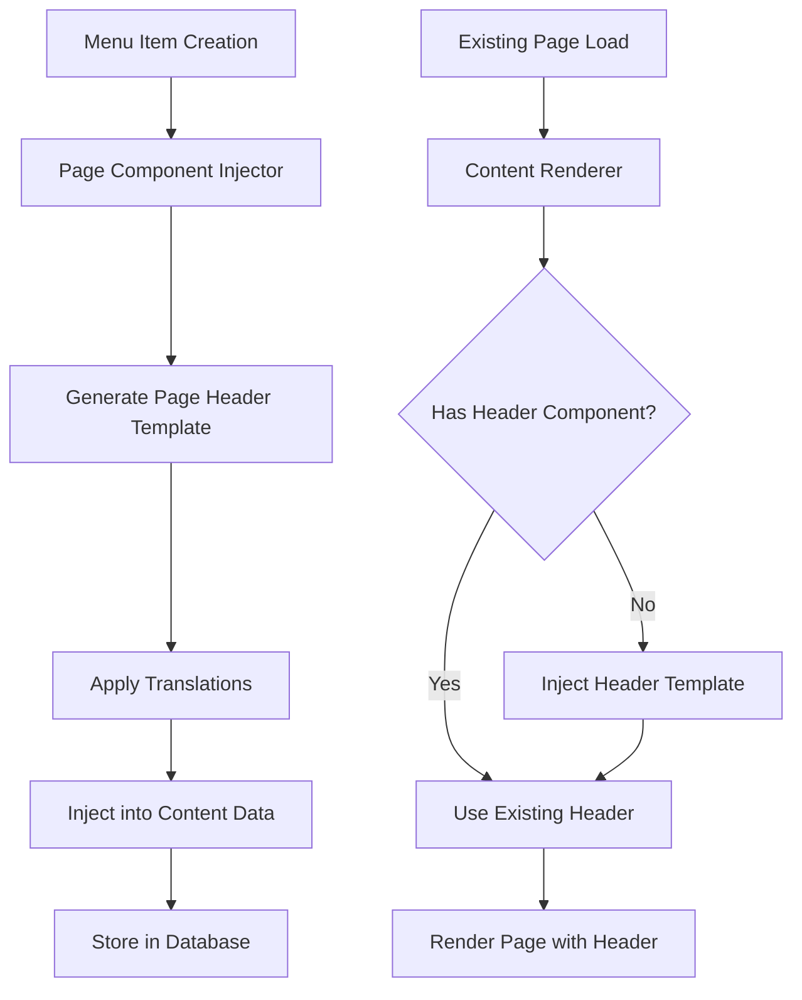
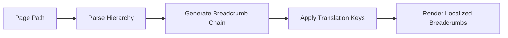
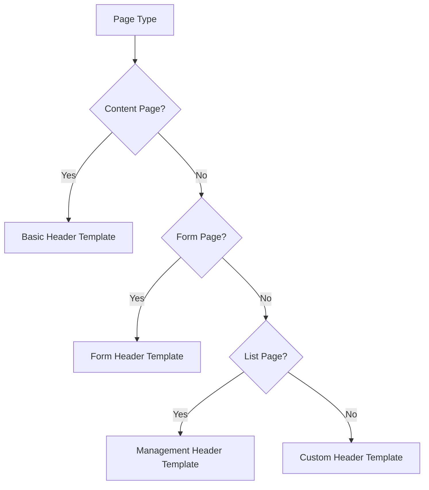

# Page Component Injection System Design

## Overview

The Page Component Injection System enables automatic insertion of standardized page header components into all existing and newly created pages within the admin/user dashboard. This system ensures consistent navigation experience with breadcrumbs, page titles, descriptions, and action buttons across all dynamically generated menu pages.

## Architecture

### Core Components

| Component | Purpose | Location |
|-----------|---------|----------|
| PageHeaderTemplate | Standardized header template | `src/components/templates/PageHeaderTemplate.tsx` |
| PageComponentInjector | Injection logic service | `src/lib/page-component-injector.ts` |
| MenuContentRenderer | Enhanced page renderer | `src/pages/ContentRenderer.tsx` |
| TranslationManager | Dynamic translation resolver | `src/lib/translation-manager.ts` |

### System Flow



## Data Models

### Menu Item Enhanced Structure

| Field | Type | Description |
|-------|------|-------------|
| content_data | JSONB | Enhanced with header template |
| header_config | Object | Page header configuration |
| breadcrumb_data | Array | Dynamic breadcrumb structure |
| translation_keys | Object | Page-specific translation mappings |

### Header Configuration Schema

```json
{
  "header_config": {
    "title_key": "users_title",
    "description_key": "users_subtitle", 
    "breadcrumbs": [
      {"label_key": "breadcrumb_home", "href": "/admin"},
      {"label_key": "breadcrumb_users", "current": true}
    ],
    "actions": [
      {
        "type": "button",
        "label_key": "add_user",
        "icon": "Plus",
        "variant": "default"
      }
    ]
  }
}
```

## Component Injection Strategy

### Automatic Injection for New Pages

When creating new menu items through the database:

1. **Template Selection**: System selects appropriate header template based on page_type
2. **Translation Key Generation**: Auto-generates translation keys using path and title
3. **Breadcrumb Construction**: Builds hierarchical breadcrumb structure
4. **Action Button Configuration**: Determines relevant action buttons for page type

### Retroactive Injection for Existing Pages

For pages without header components:

1. **Page Scan**: Identify pages missing standardized headers
2. **Context Analysis**: Analyze existing page content and structure
3. **Template Application**: Apply appropriate header template
4. **Translation Mapping**: Map existing text to translation keys

## Translation Management

### Dynamic Translation Key Resolution

| Page Type | Title Pattern | Description Pattern |
|-----------|---------------|-------------------|
| Content | `{path}_title` | `{path}_description` |
| Form | `form_{path}_title` | `form_{path}_description` |
| List | `{path}_management` | `manage_{path}_description` |
| Dashboard | `{path}_dashboard` | `{path}_overview_description` |

### Breadcrumb Translation Strategy



## Implementation Phases

### Phase 1: Template Infrastructure

- Create standardized PageHeaderTemplate component
- Implement PageComponentInjector service
- Enhance ContentRenderer with injection logic
- Add translation key management system

### Phase 2: Database Integration

- Extend user_menu_items table structure
- Create migration for header_config field
- Implement automatic injection triggers
- Add retroactive update procedures

### Phase 3: Content Enhancement

- Scan existing pages for missing headers
- Apply appropriate templates based on content analysis
- Migrate existing static headers to template system
- Validate translation key coverage

## Technical Specifications

### PageHeaderTemplate Component Interface

| Prop | Type | Required | Description |
|------|------|----------|-------------|
| titleKey | string | Yes | Translation key for page title |
| descriptionKey | string | No | Translation key for description |
| breadcrumbs | BreadcrumbConfig[] | Yes | Breadcrumb navigation items |
| actions | ActionConfig[] | No | Page-specific action buttons |
| className | string | No | Additional CSS classes |

### Injection Service Methods

| Method | Parameters | Purpose |
|--------|------------|---------|
| injectHeaderComponent | menuItem, pageType | Inject header into menu item |
| generateTranslationKeys | path, title | Create translation mappings |
| buildBreadcrumbChain | path, hierarchy | Construct navigation chain |
| updateExistingPages | criteria | Retroactively update pages |

## User Experience Impact

### Consistent Navigation

- Uniform breadcrumb navigation across all pages
- Standardized page titles and descriptions
- Consistent action button placement and styling

### Multilingual Support

- Dynamic translation resolution based on user language preference
- Contextual translation keys for different page types
- Fallback mechanisms for missing translations

### Accessibility Improvements

- Proper ARIA labels for navigation elements
- Semantic HTML structure for screen readers
- Keyboard navigation support

## Content Injection Rules

### Template Selection Logic



### Action Button Configuration

| Page Type | Default Actions | Conditional Actions |
|-----------|----------------|-------------------|
| User Management | Add User, Export | Import (if enabled) |
| Content Pages | Edit Content | Publish (if draft) |
| Form Pages | Configure Form | Test Form |
| Dashboard | Refresh, Settings | Export Data |

## Validation and Quality Assurance

### Template Validation

- Ensure all required translation keys exist
- Verify breadcrumb hierarchy consistency
- Validate action button accessibility
- Check responsive design compliance

### Content Integrity

- Preserve existing page functionality
- Maintain backward compatibility
- Ensure injection doesn't break custom styling
- Validate performance impact

## Migration Strategy

### Existing Page Updates

1. **Audit Phase**: Scan all existing pages for header components
2. **Classification Phase**: Categorize pages by type and content structure
3. **Template Application**: Apply appropriate templates with minimal disruption
4. **Validation Phase**: Test functionality and visual consistency
5. **Deployment Phase**: Roll out updates with rollback capability

### New Page Integration

- Automatic header injection during menu item creation
- Template selection based on page_type configuration
- Translation key generation using standardized patterns
- Breadcrumb chain construction from menu hierarchy

This design ensures consistent user experience across all admin and user dashboard pages while maintaining flexibility for custom page requirements and multilingual support.