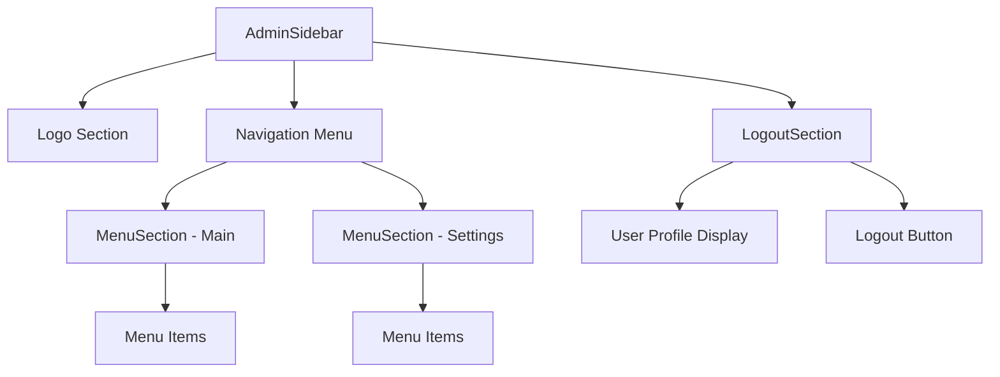
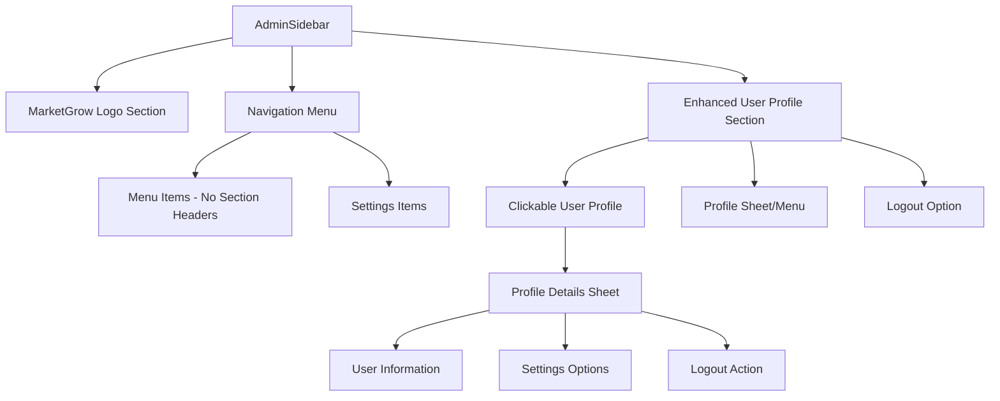
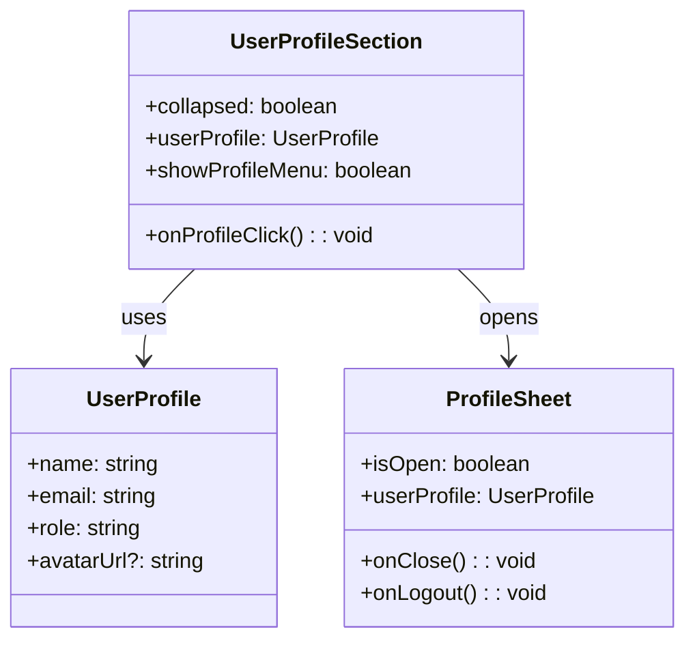
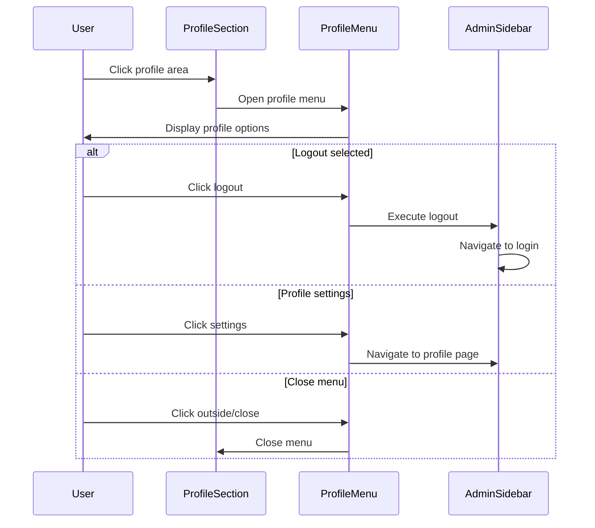

# Side Menu Redesign

## Overview

This design document outlines the redesign of the admin sidebar menu to improve user experience and visual consistency. The main objectives are to enhance the bottom section of the sidebar with a clickable administrator profile, add a proper logo placement, remove unnecessary section labels, and clean up the dashboard page.

## Technology Stack & Dependencies

- **Frontend Framework**: React 18 with TypeScript
- **UI Components**: shadcn-ui with Radix UI primitives
- **Styling**: Tailwind CSS
- **Icons**: lucide-react icon library
- **State Management**: React hooks and context providers
- **Navigation**: react-router-dom

## Component Architecture

### Current Sidebar Structure



### Target Sidebar Structure



## Design Requirements

### 1. Logo Integration

**Current State**: Simple text "MarketGrow" or "MG" when collapsed

**Target State**: 
- Replace text with MarketGrow logo from AdminAuth page
- Logo consists of:
  - Green rounded square with TrendingUp icon (emerald-600 background)
  - "MarketGrow" text alongside
- When collapsed: Show only the icon
- When expanded: Show icon + text

**Implementation Details**:
```typescript
// Logo component structure
<div className="flex items-center space-x-3 mb-8">
  <div className="h-8 w-8 rounded-lg bg-emerald-600 flex items-center justify-center">
    <TrendingUp className="h-5 w-5 text-white" />
  </div>
  {!collapsed && <span className="text-2xl font-bold">MarketGrow</span>}
</div>
```

### 2. Section Header Removal

**Current Issue**: "ГОЛОВНА" (Main) section header is displayed unnecessarily

**Solution**: 
- Remove section title display for main menu items
- Keep logical grouping but hide visual separators
- Maintain settings section separation when needed

**Implementation Approach**:
- Modify MenuSection component to conditionally hide titles
- Update AdminSidebar to pass title as undefined for main section
- Preserve section logic for proper item organization

### 3. Enhanced User Profile Section

**Current State**: LogoutSection with basic user display and logout button

**Target State**: Interactive user profile section with expandable menu

#### Profile Display Component



#### Profile Interaction Flow



### 4. Dashboard Content Cleanup

**Current State**: AdminDashboardContent displays statistics and charts

**Target State**: Empty dashboard page

**Implementation**:
- Replace AdminDashboardContent with minimal empty state
- Maintain route structure and component hierarchy
- Ensure proper loading and navigation still works

```typescript
// Simplified dashboard content
const AdminDashboardContent = () => {
  return (
    <div className="p-4 md:p-6">
      {/* Empty dashboard - content removed as requested */}
    </div>
  );
};
```

## Implementation Strategy

### Phase 1: Logo Integration
1. Extract logo component from AdminAuth page
2. Create reusable LogoComponent
3. Replace text logo in AdminSidebar
4. Test responsive behavior

### Phase 2: Section Header Cleanup
1. Modify MenuSection component rendering logic
2. Update AdminSidebar section configuration
3. Remove "ГОЛОВНА" text display
4. Verify menu functionality remains intact

### Phase 3: Enhanced Profile Section
1. Create new UserProfileSection component
2. Implement clickable profile area
3. Add Sheet/Popover for profile menu
4. Integrate logout and profile options
5. Replace existing LogoutSection

### Phase 4: Dashboard Cleanup
1. Simplify AdminDashboardContent component
2. Remove all dashboard widgets and content
3. Test navigation and routing

### Phase 5: Integration & Testing
1. Integrate all components in AdminSidebar
2. Test collapsed/expanded states
3. Verify mobile responsiveness
4. Validate accessibility
5. Test profile menu functionality

## Component Specifications

### UserProfileSection Component

**Props Interface**:
```typescript
interface UserProfileSectionProps {
  collapsed?: boolean;
  userProfile?: {
    name?: string;
    email?: string;
    role?: string;
    avatarUrl?: string;
  };
  onLogout: () => void;
}
```

**Key Features**:
- Clickable profile area that opens side menu
- Consistent hover states with emerald color scheme
- Profile information display
- Logout functionality
- Responsive behavior for collapsed state

### Enhanced Menu Organization

**Menu Structure**:
- Remove visual section headers while maintaining logical grouping
- Flat menu appearance with proper spacing
- Settings items separated by visual divider
- Consistent icon and text alignment

### Logo Component

**Features**:
- Responsive logo display (icon only when collapsed)
- Matches AdminAuth page styling
- Proper emerald color scheme
- Accessible and semantic markup

## Styling Strategy

### Color Scheme Consistency
- Primary color: emerald-600 (#10b981)
- Hover states: emerald-50 background with emerald-600 text
- Borders: emerald-200/30 for subtle emphasis
- Text: Standard gray scale with emerald accents

### Responsive Behavior
- Mobile: Existing drawer/sheet pattern preserved
- Desktop: Enhanced sidebar with new profile section
- Collapsed state: Icon-only display with tooltips
- Expanded state: Full content with proper spacing

### Accessibility Considerations
- Proper ARIA labels for interactive elements
- Keyboard navigation support
- Screen reader friendly content
- Color contrast compliance
- Focus indicators for all interactive elements

## Testing Strategy

### Unit Testing Areas
1. UserProfileSection component interactions
2. Logo component rendering states
3. Menu section header visibility logic
4. Dashboard content removal verification

### Integration Testing
1. Sidebar state management (collapsed/expanded)
2. Navigation functionality preservation
3. Profile menu opening/closing
4. Logout flow execution

### Visual Regression Testing
1. Logo display consistency
2. Profile section layout
3. Menu spacing and alignment
4. Responsive breakpoint behavior

## Risk Mitigation

### Potential Issues
1. **State Management Complexity**: Profile menu state coordination
   - **Mitigation**: Use controlled components with clear state flow

2. **Navigation Disruption**: Changes affecting existing menu behavior
   - **Mitigation**: Preserve existing navigation logic, only modify presentation

3. **Mobile Responsiveness**: Profile menu on small screens
   - **Mitigation**: Use existing Sheet component pattern for consistency

4. **Accessibility Regression**: Interactive profile area compliance
   - **Mitigation**: Follow existing patterns and test with screen readers

### Rollback Strategy
- Maintain existing component interfaces
- Implement changes incrementally
- Feature flags for gradual rollout
- Quick revert capability for critical issues