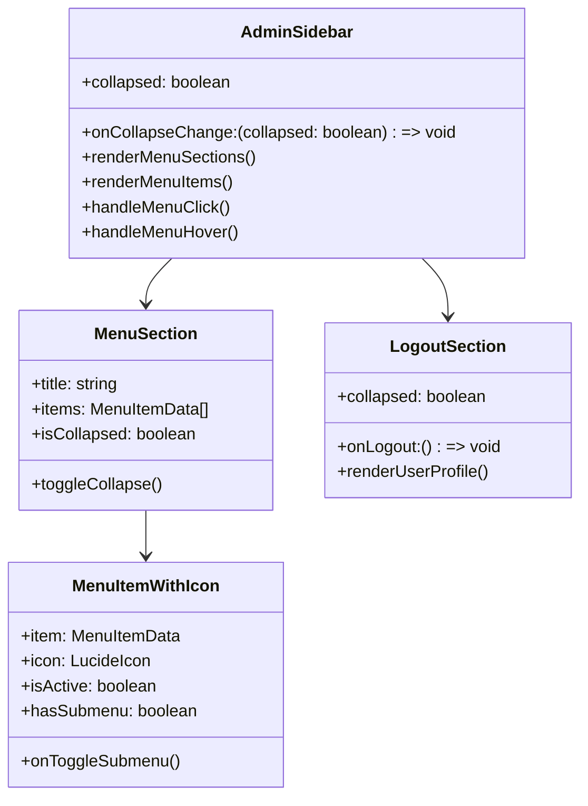
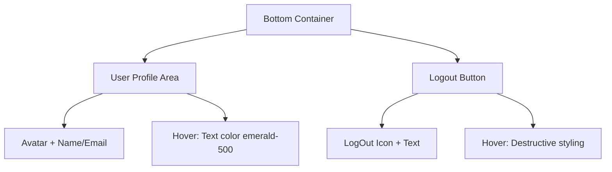

# Style Adjustments for Admin Sidebar Interface

## Overview

This design document outlines comprehensive style adjustments for the admin sidebar interface to improve visual aesthetics, user experience, and functionality. The changes include color scheme updates, hover behavior modifications, menu organization improvements, and enhanced visual hierarchy.

## Technology Stack

- **Frontend Framework**: React 18 with TypeScript
- **Styling**: Tailwind CSS with custom color variables
- **UI Library**: shadcn/ui components
- **Icons**: Lucide React
- **State Management**: React hooks and context providers

## Component Architecture

### AdminSidebar Component Structure



## Style Specifications

### Color Scheme Updates

#### Hover and Active States
- **Menu Item Hover Background**: `#ECFDF5` (emerald-50)
- **Menu Item Active Background**: `#ECFDF5` (emerald-50)
- **Admin Profile Hover Text**: `rgb(16, 185, 129)` (emerald-500)
- **Submenu Hover Text**: `rgb(16, 185, 129)` (emerald-500)

#### Icon and Control Behavior
- **Theme Toggle**: Remove hover background, show pointer cursor only
- **Language Switcher**: Remove hover background, show pointer cursor only
- **Menu Expand Icons**: Change color to `rgb(16, 185, 129)` on hover

### Menu Structure Organization

#### Section Hierarchy
```
├── Головна (Main Section)
│   ├── Dashboard (removed as separate button)
│   └── Other main items
├── [Visual Separator]
├── Content Management
│   ├── Pages
│   ├── Forms
│   └── API Documentation
├── [Visual Separator]  
└── Налаштування (Settings Section)
    ├── User Profile
    ├── Permissions
    └── System Settings
```

#### Submenu Behavior
- **Default State**: All submenus collapsed
- **Toggle Mechanism**: Arrow icon click expands/collapses submenu
- **Visual Indicator**: Rotate arrow icon 90° when expanded
- **Hover Effect**: Text color changes to emerald-500

### Icon Integration

#### Menu Item Icons
Each menu item will have relevant Lucide React icons:

```typescript
const menuIcons = {
  dashboard: Home,
  analytics: BarChart3,
  content: FileText,
  pages: Layout,
  forms: FileSpreadsheet,
  users: Users,
  settings: Settings,
  profile: User,
  permissions: Shield,
  api: Code,
  reports: TrendingUp,
  media: Image,
  notifications: Bell
};
```

#### Icon Positioning
- **Left Alignment**: Icons positioned 12px from left edge
- **Icon Size**: 16x16px (w-4 h-4)
- **Spacing**: 12px gap between icon and text
- **Collapsed State**: Show icon only, centered

### Layout Improvements

#### Section Separators
- **Visual Divider**: Subtle border-top with 1px solid border-gray-200
- **Spacing**: 16px padding top/bottom for clear separation
- **Section Titles**: When expanded, show section headers with smaller font

#### Logout Section Enhancement


- **Position**: Fixed at bottom of sidebar
- **User Info**: Avatar, name, and role display
- **Hover Effect**: Admin text color changes to emerald-500
- **Logout Button**: Destructive hover styling with red accent
- **Spacing**: Clear separation from menu items with border-top

## Component Updates

### AdminSidebar Enhancements

#### Menu Section Organization
```typescript
interface MenuSectionConfig {
  key: 'main' | 'settings';
  titleKey: string;
  items: MenuItemData[];
  isCollapsible: boolean;
}

const menuSections: MenuSectionConfig[] = [
  {
    key: 'main',
    titleKey: 'menu_main',
    items: menuItems.filter(item => item.section_type === 'main'),
    isCollapsible: false
  },
  {
    key: 'settings', 
    titleKey: 'menu_settings',
    items: menuItems.filter(item => item.section_type === 'settings'),
    isCollapsible: false
  }
];
```

#### Submenu Toggle Implementation
```typescript
interface SubmenuState {
  [itemId: number]: boolean;
}

const [submenuStates, setSubmenuStates] = useState<SubmenuState>({});

const toggleSubmenu = (itemId: number) => {
  setSubmenuStates(prev => ({
    ...prev,
    [itemId]: !prev[itemId]
  }));
};
```

### Theme Toggle Updates
```typescript
export function ThemeToggle() {
  const { theme, setTheme } = useTheme();

  return (
    <Button
      variant="ghost"
      size="sm"
      onClick={() => setTheme(theme === "light" ? "dark" : "light")}
      className="h-9 w-9 hover:bg-transparent cursor-pointer"
    >
      <Sun className="h-4 w-4 transition-all dark:scale-0" />
      <Moon className="h-4 w-4 absolute transition-all dark:scale-100 scale-0" />
      <span className="sr-only">Toggle theme</span>
    </Button>
  );
}
```

### Language Switcher Updates
```typescript
<DropdownMenu>
  <DropdownMenuTrigger asChild>
    <Button 
      variant="ghost" 
      size="icon" 
      className="hover:bg-transparent cursor-pointer"
      title={lang === "uk" ? "Українська" : "English"}
    >
      <span className="text-lg">{lang === "uk" ? "🇺🇦" : "🇺🇸"}</span>
    </Button>
  </DropdownMenuTrigger>
  <DropdownMenuContent align="end">
    <DropdownMenuItem onClick={() => setLang("uk")}>
      🇺🇦 Українська
    </DropdownMenuItem>
    <DropdownMenuItem onClick={() => setLang("en")}>
      🇺🇸 English
    </DropdownMenuItem>
  </DropdownMenuContent>
</DropdownMenu>
```

## Implementation Strategy

### Phase 1: Color Scheme Updates
1. Update CSS custom properties for emerald color palette
2. Modify hover states in AdminSidebar component
3. Remove hover backgrounds from theme/language controls
4. Update admin profile hover styling

### Phase 2: Menu Structure Reorganization
1. Remove Dashboard button from bottom of sidebar
2. Implement collapsible submenu functionality
3. Add visual separators between sections
4. Create section headers for better organization

### Phase 3: Icon Integration
1. Create icon mapping for all menu items
2. Update MenuItemWithIcon component
3. Ensure proper spacing and alignment
4. Test collapsed state icon-only display

### Phase 4: Logout Section Enhancement
1. Redesign bottom logout area
2. Add user profile information display
3. Implement proper hover states
4. Ensure visual separation from menu items

## Accessibility Considerations

### Keyboard Navigation
- **Tab Order**: Logical flow through menu items
- **Arrow Keys**: Navigate between menu items
- **Enter/Space**: Activate menu items and toggle submenus
- **Escape**: Close expanded submenus

### Screen Reader Support
- **ARIA Labels**: Descriptive labels for all interactive elements
- **Role Attributes**: Proper menu and menuitem roles
- **State Announcements**: Announce expanded/collapsed states
- **Focus Management**: Proper focus handling during navigation

### Color Contrast
- **Text Contrast**: Ensure WCAG AA compliance
- **Hover States**: Maintain sufficient contrast
- **Icon Visibility**: Clear icon distinction in all themes
- **Focus Indicators**: Visible focus rings for keyboard users

## Testing Strategy

### Visual Testing
- **Component Isolation**: Test each component independently
- **State Variations**: Test expanded, collapsed, and hover states
- **Theme Compatibility**: Verify in light and dark themes
- **Responsive Behavior**: Test on different screen sizes

### Interaction Testing
- **Menu Navigation**: Test all navigation paths
- **Submenu Toggle**: Verify expand/collapse functionality
- **Hover Preloading**: Test content preloading on hover
- **Logout Flow**: Test user logout process

### Accessibility Testing
- **Screen Reader**: Test with assistive technologies
- **Keyboard Only**: Navigate using keyboard only
- **Color Blindness**: Test with color vision simulators
- **High Contrast**: Test in high contrast mode

## Performance Considerations

### Rendering Optimization
- **Memoization**: Use React.memo for menu items
- **Virtual Scrolling**: Consider for large menu lists
- **Icon Loading**: Optimize icon bundle size
- **Animation Performance**: Use CSS transforms for smooth animations

### State Management
- **Context Optimization**: Minimize context re-renders
- **Local State**: Keep submenu states local when possible
- **Debouncing**: Debounce hover effects to prevent excessive updates
- **Cache Management**: Efficient content caching for preloaded items