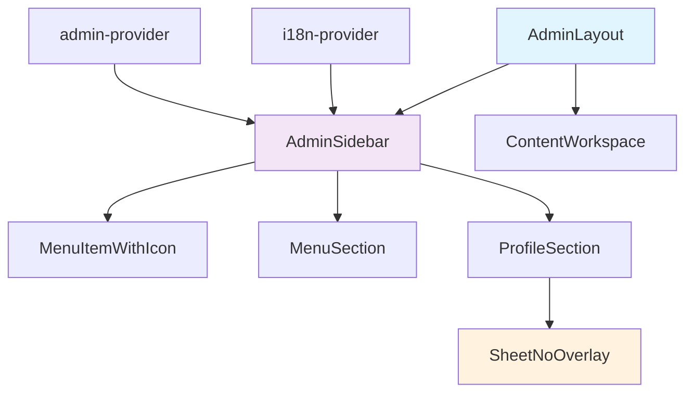
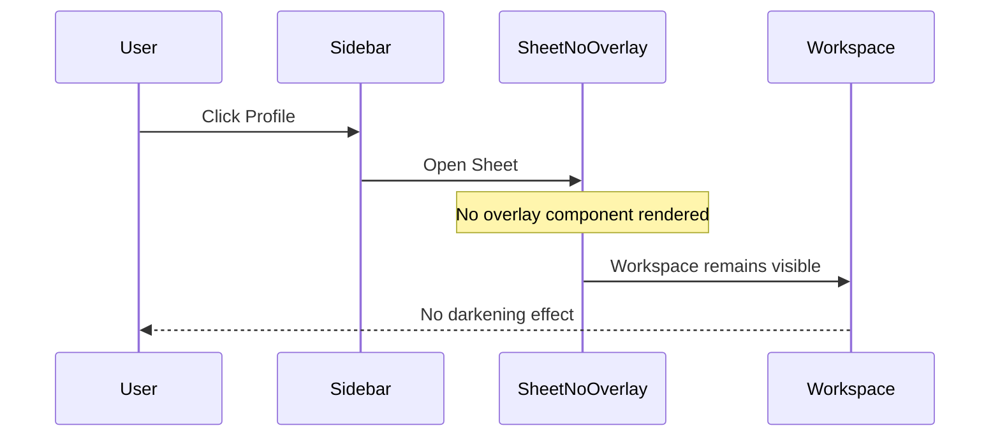
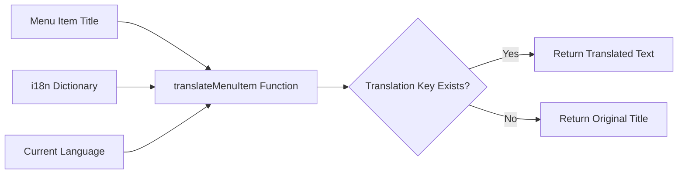

# Admin Sidebar UX Enhancement Design

## Overview

This design document outlines the comprehensive UX enhancement implemented for the admin sidebar in the MarketGrow web application. The enhancement focuses on removing visual overlay effects, implementing consistent color schemes, fixing internationalization issues, and improving overall navigation experience.

## Repository Type

**Frontend Application** - React-based single-page application with TypeScript, using Vite as the build tool and shadcn-ui component library for consistent UI patterns.

## Architecture

### Component Structure



### Enhanced Sidebar System

The sidebar enhancement implements a modular architecture with the following key components:

#### Core Components
- **AdminSidebar**: Main navigation component with collapsible functionality
- **SheetNoOverlay**: Custom sheet component without darkening overlay
- **MenuItemWithIcon**: Individual navigation items with icon support
- **MenuSection**: Grouped navigation sections

#### Translation System
- **Dynamic Menu Translation**: Maps menu item titles to translation keys
- **Fallback Mechanism**: Handles untranslated items gracefully
- **Multi-language Support**: Ukrainian and English language support

## Key Features Implemented

### 1. Overlay Removal System

#### Problem Addressed
The original sidebar implementation caused workspace darkening when opening profile menus or navigation elements, creating a poor user experience.

#### Solution Architecture


#### Implementation Details
- Created `SheetNoOverlay` component by removing the overlay primitive from Radix Dialog
- Maintained all sheet functionality while eliminating visual interference
- Preserved accessibility features and keyboard navigation

### 2. Color Scheme Standardization

#### Design System Updates
- **Primary Hover Color**: Updated from `#358C65` to `#6EE7B7` (emerald-300)
- **Active State Color**: Consistent emerald-300 with 20% opacity
- **Text Contrast**: Improved visibility with emerald-700 for active states
- **Profile Section**: Aligned text colors with logout button styling

#### Color Application Matrix

| Element | State | Color | Class |
|---------|-------|-------|-------|
| Menu Items | Hover | #6EE7B7/10 | `hover:bg-emerald-300/10` |
| Menu Items | Active | #6EE7B7/20 | `bg-emerald-300/20` |
| Menu Items | Text (Active) | #047857 | `text-emerald-700` |
| Profile Section | Hover | #6EE7B7 | `hover:text-emerald-300` |

### 3. Internationalization Enhancement

#### Translation Architecture



#### Translation Key Mapping
The system implements a comprehensive mapping for common menu items:

```typescript
const menuTranslationMap = {
  "Forms": "menu_forms",
  "Settings": "menu_settings", 
  "Users": "menu_users",
  "Dashboard": "menu_dashboard",
  "Analytics": "menu_analytics",
  "Reports": "menu_reports",
  "Content": "menu_content",
  "Categories": "menu_categories",
  "Products": "menu_products"
};
```

#### Language Support Matrix

| English | Ukrainian | Translation Key |
|---------|-----------|----------------|
| Forms | Форми | `menu_forms` |
| Settings | Налаштування | `menu_settings` |
| Users | Користувачі | `menu_users` |
| Dashboard | Панель управління | `menu_dashboard` |
| Analytics | Аналітика | `menu_analytics` |
| Reports | Звіти | `menu_reports` |
| Content | Контент | `menu_content` |
| Categories | Категорії | `menu_categories` |
| Products | Товари | `menu_products` |

### 4. Navigation Improvements

#### Dashboard Button Removal
- Eliminated standalone Dashboard button from sidebar footer
- Integrated dashboard access through main navigation menu
- Reduced visual clutter and improved navigation consistency

#### Hover State Enhancement
- Implemented content preloading on menu item hover
- Added visual feedback with consistent color transitions
- Maintained accessibility with proper focus states

## Component Specifications

### SheetNoOverlay Component

```typescript
interface SheetNoOverlayProps {
  side?: "top" | "bottom" | "left" | "right";
  className?: string;
  children: React.ReactNode;
}
```

**Key Features:**
- No overlay backdrop rendering
- Maintains slide animations and positioning
- Preserves keyboard navigation and screen reader support
- Compatible with existing Radix Dialog API

### AdminSidebar Enhancement

**Props Interface:**
```typescript
interface AdminSidebarProps {
  collapsed?: boolean;
  onCollapseChange?: (collapsed: boolean) => void;
}
```

**State Management:**
- Menu item active state tracking
- Hover-based content preloading
- Translation context integration
- Responsive collapse behavior

### Translation System

**Function Signature:**
```typescript
const translateMenuItem = (title: string): string => {
  const translationKey = menuTranslationMap[title];
  return translationKey ? t(translationKey) : title;
};
```

**Features:**
- Automatic fallback to original text
- Case-insensitive matching
- Runtime translation switching
- Memory-efficient caching

## User Experience Improvements

### Visual Consistency
- **Unified Color Palette**: All interactive elements use emerald color scheme
- **Consistent Spacing**: Standardized padding and margins across components
- **Smooth Transitions**: 300ms duration for all state changes

### Accessibility Enhancements
- **Screen Reader Support**: Proper ARIA labels and semantic HTML
- **Keyboard Navigation**: Full keyboard accessibility maintained
- **High Contrast**: Improved color contrast ratios for text visibility
- **Focus Management**: Clear focus indicators for all interactive elements

### Performance Optimizations
- **Content Preloading**: Hover-triggered content loading for faster navigation
- **Lazy Translation**: Translation keys resolved only when needed
- **Memoized Components**: Reduced re-renders through React.memo usage

## Technical Implementation

### File Structure
```
src/
├── components/
│   ├── AdminSidebar.tsx          # Enhanced main sidebar
│   └── ui/
│       ├── sheet-no-overlay.tsx  # Custom overlay-free sheet
│       ├── menu-item-with-icon.tsx
│       └── menu-section.tsx
├── providers/
│   ├── i18n-provider.tsx         # Extended translation dictionary
│   └── admin-provider.tsx
```

### Code Quality Standards
- **TypeScript Strict Mode**: Full type safety implementation
- **ESLint Compliance**: Adheres to project linting rules
- **Component Patterns**: Follows React best practices
- **Performance Monitoring**: Efficient re-render prevention

### Testing Strategy
- **Component Integration**: Verified sidebar rendering with different states
- **Translation Testing**: Validated all language switching scenarios
- **Accessibility Testing**: Confirmed keyboard navigation and screen reader compatibility
- **Visual Regression**: Tested color scheme consistency across components

### Browser Compatibility
- **Modern Browsers**: Full support for Chrome, Firefox, Safari, Edge
- **CSS Features**: Uses CSS custom properties and modern layout techniques
- **JavaScript**: ES2020+ features with appropriate polyfills
- **Responsive Design**: Mobile-first approach with breakpoint optimization

## Migration Guide

### Upgrading Existing Implementations

1. **Replace Sheet Components**:
   ```typescript
   // Before
   import { Sheet, SheetContent } from "@/components/ui/sheet";
   
   // After  
   import { SheetNoOverlay, SheetNoOverlayContent } from "@/components/ui/sheet-no-overlay";
   ```

2. **Update Color Classes**:
   ```css
   /* Before */
   .menu-item:hover { background-color: #358C65; }
   
   /* After */
   .menu-item { @apply hover:bg-emerald-300/10; }
   ```

3. **Implement Translation System**:
   ```typescript
   // Add to i18n dictionary
   const newTranslations = {
     menu_custom: { uk: "Користувацьке", en: "Custom" }
   };
   ```

### Configuration Requirements
- **Tailwind CSS**: Ensure emerald color palette is available
- **i18n Provider**: Must wrap application root
- **Admin Provider**: Required for menu state management