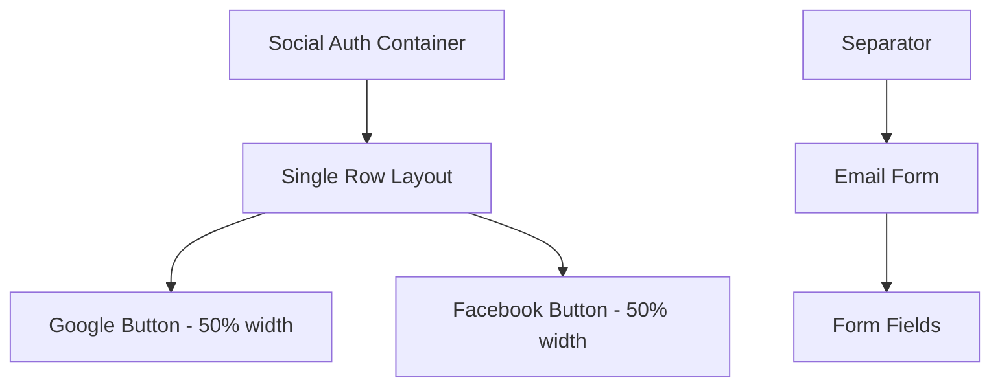
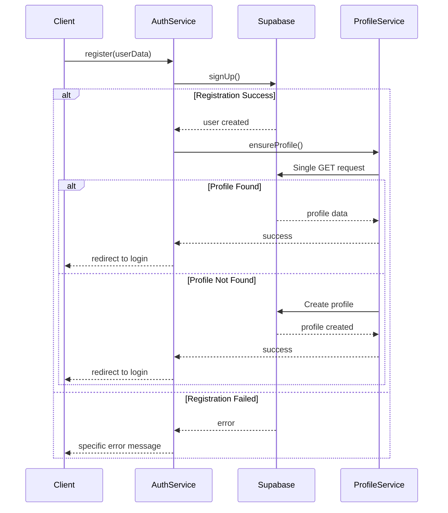

# Translation and UI Adjustments Design

## Overview

This design document outlines the implementation of several UI improvements and translation enhancements for authentication pages in the MarketGrow application. The changes focus on improving user experience through better internationalization, layout adjustments, and authentication flow optimization.

## Technology Stack & Dependencies

- **Frontend Framework**: React with TypeScript
- **UI Components**: shadcn/ui component library
- **Styling**: Tailwind CSS
- **Internationalization**: Custom i18n provider with React Context
- **Authentication**: Supabase Auth
- **Form Handling**: React Hook Form with Zod validation
- **Icons**: Lucide React

## Component Architecture

### Translation System Enhancement

The existing i18n system uses a dictionary-based approach with React Context for state management. We'll extend this system to include new translation keys and improve language switcher functionality.

```mermaid
graph TD
    A[I18nProvider] --> B[useI18n Hook]
    B --> C[Translation Function t()]
    B --> D[Language State]
    B --> E[setLang Function]
    
    F[Dictionary Object] --> C
    G[Components] --> B
    
    H[Language Switcher] --> E
    E --> I[Re-render Components]
```

#### Translation Dictionary Extensions

New translation keys to be added to the existing dictionary structure:

1. **Terms and Conditions Translation**
   - Ukrainian: "Я погоджуюся з Умовами користування та Політикою конфіденційності"
   - English: "I agree to the Terms of Service and Privacy Policy"

2. **Email Continuation Text**
   - Ukrainian: "або продовжити з email"
   - English: "or continue with email"

### Social Authentication Layout Redesign

#### Current State Analysis
The social authentication buttons are currently stacked vertically on mobile and arranged in a flex layout on desktop. The requirement is to place Google and Facebook buttons in a single row across all screen sizes.

#### Proposed Layout Structure



#### CSS Layout Strategy
- Use CSS Grid or Flexbox for consistent single-row layout
- Apply `grid-cols-2` or `flex` with `flex-1` for equal width distribution
- Remove responsive stacking behavior (`md:space-y-0 md:flex`)
- Ensure consistent spacing between buttons

### Language Switcher Improvements

#### Hover State Enhancement
Current issue: Text becomes invisible on hover due to styling conflicts.

**Proposed Solution:**
- Maintain text color consistency during hover states
- Use `hover:bg-emerald-50` for background changes only
- Preserve `text-emerald-700` color during hover interactions

#### Positioning Adjustments
Move language switcher to top-right corner on authentication pages:
- `/register`
- `/login` 
- `/user-forgot-password`

**Implementation Strategy:**
- Use absolute positioning: `absolute right-4 top-4 md:right-8 md:top-8`
- Ensure proper z-index stacking: `z-10`
- Maintain responsive spacing

### Authentication Flow Optimization

#### Request Reduction Strategy

**Current Problem Analysis:**
The system currently makes multiple unnecessary requests:
1. Initial GET request to fetch profile
2. Three additional POST requests with 401 errors
3. Error messages not properly displayed

**Proposed Solution:**



#### Enhanced Error Handling

**Duplicate Registration Detection:**
- Implement specific error handling for existing email addresses
- Display Ukrainian/English specific messages for duplicate registrations
- Provide clear next steps for existing users

**Error Message Localization:**
```typescript
// Enhanced error messages
const errorMessages = {
  email_exists: { 
    uk: "Користувач з таким email вже зареєстрований. Спробуйте увійти.",
    en: "User with this email is already registered. Try signing in."
  },
  registration_success: {
    uk: "Реєстрація успішна! Перенаправляємо на сторінку входу...",
    en: "Registration successful! Redirecting to login page..."
  }
}
```

## Routing & Navigation

### Post-Registration Flow Enhancement

**Current Behavior:** Unclear navigation after successful registration
**Proposed Behavior:** 
1. Show success message
2. Automatic redirect to login page after 2-second delay
3. Clear indication of next steps

### Navigation State Management
- Implement loading states during authentication flows
- Provide breadcrumb navigation where appropriate
- Ensure consistent navigation patterns across auth pages

## API Integration Layer

### Request Optimization Strategy

**ProfileService Enhancement:**
```typescript
class OptimizedProfileService {
  static async validateAndCreateProfile(userData: UserData) {
    try {
      // Single request to check existence
      const { data: existingProfile } = await supabase
        .from('profiles')
        .select('id')
        .eq('email', userData.email)
        .single();
      
      if (existingProfile) {
        return { error: 'email_exists' };
      }
      
      // Create profile only if doesn't exist
      return await this.createProfile(userData);
    } catch (error) {
      return this.handleProfileError(error);
    }
  }
}
```

### Error Boundary Implementation
- Implement error boundaries for authentication components
- Provide fallback UI for network failures
- Log errors for monitoring and debugging

## Styling Strategy

### Responsive Design Patterns

**Mobile-First Approach:**
- Default to single-column layout for social buttons
- Progressive enhancement for larger screens
- Consistent spacing across breakpoints

**Button Styling Consistency:**
```css
.social-auth-button {
  @apply w-full flex items-center justify-center gap-2;
  @apply border border-gray-300 rounded-md px-4 py-2;
  @apply hover:bg-gray-50 transition-colors;
  @apply text-sm font-medium;
}
```

### Typography & Internationalization
- Ensure consistent font weights across languages
- Handle text overflow for longer Ukrainian translations
- Maintain visual hierarchy regardless of content length

## Testing Strategy

### Component Testing Approach

**Translation Testing:**
- Test language switching functionality
- Verify all new translation keys are properly rendered
- Test text length handling for different languages

**Layout Testing:**
- Verify social button layout across screen sizes
- Test language switcher positioning
- Validate hover states and interactions

**Authentication Flow Testing:**
- Test duplicate registration handling
- Verify error message display
- Test successful registration flow with redirect

### Integration Testing

**API Request Testing:**
- Verify request reduction implementation
- Test error handling scenarios
- Validate profile creation flow

**Cross-Browser Testing:**
- Test language switcher functionality
- Verify responsive layouts
- Test authentication flows

## Implementation Phases

### Phase 1: Translation Updates
1. Add new translation keys to i18n dictionary
2. Update terms and conditions text
3. Implement "or continue with email" translation
4. Test language switching functionality

### Phase 2: Layout Adjustments  
1. Redesign social authentication button layout
2. Implement single-row display across all breakpoints
3. Update language switcher positioning
4. Fix hover state styling issues

### Phase 3: Authentication Flow Optimization
1. Implement request reduction strategy
2. Enhance error handling for duplicate registrations
3. Add success messaging and auto-redirect
4. Optimize ProfileService calls

### Phase 4: Testing & Validation
1. Comprehensive testing of all changes
2. Cross-browser compatibility verification
3. Performance impact assessment
4. User acceptance testing

## Performance Considerations

### Bundle Size Impact
- New translations add minimal overhead
- CSS optimizations may reduce bundle size
- Request reduction improves perceived performance

### Runtime Performance
- Fewer API requests reduce server load
- Optimized error handling prevents unnecessary retries
- Improved caching strategy for profile data

### User Experience Metrics
- Faster authentication flows
- Clearer error messaging reduces user confusion
- Consistent UI improves user confidence

## Security Considerations

### Authentication Security
- Maintain existing security patterns
- Ensure error messages don't leak sensitive information
- Validate all user inputs consistently

### Data Privacy
- Handle user data according to existing privacy policies
- Ensure translation content complies with data protection requirements
- Maintain audit trails for authentication events