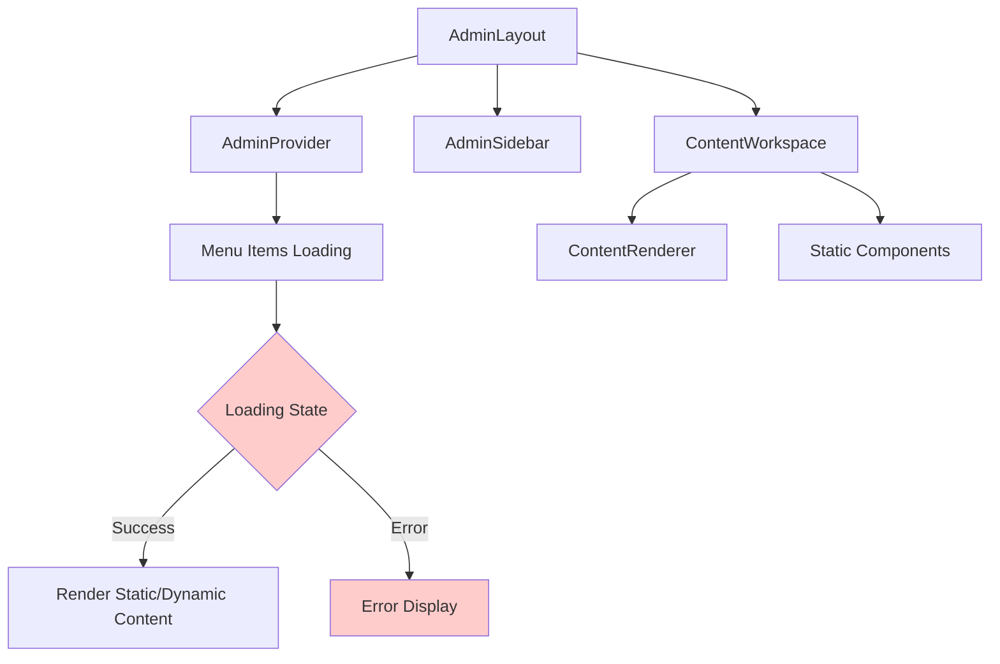

# Admin Content Loading Issue Resolution

## Overview
The admin panel is experiencing content loading failures following recent styling modifications. This design document outlines the problem analysis and resolution strategy to restore stable content rendering while maintaining the visual improvements where possible.

## Problem Analysis

### Current Issues
1. **Content Not Loading**: Admin pages fail to render content properly
2. **Recent Styling Changes**: Previous modifications to admin layout components may have introduced regressions
3. **Component Dependencies**: Changes to AdminLayout, AdminSidebar, or ContentWorkspace may have disrupted the rendering pipeline

### Affected Components
- `AdminLayout.tsx` - Main layout wrapper
- `AdminSidebar.tsx` - Navigation sidebar
- `ContentWorkspace.tsx` - Content rendering engine
- `ResponsiveAdminSidebar.tsx` - Mobile-responsive sidebar variant

## Technical Architecture

### Current Content Flow


### Component Responsibilities

| Component | Responsibility | Current State |
|-----------|---------------|---------------|
| AdminLayout | Layout shell, user profile, header | ✅ Functional |
| AdminProvider | State management, menu data | ⚠️ May have issues |
| AdminSidebar | Navigation menu rendering | ⚠️ Styling changes applied |
| ContentWorkspace | Content routing and rendering | ❌ Content not loading |

## Root Cause Investigation

### Potential Issues
1. **CSS Class Conflicts**: New styling may conflict with existing layout
2. **Component State Management**: AdminProvider state may not be updating correctly
3. **Route Matching**: ContentWorkspace routing logic may be broken
4. **Async Loading**: Content loading promises may be failing silently

### Critical Code Areas
```typescript
// ContentWorkspace content resolution
const ContentComponent = useMemo(() => {
  if (STATIC_COMPONENTS[adminPath]) {
    return STATIC_COMPONENTS[adminPath];
  }
  return null;
}, [adminPath]);

// Menu loading state in AdminProvider
const { 
  activeMenuItem, 
  contentLoading, 
  contentError, 
  menuLoading 
} = useAdmin();
```

## Resolution Strategy

### Phase 1: Immediate Recovery
1. **Backup Current State**: Save current component versions
2. **Identify Last Working Version**: Locate components before styling changes
3. **Selective Rollback**: Revert only problematic styling changes
4. **Preserve Functional Improvements**: Keep non-visual enhancements

### Phase 2: Diagnostic Testing
1. **Content Loading Verification**: Test static vs dynamic content rendering
2. **Provider State Validation**: Verify AdminProvider data flow
3. **Route Resolution Testing**: Confirm path matching logic
4. **Error Boundary Activation**: Enable comprehensive error logging

### Phase 3: Progressive Restoration
1. **Core Functionality First**: Ensure basic content loading works
2. **Styling Re-application**: Gradually reintroduce visual improvements
3. **Regression Testing**: Validate each change doesn't break content loading
4. **Performance Optimization**: Maintain loading performance gains

## Implementation Plan

### Critical Component Restoration

#### ContentWorkspace.tsx Priority Areas
```typescript
// Ensure static component resolution works
const STATIC_COMPONENTS: Record<string, React.ComponentType> = {
  '/dashboard': AdminDashboard,
  '/personal': AdminPersonal,
  // ... other components
};

// Verify error handling doesn't block rendering
if (contentError) {
  return <ContentError error={contentError} />;
}
```

#### AdminProvider State Management
```typescript
// Verify menu loading doesn't block content
const [menuLoading, setMenuLoading] = useState(false);
const [contentLoading, setContentLoading] = useState(false);

// Ensure independent loading states
useEffect(() => {
  // Menu loading shouldn't block static content
  if (staticRoute) {
    setContentLoading(false);
  }
}, [staticRoute]);
```

### Testing Approach
1. **Route-by-Route Testing**: Verify each admin route loads correctly
2. **Loading State Validation**: Confirm loading indicators don't block content
3. **Error Boundary Testing**: Ensure errors don't crash entire admin panel
4. **Cross-Browser Validation**: Test in different browsers and screen sizes

### Rollback Criteria
- Content fails to load after 5 seconds
- JavaScript errors in console during navigation
- White screen or infinite loading states
- User unable to access any admin functionality

## Risk Mitigation

### Backup Strategy
1. **Component Snapshots**: Save working versions of all admin components
2. **Database State**: Ensure menu items and user permissions intact
3. **User Session Continuity**: Maintain user authentication during fixes

### Monitoring Points
- Page load times for admin routes
- Error rates in ContentWorkspace rendering
- User session duration and navigation patterns
- Menu item loading success rates

## Success Metrics
- ✅ All admin pages load within 2 seconds
- ✅ No JavaScript errors during navigation
- ✅ Smooth transitions between menu items
- ✅ Proper error handling for failed content loads
- ✅ Responsive design maintained across screen sizes

## Testing Protocol

### Manual Testing Checklist
- [ ] Dashboard loads correctly
- [ ] Personal profile page accessible
- [ ] Form pages render properly
- [ ] Menu navigation works smoothly
- [ ] Error states display appropriately
- [ ] Mobile responsive behavior intact
- [ ] Theme switching functional
- [ ] User logout process works

### Automated Testing Considerations
- Component rendering tests for each admin page
- Navigation flow tests
- Error boundary activation tests
- Loading state timeout tests