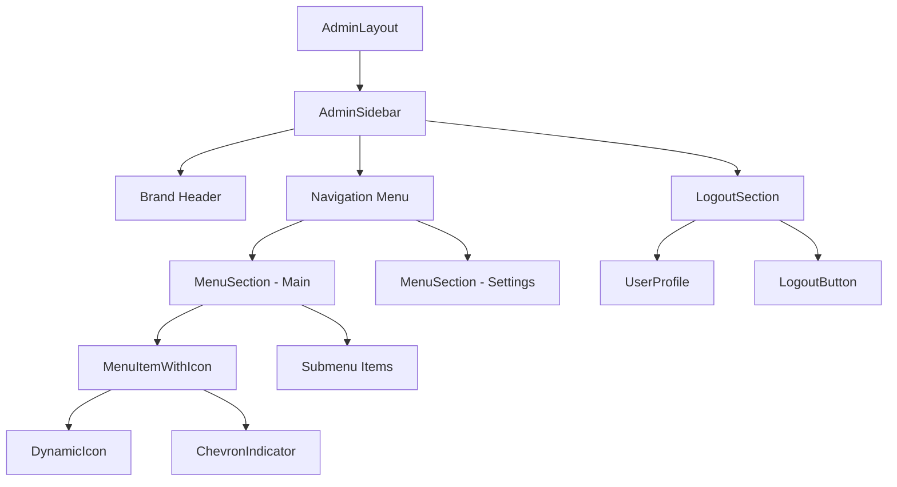

# Admin Interface Styling Enhancement Design

## Overview
This design document outlines improvements to the MarketGrow admin interface styling, focusing on user profile section positioning, hover states, menu icons, submenu indicators, and main page content simplification.

## Current State Analysis
The admin interface consists of:
- Left sidebar with navigation menu
- User profile section at the bottom of sidebar  
- Main content area with dashboard widgets
- Top header with user profile block in upper right

## Design Requirements

### 1. User Profile Section Duplication
**Requirement**: Duplicate the administrator block from top-right corner to bottom-left sidebar

**Current Implementation**:
- Top-right header contains admin user info with avatar and role
- Bottom sidebar has logout section with user profile

**Target Design**:
- Remove any duplicate admin block from bottom of main content area
- Enhance existing bottom sidebar user profile to match top-right styling
- Maintain consistent user information display

### 2. Hover State Enhancement  
**Requirement**: Green hover text color `#10b981` for all menu items

**Implementation**:
- Apply green hover color to all menu item text
- Maintain existing background hover effects
- Ensure consistent hover behavior across main menu and submenus

### 3. Menu Icons Integration
**Requirement**: Add relevant icons to each main menu item

**Icon Mapping Strategy**:
```
Dashboard → Home/LayoutDashboard
Users/Користувачі → Users
Settings/Налаштування → Settings/Cog
Forms → FileText/Form
Reports → BarChart3/TrendingUp
```

**Implementation Approach**:
- Extend `MenuItemWithIcon` component
- Map menu item types to appropriate Lucide icons
- Support icon display in both collapsed and expanded states

### 4. Submenu Indicator Enhancement
**Requirement**: Downward chevron for hidden submenus (since they expand downward)

**Current State**:
- Uses ChevronRight for collapsed submenus
- Uses ChevronDown for expanded submenus

**Target Design**:
- Always use ChevronDown for collapsed submenus (since they expand downward)
- Use ChevronUp for expanded submenus (indicating collapse action)
- Maintain smooth rotation animation

### 5. Main Page Content Simplification
**Requirement**: Remove all content from main page, show only page title

**Current Main Page Structure**:
```
- Header
- HeroSection  
- ProblemsSection
- SolutionsSection
- TestimonialsSection
- PricingSection
- FAQSection
- NewsletterSection
- Footer
```

**Target Structure**:
```
- Header
- Simple page title section
- Footer
```

## Component Modifications

### AdminSidebar Component Enhancement
```typescript
interface EnhancedSidebarProps {
  collapsed?: boolean;
  onCollapseChange?: (collapsed: boolean) => void;
}
```

**Key Changes**:
- Enhanced user profile section styling
- Improved hover states with green color
- Icon integration for menu items

### LogoutSection Component Update
**Enhancement Areas**:
- Consistent styling with top header user block
- Green hover color implementation (`#10b981`)
- Proper avatar and user info display

### MenuSection Component Modifications
**Icon Integration**:
- Add icon prop support
- Default icon mapping for common menu types
- Responsive icon sizing

**Submenu Indicators**:
- Modified chevron logic for intuitive direction
- Smooth animation transitions

### MenuItemWithIcon Component Enhancement
**Hover State Implementation**:
```css
.menu-item:hover .menu-text {
  color: #10b981;
}
```

**Icon Support**:
- Dynamic icon loading
- Consistent sizing (16px for normal, 14px for child items)
- Proper spacing in collapsed mode

## Visual Design Specifications

### Color Palette
```css
--hover-text-color: #10b981;
--hover-bg-color: #f0fdf4;
--active-bg-color: #dcfce7;
--border-color: #e5e7eb;
```

### Typography
- Menu items: 14px medium weight
- Section headers: 12px semibold uppercase
- User profile: 14px medium, 12px regular for role

### Spacing
- Menu item padding: 12px horizontal, 8px vertical
- Icon margin: 12px right in expanded mode
- Section spacing: 16px between sections

## Component Tree Structure



## Implementation Strategy

### Phase 1: User Profile Enhancement
1. Remove duplicate admin blocks from content area
2. Enhance bottom sidebar user profile section
3. Implement consistent styling between top and bottom profiles

### Phase 2: Hover States & Colors
1. Apply green hover color to all menu items
2. Update hover state transitions
3. Test color contrast and accessibility

### Phase 3: Icon Integration
1. Create icon mapping configuration
2. Update MenuItemWithIcon component
3. Add icons to all main menu items

### Phase 4: Submenu Indicators
1. Modify chevron direction logic
2. Implement smooth animations
3. Update submenu expand/collapse behavior

### Phase 5: Main Page Simplification
1. Remove all marketing sections from Index page
2. Keep only header, title, and footer
3. Ensure consistent layout with other admin pages

## Testing Requirements

### Visual Testing
- Verify hover states in all browsers
- Test icon alignment in collapsed/expanded modes
- Validate color contrast ratios

### Functional Testing  
- Submenu expand/collapse behavior
- Navigation functionality preservation
- User profile information consistency

### Responsive Testing
- Mobile sidebar behavior
- Icon visibility at different screen sizes
- Text truncation in collapsed mode

## Accessibility Considerations

### Screen Reader Support
- Proper ARIA labels for icon-only elements
- Semantic HTML structure maintenance
- Focus indicator visibility

### Keyboard Navigation
- Tab order preservation
- Enter/Space key support for menu items
- Escape key for submenu collapse

### Color Accessibility
- Sufficient contrast ratios for green hover color
- High contrast mode compatibility
- Color-blind friendly icon usage