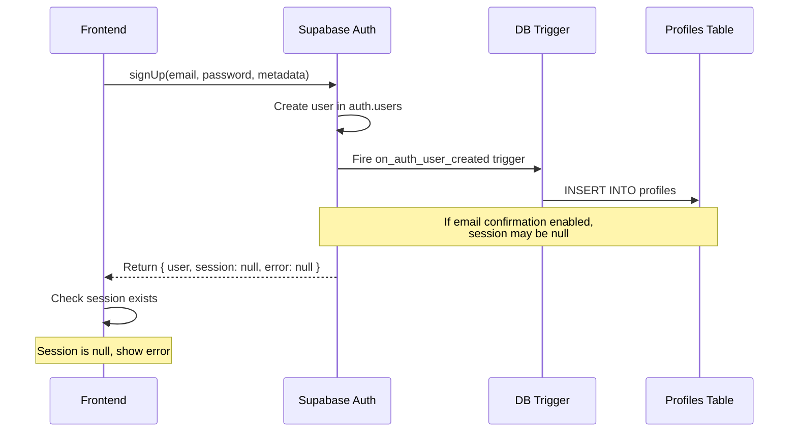

# User Registration Database Issue - Design Fix

## Overview
Analysis of the user registration issue where the system returns HTTP 200 status but fails to create profile record in the database, despite the authentication record being created successfully.

## Problem Analysis

### Issue Description
- User registration appears successful (HTTP 200 status)
- Error message displayed: "Помилка реєстрації. Спробуйте ще раз" (Registration error. Try again)
- Authentication record created in `auth.users` table
- Profile record NOT created in `profiles` table
- Previous working behavior: Error occurred but data was saved to database

### Root Cause Analysis

#### 1. Email Confirmation Flow
The registration flow involves email confirmation which affects the profile creation:



#### 2. RLS Policy Conflict
The Row Level Security policies may be preventing profile access:

```sql
-- Problematic policy - user not authenticated yet
CREATE POLICY "Users with user role can view own profile" ON public.profiles
  FOR SELECT USING (auth.uid() = id AND role = 'user');
```

#### 3. Trigger Function Logic Issue
The `handle_new_user()` function checks for role in `raw_user_meta_data` but the metadata structure might not match:

```sql
-- Current trigger logic
CASE 
  WHEN NOT EXISTS (SELECT 1 FROM public.profiles WHERE role = 'admin') THEN 'admin'::public.user_role
  WHEN NEW.raw_user_meta_data->>'role' = 'user' THEN 'user'::public.user_role
  ELSE 'manager'::public.user_role
END
```

## Solution Design

### 1. Fix RLS Policies
Update RLS policies to allow proper profile access during registration:

```sql
-- Drop conflicting policy
DROP POLICY IF EXISTS "Users with user role can view own profile" ON public.profiles;

-- Update existing policy to handle all user roles
CREATE POLICY "Users can view their own profile" ON public.profiles
  FOR SELECT USING (auth.uid() = id);
```

### 2. Enhance Trigger Function
Improve the trigger function to handle metadata properly:

```sql
CREATE OR REPLACE FUNCTION public.handle_new_user()
RETURNS TRIGGER AS $$
DECLARE
  user_role_from_metadata TEXT;
  assigned_role public.user_role;
BEGIN
  -- Extract role from metadata with fallback
  user_role_from_metadata := COALESCE(
    NEW.raw_user_meta_data->>'role',
    'user'
  );
  
  -- Determine role assignment
  IF NOT EXISTS (SELECT 1 FROM public.profiles WHERE role = 'admin') THEN
    assigned_role := 'admin'::public.user_role;
  ELSIF user_role_from_metadata = 'user' THEN
    assigned_role := 'user'::public.user_role;
  ELSE
    assigned_role := 'manager'::public.user_role;
  END IF;
  
  -- Insert profile with error handling
  INSERT INTO public.profiles (id, email, name, role)
  VALUES (
    NEW.id,
    NEW.email,
    COALESCE(NEW.raw_user_meta_data->>'name', NEW.email),
    assigned_role
  );
  
  RETURN NEW;
EXCEPTION
  WHEN OTHERS THEN
    -- Log error but don't fail user creation
    RAISE WARNING 'Failed to create profile for user %: %', NEW.id, SQLERRM;
    RETURN NEW;
END;
$$ LANGUAGE plpgsql SECURITY DEFINER;
```

### 3. Fix Registration Service Logic
Update the frontend registration logic to handle email confirmation properly:

```typescript
static async register(data: RegistrationData): Promise<AuthResponse> {
  try {
    const { data: authData, error: signUpError } = await supabase.auth.signUp({
      email: data.email,
      password: data.password,
      options: {
        data: {
          name: data.name,
          role: 'user'
        }
      }
    });

    if (signUpError) {
      return {
        user: null,
        session: null,
        error: UserAuthService.mapSupabaseError(signUpError)
      };
    }

    if (authData.user) {
      // Give time for trigger to process
      await new Promise(resolve => setTimeout(resolve, 500));
      
      // Check if profile was created regardless of session
      const profile = await UserAuthService.getUserProfile(authData.user.id);
      
      if (profile) {
        if (authData.session) {
          // User confirmed, has session
          return {
            user: profile,
            session: authData.session,
            error: null
          };
        } else {
          // Email confirmation required
          return {
            user: null,
            session: null,
            error: 'email_confirmation_required'
          };
        }
      } else {
        // Profile creation failed
        return {
          user: null,
          session: null,
          error: UserAuthError.PROFILE_CREATION_FAILED
        };
      }
    }

    return {
      user: null,
      session: null,
      error: UserAuthError.REGISTRATION_FAILED
    };
  } catch (error) {
    console.error('Registration error:', error);
    return {
      user: null,
      session: null,
      error: UserAuthError.NETWORK_ERROR
    };
  }
}
```

### 4. Add Profile Creation Error Handling
Add new error type for profile creation failures:

```typescript
export enum UserAuthError {
  // ... existing errors
  PROFILE_CREATION_FAILED = 'profile_creation_failed'
}
```

### 5. Improve Email Confirmation Handling
Update the UI to properly handle email confirmation flow:

```typescript
const handleRegistration = async (data: RegistrationData) => {
  setLoading(true);
  try {
    const { user, session, error } = await UserAuthService.register(data);
    
    if (error === 'email_confirmation_required') {
      toast.success(t("registration_success_confirm_email"));
      // Don't redirect, show confirmation message
      return;
    }
    
    if (error) {
      toast.error(t(error as any) || t("registration_failed"));
      return;
    }

    if (user && session) {
      toast.success(t("registration_success"));
      navigate("/user/dashboard");
    }
  } catch (error) {
    console.error("Registration error:", error);
    toast.error(t("registration_failed"));
  } finally {
    setLoading(false);
  }
};
```

## Implementation Priority

### High Priority
1. Fix RLS policies to remove conflicting user role policy
2. Enhance trigger function with better error handling
3. Update registration service with proper timing and profile validation

### Medium Priority
1. Add specific error handling for profile creation failures
2. Improve email confirmation flow messaging

### Low Priority
1. Add comprehensive logging for debugging
2. Add retry mechanism for profile creation

## Database Migration Required

```sql
-- Migration: Fix registration profile creation
-- File: supabase/migrations/[timestamp]_fix_registration_profile_creation.sql

-- Drop conflicting RLS policy
DROP POLICY IF EXISTS "Users with user role can view own profile" ON public.profiles;

-- Update trigger function with better error handling
CREATE OR REPLACE FUNCTION public.handle_new_user()
RETURNS TRIGGER AS $$
DECLARE
  user_role_from_metadata TEXT;
  assigned_role public.user_role;
BEGIN
  user_role_from_metadata := COALESCE(
    NEW.raw_user_meta_data->>'role',
    'user'
  );
  
  IF NOT EXISTS (SELECT 1 FROM public.profiles WHERE role = 'admin') THEN
    assigned_role := 'admin'::public.user_role;
  ELSIF user_role_from_metadata = 'user' THEN
    assigned_role := 'user'::public.user_role;
  ELSE
    assigned_role := 'manager'::public.user_role;
  END IF;
  
  INSERT INTO public.profiles (id, email, name, role)
  VALUES (
    NEW.id,
    NEW.email,
    COALESCE(NEW.raw_user_meta_data->>'name', NEW.email),
    assigned_role
  );
  
  RETURN NEW;
EXCEPTION
  WHEN OTHERS THEN
    RAISE WARNING 'Failed to create profile for user %: %', NEW.id, SQLERRM;
    RETURN NEW;
END;
$$ LANGUAGE plpgsql SECURITY DEFINER;
```

## Testing Strategy

### 1. Database Level Testing
- Verify trigger fires correctly on user creation
- Test profile creation with different metadata combinations
- Validate RLS policies allow proper access

### 2. Integration Testing
- Test registration with email confirmation enabled/disabled
- Verify profile creation timing
- Test error handling scenarios

### 3. End-to-End Testing
- Complete registration flow from UI
- Verify proper error messaging
- Test email confirmation flow

## Risk Assessment

### Low Risk
- RLS policy fix (only removes conflicting policy)
- Error handling improvements

### Medium Risk
- Trigger function changes (affects all new user registrations)
- Service logic timing changes

### Mitigation
- Test thoroughly in development environment
- Deploy during low-traffic period
- Have rollback plan ready
- Monitor registration success rates post-deployment
