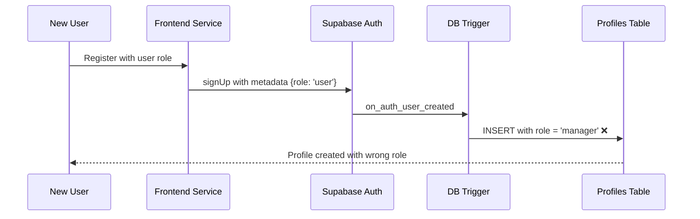
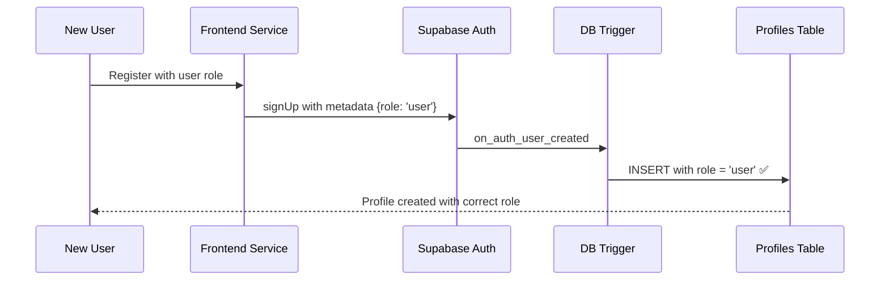

# User Role Assignment Bug Fix Design

## Overview

This design addresses the critical issue where new user registrations are incorrectly assigned the "manager" role instead of the intended "user" role, despite the database recording the data successfully.

## Problem Analysis

### Root Cause Identification
Based on the codebase analysis, the issue stems from multiple sources:

1. **TypeScript Type Inconsistency**: Edge functions still define user roles as `'admin' | 'manager'` instead of `'admin' | 'manager' | 'user'`
2. **Database Trigger Logic**: The `handle_new_user()` function may have race conditions or metadata parsing issues
3. **Default Role Assignment**: The system defaults to 'manager' instead of 'user' in some scenarios

### Evidence from Codebase
- User registration service correctly sets `role: 'user'` in metadata
- Multiple migrations exist to fix this issue, indicating recurring problems
- TypeScript definitions in edge functions don't include 'user' role

## System Impact Assessment

### Current Behavior


### Expected Behavior


## Solution Architecture

### 1. Database Layer Fixes

#### Update Trigger Function
The `handle_new_user()` function needs comprehensive revision:

```sql
CREATE OR REPLACE FUNCTION public.handle_new_user()
RETURNS TRIGGER AS $$
DECLARE
  user_role_from_metadata TEXT;
  assigned_role public.user_role;
  admin_exists BOOLEAN;
BEGIN
  -- Check if admin exists first (single query for performance)
  SELECT EXISTS(SELECT 1 FROM public.profiles WHERE role = 'admin') INTO admin_exists;
  
  -- Extract role from multiple metadata sources
  user_role_from_metadata := COALESCE(
    NEW.raw_user_meta_data->>'role',
    NEW.user_metadata->>'role',
    'user'  -- Default to 'user' for all regular registrations
  );
  
  -- Role assignment logic with explicit validation
  IF NOT admin_exists THEN
    assigned_role := 'admin'::public.user_role;
  ELSE
    -- Validate and assign role
    CASE user_role_from_metadata
      WHEN 'admin' THEN assigned_role := 'admin'::public.user_role;
      WHEN 'manager' THEN assigned_role := 'manager'::public.user_role;
      WHEN 'user' THEN assigned_role := 'user'::public.user_role;
      ELSE assigned_role := 'user'::public.user_role;  -- Default fallback
    END CASE;
  END IF;
  
  -- Insert profile with explicit role assignment
  INSERT INTO public.profiles (id, email, name, role, status)
  VALUES (
    NEW.id,
    NEW.email,
    COALESCE(
      NEW.raw_user_meta_data->>'name', 
      NEW.user_metadata->>'name', 
      NEW.email
    ),
    assigned_role,
    'active'::public.user_status
  );
  
  RETURN NEW;
EXCEPTION
  WHEN OTHERS THEN
    -- Log error but don't prevent user creation
    RAISE WARNING 'Profile creation failed for user %: % - %', NEW.id, SQLSTATE, SQLERRM;
    RETURN NEW;
END;
$$ LANGUAGE plpgsql SECURITY DEFINER;
```

### 2. TypeScript Type System Updates

#### Edge Function Type Corrections
All edge functions must be updated to include the 'user' role:

**Required Files to Update:**
- `supabase/functions/auth-me/index.ts`
- `supabase/functions/users/index.ts`
- `supabase/functions/permissions/index.ts`
- `supabase/functions/menu/index.ts`

**Type Definition Update:**
```typescript
interface Database {
  public: {
    Tables: {
      profiles: {
        Row: {
          id: string
          email: string
          name: string
          phone: string | null
          role: 'admin' | 'manager' | 'user'  // ← Add 'user' role
          status: 'active' | 'inactive'
          created_at: string
          updated_at: string
          avatar_url?: string | null
        }
        Insert: {
          id: string
          email: string
          name: string
          phone?: string | null
          role?: 'admin' | 'manager' | 'user'  // ← Add 'user' role
          status?: 'active' | 'inactive'
        }
        Update: {
          email?: string
          name?: string
          phone?: string | null
          role?: 'admin' | 'manager' | 'user'  // ← Add 'user' role
          status?: 'active' | 'inactive'
        }
      }
    }
  }
}
```

### 3. Frontend Integration Layer

#### User Registration Service Enhancement
Ensure metadata is properly set and validated:

```typescript
// Enhanced registration with explicit role validation
static async register(data: RegistrationData): Promise<AuthResponse> {
  const { data: authData, error: signUpError } = await supabase.auth.signUp({
    email: data.email,
    password: data.password,
    options: {
      data: {
        name: data.name,
        role: 'user'  // Explicit user role assignment
      }
    }
  });

  // Validation and profile verification logic
  if (authData.user && !signUpError) {
    // Wait for trigger processing
    await new Promise(resolve => setTimeout(resolve, 1000));
    
    // Verify correct role assignment
    const profile = await UserAuthService.getUserProfile(authData.user.id);
    if (profile && profile.role !== 'user') {
      console.warn(`Role mismatch: expected 'user', got '${profile.role}'`);
    }
  }
}
```

## Implementation Strategy

### Phase 1: Database Migration (Critical Priority)
1. **Create new migration file**: `20250111000000_fix_user_role_assignment_final.sql`
2. **Update trigger function** with enhanced logic and error handling
3. **Verify enum contains all three roles**: `admin`, `manager`, `user`

### Phase 2: Backend Type Updates (High Priority)
1. **Update all edge function type definitions** to include 'user' role
2. **Test each function** to ensure they handle 'user' role correctly
3. **Update any role validation logic** in backend functions

### Phase 3: Frontend Validation (Medium Priority)
1. **Enhance registration service** with better validation
2. **Add role verification** after registration
3. **Improve error handling** for role assignment failures

### Phase 4: Testing & Validation (High Priority)
1. **Test registration flow** with different scenarios
2. **Verify database records** have correct roles
3. **Test edge function responses** include correct role information

## Risk Mitigation

### Deployment Safety
- **Backup current database** before applying migration
- **Test migration on staging environment** first
- **Implement rollback plan** if issues occur
- **Monitor registration success rates** after deployment

### Data Integrity Protection
- **Preserve existing user data** during migration
- **Ensure no user lockouts** during update process
- **Validate all existing profiles** have valid roles

## Success Criteria

### Primary Metrics
- New registrations create profiles with `role = 'user'`
- No "manager" role assignments for regular users
- All edge functions return correct role information
- TypeScript compilation passes without role-related errors

### Validation Tests
1. **Registration Test**: New user → profile with 'user' role
2. **First Admin Test**: First registration → profile with 'admin' role
3. **Edge Function Test**: All functions handle 'user' role correctly
4. **Type Safety Test**: No TypeScript errors related to roles

## Monitoring & Observability

### Database Monitoring
```sql
-- Query to monitor role distribution
SELECT role, COUNT(*) as count 
FROM profiles 
WHERE created_at > NOW() - INTERVAL '1 day' 
GROUP BY role;
```

### Frontend Logging
- Log successful registrations with role verification
- Alert on role mismatches
- Track registration success rates

## Long-term Considerations

### System Scalability
- Consider role hierarchy expansion
- Plan for custom role definitions
- Design flexible permission system

### Security Enhancement
- Implement role-based route protection
- Add role transition audit logs
- Consider role expiration policies