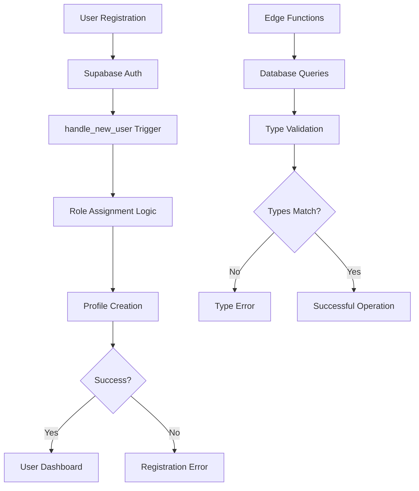

# User Role Assignment Fix Design

## Overview

This design addresses the persistent issue where new user registrations continue to receive the 'manager' role instead of the intended 'user' role, despite multiple previous fix attempts. The issue stems from inconsistencies across database schema, Edge Function type definitions, and potential migration ordering problems.

## Current Problem Analysis

### Symptoms
- New users registering receive 'manager' role instead of 'user' role
- Registration process throws errors during role assignment
- Multiple fix attempts have failed to resolve the issue
- TypeScript type definitions are inconsistent between Edge Functions

### Root Causes
1. **Edge Function Type Inconsistencies**: Some Edge Functions (particularly `menu-content/index.ts`) have incomplete Database interface definitions missing the 'user' role
2. **Migration Execution Issues**: Multiple overlapping migrations may have created conflicts or incomplete execution
3. **Trigger Function Conflicts**: Different versions of the `handle_new_user()` function may be executing incorrectly

## Architecture Analysis



## Data Model Issues

### Current Database Schema
- `user_role` enum: `('admin', 'manager', 'user')` ✓ Correct
- Default role in profiles table: `'manager'` ❌ Should be 'user'
- Trigger function: Multiple versions exist, causing conflicts

### Edge Function Type Definitions
- `auth-me/index.ts`: ✓ Includes all three roles
- `users/index.ts`: ✓ Includes all three roles  
- `menu/index.ts`: ✓ Includes all three roles
- `permissions/index.ts`: ✓ Includes all three roles
- `menu-content/index.ts`: ❌ Missing 'user' role

## Solution Design

### Phase 1: Database Schema Cleanup
1. **Verify Current Schema State**
   - Check which migrations have been applied
   - Verify enum definition contains all three roles
   - Confirm trigger function is latest version

2. **Create Comprehensive Migration**
   - Drop all existing trigger functions
   - Recreate single, definitive `handle_new_user()` function
   - Update default role assignment logic
   - Add comprehensive logging and error handling

### Phase 2: Edge Function Type Synchronization
1. **Standardize Database Interface**
   - Create shared type definition file
   - Update all Edge Functions to use consistent types
   - Ensure all functions include 'user' role in type definitions

2. **Update Affected Functions**
   - Fix `menu-content/index.ts` Database interface
   - Verify all other Edge Functions have correct types

### Phase 3: Testing and Validation
1. **Database Function Testing**
   - Test role assignment logic with different scenarios
   - Verify first-user admin promotion
   - Test default user role assignment

2. **Integration Testing**
   - Test registration flow end-to-end
   - Verify Edge Functions work with all role types
   - Test permission system with user role

## Implementation Details

### Database Migration Strategy
```sql
-- New migration: 20250112000000_final_role_assignment_fix.sql

-- 1. Ensure enum is complete
DO $$ 
BEGIN
    IF NOT EXISTS (
        SELECT 1 FROM pg_enum 
        WHERE enumlabel = 'user' 
        AND enumtypid = (SELECT oid FROM pg_type WHERE typname = 'user_role')
    ) THEN
        ALTER TYPE public.user_role ADD VALUE 'user';
    END IF;
END $$;

-- 2. Drop all existing trigger functions to avoid conflicts
DROP FUNCTION IF EXISTS public.handle_new_user() CASCADE;

-- 3. Create single, definitive trigger function
CREATE OR REPLACE FUNCTION public.handle_new_user()
RETURNS TRIGGER AS $$
DECLARE
  assigned_role public.user_role;
  admin_exists BOOLEAN;
BEGIN
  -- Check if any admin exists
  SELECT EXISTS(SELECT 1 FROM public.profiles WHERE role = 'admin') INTO admin_exists;
  
  -- Role assignment logic
  IF NOT admin_exists THEN
    assigned_role := 'admin'::public.user_role;
    RAISE NOTICE 'Assigning admin role to first user: %', NEW.email;
  ELSE
    -- Always assign 'user' role for new registrations
    assigned_role := 'user'::public.user_role;
    RAISE NOTICE 'Assigning user role to: %', NEW.email;
  END IF;
  
  -- Insert profile
  INSERT INTO public.profiles (id, email, name, role, status)
  VALUES (
    NEW.id,
    NEW.email,
    COALESCE(
      NEW.raw_user_meta_data->>'name', 
      NEW.user_metadata->>'name', 
      NEW.email
    ),
    assigned_role,
    'active'::public.user_status
  );
  
  RAISE NOTICE 'Successfully created profile for: % with role: %', NEW.email, assigned_role;
  
  RETURN NEW;
EXCEPTION
  WHEN OTHERS THEN
    RAISE WARNING 'Profile creation failed for %: SQLSTATE: %, Message: %', 
      NEW.email, SQLSTATE, SQLERRM;
    RETURN NEW;
END;
$$ LANGUAGE plpgsql SECURITY DEFINER;

-- 4. Recreate trigger
DROP TRIGGER IF EXISTS on_auth_user_created ON auth.users;
CREATE TRIGGER on_auth_user_created
  AFTER INSERT ON auth.users
  FOR EACH ROW
  EXECUTE FUNCTION public.handle_new_user();
```

### Edge Function Type Standardization

#### Shared Database Interface
```typescript
// Create shared types file: supabase/functions/_shared/database-types.ts
export interface Database {
  public: {
    Tables: {
      profiles: {
        Row: {
          id: string
          email: string
          name: string
          phone: string | null
          role: 'admin' | 'manager' | 'user'  // All three roles
          status: 'active' | 'inactive'
          created_at: string
          updated_at: string
        }
        Insert: {
          id: string
          email: string
          name: string
          phone?: string | null
          role?: 'admin' | 'manager' | 'user'  // All three roles
          status?: 'active' | 'inactive'
        }
        Update: {
          email?: string
          name?: string
          phone?: string | null
          role?: 'admin' | 'manager' | 'user'  // All three roles
          status?: 'active' | 'inactive'
        }
      }
      // ... other tables
    }
  }
}
```

#### Update menu-content/index.ts
```typescript
import type { Database } from '../_shared/database-types.ts'

// Remove local Database interface definition
// Use shared interface instead
```

### Testing Strategy

#### Database Testing
1. **Role Assignment Verification**
   ```sql
   -- Test function for validating role assignments
   SELECT public.validate_user_roles();
   ```

2. **Registration Simulation**
   - Test first user becomes admin
   - Test subsequent users become 'user' role
   - Test error handling scenarios

#### Integration Testing
1. **Frontend Registration Flow**
   - Test user registration form
   - Verify role assignment in profile
   - Test dashboard access with user role

2. **Edge Function Compatibility**
   - Test all Edge Functions with user role
   - Verify permission checks work correctly
   - Test menu visibility for user role

## Risk Mitigation

### Migration Risks
- **Conflict Prevention**: Drop existing functions before recreation
- **Rollback Plan**: Keep backup of current trigger function
- **Gradual Deployment**: Test in development environment first

### Data Integrity
- **Existing User Preservation**: Migration only affects new registrations
- **Admin Preservation**: First-user admin logic remains intact
- **Permission Consistency**: Verify existing permissions remain valid

## Success Criteria

1. **Functional Requirements**
   - New users receive 'user' role by default
   - First user still becomes admin
   - Registration completes without errors
   - All Edge Functions work with user role

2. **Technical Requirements**  
   - All Database interfaces include 'user' role
   - Single, consistent trigger function
   - Comprehensive error logging
   - Type safety across all functions

3. **Testing Requirements**
   - Successful registration flow testing
   - Role assignment verification
   - Edge Function compatibility confirmation
   - Performance impact assessment

## Monitoring and Validation

### Post-Implementation Checks
1. **Database Validation**
   ```sql
   -- Check recent registrations have correct roles
   SELECT email, role, created_at 
   FROM profiles 
   WHERE created_at > NOW() - INTERVAL '1 day'
   ORDER BY created_at DESC;
   ```

2. **Error Monitoring**
   - Monitor Supabase logs for trigger function errors
   - Track registration success rates
   - Verify Edge Function response codes

3. **User Experience Validation**
   - Test complete user journey from registration to dashboard
   - Verify appropriate menu items display for user role
   - Confirm permissions work correctly