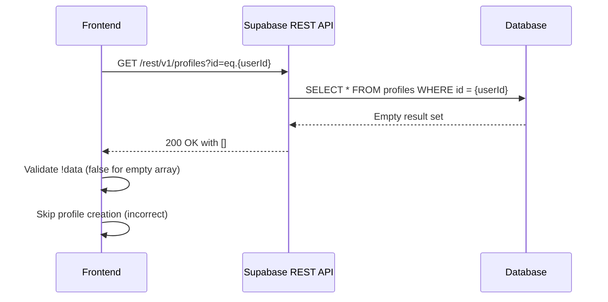
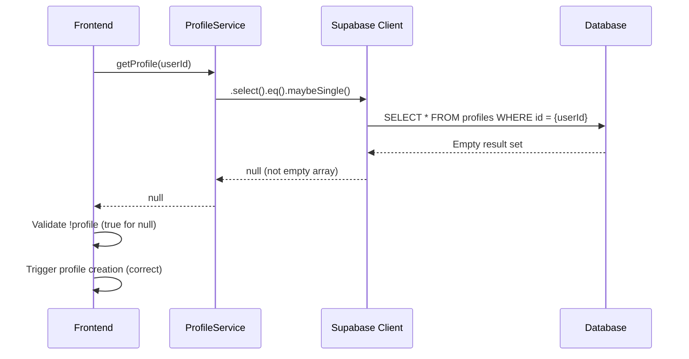
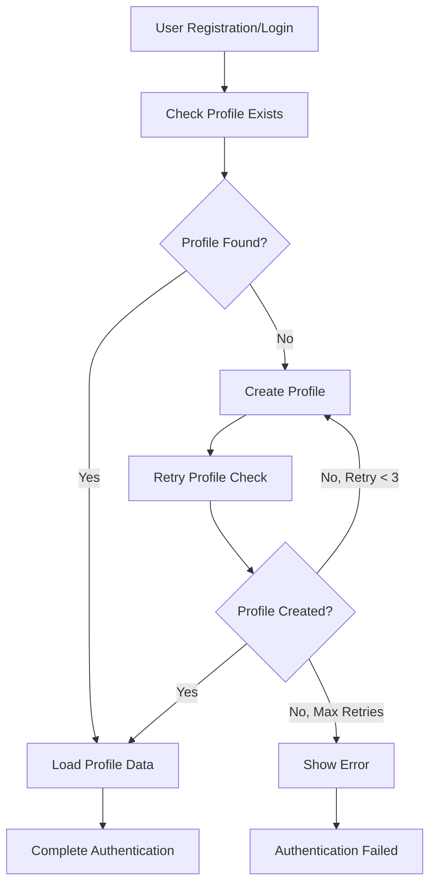

# Profile Creation and Array Response Handling Fix

## Overview

This design addresses the issue where Supabase REST API calls return empty arrays `[]` instead of individual profile objects when profiles don't exist, causing incorrect frontend validation logic. The problem occurs when the frontend incorrectly checks for profile existence by evaluating `!data` on an array response, which always returns `false` even for empty arrays.

## Problem Analysis

### Current Issue
The Supabase REST API endpoint returns:
- `200 OK` with empty array `[]` when no profile exists
- Frontend logic incorrectly validates this as `!data` which evaluates to `false`
- Profile creation logic fails because empty array is treated as existing data

### Root Cause
Frontend validation logic assumes single object responses but receives array responses from direct REST API calls, leading to incorrect boolean evaluation of profile existence.

## Architecture

### Current Profile Fetching Flow


### Fixed Profile Fetching Flow


## Implementation Strategy

### 1. Consolidate Profile Service Usage

**Objective**: Ensure all profile-related operations use the centralized `ProfileService` instead of direct Supabase client calls.

**Current State**: 
- `ProfileService` exists with proper `.maybeSingle()` handling
- Some components still use direct Supabase client calls
- Inconsistent response handling across components

**Target State**:
- All profile operations use `ProfileService`
- Consistent null/undefined handling
- Proper validation logic for profile existence

### 2. Frontend Validation Logic Enhancement

**Profile Existence Validation Pattern**:
```typescript
// ❌ Incorrect (vulnerable to empty array)
const data = await fetch(url).then(r => r.json());
if (!data) { /* create profile */ }

// ✅ Correct (array length check)
const data = await fetch(url).then(r => r.json());
if (Array.isArray(data) && data.length === 0) { /* create profile */ }

// ✅ Better (use ProfileService)
const profile = await ProfileService.getProfile(userId);
if (!profile) { /* create profile */ }
```

### 3. Profile Creation Flow Standardization

**Enhanced Profile Creation Logic**:


## Component Updates

### 1. Profile Service Enhancement

**Current Implementation**:
- Already uses `.maybeSingle()` correctly
- Proper error handling for PGRST116 errors
- Returns `null` for non-existent profiles

**Enhancement Needed**:
- Add profile creation method with retry logic
- Enhanced logging for debugging
- Validation helpers for profile data

```typescript
export class ProfileService {
  /**
   * Create user profile with retry logic
   */
  static async createProfile(profileData: Partial<UserProfile> & { id: string }): Promise<UserProfile | null> {
    const maxRetries = 3;
    let retryCount = 0;
    
    while (retryCount < maxRetries) {
      try {
        const profile = await this.upsertProfile(profileData);
        if (profile) return profile;
        
        // Wait before retry
        await new Promise(resolve => setTimeout(resolve, 500));
        retryCount++;
      } catch (error) {
        console.error(`Profile creation attempt ${retryCount + 1} failed:`, error);
        if (retryCount === maxRetries - 1) throw error;
        retryCount++;
      }
    }
    
    return null;
  }
  
  /**
   * Ensure profile exists, create if missing
   */
  static async ensureProfile(userId: string, userData: { email: string; name: string }): Promise<UserProfile | null> {
    let profile = await this.getProfile(userId);
    
    if (!profile) {
      console.log('Profile not found, creating...', userId);
      profile = await this.createProfile({
        id: userId,
        email: userData.email,
        name: userData.name,
        role: 'user',
        status: 'active'
      });
    }
    
    return profile;
  }
}
```

### 2. User Authentication Service Updates

**Current Issues**:
- Uses `getUserProfile` but may still have timing issues
- Retry logic exists but may need enhancement

**Enhancement Plan**:
- Replace `getUserProfile` calls with `ProfileService.ensureProfile`
- Improve error handling and user feedback
- Add better logging for debugging profile creation issues

### 3. Admin Components Updates

**Components to Update**:
- `AdminPersonal.tsx` - profile loading on mount
- `AdminAuth.tsx` - profile validation after login
- `AdminLayout.tsx` - user profile loading
- `UserProfile.tsx` - profile data fetching

**Update Pattern**:
```typescript
// Before
const { data: userData } = await supabase.auth.getUser();
const user = userData.user;
if (user?.id) {
  const profile = await ProfileService.getProfile(user.id);
  // Handle profile...
}

// After
const { data: userData } = await supabase.auth.getUser();
const user = userData.user;
if (user?.id) {
  const profile = await ProfileService.ensureProfile(user.id, {
    email: user.email || '',
    name: user.user_metadata?.name || ''
  });
  // Handle profile...
}
```

## Error Handling Strategy

### 1. Centralized Error Types

```typescript
export enum ProfileError {
  PROFILE_NOT_FOUND = 'profile_not_found',
  PROFILE_CREATION_FAILED = 'profile_creation_failed',
  PROFILE_UPDATE_FAILED = 'profile_update_failed',
  INSUFFICIENT_PERMISSIONS = 'insufficient_permissions',
  NETWORK_ERROR = 'network_error'
}
```

### 2. User Feedback Patterns

```typescript
// Profile creation with user feedback
try {
  const profile = await ProfileService.ensureProfile(userId, userData);
  if (!profile) {
    toast.error('Failed to create user profile. Please try again.');
    return;
  }
  toast.success('Profile loaded successfully');
} catch (error) {
  console.error('Profile error:', error);
  toast.error('Unable to load profile. Please refresh and try again.');
}
```

## Testing Strategy

### Unit Tests

1. **ProfileService Tests**:
   - Test `getProfile` returns null for non-existent profiles
   - Test `ensureProfile` creates profile when missing
   - Test retry logic in `createProfile`
   - Test error handling for various failure scenarios

2. **Component Tests**:
   - Test profile loading states in admin components
   - Test error handling and user feedback
   - Test authentication flow with profile creation

### Integration Tests

1. **End-to-End Profile Flow**:
   - New user registration with profile creation
   - Existing user login with profile loading
   - Profile update operations
   - Error recovery scenarios

### Edge Cases

1. **Concurrent Profile Creation**:
   - Multiple tabs creating profile simultaneously
   - Race conditions between auth and profile creation

2. **Network Issues**:
   - Intermittent connection during profile creation
   - Partial profile data scenarios

## Monitoring and Debugging

### 1. Enhanced Logging

```typescript
export class ProfileService {
  private static logProfileOperation(operation: string, userId: string, result: any) {
    console.log(`[ProfileService] ${operation}:`, {
      userId,
      timestamp: new Date().toISOString(),
      result: result ? 'success' : 'null/failure'
    });
  }
}
```

### 2. Performance Metrics

- Track profile creation success rates
- Monitor profile loading times
- Alert on high failure rates
- Log retry patterns for optimization

## Security Considerations

### 1. Data Validation

```typescript
// Validate profile data before creation
const validateProfileData = (data: Partial<UserProfile>) => {
  if (!data.email || !data.name || !data.id) {
    throw new Error('Missing required profile fields');
  }
  
  if (!/^[^\s@]+@[^\s@]+\.[^\s@]+$/.test(data.email)) {
    throw new Error('Invalid email format');
  }
};
```

### 2. Permission Checks

- Ensure users can only create/update their own profiles
- Validate admin permissions for user management operations
- Implement rate limiting for profile operations

## Performance Optimization

### 1. Caching Strategy

```typescript
// Cache profile data to reduce database calls
class ProfileCache {
  private static cache = new Map<string, { profile: UserProfile; timestamp: number }>();
  private static CACHE_TTL = 5 * 60 * 1000; // 5 minutes
  
  static get(userId: string): UserProfile | null {
    const cached = this.cache.get(userId);
    if (cached && Date.now() - cached.timestamp < this.CACHE_TTL) {
      return cached.profile;
    }
    return null;
  }
  
  static set(userId: string, profile: UserProfile) {
    this.cache.set(userId, { profile, timestamp: Date.now() });
  }
}
```

### 2. Batch Operations

- Group multiple profile operations where possible
- Optimize database queries for bulk user management
- Implement pagination for admin user lists

## Migration Plan

### Phase 1: Core Service Enhancement
1. Update `ProfileService` with new methods
2. Add comprehensive error handling
3. Implement retry logic and logging

### Phase 2: Component Updates
1. Update admin components to use enhanced ProfileService
2. Replace direct Supabase client calls
3. Implement proper error handling and user feedback

### Phase 3: Testing and Validation
1. Comprehensive testing of all profile operations
2. Performance testing and optimization
3. User acceptance testing

### Phase 4: Monitoring and Cleanup
1. Deploy monitoring and alerting
2. Remove deprecated code patterns
3. Documentation updates

## Risk Assessment

### Low Risk
- Enhanced logging and monitoring
- Improved error messages
- Caching implementation

### Medium Risk
- Changing profile creation logic
- Component-level updates
- Retry mechanism implementation

### High Risk
- Database schema changes (if needed)
- Authentication flow modifications

### Mitigation Strategies
- Gradual rollout with feature flags
- Comprehensive testing in staging environment
- Rollback procedures documented
- User communication for any service disruptions