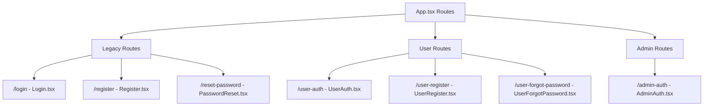
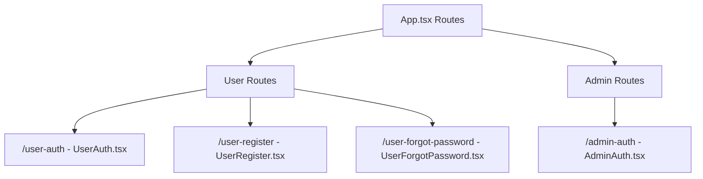

# Remove Duplicate Authentication Pages

## Overview

This design outlines the removal of duplicate authentication pages that were accidentally created in the application. The application currently has both legacy and proper authentication routes, causing confusion and code duplication.

## Current Problem

The application contains duplicate authentication pages:

**Duplicate/Legacy Pages (to be removed):**
- `/login` → `Login.tsx`
- `/register` → `Register.tsx` 
- `/reset-password` → `PasswordReset.tsx`

**Proper Pages (to keep):**
- `/user-auth` → `UserAuth.tsx`
- `/user-register` → `UserRegister.tsx`
- `/user-forgot-password` → `UserForgotPassword.tsx`

## Architecture

### Current Route Structure


### Target Route Structure


## Component Analysis

### Files to be Removed
1. **`/src/pages/Login.tsx`**
   - Duplicate of UserAuth.tsx
   - Contains similar login functionality
   - References `/register` and `/reset-password` routes

2. **`/src/pages/Register.tsx`**
   - Duplicate of UserRegister.tsx
   - Contains similar registration functionality
   - May have cross-references to other legacy routes

3. **`/src/pages/PasswordReset.tsx`**
   - Duplicate of UserForgotPassword.tsx
   - Contains password reset functionality
   - May be referenced by other components

### Route Configuration Changes

**In `App.tsx`, remove these routes:**
```typescript
// Remove these legacy routes
<Route path="/register" element={<Register />} />
<Route path="/login" element={<Login />} />
<Route path="/reset-password" element={<PasswordReset />} />
```

**Keep these routes:**
```typescript
// Keep these proper routes
<Route path="/user-register" element={<UserRegister />} />
<Route path="/user-auth" element={<UserAuth />} />
<Route path="/user-forgot-password" element={<UserForgotPassword />} />
```

### Cross-Reference Impact Analysis

**Potential References to Check:**
1. **Internal Links**: Components linking to `/login`, `/register`, `/reset-password`
2. **Navigation Components**: Menu items or navigation bars
3. **Redirect Logic**: Authentication flows that redirect to these routes
4. **External Documentation**: README files or documentation mentioning these routes

## Implementation Strategy

### Phase 1: Route Analysis and Cleanup
1. Search codebase for references to legacy routes
2. Update all internal links to use proper routes
3. Remove legacy route imports from App.tsx
4. Remove legacy route definitions from App.tsx

### Phase 2: File Removal
1. Delete `/src/pages/Login.tsx`
2. Delete `/src/pages/Register.tsx`
3. Delete `/src/pages/PasswordReset.tsx`

### Phase 3: Verification
1. Verify all authentication flows work correctly
2. Test all navigation paths
3. Ensure no broken links exist
4. Check that proper routes handle all use cases

## Risk Assessment

### Low Risk
- **File Removal**: Legacy files appear to be standalone duplicates
- **Route Cleanup**: Routes are clearly separated and independent

### Medium Risk  
- **Cross-References**: Need to verify no components reference legacy routes
- **User Bookmarks**: Users may have bookmarked legacy URLs

### Mitigation Strategies
1. **Comprehensive Search**: Search entire codebase for legacy route references
2. **Redirect Strategy**: Consider adding temporary redirects for legacy routes instead of complete removal
3. **Testing**: Thorough testing of all authentication flows

## Alternative Approach: Redirect Instead of Remove

Instead of completely removing legacy routes, consider implementing redirects:

```typescript
// Redirect legacy routes to proper routes
<Route path="/login" element={<Navigate to="/user-auth" replace />} />
<Route path="/register" element={<Navigate to="/user-register" replace />} />
<Route path="/reset-password" element={<Navigate to="/user-forgot-password" replace />} />
```

This approach provides backward compatibility while gradually phasing out legacy routes.

## Testing Strategy

### Manual Testing Required
1. **Authentication Flows**
   - User login via `/user-auth`
   - User registration via `/user-register`
   - Password reset via `/user-forgot-password`

2. **Navigation Testing**
   - All internal links work correctly
   - No 404 errors for authentication-related navigation
   - Admin authentication flow unaffected

3. **Cross-Browser Testing**
   - Ensure authentication works across different browsers
   - Verify responsive design remains intact

### Automated Testing Considerations
- Update any existing tests that reference legacy routes
- Add tests to verify proper routes work correctly
- Consider adding redirect tests if using redirect approach