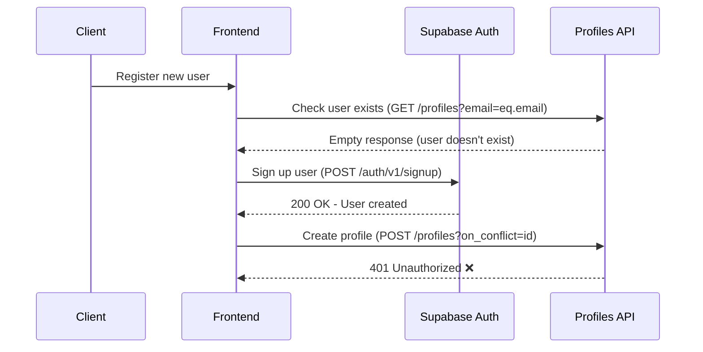
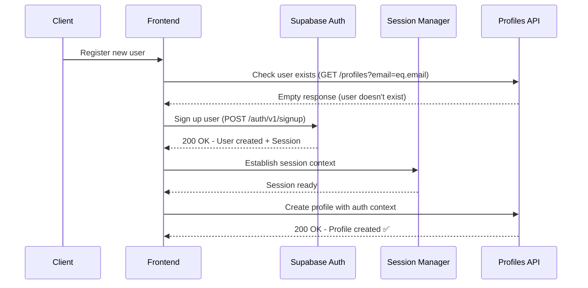
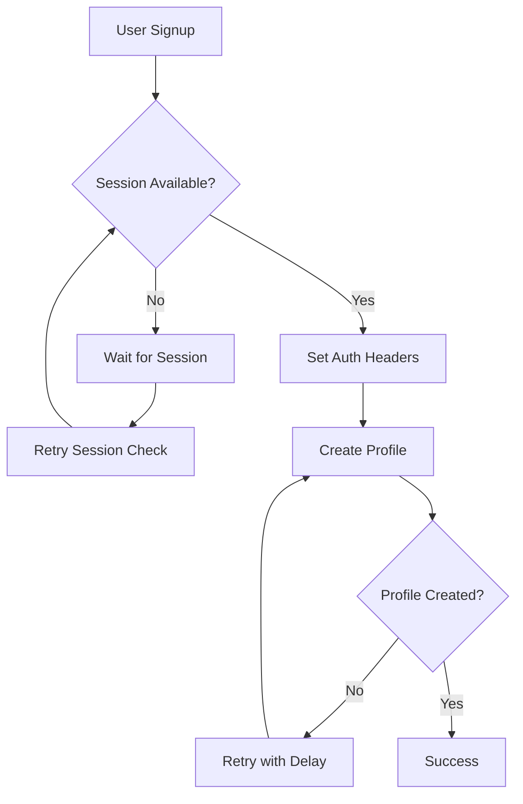
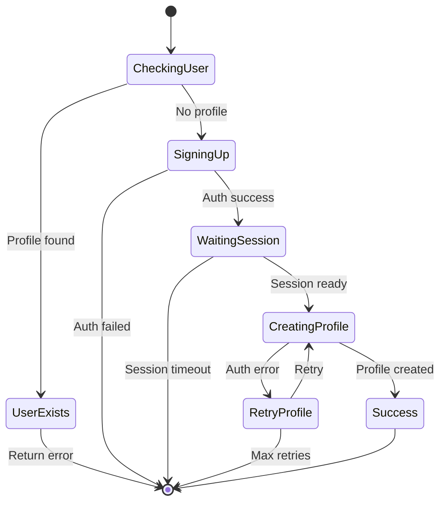
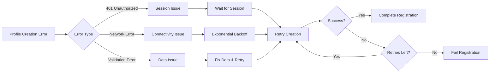
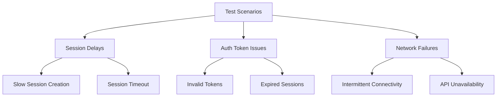

# User Registration Authorization Fix Design

## Overview

The current user registration flow has a critical authorization issue where profile creation fails with a 401 Unauthorized error after successful user authentication. This occurs because the profile creation request is made without proper authentication context, causing the database operation to fail despite successful user signup.

## Problem Analysis

### Current Registration Flow Issues



### Root Cause

The profile creation request fails because:
1. User signup creates an auth session, but the session is not immediately available for API requests
2. Profile creation happens immediately after signup without waiting for session establishment
3. The request lacks proper authorization headers or session context

## Architecture

### Corrected Registration Flow



### Session Management Strategy



## Component Architecture

### Authentication Service Enhancement

The `UserAuthService.register()` method requires modification to handle session establishment:

```typescript
interface RegistrationOptions {
  maxRetries: number;
  sessionTimeout: number;
  profileCreationDelay: number;
}

interface SessionContext {
  accessToken: string;
  refreshToken: string;
  userId: string;
  isReady: boolean;
}
```

### Profile Service Integration

The `ProfileService` needs session-aware methods:

- `createProfileWithSession()` - Creates profile with authenticated context
- `waitForSessionReady()` - Ensures session availability before operations
- `retryWithAuthentication()` - Handles auth-related failures

## Data Flow Architecture

### Registration State Management



### Error Handling Strategy



## Implementation Strategy

### Phase 1: Session Management Fix

1. **Session Waiting Logic**
   - Implement session readiness check
   - Add timeout handling for session establishment
   - Ensure auth headers are properly set

2. **Profile Creation Timing**
   - Add delay before profile creation attempt
   - Implement retry mechanism for auth failures
   - Handle session refresh if needed

### Phase 2: Enhanced Error Handling

1. **Authorization Error Recovery**
   - Detect 401 errors specifically
   - Implement session refresh mechanism
   - Add fallback authentication methods

2. **Robust Retry Logic**
   - Exponential backoff for network errors
   - Maximum retry limits
   - Graceful degradation for persistent failures

### Phase 3: User Experience Improvements

1. **Registration Flow Optimization**
   - Show loading states during session establishment
   - Provide clear error messages for auth issues
   - Handle edge cases gracefully

2. **Logging and Monitoring**
   - Track registration success rates
   - Monitor auth failure patterns
   - Log session establishment timing

## Testing Strategy

### Unit Testing Focus

- Session establishment timing
- Profile creation with various auth states
- Error handling for 401 scenarios
- Retry logic validation

### Integration Testing

- End-to-end registration flow
- Session timeout scenarios
- Network failure recovery
- Concurrent registration handling

### Error Scenarios



## Security Considerations

### Authentication Context

- Ensure proper session isolation
- Validate auth tokens before profile operations
- Handle session expiration gracefully

### Data Protection

- Avoid storing sensitive data during registration delays
- Implement secure retry mechanisms
- Log security events appropriately

## Performance Optimization

### Session Establishment

- Minimize wait times for session readiness
- Implement efficient polling mechanisms
- Cache session state when appropriate

### Profile Creation Efficiency

- Batch profile operations when possible
- Optimize database queries
- Implement smart retry intervals