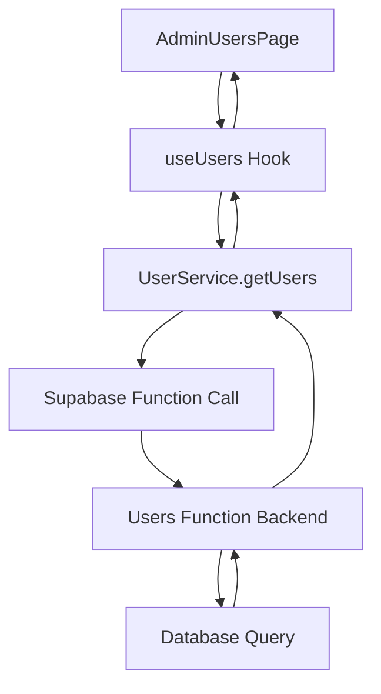

# Role-Based User Filtering Issue Analysis and Fix

## Overview
This document analyzes the issue with role-based filtering in the user management system where requesting users with the "user" role filter returns all users regardless of their role. The problem occurs in the Supabase users function where the role parameter handling logic has a flaw in its default behavior implementation.

## Problem Description
When making a request to the users endpoint with `role=user` parameter, the system returns users with all roles (user, admin, manager) instead of filtering to only users with the "user" role. This is a critical issue for the admin interface as it prevents proper user management and role-based access control.

### Current Behavior
- Request: `GET /functions/v1/users?role=user`
- Expected: Only users with role = "user"
- Actual: All users (user, admin, manager roles)

## Root Cause Analysis

### 1. Issue in Parameter Handling Logic
The problem lies in the conditional logic in `/supabase/functions/users/index.ts`:

```typescript
const role = url.searchParams.get('role') || 'user' // Extract role parameter

// Build query with conditional role filtering
let query = supabaseClient.from('profiles').select('*', { count: 'exact' })

// Apply role filter based on parameter
if (role && role !== 'all') {
  query = query.eq('role', role)
}
```

### 2. Logic Flow Issue
The current implementation has a flaw in how it handles the default case:

1. When `role=user` is passed in the query string, `role` variable gets the value "user"
2. The condition `if (role && role !== 'all')` evaluates to true
3. The query should apply `.eq('role', 'user')` filter
4. However, there seems to be an issue with how the query is constructed or executed

### 3. Frontend Integration Issue
In the frontend, the AdminUsersPage component initializes the role filter to "user" by default:

```typescript
const [filters, setFilters] = useState<UserFilters>({
  search: "",
  status: "all",
  role: "user", // Add default role filter
  sortBy: "created_at",
  sortOrder: "desc",
});
```

This means that even when no explicit role filter is selected by the user, the "role=user" parameter is always sent to the backend.

## Technical Architecture

### Data Flow


### Component Interaction
1. **AdminUsersPage**: Manages filter state and passes filters to the useUsers hook
2. **useUsers Hook**: Uses React Query to fetch users with specified filters
3. **UserService**: Constructs the API call with query parameters
4. **Supabase Users Function**: Processes query parameters and executes database query
5. **Database**: Returns filtered results based on query conditions

## Solution Design

### Issue Identification
After analyzing the code, the issue appears to be that when the role parameter is explicitly set to "user", the filter should be applied. However, the current implementation might have an issue with how the default value is handled.

### Proposed Fix
The fix involves ensuring that when a specific role is requested (including "user"), the filter is properly applied. The issue might be in the database query construction.

### Detailed Implementation

#### 1. Backend Fix (Supabase Function)
In `/supabase/functions/users/index.ts`, we need to ensure the role filtering logic works correctly:

```typescript
// Extract role parameter with explicit handling
const roleParam = url.searchParams.get('role')

// Build query
let query = supabaseClient.from('profiles').select('*', { count: 'exact' })

// Apply role filter - handle both explicit and default cases
if (roleParam !== null && roleParam !== 'all') {
  // Explicit role filter requested
  query = query.eq('role', roleParam)
} else if (roleParam === null) {
  // No role parameter provided, default to 'user' role
  query = query.eq('role', 'user')
}
// If roleParam is 'all', no role filter is applied (show all roles)
```

#### 2. Frontend Consideration
The frontend should differentiate between:
- No role filter selected (should send no role parameter)
- Explicit "user" role filter selected (should send role=user)
- "all" roles filter selected (should send role=all)

## API Specification

### Current Endpoint
```
GET /functions/v1/users
```

### Query Parameters
| Parameter | Type | Required | Description |
|-----------|------|----------|-------------|
| role | string | No | Filter by user role (user, admin, manager, all) |
| page | number | No | Page number (default: 1) |
| limit | number | No | Items per page (default: 10) |
| search | string | No | Text search in name/email |
| status | string | No | Filter by status (active, inactive, all) |
| sortBy | string | No | Field to sort by |
| sortOrder | string | No | Sort order (asc, desc) |

### Expected Behavior
| Request | Expected Result |
|---------|-----------------|
| `GET /users?role=user` | Only users with role = "user" |
| `GET /users?role=admin` | Only users with role = "admin" |
| `GET /users?role=manager` | Only users with role = "manager" |
| `GET /users?role=all` | All users regardless of role |
| `GET /users` | Only users with role = "user" (default) |

## Testing Strategy

### Unit Tests
1. Test role filtering with explicit "user" role parameter
2. Test role filtering with other role values (admin, manager)
3. Test "all" roles parameter behavior
4. Test default behavior when no role parameter is provided
5. Test combination of role filter with other filters (search, status)

### Integration Tests
1. Verify AdminUsersPage correctly sends role parameters
2. Confirm useUsers hook properly handles different role filter values
3. Validate UserService constructs correct API calls
4. Test end-to-end filtering from UI to database

## Implementation Steps

### 1. Backend Implementation
1. Modify the users function in `/supabase/functions/users/index.ts`
2. Update the role parameter handling logic
3. Ensure proper query construction for all role filter cases
4. Test with direct API calls

### 2. Frontend Consideration
1. Review AdminUsersPage filter handling
2. Ensure proper differentiation between no filter and explicit "user" filter
3. Update UI to clearly indicate filter state

### 3. Validation
1. Test all role filter combinations
2. Verify existing functionality remains intact
3. Confirm backward compatibility

## Risk Assessment

### Potential Issues
1. **Breaking Change Risk**: Modifying the filtering logic could affect existing integrations
2. **Performance Impact**: Additional query conditions might affect database performance
3. **UI/UX Impact**: Changes to default filtering behavior might confuse users

### Mitigation Strategies
1. Maintain backward compatibility by preserving default behavior
2. Thorough testing of all filter combinations
3. Clear documentation of the fix and its impact

## Conclusion
The role filtering issue in the user management system requires a fix to the parameter handling logic in the Supabase users function. The solution involves ensuring that when an explicit role parameter is provided (including "user"), the filter is properly applied to the database query. This fix will restore the expected behavior of the admin interface and ensure proper role-based access control.```

This means that even when no explicit role filter is selected by the user, the "role=user" parameter is always sent to the backend.

## Technical Architecture

### Data Flow


### Component Interaction
1. **AdminUsersPage**: Manages filter state and passes filters to the useUsers hook
2. **useUsers Hook**: Uses React Query to fetch users with specified filters
3. **UserService**: Constructs the API call with query parameters
4. **Supabase Users Function**: Processes query parameters and executes database query
5. **Database**: Returns filtered results based on query conditions

## Solution Design

### Issue Identification
After analyzing the code, the issue appears to be that when the role parameter is explicitly set to "user", the filter should be applied. However, the current implementation might have an issue with how the default value is handled.

### Proposed Fix
The fix involves ensuring that when a specific role is requested (including "user"), the filter is properly applied. The issue might be in the database query construction.

### Detailed Implementation

#### 1. Backend Fix (Supabase Function)
In `/supabase/functions/users/index.ts`, we need to ensure the role filtering logic works correctly:

```typescript
// Extract role parameter with explicit handling
const roleParam = url.searchParams.get('role')

// Build query
let query = supabaseClient.from('profiles').select('*', { count: 'exact' })

// Apply role filter - handle both explicit and default cases
if (roleParam !== null && roleParam !== 'all') {
  // Explicit role filter requested
  query = query.eq('role', roleParam)
} else if (roleParam === null) {
  // No role parameter provided, default to 'user' role
  query = query.eq('role', 'user')
}
// If roleParam is 'all', no role filter is applied (show all roles)
```

#### 2. Frontend Consideration
The frontend should differentiate between:
- No role filter selected (should send no role parameter)
- Explicit "user" role filter selected (should send role=user)
- "all" roles filter selected (should send role=all)

## API Specification

### Current Endpoint
```
GET /functions/v1/users
```

### Query Parameters
| Parameter | Type | Required | Description |
|-----------|------|----------|-------------|
| role | string | No | Filter by user role (user, admin, manager, all) |
| page | number | No | Page number (default: 1) |
| limit | number | No | Items per page (default: 10) |
| search | string | No | Text search in name/email |
| status | string | No | Filter by status (active, inactive, all) |
| sortBy | string | No | Field to sort by |
| sortOrder | string | No | Sort order (asc, desc) |

### Expected Behavior
| Request | Expected Result |
|---------|-----------------|
| `GET /users?role=user` | Only users with role = "user" |
| `GET /users?role=admin` | Only users with role = "admin" |
| `GET /users?role=manager` | Only users with role = "manager" |
| `GET /users?role=all` | All users regardless of role |
| `GET /users` | Only users with role = "user" (default) |

## Testing Strategy

### Unit Tests
1. Test role filtering with explicit "user" role parameter
2. Test role filtering with other role values (admin, manager)
3. Test "all" roles parameter behavior
4. Test default behavior when no role parameter is provided
5. Test combination of role filter with other filters (search, status)

### Integration Tests
1. Verify AdminUsersPage correctly sends role parameters
2. Confirm useUsers hook properly handles different role filter values
3. Validate UserService constructs correct API calls
4. Test end-to-end filtering from UI to database

## Implementation Steps

### 1. Backend Implementation
1. Modify the users function in `/supabase/functions/users/index.ts`
2. Update the role parameter handling logic
3. Ensure proper query construction for all role filter cases
4. Test with direct API calls

### 2. Frontend Consideration
1. Review AdminUsersPage filter handling
2. Ensure proper differentiation between no filter and explicit "user" filter
3. Update UI to clearly indicate filter state

### 3. Validation
1. Test all role filter combinations
2. Verify existing functionality remains intact
3. Confirm backward compatibility

## Risk Assessment

### Potential Issues
1. **Breaking Change Risk**: Modifying the filtering logic could affect existing integrations
2. **Performance Impact**: Additional query conditions might affect database performance
3. **UI/UX Impact**: Changes to default filtering behavior might confuse users

### Mitigation Strategies
1. Maintain backward compatibility by preserving default behavior
2. Thorough testing of all filter combinations
3. Clear documentation of the fix and its impact

## Conclusion
The role filtering issue in the user management system requires a fix to the parameter handling logic in the Supabase users function. The solution involves ensuring that when an explicit role parameter is provided (including "user"), the filter is properly applied to the database query. This fix will restore the expected behavior of the admin interface and ensure proper role-based access control.


