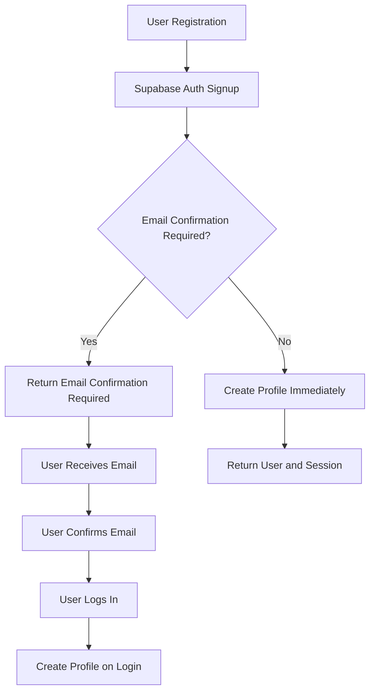

# User Registration Issue Analysis and Fix

## Overview

This document analyzes and proposes a solution for the user registration issue on the `/user-register` page. Based on the code review, the problem appears to be related to profile creation during the registration flow, particularly with how the system handles the email confirmation workflow and profile creation timing.

## Problem Analysis

### Current Registration Flow Issues

1. **Email Confirmation Workflow Misalignment**: The current implementation attempts to create user profiles immediately after registration, but Supabase's email confirmation flow doesn't provide a session token until email is confirmed.

2. **Profile Creation Timing**: The system tries to create profiles before the authentication session is properly established, leading to RLS (Row Level Security) policy violations.

3. **Role Assignment Inconsistencies**: The database schema and migrations show inconsistencies in role assignments, particularly with the missing 'user' role in early migrations.

4. **Error Handling Gaps**: The registration flow doesn't properly handle cases where profile creation fails due to timing issues or authorization problems.

### Root Causes

1. **Database Schema Evolution**: The profiles table initially only had 'admin' and 'manager' roles, with 'user' role added later in migrations.

2. **Trigger Function Issues**: The `handle_new_user()` function had inadequate error handling and didn't properly account for the email confirmation workflow.

3. **Session Management**: The frontend attempts to create profiles immediately after registration without waiting for proper session establishment.

## Proposed Solution

### 1. Fix Registration Flow Logic

The registration flow needs to be updated to properly handle Supabase's email confirmation workflow:



### 2. Update UserAuthService.register Method

The registration method should be modified to:
1. Check if email confirmation is required
2. Return appropriate status without attempting profile creation if email confirmation is needed
3. Only create profiles when a valid session is available

### 3. Improve Profile Creation Logic

The profile creation should:
1. Wait for proper session establishment before attempting creation
2. Use retry logic with exponential backoff for transient failures
3. Provide better error handling and user feedback

## Implementation Plan

### Phase 1: Fix Registration Service Logic

1. Modify `UserAuthService.register` to properly handle email confirmation flow:
   - Remove immediate profile creation attempts
   - Return `EMAIL_CONFIRMATION_REQUIRED` status consistently
   - Clear user existence cache after registration

2. Update error handling to provide more specific error messages

### Phase 2: Improve Profile Creation Robustness

1. Enhance `ProfileService.createProfileWithAuth` with better session validation
2. Add retry logic with proper delays for profile creation
3. Improve logging and debugging information

### Phase 3: Update Database Schema and Functions

1. Ensure all migrations properly handle role assignments
2. Update trigger functions with better error handling
3. Verify RLS policies allow proper profile access

## Technical Details

### Updated Registration Flow

1. **Registration Request**:
   - User submits registration form
   - Frontend validates input with Zod schema

2. **Supabase Registration**:
   - Call `supabase.auth.signUp()` with user data
   - Include proper redirect URL for email confirmation

3. **Response Handling**:
   - If error, map to appropriate user-friendly message
   - If success but no session, return email confirmation required
   - Clear user existence cache

4. **Profile Creation**:
   - Profile creation happens during login after email confirmation
   - Use existing `ProfileService.createProfileWithAuth` method

### Code Changes Required

1. **UserAuthService.ts**:
   - Simplify registration logic to align with email confirmation workflow
   - Remove immediate profile creation attempts
   - Improve error mapping and handling

2. **UserRegister.tsx**:
   - Ensure proper error message display
   - Update success flow handling

3. **Database Migrations**:
   - Verify all migrations properly handle role assignments
   - Ensure trigger functions have proper error handling

## Implementation Details

### Fixing UserAuthService.register

The main issue is in the `UserAuthService.register` method which attempts to create profiles immediately after registration. Here's the specific fix needed:

1. After successful Supabase registration, always return `EMAIL_CONFIRMATION_REQUIRED` status
2. Remove all immediate profile creation attempts
3. Clear the user existence cache to ensure subsequent checks work correctly

### Specific Code Changes

In `src/lib/user-auth-service.ts`, the `register` method needs to be simplified to:

```typescript
static async register(data: RegistrationData, options: Partial<RegistrationOptions> = {}): Promise<AuthResponse> {
  const config = { ...DEFAULT_REGISTRATION_OPTIONS, ...options };
  const metrics = RegistrationLogger.startRegistration(data.email);
  
  try {
    RegistrationLogger.logStep(data.email, 'validation');
    console.log('Starting user registration for:', data.email);
    RegistrationLogger.logStep(data.email, 'validation', { completed: true });
    
    // Step 1: Check user existence through profile (more reliable)
    RegistrationLogger.logStep(data.email, 'existence_check');
    const existingProfile = await ProfileService.getProfileByEmail(data.email);
    
    if (existingProfile) {
      RegistrationLogger.logStep(data.email, 'existence_check', { exists: true, profile: existingProfile.id });
      RegistrationLogger.finishRegistration(data.email, false, UserAuthError.EMAIL_EXISTS);
      console.log('User profile already exists:', data.email);
      return {
        user: null,
        session: null,
        error: UserAuthError.EMAIL_EXISTS
      };
    }
    
    RegistrationLogger.logStep(data.email, 'existence_check', { exists: false });
    console.log('User does not exist, proceeding with registration');
    
    // Step 2: Supabase Auth signup - this creates user but NO session/token until email confirmed
    RegistrationLogger.logStep(data.email, 'auth_signup');
    const { data: authData, error: signUpError } = await supabase.auth.signUp({
      email: data.email,
      password: data.password,
      options: {
        emailRedirectTo: `${window.location.origin}/auth/callback`,
        data: {
          name: data.name,
          role: 'user'
        }
      }
    });

    if (signUpError || !authData.user) {
      RegistrationLogger.logError(data.email, 'auth_signup', signUpError || 'No user data returned');
      RegistrationLogger.finishRegistration(data.email, false, signUpError);
      console.error('Registration signup error:', signUpError);
      return {
        user: null,
        session: null,
        error: UserAuthService.mapSupabaseError(signUpError)
      };
    }

    RegistrationLogger.logStep(data.email, 'auth_signup', { 
      userId: authData.user.id, 
      hasSession: !!authData.session,
      emailConfirmed: authData.user.email_confirmed_at !== null
    });
    console.log('User created in auth:', {
      userId: authData.user.id,
      emailConfirmed: authData.user.email_confirmed_at !== null,
      hasSession: !!authData.session
    });
    
    // Step 3: According to Supabase flow - no session/token until email is confirmed
    // We should NOT create profile here if email requires confirmation
    RegistrationLogger.finishRegistration(data.email, true, 'Email confirmation required');
    console.log('Registration successful, email confirmation required before login');
    
    // Clear existence cache for correct subsequent checks
    UserExistenceService.clearExistenceCache(data.email);
    
    return {
      user: null,
      session: null,
      error: UserAuthError.EMAIL_CONFIRMATION_REQUIRED
    };
    
  } catch (error) {
    RegistrationLogger.logError(data.email, 'general', error);
    RegistrationLogger.finishRegistration(data.email, false, error);
    console.error('Registration error:', error);
    
    // Enhanced error handling for authorization issues
    if (this.isAuthorizationError(error)) {
      return {
        user: null,
        session: null,
        error: UserAuthError.INSUFFICIENT_PERMISSIONS
      };
    }
    
    return {
      user: null,
      session: null,
      error: UserAuthError.REGISTRATION_FAILED
    };
  }
}
```

### Profile Creation Enhancement

The profile creation should be more robust:

1. Add proper session validation before attempting profile creation
2. Implement retry logic with exponential backoff
3. Improve error handling and logging

### Database Trigger Function Enhancement

The `handle_new_user()` database function should be improved to:

1. Properly handle the 'user' role assignment
2. Include better error logging
3. Ensure all required fields are populated

```sql
CREATE OR REPLACE FUNCTION public.handle_new_user()
RETURNS TRIGGER AS $$
DECLARE
  user_role_from_metadata TEXT;
  assigned_role public.user_role;
BEGIN
  -- Extract role from metadata with fallback options
  user_role_from_metadata := COALESCE(
    NEW.raw_user_meta_data->>'role',
    NEW.user_metadata->>'role',
    'user'  -- Default to 'user' if no role specified
  );
  
  -- Determine role assignment logic
  IF NOT EXISTS (SELECT 1 FROM public.profiles WHERE role = 'admin') THEN
    assigned_role := 'admin'::public.user_role;
  ELSIF user_role_from_metadata = 'user' THEN
    assigned_role := 'user'::public.user_role;
  ELSIF user_role_from_metadata = 'admin' THEN
    assigned_role := 'admin'::public.user_role;
  ELSIF user_role_from_metadata = 'manager' THEN
    assigned_role := 'manager'::public.user_role;
  ELSE
    assigned_role := 'user'::public.user_role;  -- Default to 'user' for safety
  END IF;
  
  -- Insert profile with all required fields
  INSERT INTO public.profiles (id, email, name, role, status)
  VALUES (
    NEW.id,
    NEW.email,
    COALESCE(NEW.raw_user_meta_data->>'name', NEW.user_metadata->>'name', NEW.email),
    assigned_role,
    'active'::public.user_status
  );
  
  RETURN NEW;
EXCEPTION
  WHEN OTHERS THEN
    -- Log error but don't fail user creation
    RAISE WARNING 'Failed to create profile for user %: %', NEW.id, SQLERRM;
    RETURN NEW;
END;
$$ LANGUAGE plpgsql SECURITY DEFINER;
```

## Testing Strategy

### Unit Tests

1. Test registration with email confirmation required
2. Test registration error handling (email exists, network errors)
3. Test profile creation with valid sessions
4. Test profile creation error handling

### Integration Tests

1. End-to-end registration flow
2. Email confirmation workflow
3. Profile creation after confirmation
4. Login with newly created user

## Security Considerations

1. Ensure proper RLS policies are in place
2. Validate all user input with Zod schemas
3. Use secure session handling
4. Implement proper rate limiting

## Performance Considerations

1. Implement caching for profile lookups
2. Use efficient database queries
3. Add proper retry logic with exponential backoff
4. Minimize unnecessary API calls

## Rollback Plan

If issues arise after deployment:
1. Revert UserAuthService changes
2. Restore previous database migration if needed
3. Monitor error logs for authentication failures
4. Communicate with users about potential registration issues

## Conclusion

The user registration issue on the `/user-register` page is primarily caused by attempting to create user profiles immediately after registration, which conflicts with Supabase's email confirmation workflow. The fix involves:

1. Simplifying the registration flow to always return `EMAIL_CONFIRMATION_REQUIRED` status
2. Removing immediate profile creation attempts that cause RLS policy violations
3. Ensuring profile creation happens during the login flow after email confirmation
4. Improving database trigger functions for more robust profile creation

These changes align the application with Supabase's recommended authentication patterns and should resolve the registration issues while maintaining security and proper user role assignment.
