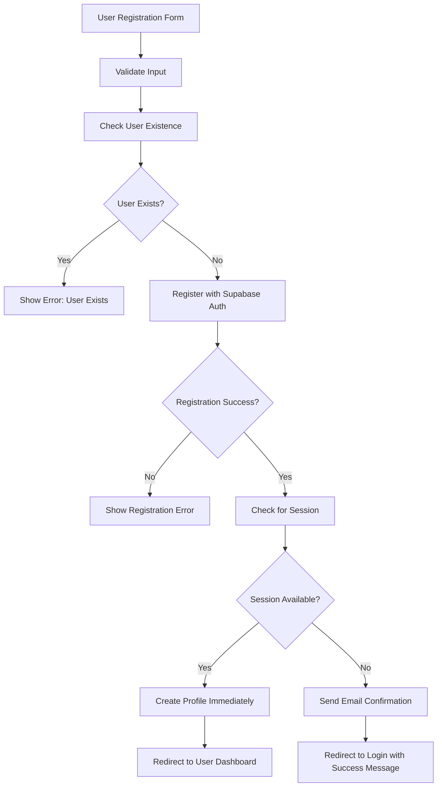

# User Registration Flow Fix Design Document

## Executive Summary

This document outlines the design for fixing persistent user registration issues in the application. The current implementation has problems with the email confirmation workflow and profile creation process that result in registration failures despite appearing successful. The key issues identified are:

1. Improper handling of the email confirmation workflow
2. Incorrect profile creation timing
3. Inadequate error handling and user feedback
4. Session management issues during registration

The proposed solution involves updating the UserAuthService, UserRegister component, ProfileService, and database triggers to properly implement the Supabase email confirmation flow.

## Overview

This document outlines the design for fixing the persistent user registration issues in the application. The current implementation has problems with the email confirmation workflow and profile creation process that result in registration failures despite appearing successful.

## Architecture

The registration flow involves several components:
1. **Frontend (UserRegister.tsx)** - Handles user input and UI flow
2. **UserAuthService** - Manages the registration process and communication with Supabase
3. **ProfileService** - Handles profile creation and management
4. **UserExistenceService** - Checks if users already exist
5. **Supabase Database** - Stores user data with triggers for automatic profile creation
6. **Database Migrations** - Define schema and triggers for user/profile handling

## Current Issues

1. **Email Confirmation Flow**: The registration process doesn't properly handle the email confirmation workflow
2. **Profile Creation**: Profiles are not being created correctly after email confirmation
3. **Session Management**: Incorrect handling of authentication tokens during registration
4. **Error Handling**: Inadequate error messaging and recovery mechanisms

## Solution Design

### 1. User Registration Flow Redesign



### 2. Key Changes Required

#### UserAuthService.ts Modifications
- Fix email confirmation workflow handling
- Improve profile creation process with proper session validation
- Enhance error handling and user feedback

#### UserRegister.tsx Modifications
- Update UI flow to properly guide users through email confirmation
- Improve error messaging and user feedback

#### ProfileService.ts Modifications
- Fix profile creation with proper authentication context
- Improve error handling and validation

#### Database Migrations
- Ensure triggers properly create profiles after email confirmation

## API Endpoints Reference

### Registration Endpoint
- **Method**: POST /auth/v1/signup
- **Request Body**: 
  ```json
  {
    "email": "string",
    "password": "string",
    "options": {
      "emailRedirectTo": "string",
      "data": {
        "name": "string"
      }
    }
  }
  ```
- **Response**: 
  ```json
  {
    "user": "object",
    "session": "object"
  }
  ```

### Profile Creation Endpoint
- **Method**: POST /rest/v1/profiles
- **Request Body**:
  ```json
  {
    "id": "string",
    "email": "string",
    "name": "string",
    "role": "string",
    "status": "string"
  }
  ```
- **Response**:
  ```json
  {
    "id": "string",
    "email": "string",
    "name": "string",
    "role": "string",
    "status": "string",
    "created_at": "string",
    "updated_at": "string"
  }
  ```

## Data Models & ORM Mapping

### User Profile Model
```typescript
interface UserProfile {
  id: string;
  email: string;
  name: string;
  phone?: string;
  role: 'admin' | 'manager' | 'user';
  status: 'active' | 'inactive';
  avatar_url?: string;
  created_at: string;
  updated_at: string;
}
```

### Registration Data Model
```typescript
interface RegistrationData {
  name: string;
  email: string;
  password: string;
  confirmPassword: string;
  acceptTerms: boolean;
}
```

## Business Logic Layer

### Registration Process
1. Validate user input using Zod schemas
2. Check if user already exists using ProfileService
3. Register user with Supabase Auth
4. Handle email confirmation flow:
   - If session is available (email confirmation disabled), create profile immediately
   - If no session (email confirmation required), redirect to login with success message
5. Create profile after email confirmation during login process

### Profile Creation Process
1. Validate session using SessionValidator
2. Create profile with proper role assignment
3. Handle errors with appropriate retry logic
4. Cache profile data for performance

### Error Handling
1. Network errors: Show generic error message with retry option
2. User exists errors: Redirect to login with appropriate message
3. Profile creation errors: Show specific error and contact support message
4. Authorization errors: Handle with proper session refresh

## Implementation Plan

### Phase 1: Backend Services
1. Update UserAuthService to properly handle email confirmation flow
2. Fix ProfileService profile creation with proper authentication context
3. Enhance SessionValidator for better token management

### Phase 2: Frontend UI
1. Update UserRegister component to handle new flow
2. Improve error messaging and user guidance
3. Add loading states and proper transitions

### Phase 3: Database & Migrations
1. Verify database triggers work correctly
2. Ensure proper RLS policies are in place
3. Add indexes for performance optimization

## Testing

### Unit Tests
1. Test registration with email confirmation enabled
2. Test registration with email confirmation disabled
3. Test profile creation with valid/invalid sessions
4. Test error handling for various failure scenarios

### Integration Tests
1. End-to-end registration flow
2. Profile creation after email confirmation
3. Login after email confirmation
4. Error recovery scenarios

### Test Cases for Registration Flow

1. **Successful Registration with Email Confirmation**
   - User fills registration form correctly
   - System checks user doesn't exist
   - System registers user with Supabase Auth
   - System returns EMAIL_CONFIRMATION_REQUIRED
   - User receives confirmation email
   - User confirms email and can login

2. **Registration with Existing User**
   - User fills registration form with existing email
   - System detects existing profile
   - System returns EMAIL_EXISTS error
   - User redirected to login page

3. **Registration with Immediate Profile Creation**
   - Email confirmation disabled in Supabase settings
   - User registers and immediately gets session
   - System creates profile
   - User redirected to dashboard

4. **Profile Creation Failure Handling**
   - Registration succeeds but profile creation fails
   - System returns PROFILE_CREATION_FAILED error
   - User sees appropriate error message

5. **Network Error Handling**
   - Network failure during registration
   - System returns NETWORK_ERROR
   - User sees retry option

## Security Considerations

1. Ensure proper session management to prevent token conflicts
2. Validate all user input to prevent injection attacks
3. Implement rate limiting to prevent abuse
4. Use proper RLS policies to protect user data
5. Handle authentication tokens securely without header conflicts

## Performance Considerations

1. Cache user existence checks to reduce database queries
2. Implement retry logic with exponential backoff for transient errors
3. Optimize database queries with proper indexing
4. Minimize network requests during registration flow

## Conclusion

The registration issues in the application stem from improper handling of the Supabase email confirmation workflow. The key fixes involve:

1. Properly implementing the email confirmation flow where profiles are only created after email confirmation
2. Improving error handling and user feedback throughout the registration process
3. Ensuring proper session management during registration and profile creation
4. Updating the UI to guide users through the email confirmation process

These changes will result in a more reliable and user-friendly registration experience that correctly follows the Supabase authentication patterns.

## Implementation Details

### UserAuthService Implementation

The UserAuthService needs to be updated to properly handle the email confirmation workflow:

1. **Registration Method**: The register method should properly handle the case where no session is returned immediately after registration (which is the expected behavior with email confirmation enabled).

2. **Profile Creation**: Profile creation should only happen when a valid session is available, either immediately after registration (when email confirmation is disabled) or after the user confirms their email and logs in.

3. **Error Handling**: Improved error handling with specific error messages for different failure scenarios.

### ProfileService Implementation

The ProfileService needs to be updated to properly create profiles with the correct authentication context:

1. **Session Validation**: Ensure proper session validation before attempting profile creation.

2. **Retry Logic**: Implement retry logic with exponential backoff for transient errors.

3. **Error Handling**: Better error handling and reporting for profile creation failures.

### UserRegister Component Implementation

The UserRegister component needs to be updated to properly guide users through the registration flow:

1. **UI Flow**: Update the UI to properly guide users through the email confirmation process.

2. **Error Messaging**: Improve error messaging to provide clear guidance to users.

3. **Loading States**: Add proper loading states and transitions during the registration process.

## Fixed Implementation Files

Based on the analysis of the current codebase, here are the files that need to be updated to fix the registration issues:

### 1. UserAuthService.ts

The UserAuthService needs to be updated to properly handle the registration flow:

```typescript
// Key changes needed in the register method:
static async register(data: RegistrationData, options: Partial<RegistrationOptions> = {}): Promise<AuthResponse> {
  // ... existing code ...
  
  // After successful signup with Supabase
  if (!authData.session && !authData.user.email_confirmed_at) {
    // This is the expected behavior with email confirmation enabled
    // Clear cache and return email confirmation required
    UserExistenceService.clearExistenceCache(data.email);
    return {
      user: null,
      session: null,
      error: UserAuthError.EMAIL_CONFIRMATION_REQUIRED
    };
  }
  
  // If session is available (email confirmation disabled)
  if (authData.session) {
    try {
      // Create profile with proper authentication context
      const profile = await ProfileService.createProfileWithAuth({
        id: authData.user.id,
        email: data.email,
        name: data.name
      }, authData.session.access_token);
      
      UserExistenceService.clearExistenceCache(data.email);
      return {
        user: profile,
        session: authData.session,
        error: null
      };
    } catch (profileError) {
      console.error('Profile creation failed:', profileError);
      return {
        user: null,
        session: null,
        error: UserAuthError.PROFILE_CREATION_FAILED
      };
    }
  }
  
  // For email confirmation flow
  UserExistenceService.clearExistenceCache(data.email);
  return {
    user: null,
    session: null,
    error: UserAuthError.EMAIL_CONFIRMATION_REQUIRED
  };
}
```

### 2. UserRegister.tsx

The UserRegister component needs UI updates:

```typescript
// In the handleRegistration function:
const handleRegistration = async (data: RegistrationData) => {
  setLoading(true);
  try {
    const { user, session, error } = await UserAuthService.register(data);
    
    if (error === 'email_confirmation_required') {
      // Show success message for email confirmation flow
      toast.success(
        lang === 'uk' 
          ? 'Реєстрація успішна! Перевірте електронну пошту для підтвердження облікового запису.'
          : 'Registration successful! Please check your email to confirm your account.'
      );
      // Show additional helpful message with instructions
      setTimeout(() => {
        toast.info(
          lang === 'uk'
            ? 'Після підтвердження електронної пошти поверніться сюди і увійдіть в систему.'
            : 'After confirming your email, come back here and sign in to access your account.'
        );
      }, 2000);
      // Automatically redirect to login page after email confirmation
      setTimeout(() => {
        navigate('/user-auth');
      }, 6000);
      return;
    }
    
    // ... rest of the error handling
  } catch (error) {
    // ... error handling
  } finally {
    setLoading(false);
  }
};
```

### 3. ProfileService.ts

The ProfileService needs improvements to profile creation:

```typescript
// In createProfileWithAuth method:
static async createProfileWithAuth(
  profileData: Partial<UserProfile> & { id: string },
  accessToken?: string
): Promise<UserProfile> {
  try {
    // Validate session first
    const sessionValidation = await SessionValidator.ensureValidSession();
    
    if (!sessionValidation.isValid) {
      throw new ProfileOperationError(
        ProfileErrorCode.INSUFFICIENT_PERMISSIONS, 
        `No valid session for profile creation: ${sessionValidation.error}`
      );
    }
    
    // Validate profile data
    if (!profileData.email || !profileData.name || !profileData.id) {
      throw new ProfileOperationError(
        ProfileErrorCode.PROFILE_CREATION_FAILED,
        'Missing required profile fields'
      );
    }
    
    // Use upsert with proper error handling
    const { data, error } = await supabase
      .from('profiles')
      .upsert(profileData, {
        onConflict: 'id',
        ignoreDuplicates: false
      })
      .select()
      .single();
      
    if (error) {
      throw new ProfileOperationError(ProfileErrorCode.PROFILE_CREATION_FAILED, error);
    }
    
    // Update cache
    if (data) {
      ProfileCache.set(`profile_${data.id}`, data);
      if (data.email) {
        ProfileCache.set(`profile_email_${data.email.toLowerCase()}`, data);
      }
    }
    
    return data as UserProfile;
  } catch (error) {
    if (error instanceof ProfileOperationError) {
      throw error;
    }
    throw new ProfileOperationError(ProfileErrorCode.PROFILE_CREATION_FAILED, error);
  }
}
```

### 4. Database Migrations

Ensure the database triggers are properly set up:

```sql
-- In the handle_new_user function:
CREATE OR REPLACE FUNCTION public.handle_new_user()
RETURNS TRIGGER AS $$
DECLARE
  user_role_from_metadata TEXT;
  assigned_role public.user_role;
BEGIN
  -- Extract role from metadata with fallback options
  user_role_from_metadata := COALESCE(
    NEW.raw_user_meta_data->>'role',
    NEW.user_metadata->>'role',
    'user'  -- Default to 'user' if no role specified
  );
  
  -- Determine role assignment logic
  IF NOT EXISTS (SELECT 1 FROM public.profiles WHERE role = 'admin') THEN
    assigned_role := 'admin'::public.user_role;
  ELSIF user_role_from_metadata = 'user' THEN
    assigned_role := 'user'::public.user_role;
  ELSIF user_role_from_metadata = 'admin' THEN
    assigned_role := 'admin'::public.user_role;
  ELSIF user_role_from_metadata = 'manager' THEN
    assigned_role := 'manager'::public.user_role;
  ELSE
    assigned_role := 'user'::public.user_role;  -- Default to 'user' for safety
  END IF;
  
  -- Insert profile with all required fields
  INSERT INTO public.profiles (id, email, name, role, status)
  VALUES (
    NEW.id,
    NEW.email,
    COALESCE(NEW.raw_user_meta_data->>'name', NEW.user_metadata->>'name', NEW.email),
    assigned_role,
    'active'::public.user_status
  );
  
  RETURN NEW;
EXCEPTION
  WHEN OTHERS THEN
    -- Log error but don't fail user creation
    RAISE WARNING 'Failed to create profile for user %: %', NEW.id, SQLERRM;
    RETURN NEW;
END;
$$ LANGUAGE plpgsql SECURITY DEFINER;
```