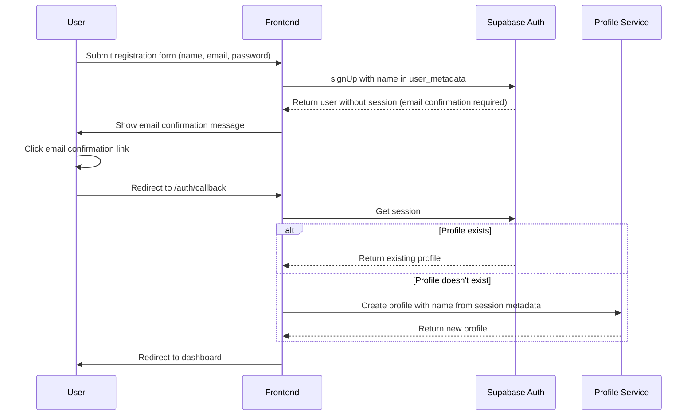

# User Registration Profile Name Issue Resolution

## Overview

This document outlines the solution for fixing the issue where user profiles are created without names during the registration process. Currently, when a new user registers, the name is not properly passed to the profile creation step, resulting in profiles without names which causes issues in the admin panel.

## Architecture

The current user registration flow follows these steps:
1. User submits registration form with name, email, and password
2. Application calls `UserAuthService.register()` which:
   - Creates user in Supabase Auth with name in user metadata
   - Sends email confirmation
   - Does NOT create profile immediately (email confirmation required)
3. After email confirmation, user visits `/auth/callback` which:
   - Calls `UserAuthService.handleOAuthCallback()` 
   - Creates profile but doesn't properly extract name from user metadata

## Problem Analysis

The issue occurs in the profile creation step after email confirmation. In `UserAuthService.handleOAuthCallback()`, the code attempts to extract the user's name from `session.user.user_metadata?.name` but this value may not be properly populated or accessible.

The registration flow needs to be enhanced to ensure the user's name is properly stored and accessible during profile creation.

## Solution Design

### 1. Enhanced Registration Flow

Modify the registration process to ensure the user's name is properly stored and accessible:



### 2. Implementation Changes

#### 2.1 Update UserAuthService.register()

In the registration method, ensure the name is properly passed in user metadata:

```typescript
// In UserAuthService.register()
const { data: authData, error: signUpError } = await supabase.auth.signUp({
  email: data.email,
  password: data.password,
  options: {
    emailRedirectTo: `${window.location.origin}/auth/callback`,
    data: {
      name: data.name,  // Ensure name is stored in user metadata
      full_name: data.name  // Alternative field for redundancy
    }
  }
});
```

#### 2.2 Update UserAuthService.handleOAuthCallback()

Enhance the profile creation logic to properly extract and use the user's name:

```typescript
// In UserAuthService.handleOAuthCallback()
if (!profile) {
  console.log('Creating profile for authenticated user:', session.user.id);
  
  // Enhanced name extraction with fallbacks
  const userName = session.user.user_metadata?.name || 
                  session.user.user_metadata?.full_name ||
                  session.user.email?.split('@')[0] || 
                  'User';
  
  try {
    profile = await ProfileService.createProfileWithAuth({
      id: session.user.id,
      email: session.user.email || '',
      name: userName
    }, session.access_token);
    
    console.log('Profile created successfully for authenticated user');
  } catch (profileError) {
    console.error('Profile creation in callback failed:', profileError);
    return {
      user: null,
      session: null,
      error: UserAuthError.PROFILE_CREATION_FAILED
    };
  }
}
```

#### 2.3 Update UserAuthService.login()

Apply the same enhanced name extraction for login flow:

```typescript
// In UserAuthService.login()
if (!profile) {
  console.log('Creating profile for confirmed user:', authData.user.id);
  
  // Enhanced name extraction with fallbacks
  const userName = authData.user.user_metadata?.name || 
                  authData.user.user_metadata?.full_name ||
                  authData.user.email?.split('@')[0] || 
                  'User';
  
  try {
    profile = await ProfileService.createProfileWithAuth({
      id: authData.user.id,
      email: data.email,
      name: userName
    }, authData.session.access_token);
  } catch (profileError) {
    console.error('Profile creation during login failed:', profileError);
    return {
      user: null,
      session: null,
      error: UserAuthError.PROFILE_CREATION_FAILED
    };
  }
}
```

### 3. Profile Service Enhancement

Add additional logging and validation to the profile creation process:

```typescript
// In ProfileService.createProfileWithAuth()
static async createProfileWithAuth(
  profileData: Partial<UserProfile> & { id: string },
  accessToken?: string
): Promise<UserProfile> {
  try {
    // Validate that name is present
    if (!profileData.name || profileData.name.trim() === '') {
      console.warn('[ProfileService] Profile name is missing, using fallback');
      profileData.name = profileData.email?.split('@')[0] || 'User';
    }
    
    // Log profile data for debugging
    console.log('[ProfileService] Creating profile with data:', {
      id: profileData.id,
      email: profileData.email,
      name: profileData.name
    });
    
    // Continue with existing profile creation logic...
  } catch (error) {
    // Handle error...
  }
}
```

## Data Models

### UserProfile Interface
```typescript
interface UserProfile {
  id: string;
  email: string;
  name: string;           // This field must be properly populated
  phone?: string | null;
  role: 'admin' | 'manager' | 'user';
  status: 'active' | 'inactive';
  avatar_url?: string | null;
  created_at: string;
  updated_at: string;
}
```

## Business Logic Layer

### Registration Flow Enhancement
1. Store user name in Supabase Auth metadata during registration
2. Extract name from metadata during profile creation
3. Implement fallback mechanisms for name extraction
4. Add validation to ensure name is never empty

### Profile Creation Enhancement
1. Add logging to track profile creation data
2. Implement validation to ensure required fields are present
3. Add fallback mechanisms for missing data
4. Improve error handling and reporting

## Testing

### Unit Tests

1. Test name extraction from user metadata:
   - With name in `user_metadata.name`
   - With name in `user_metadata.full_name`
   - With no name (should use email prefix)
   - With empty name (should use fallback)

2. Test profile creation with various name scenarios:
   - Valid name
   - Empty name (should use fallback)
   - Special characters in name
   - Very long name (should be truncated)

3. Test registration flow with name preservation:
   - Registration with valid name
   - Profile creation after email confirmation
   - Profile retrieval with correct name

### Integration Tests

1. End-to-end registration flow:
   - User registration with name
   - Email confirmation
   - Profile creation with correct name
   - Profile retrieval in admin panel

2. Login flow for users with existing profiles:
   - Login with email/password
   - Profile retrieval with correct name
   - Name display in UI components

## Implementation Plan

### Phase 1: Backend Changes (UserAuthService)
- Update registration method to properly store name in user metadata
- Enhance handleOAuthCallback to extract name with fallbacks
- Update login method with same name extraction logic
- Add logging for debugging

### Phase 2: Profile Service Enhancement
- Add validation to ensure name is never empty
- Implement fallback mechanisms for missing name
- Add detailed logging for profile creation

### Phase 3: Testing
- Implement unit tests for name extraction logic
- Create integration tests for registration flow
- Test edge cases and error conditions

### Phase 4: Monitoring
- Add monitoring for profile creation failures
- Implement alerts for name-related issues
- Add metrics for successful profile creations

## Error Handling

1. **Missing Name**: Use email prefix or "User" as fallback
2. **Profile Creation Failure**: Log detailed error and return appropriate error code
3. **Session Issues**: Ensure valid session before profile creation
4. **Database Errors**: Implement retry logic with exponential backoff

## Security Considerations

1. Validate all user input to prevent injection attacks
2. Ensure proper session validation before profile operations
3. Sanitize user names to prevent XSS issues in UI
4. Implement rate limiting for profile creation operations

## Performance Considerations

1. Add caching for profile data to reduce database queries
2. Implement efficient retry logic with exponential backoff
3. Minimize session validation calls with proper caching
4. Optimize database queries for profile creation and retrieval