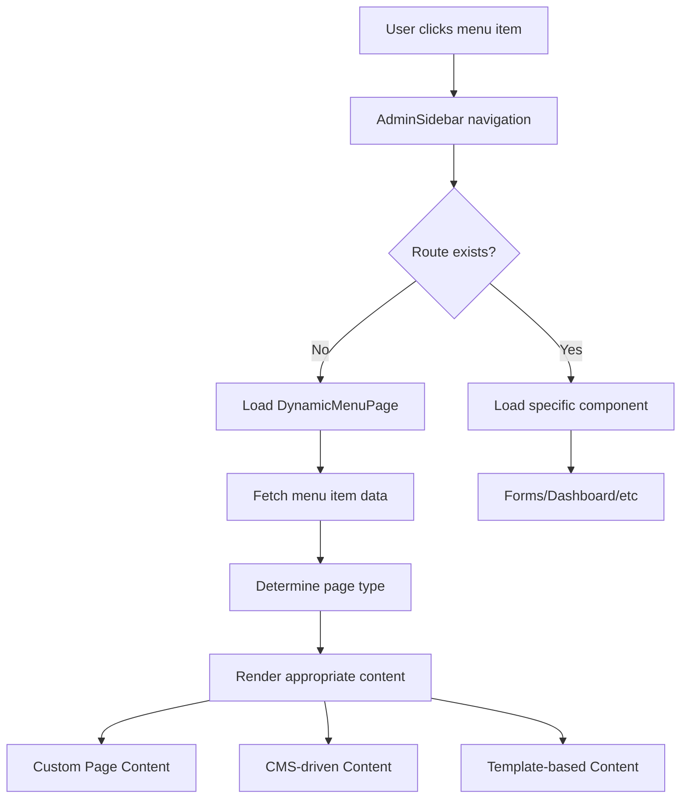
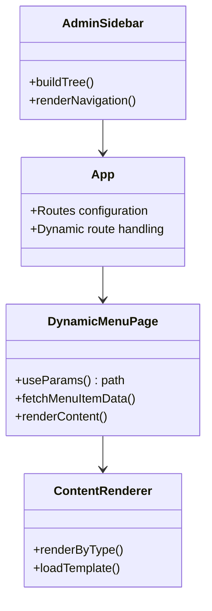

# Dynamic Menu Pages Implementation Design

## Overview

This design document outlines the implementation of dynamic menu pages for an admin dashboard that resolves routing errors (400 errors) when navigating to menu items stored in the `menu_items` database table. The current system loads menu items from Supabase but lacks corresponding React routes for these dynamic paths.

## Current System Architecture

### Database Schema
```sql
menu_items table:
- id (serial primary key)
- title (text, not null)
- path (text, not null) 
- parent_id (integer, nullable, references menu_items.id)
- order_index (integer, default 0)
- is_active (boolean, default true)
- created_at (timestamp)
```

### Current Components
- **AdminSidebar**: Fetches menu items from database and renders navigation
- **MenuPage**: Static placeholder component handling `/admin/page/:title` route
- **App.tsx**: Contains hardcoded routes for specific admin pages

## Architecture Design

### Dynamic Routing System



### Component Hierarchy



## Implementation Strategy

### 1. Enhanced Menu Item Data Model

Extend the `menu_items` table to support different page types:

```sql
ALTER TABLE public.menu_items ADD COLUMN page_type TEXT DEFAULT 'content';
ALTER TABLE public.menu_items ADD COLUMN content_data JSONB;
ALTER TABLE public.menu_items ADD COLUMN template_name TEXT;
ALTER TABLE public.menu_items ADD COLUMN meta_data JSONB;
```

Page types:
- `content`: Static content pages with rich text
- `form`: Form-based pages with specific form components
- `dashboard`: Dashboard-style pages with widgets
- `list`: Data table/list pages
- `custom`: Custom component pages

### 2. Dynamic Route Configuration

Update `App.tsx` routing:

```tsx
<Route path="/admin" element={<AdminProtected />}>
  {/* Existing static routes */}
  <Route path="dashboard" element={<AdminDashboard />} />
  <Route path="personal" element={<AdminPersonal />} />
  
  {/* Dynamic routes - catch all admin paths */}
  <Route path="*" element={<DynamicMenuPage />} />
</Route>
```

### 3. DynamicMenuPage Component

```typescript
interface MenuItemData {
  id: number;
  title: string;
  path: string;
  page_type: 'content' | 'form' | 'dashboard' | 'list' | 'custom';
  content_data?: any;
  template_name?: string;
  meta_data?: any;
}

const DynamicMenuPage = () => {
  const location = useLocation();
  const [menuItem, setMenuItem] = useState<MenuItemData | null>(null);
  const [loading, setLoading] = useState(true);
  const [error, setError] = useState<string | null>(null);

  useEffect(() => {
    const fetchMenuItemByPath = async () => {
      // Fetch menu item data based on current path
      // Handle page rendering based on page_type
    };
    fetchMenuItemByPath();
  }, [location.pathname]);

  return (
    <div className="p-4 md:p-6">
      {loading && <LoadingSpinner />}
      {error && <ErrorDisplay error={error} />}
      {menuItem && <ContentRenderer menuItem={menuItem} />}
    </div>
  );
};
```

### 4. ContentRenderer Component

```typescript
const ContentRenderer = ({ menuItem }: { menuItem: MenuItemData }) => {
  switch (menuItem.page_type) {
    case 'content':
      return <ContentPage data={menuItem.content_data} title={menuItem.title} />;
    case 'form':
      return <FormPage template={menuItem.template_name} data={menuItem.content_data} />;
    case 'dashboard':
      return <DashboardPage widgets={menuItem.content_data} title={menuItem.title} />;
    case 'list':
      return <ListPage config={menuItem.content_data} title={menuItem.title} />;
    case 'custom':
      return <CustomComponentPage component={menuItem.template_name} data={menuItem.content_data} />;
    default:
      return <DefaultContentPage title={menuItem.title} />;
  }
};
```

## Page Type Implementations

### Content Pages
For static content with rich text editing:

```typescript
const ContentPage = ({ data, title }: { data: any; title: string }) => {
  return (
    <Card>
      <CardHeader>
        <CardTitle>{title}</CardTitle>
      </CardHeader>
      <CardContent>
        <div className="prose max-w-none" dangerouslySetInnerHTML={{ __html: data?.html_content || '' }} />
      </CardContent>
    </Card>
  );
};
```

### Form Pages
For dynamic form generation:

```typescript
const FormPage = ({ template, data }: { template: string; data: any }) => {
  const formConfig = data?.form_config || {};
  
  return (
    <Card>
      <CardHeader>
        <CardTitle>{data?.title || 'Form'}</CardTitle>
      </CardHeader>
      <CardContent>
        <DynamicForm config={formConfig} template={template} />
      </CardContent>
    </Card>
  );
};
```

### Dashboard Pages
For widget-based dashboards:

```typescript
const DashboardPage = ({ widgets, title }: { widgets: any[]; title: string }) => {
  return (
    <div className="space-y-6">
      <h1 className="text-2xl font-bold">{title}</h1>
      <div className="grid grid-cols-1 md:grid-cols-2 lg:grid-cols-3 gap-6">
        {widgets?.map((widget, index) => (
          <WidgetRenderer key={index} widget={widget} />
        ))}
      </div>
    </div>
  );
};
```

## Data Management

### Menu Item Content API

Create Supabase edge function for menu content management:

```typescript
// supabase/functions/menu-content/index.ts
export default async function handler(req: Request) {
  const { method } = req;
  const url = new URL(req.url);
  const path = url.searchParams.get('path');

  switch (method) {
    case 'GET':
      // Fetch menu item by path
      return getMenuItemByPath(path);
    case 'PUT':
      // Update menu item content
      return updateMenuItemContent(req);
    default:
      return new Response('Method not allowed', { status: 405 });
  }
}
```

### Content Management Interface

Add admin interface for managing menu item content:

```typescript
const MenuContentManager = ({ menuItemId }: { menuItemId: number }) => {
  const [pageType, setPageType] = useState<string>('content');
  const [contentData, setContentData] = useState<any>({});

  return (
    <div className="space-y-6">
      <div>
        <Label>Page Type</Label>
        <Select value={pageType} onValueChange={setPageType}>
          <SelectItem value="content">Content Page</SelectItem>
          <SelectItem value="form">Form Page</SelectItem>
          <SelectItem value="dashboard">Dashboard Page</SelectItem>
          <SelectItem value="list">List Page</SelectItem>
          <SelectItem value="custom">Custom Page</SelectItem>
        </Select>
      </div>
      
      <PageTypeEditor type={pageType} data={contentData} onChange={setContentData} />
      
      <Button onClick={saveMenuItemContent}>Save Changes</Button>
    </div>
  );
};
```

## Error Handling & Fallbacks

### Route Not Found Handling

```typescript
const DynamicMenuPage = () => {

  const handleRouteNotFound = () => {
    // Log the missing route for admin review
    console.warn(`Menu route not found: ${location.pathname}`);
    
    // Show user-friendly 404 page with navigation suggestions
    return (
      <Card>
        <CardHeader>
          <CardTitle>Page Not Found</CardTitle>
        </CardHeader>
        <CardContent>
          <p>The requested page could not be found.</p>
          <Button onClick={() => navigate('/admin/dashboard')}>
            Return to Dashboard
          </Button>
        </CardContent>
      </Card>
    );
  };
};
```

### Graceful Degradation

```typescript
const ContentRenderer = ({ menuItem }: { menuItem: MenuItemData }) => {
  try {
    // Attempt to render specific page type
    return renderPageType(menuItem);
  } catch (error) {
    // Fall back to basic content display
    console.error('Page rendering error:', error);
    return (
      <Card>
        <CardHeader>
          <CardTitle>{menuItem.title}</CardTitle>
        </CardHeader>
        <CardContent>
          <Alert>
            <AlertDescription>
              This page is currently unavailable. Please contact support.
            </AlertDescription>
          </Alert>
        </CardContent>
      </Card>
    );
  }
};
```

## Performance Optimization

### Route Pre-loading

```typescript
const AdminSidebar = () => {
  // Pre-load menu item data when building sidebar
  const preloadMenuData = useCallback(async () => {
    const paths = items.map(item => item.path);
    await Promise.all(
      paths.map(path => 
        supabase
          .from('menu_items')
          .select('*')
          .eq('path', path)
          .single()
      )
    );
  }, [items]);

  useEffect(() => {
    if (items.length > 0) {
      preloadMenuData();
    }
  }, [items, preloadMenuData]);
};
```

### Caching Strategy

``typescript
const useMenuItemCache = () => {
  const cache = useRef<Map<string, MenuItemData>>(new Map());
  
  const getCachedMenuItem = useCallback(async (path: string) => {
    if (cache.current.has(path)) {
      return cache.current.get(path);
    }
    
    const { data } = await supabase
      .from('menu_items')
      .select('*')
      .eq('path', path)
      .single();
    
    if (data) {
      cache.current.set(path, data);
    }
    
    return data;
  }, []);
  
  return { getCachedMenuItem };
};
```

## Testing Strategy

### Unit Testing

```typescript
describe('DynamicMenuPage', () => {
  test('renders content page correctly', async () => {
    const mockMenuItem = {
      id: 1,
      title: 'Test Page',
      path: '/admin/test',
      page_type: 'content',
      content_data: { html_content: '<p>Test content</p>' }
    };
    
    render(<DynamicMenuPage />);
    // Test rendering logic
  });
  
  test('handles route not found gracefully', async () => {
    // Test 404 handling
  });
});
```

### Integration Testing

```typescript
describe('Menu Navigation Integration', () => {
  test('navigation from sidebar to dynamic page works', async () => {
    // Test full navigation flow
  });
  
  test('handles database menu items correctly', async () => {
    // Test database integration
  });
});
```

## Migration Plan

### Phase 1: Basic Dynamic Routing
1. Update App.tsx with catch-all route
2. Create basic DynamicMenuPage component
3. Implement path-based menu item fetching

### Phase 2: Content Management
1. Add database columns for page types and content
2. Implement ContentRenderer component
3. Create basic content page templates

### Phase 3: Advanced Features
1. Add content management interface
2. Implement caching and performance optimizations
3. Add comprehensive error handling

### Phase 4: Enhancement
1. Add rich content editing capabilities
2. Implement advanced page templates
3. Add analytics and monitoring