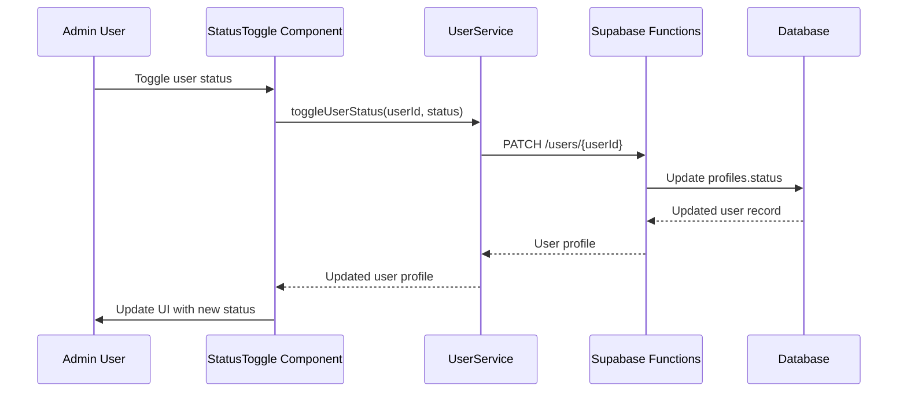
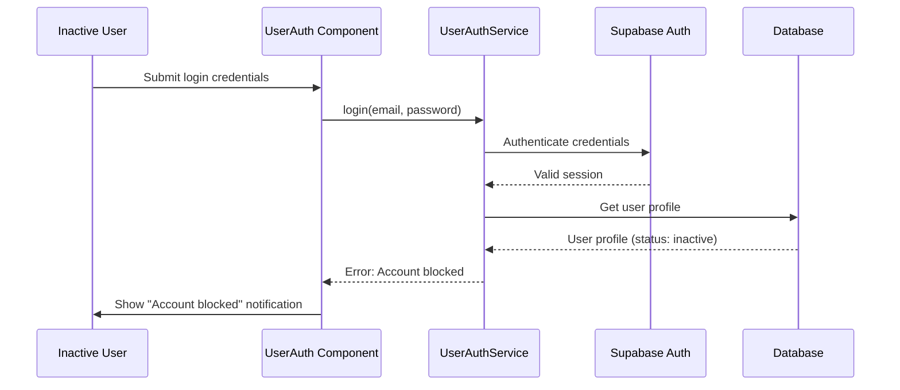

# User Status Update Endpoint Design

## Overview

This document outlines the design for fixing the user status update endpoint issue in the admin panel. Currently, when an admin attempts to change a user's status (activate/deactivate), the frontend sends a request to the incorrect endpoint, causing a "Method not allowed" error. Additionally, we need to implement a check during user login to prevent inactive users from accessing the user dashboard.

## Problem Statement

1. **Incorrect API Endpoint**: The frontend sends PATCH requests to `/functions/v1/users` instead of `/functions/v1/users/{userId}`, causing a "Method not allowed" error.
2. **Missing Access Control**: Inactive users can still access the user dashboard when they should be blocked.

## Solution Architecture

### 1. Frontend Changes

#### StatusToggle Component Update
The StatusToggle component will remain unchanged as it only handles the UI. The actual API call logic needs to be updated in the service layer.

#### UserService Enhancement
The `UserService` needs to be updated to send requests to the correct endpoint with the user ID in the URL path.

Current implementation sends requests to the base users endpoint without including the user ID in the URL path.

Updated implementation sends requests to the users endpoint with the specific user ID included in the URL path.

### 2. Backend Changes

The Supabase function already supports the correct endpoint pattern:
- `PATCH /users/{userId}` - Updates a specific user's information

The existing implementation in `/supabase/functions/users/index.ts` correctly handles PATCH requests with user ID in the URL path.

### 3. Authentication Enhancement

#### User Login Validation
During the login process, we need to check if the user's status is "inactive" and prevent them from accessing the user dashboard.

The login flow needs to be enhanced to check the user status after retrieving the user profile but before allowing access. If the user status is inactive, an appropriate error should be returned to prevent dashboard access.

## API Specification

### Update User Status Endpoint

**URL**: `PATCH /functions/v1/users/{userId}`

**Headers**: Standard authentication headers including Content-Type, Authorization with Bearer token for authenticated users, and apikey for anonymous requests.

**Path Parameters**: User ID to identify the specific user being updated.

**Request Body**: Contains the status field with the new status value (active/inactive).

**Response**: Returns the updated user profile information.

### Error Handling

**Inactive User Login**
When an inactive user attempts to log in, they should receive a notification that their account is blocked.

## Implementation Flow

### 1. Frontend Implementation

### 2. Authentication Implementation

## Security Considerations

1. **Authentication**: Only admin users should be able to update user status
2. **Authorization**: The backend function already validates admin permissions
3. **Data Validation**: The request body should be validated to ensure only allowed fields are updated
4. **Rate Limiting**: Supabase functions have built-in rate limiting

## Testing Plan

### Unit Tests

- UserService tests to verify correct endpoint usage
- UserAuthService tests for login validation with active/inactive users

### Integration Tests

- Status update flow validation
- Login restriction for inactive users

## Implementation Steps

1. Update the user service to use the correct endpoint URL with user ID
2. Add status check in the authentication service to prevent inactive users from logging in
3. Update error handling in the authentication component to display appropriate message for blocked accounts
4. Test the implementation with both active and inactive users
5. Verify admin functionality for toggling user status

