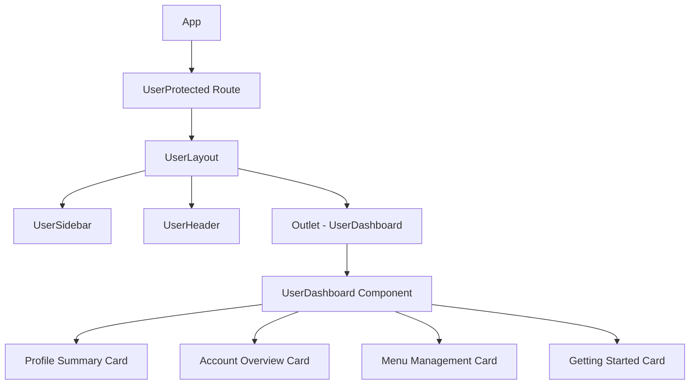

# User Dashboard Restoration Design

## 1. Overview

The user dashboard at `/user/dashboard` is currently not displaying properly. This design document outlines the approach to restore the user dashboard functionality to provide users with a comprehensive overview of their account information, menu items, and personalized statistics.

## 2. Current State Analysis

### 2.1 Existing Components
- `UserDashboard.tsx` - Main dashboard component with profile summary, statistics, and menu management
- `UserProtected.tsx` - Route protection for user pages
- `UserLayout.tsx` - Layout component with sidebar and header
- `UserAuthService.ts` - Authentication service for user data
- `ProfileService.ts` - Service for fetching user profile information
- `UserMenuService.ts` - Service for managing user menu items

### 2.2 Identified Issues
- The dashboard component exists but may not be properly routed
- Data fetching for user profile and menu items may have issues
- Context passing between components might be broken

## 3. Architecture

### 3.1 Component Hierarchy


### 3.2 Data Flow
1. `UserProtected` validates user authentication and role
2. `UserLayout` fetches user profile and menu items
3. Data is passed via context to `UserDashboard`
4. `UserDashboard` renders personalized information

## 4. Implementation Plan

### 4.1 Route Configuration
The main issue is that the user dashboard route is not explicitly defined in `App.tsx`. The current route configuration only has a catch-all route that uses `UserLayout` but doesn't specifically route `/user/dashboard` to the `UserDashboard` component.

Fixes needed:
- Add explicit route for `/user/dashboard` pointing to `UserDashboard` component
- Ensure the route is properly nested within the `UserProtected` route
- Verify that `UserLayout` properly wraps the dashboard route
- The route should be added within the `/user` route as `<Route path="/dashboard" element={<UserDashboard />} />`

### 4.2 Data Fetching Enhancement
Improve data fetching reliability in `UserLayout.tsx`:
- Add error boundaries for data fetching failures
- Implement retry mechanisms for failed requests
- Add loading states for better UX
- Ensure proper error handling when user profile or menu items fail to load
- Add fallback UI when data is unavailable

### 4.3 Context Management
Verify context passing in `UserLayout.tsx`:
- Ensure `user`, `menuItems`, and `onMenuUpdate` are properly passed via Outlet context
- Add fallback values for missing data

### 4.4 Error Handling
Enhance error handling throughout the dashboard:
- Add specific error messages for different failure scenarios
- Implement graceful degradation when data is unavailable

## 5. Component Structure

### 5.1 UserDashboard Component
Props:
- `user`: UserProfile object containing user information
- `menuItems`: Array of UserMenuItem objects
- `onMenuUpdate`: Function to refresh menu items

Key Sections:
1. **Profile Summary Card**
   - User avatar with initials fallback
   - Name and email display
   - Role and status badges
   - Member since date

2. **Account Overview Card**
   - Menu items count
   - Account status indicator
   - Profile completion percentage

3. **Menu Management Card**
   - List of user menu items
   - Add menu item button

4. **Getting Started Card**
   - Quick action buttons for common tasks

### 5.2 Data Models

#### UserProfile Interface
```typescript
interface UserProfile {
  id: string;
  email: string;
  name: string;
  phone?: string | null;
  role: 'admin' | 'manager' | 'user';
  status: 'active' | 'inactive';
  avatar_url?: string | null;
  created_at: string;
  updated_at: string;
}
```

#### UserMenuItem Interface
```typescript
interface UserMenuItem {
  id: number;
  user_id: string;
  title: string;
  path: string;
  parent_id?: number;
  order_index: number;
  is_active: boolean;
  page_type: 'content' | 'form' | 'dashboard' | 'list' | 'custom';
  content_data?: Record<string, any>;
  template_name?: string;
  meta_data?: Record<string, any>;
  icon_name?: string;
  description?: string;
  created_at: string;
  updated_at: string;
}
```

## 6. API Integration

### 6.1 User Profile Endpoint
- Method: `GET /profiles?id=eq.{userId}`
- Service: `ProfileService.getProfile()`
- Response: UserProfile object

### 6.2 Menu Items Endpoint
- Method: `GET /user_menu_items?user_id=eq.{userId}&is_active=eq.true`
- Service: `UserMenuService.getUserMenuItems()`
- Response: Array of UserMenuItem objects

## 7. Error Handling

### 7.1 Authentication Errors
- Redirect to login page when session is invalid
- Display appropriate error messages for different auth states

### 7.2 Data Fetching Errors
- Show error messages when profile or menu data cannot be loaded
- Provide retry mechanisms for transient failures

### 7.3 Network Errors
- Implement timeout handling for API requests
- Show offline indicators when network is unavailable

## 8. Verification

After implementing the fix, verify that:
- The `/user/dashboard` route properly renders the UserDashboard component
- User profile information is displayed correctly
- Menu items are loaded and displayed
- All dashboard sections render without errors
- Navigation to and from the dashboard works correctly

## 9. Testing

### 9.1 Unit Tests
- Test UserDashboard component with mock data
- Verify proper rendering of all dashboard sections
- Test error states and loading states

### 9.2 Integration Tests
- Test complete user flow from login to dashboard
- Verify data fetching and context passing
- Test error scenarios and recovery
- Verify that the `/user/dashboard` route properly renders the UserDashboard component

### 9.3 UI Tests
- Verify responsive design on different screen sizes
- Test component interactions and button functionality
- Validate accessibility compliance
- Test that the Dashboard link in the sidebar properly navigates to the dashboard