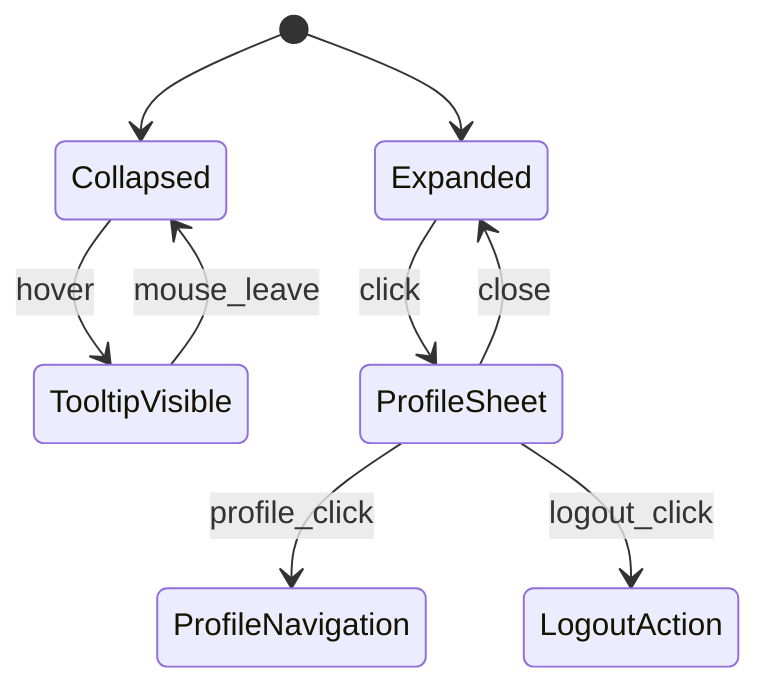
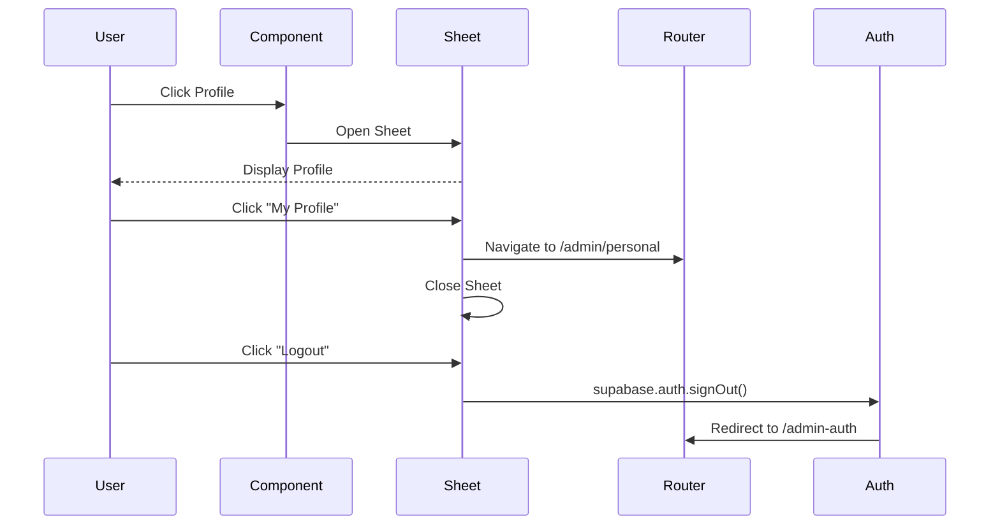

# User Profile Section Customization Design

## Overview

This design document outlines the standardization and enhancement of user profile sections across the admin interface. The goal is to create consistent profile components that appear in both the top-right header and bottom sidebar areas, providing unified user experience and functionality.

## Technology Stack & Dependencies

- **Frontend Framework**: React 18 with TypeScript
- **UI Components**: shadcn-ui built on Radix UI primitives
- **Styling**: Tailwind CSS with utility-first approach
- **Interaction Components**: SheetNoOverlay for profile dialogs
- **Icons**: Lucide React icon library
- **State Management**: React hooks and context providers
- **Routing**: React Router DOM for navigation

## Component Architecture

### Current State Analysis

The admin interface currently has two separate profile implementations:

1. **Header Profile Section** (AdminLayout.tsx lines 85-134)
   - Located in top-right header area
   - Uses SheetNoOverlay with right-side slide-out
   - Displays user avatar, name, and role
   - Contains profile navigation and logout functionality

2. **Sidebar Profile Section** (user-profile-section.tsx)
   - Located at bottom of sidebar
   - Uses SheetNoOverlay with left-side slide-out
   - Has collapsed/expanded states for responsive design
   - Separate logout button when collapsed

### Unified Component Design

```mermaid
graph TB
    A[UserProfileTrigger] --> B[Profile Display Button]
    B --> C[Avatar Component]
    B --> D[User Info Display]
    
    A --> E[SheetNoOverlay]
    E --> F[Profile Content]
    F --> G[User Details Section]
    F --> H[Navigation Options]
    F --> I[Logout Action]
    
    J[Props Interface] --> K[userProfile Object]
    J --> L[positioning: 'header' | 'sidebar']
    J --> M[collapsed state]
    J --> N[callback functions]
```

### Component Hierarchy

- **ProfileTriggerSection**
  - **Avatar** (8x8 for compact, 12x12 for detailed view)
  - **UserInfoDisplay** (name, role, responsive visibility)
  - **SheetNoOverlay**
    - **ProfileHeader** (title with i18n support)
    - **UserDetailsSection** (avatar, name, role, email)
    - **NavigationSection** (profile settings button)
    - **LogoutSection** (logout button with emerald theme)

## Styling Strategy

### Design Tokens

- **Primary Color**: Emerald (#10b981)
- **Hover States**: emerald-50 background, emerald-600 text
- **Border Styling**: border-l for visual separation
- **Spacing**: Consistent padding (pl-2, pr-3, py-1)
- **Border Radius**: rounded-lg for modern appearance

### Responsive Design

| Breakpoint | Header Profile | Sidebar Profile |
|------------|----------------|-----------------|
| Mobile (sm) | Avatar only | Collapsed with tooltip |
| Tablet (md) | Avatar + Name | Expanded with full info |
| Desktop (lg+) | Full display | Full display |

### Visual States



## Data Flow Between Layers

### User Profile Data Structure

```typescript
interface UserProfile {
  id: string;
  email: string;
  name: string;
  role: string;
  avatarUrl: string;
}
```

### State Management Pattern

1. **Data Loading**: AdminLayout loads user profile from Supabase
2. **Prop Passing**: Profile data passed to both header and sidebar sections
3. **Event Handling**: Consistent callback functions for navigation and logout
4. **State Synchronization**: Shared profile state across components

### API Integration Layer

- **Profile Loading**: `supabase.auth.getUser()` + `profiles` table query
- **Avatar Source**: Supabase Storage or fallback to placeholder
- **Session Management**: `supabase.auth.signOut()` for logout
- **Error Handling**: Graceful fallbacks for missing profile data

## Business Logic Layer

### Profile Section Architecture

#### Header Profile Section
- **Purpose**: Quick access to profile options in top navigation
- **Behavior**: Right-side sheet overlay for profile details
- **Responsive**: Hidden text on small screens, full display on larger screens
- **Integration**: Part of main header layout

#### Sidebar Profile Section  
- **Purpose**: Persistent profile access in navigation sidebar
- **Behavior**: Left-side sheet overlay, adapts to sidebar collapse state
- **Responsive**: Icon-only when collapsed, full display when expanded
- **Integration**: Bottom section of sidebar with separator

### Interaction Patterns

| Action | Header Profile | Sidebar Profile | Shared Behavior |
|--------|----------------|-----------------|-----------------|
| Click Trigger | Opens right sheet | Opens left sheet | Same profile content |
| Profile Navigation | → /admin/personal | → /admin/personal | Navigate and close |
| Logout Action | Sign out → /admin-auth | Sign out → /admin-auth | Clear session |
| Close Sheet | X button or outside click | X button or outside click | Consistent UX |

### Event Flow Architecture



## Testing Strategy

### Component Testing Requirements

1. **Profile Display Tests**
   - Verify correct user information rendering
   - Test responsive visibility states
   - Validate avatar fallback behavior

2. **Interaction Tests**
   - Sheet opening/closing functionality
   - Navigation to profile page
   - Logout process verification

3. **Integration Tests**
   - Profile data loading from Supabase
   - Consistent behavior between header and sidebar
   - Error handling for missing data

### Test Cases

| Test Scenario | Expected Behavior |
|---------------|-------------------|
| Profile data loaded | Display name, role, email correctly |
| No avatar URL | Show fallback avatar with initials |
| Small screen | Header shows avatar only |
| Large screen | Both sections show full info |
| Profile click | Navigate to /admin/personal |
| Logout click | Sign out and redirect |
| Sheet interactions | Open/close properly |

## Implementation Requirements

### Component Standardization

1. **Unified ProfileTrigger Component**
   - Accept `position: 'header' | 'sidebar'` prop
   - Handle responsive states based on position
   - Consistent styling with position-specific adjustments

2. **Shared Profile Sheet Content**
   - Same user details layout
   - Identical navigation options
   - Consistent logout functionality
   - Direction-agnostic (left/right slide)

3. **Props Interface Alignment**

```typescript
interface ProfileSectionProps {
  userProfile?: UserProfile;
  position: 'header' | 'sidebar';
  collapsed?: boolean;
  onNavigate: (path: string) => void;
  onLogout: () => void;
}
```

### Migration Strategy

1. **Phase 1**: Extract common profile content into shared component
2. **Phase 2**: Update AdminLayout to use standardized component  
3. **Phase 3**: Update sidebar UserProfileSection to use shared logic
4. **Phase 4**: Remove duplicate profile sheet implementations
5. **Phase 5**: Verify consistent behavior and styling

### File Structure Changes

```
src/components/ui/
├── user-profile-section.tsx (enhanced)
├── profile-trigger.tsx (new shared component)
└── profile-sheet-content.tsx (new shared content)

src/components/
└── AdminLayout.tsx (updated to use shared components)
```