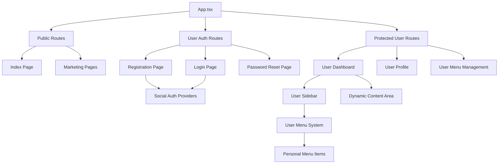
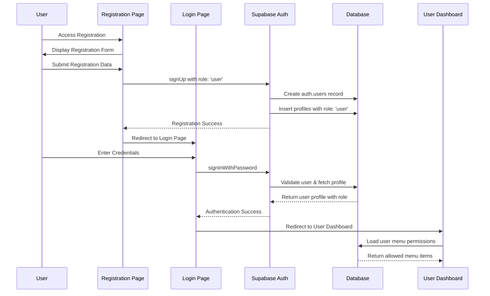
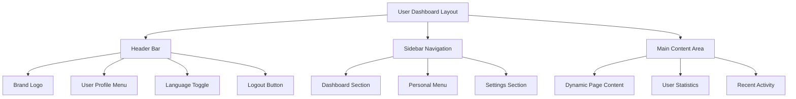

# User Registration and Login Flow Design

## Overview

This design document outlines a comprehensive user registration and authentication system with separate pages for registration, login, and password recovery. The system includes social authentication options (Google and Facebook), proper role management, and a dedicated user dashboard with menu management capabilities similar to the admin interface.

## Current System Analysis

### Database Schema Status
- **User Roles**: The database already supports three roles: `admin`, `manager`, and `user`
- **Issue**: Registration process may not be properly assigning the "user" role
- **Menu System**: Existing menu infrastructure supports user-specific permissions via `user_permissions` table
- **Profile Management**: `profiles` table properly configured for user data storage

### Existing Implementation Issues
1. User role assignment during registration needs verification
2. Current `UserAuth.tsx` combines all auth flows in tabs - needs separation
3. Social authentication buttons are disabled
4. User dashboard exists but lacks comprehensive menu management
5. Missing dedicated password reset page

## Architecture Design

### Component Structure



### Authentication Flow



## Page Design Specifications

### 1. Registration Page (`/register`)

#### Layout Structure
- **Left Panel**: Marketing content with brand identity
- **Right Panel**: Registration form with social auth options
- **Design**: Consistent with existing admin auth styling using emerald color scheme

#### Form Fields
```typescript
interface RegistrationForm {
  name: string           // Full name (required)
  email: string         // Email address (required, validated)
  password: string      // Password (required, min 8 chars)
  confirmPassword: string // Password confirmation (required, must match)
  acceptTerms: boolean  // Terms acceptance checkbox (required)
}
```

#### Social Authentication
- **Google Sign-up**: OAuth integration with Google provider
- **Facebook Sign-up**: OAuth integration with Facebook provider
- **Fallback**: Email/password registration if social auth fails

#### Validation Rules
- Email: Valid format, unique in system
- Password: Minimum 8 characters, contain uppercase, lowercase, number
- Name: Minimum 2 characters, no special characters
- Terms: Must be accepted to proceed

### 2. Login Page (`/login`)

#### Layout Structure
- **Left Panel**: Marketing content (same as registration)
- **Right Panel**: Login form with social auth options
- **Links**: Registration link, password reset link

#### Form Fields
```typescript
interface LoginForm {
  email: string     // Email address (required)
  password: string  // Password (required)
  rememberMe: boolean // Remember login session (optional)
}
```

#### Social Authentication
- **Google Sign-in**: OAuth integration
- **Facebook Sign-in**: OAuth integration
- **Role Validation**: Redirect admin/manager users to admin interface

### 3. Password Reset Page (`/reset-password`)

#### Layout Structure
- **Left Panel**: Simplified marketing content
- **Right Panel**: Password reset form

#### Process Flow
1. **Email Input**: User enters email address
2. **Email Sent**: System sends reset link via Supabase Auth
3. **Confirmation**: Display success message with instructions
4. **Token Validation**: Validate reset token from email link
5. **Password Update**: Allow user to set new password

### 4. User Dashboard Design

#### Layout Components



#### Sidebar Structure
- **Dashboard Section**: Home, Overview, Quick Stats
- **Personal Menu**: User-specific menu items with CRUD operations
- **Settings Section**: Profile, Preferences, Security

#### Menu Management System
- **View Permissions**: Users can view their assigned menu items
- **Personal Menu**: Users can create/edit/delete their own menu items
- **Menu Types**: Support for content, form, dashboard, list, and custom page types
- **Menu Structure**: Hierarchical menu with parent-child relationships (max 2 levels)

## Technical Implementation

### Database Schema Updates

#### Profiles Table Enhancement
```sql
-- Ensure user role exists and is default for regular users
ALTER TYPE public.user_role ADD VALUE IF NOT EXISTS 'user';

-- Update default role for new users
ALTER TABLE public.profiles 
ALTER COLUMN role SET DEFAULT 'user';
```

#### User Menu Items Table
```sql
-- Create user-specific menu items table
CREATE TABLE public.user_menu_items (
  id SERIAL PRIMARY KEY,
  user_id UUID NOT NULL REFERENCES public.profiles(id) ON DELETE CASCADE,
  title TEXT NOT NULL,
  path TEXT NOT NULL,
  parent_id INTEGER REFERENCES public.user_menu_items(id) ON DELETE CASCADE,
  order_index INTEGER NOT NULL DEFAULT 0,
  is_active BOOLEAN NOT NULL DEFAULT true,
  page_type TEXT DEFAULT 'content' CHECK (page_type IN ('content', 'form', 'dashboard', 'list', 'custom')),
  content_data JSONB DEFAULT '{}'::jsonb,
  template_name TEXT,
  meta_data JSONB DEFAULT '{}'::jsonb,
  icon_name TEXT,
  description TEXT,
  created_at TIMESTAMP WITH TIME ZONE NOT NULL DEFAULT now(),
  updated_at TIMESTAMP WITH TIME ZONE NOT NULL DEFAULT now(),
  UNIQUE(user_id, path)
);

-- Add indexes for performance
CREATE INDEX idx_user_menu_items_user_id ON public.user_menu_items(user_id);
CREATE INDEX idx_user_menu_items_parent_id ON public.user_menu_items(parent_id);
CREATE INDEX idx_user_menu_items_order ON public.user_menu_items(user_id, parent_id, order_index);

-- Add RLS policies
ALTER TABLE public.user_menu_items ENABLE ROW LEVEL SECURITY;

CREATE POLICY "Users can manage their own menu items" ON public.user_menu_items
  FOR ALL TO authenticated
  USING (auth.uid() = user_id);

CREATE POLICY "Admins can view all user menu items" ON public.user_menu_items
  FOR SELECT TO authenticated
  USING (
    EXISTS (
      SELECT 1 FROM public.profiles 
      WHERE id = auth.uid() AND role = 'admin'
    )
  );
```

### Authentication Service Updates

#### Enhanced User Auth Service
```typescript
export class UserAuthService {
  // Update registration to ensure proper role assignment
  static async register(data: RegistrationData): Promise<AuthResponse> {
    try {
      const { data: authData, error: signUpError } = await supabase.auth.signUp({
        email: data.email,
        password: data.password,
        options: {
          data: {
            name: data.name,
            role: 'user' // Explicitly set role
          }
        }
      });

      if (signUpError) throw signUpError;

      if (authData.user && authData.session) {
        // Ensure profile is created with correct role
        const { error: profileError } = await supabase
          .from('profiles')
          .upsert({
            id: authData.user.id,
            email: data.email,
            name: data.name,
            role: 'user',
            status: 'active'
          });

        if (profileError) throw profileError;

        return {
          user: await this.getUserProfile(authData.user.id),
          session: authData.session,
          error: null
        };
      }
    } catch (error) {
      return this.handleAuthError(error);
    }
  }

  // Social authentication methods
  static async signInWithGoogle(): Promise<AuthResponse> {
    try {
      const { data, error } = await supabase.auth.signInWithOAuth({
        provider: 'google',
        options: {
          redirectTo: `${window.location.origin}/auth/callback`
        }
      });

      if (error) throw error;
      return { user: null, session: null, error: null };
    } catch (error) {
      return this.handleAuthError(error);
    }
  }

  static async signInWithFacebook(): Promise<AuthResponse> {
    try {
      const { data, error } = await supabase.auth.signInWithOAuth({
        provider: 'facebook',
        options: {
          redirectTo: `${window.location.origin}/auth/callback`
        }
      });

      if (error) throw error;
      return { user: null, session: null, error: null };
    } catch (error) {
      return this.handleAuthError(error);
    }
  }
}
```

### Component Implementation

#### Separate Page Components

##### Registration Page
```typescript
// /src/pages/Register.tsx
import { useState } from "react";
import { useNavigate } from "react-router-dom";
import { UserAuthService } from "@/lib/user-auth-service";
// ... component implementation with social auth buttons

const Register = () => {
  const [loading, setLoading] = useState(false);
  
  const handleGoogleSignUp = async () => {
    setLoading(true);
    try {
      await UserAuthService.signInWithGoogle();
    } catch (error) {
      // Handle error
    } finally {
      setLoading(false);
    }
  };

  const handleFacebookSignUp = async () => {
    setLoading(true);
    try {
      await UserAuthService.signInWithFacebook();
    } catch (error) {
      // Handle error
    } finally {
      setLoading(false);
    }
  };

  // Registration form implementation
  return (
    <div className="min-h-screen flex">
      {/* Marketing Panel */}
      <div className="hidden md:flex flex-col justify-center px-10 bg-emerald-50">
        {/* Brand and marketing content */}
      </div>
      
      {/* Registration Form Panel */}
      <div className="flex items-center justify-center p-6">
        <Card className="w-full max-w-md">
          {/* Social Auth Buttons */}
          <div className="space-y-2">
            <Button 
              variant="outline" 
              className="w-full" 
              onClick={handleGoogleSignUp}
              disabled={loading}
            >
              <Chrome className="h-4 w-4 mr-2" />
              Sign up with Google
            </Button>
            <Button 
              variant="outline" 
              className="w-full" 
              onClick={handleFacebookSignUp}
              disabled={loading}
            >
              <Facebook className="h-4 w-4 mr-2" />
              Sign up with Facebook
            </Button>
          </div>
          
          {/* Email Registration Form */}
          {/* ... form implementation */}
        </Card>
      </div>
    </div>
  );
};
```

#### User Dashboard with Menu Management

##### User Layout Component
```typescript
// /src/components/UserLayout.tsx
import { useState, useEffect } from "react";
import { UserSidebar } from "./UserSidebar";
import { UserHeader } from "./UserHeader";

const UserLayout = () => {
  const [menuItems, setMenuItems] = useState([]);
  const [sidebarCollapsed, setSidebarCollapsed] = useState(false);

  // Load user menu items
  useEffect(() => {
    loadUserMenuItems();
  }, []);

  const loadUserMenuItems = async () => {
    try {
      const { data } = await supabase
        .from('user_menu_items')
        .select('*')
        .eq('user_id', user.id)
        .eq('is_active', true)
        .order('order_index');
      
      setMenuItems(data || []);
    } catch (error) {
      console.error('Failed to load user menu items:', error);
    }
  };

  return (
    <div className="flex h-screen bg-gray-50">
      <UserSidebar 
        menuItems={menuItems}
        collapsed={sidebarCollapsed}
        onToggle={() => setSidebarCollapsed(!sidebarCollapsed)}
        onMenuUpdate={loadUserMenuItems}
      />
      <div className="flex-1 flex flex-col">
        <UserHeader user={user} />
        <main className="flex-1 overflow-auto">
          <Outlet />
        </main>
      </div>
    </div>
  );
};
```

#### User Menu Management

##### Menu CRUD Operations
```typescript
// /src/lib/user-menu-service.ts
export class UserMenuService {
  static async createMenuItem(userId: string, menuData: UserMenuItemData) {
    const { data, error } = await supabase
      .from('user_menu_items')
      .insert({
        user_id: userId,
        ...menuData
      })
      .select()
      .single();

    if (error) throw error;
    return data;
  }

  static async updateMenuItem(itemId: number, menuData: Partial<UserMenuItemData>) {
    const { data, error } = await supabase
      .from('user_menu_items')
      .update(menuData)
      .eq('id', itemId)
      .select()
      .single();

    if (error) throw error;
    return data;
  }

  static async deleteMenuItem(itemId: number) {
    const { error } = await supabase
      .from('user_menu_items')
      .delete()
      .eq('id', itemId);

    if (error) throw error;
  }

  static async reorderMenuItems(userId: string, reorderedItems: Array<{id: number, order_index: number}>) {
    const updates = reorderedItems.map(item => 
      supabase
        .from('user_menu_items')
        .update({ order_index: item.order_index })
        .eq('id', item.id)
        .eq('user_id', userId)
    );

    await Promise.all(updates);
  }
}
```

## Security Considerations

### Authentication Security
- **Email Verification**: Require email verification for new registrations
- **Password Policies**: Enforce strong password requirements
- **Rate Limiting**: Implement rate limiting on auth endpoints
- **Session Management**: Secure session handling with proper token rotation

### Authorization Security
- **Role-Based Access**: Strict role validation in authentication flow
- **Menu Isolation**: Users can only access their own menu items
- **RLS Policies**: Row-level security for all user data access
- **Input Validation**: Comprehensive validation on all user inputs

### Social Authentication Security
- **Provider Verification**: Validate OAuth tokens from social providers
- **Profile Data**: Sanitize and validate social profile data
- **Fallback Handling**: Graceful fallback to email auth if social auth fails

## User Experience Flow

### Registration Journey
1. **Landing**: User accesses `/register` page
2. **Social Auth**: Option to register with Google/Facebook
3. **Form Registration**: Alternative email/password registration
4. **Verification**: Email verification if required
5. **Welcome**: Automatic redirect to login page with success message
6. **First Login**: Guided tour of user dashboard features

### Login Journey
1. **Access**: User visits `/login` page
2. **Authentication**: Social or email/password login
3. **Role Check**: Validate user role and redirect appropriately
4. **Dashboard**: Load user dashboard with personalized menu
5. **Session**: Maintain secure session with proper timeout

### Password Recovery Journey
1. **Request**: User accesses `/reset-password` page
2. **Email Input**: Enter email address for reset
3. **Email Sent**: Receive reset link via email
4. **Token Validation**: Validate reset token from email
5. **New Password**: Set new password with confirmation
6. **Completion**: Redirect to login with success message

## Testing Strategy

### Unit Testing
- **Authentication Service**: Test all auth methods with mock data
- **Form Validation**: Test all validation rules and error states
- **Menu Operations**: Test CRUD operations for user menu items
- **Role Management**: Test role assignment and validation

### Integration Testing
- **Auth Flow**: End-to-end registration and login flows
- **Social Auth**: Test OAuth integration with provider sandboxes
- **Dashboard**: Test dashboard loading and menu rendering
- **Security**: Test RLS policies and unauthorized access attempts

### User Acceptance Testing
- **Registration Process**: Complete user registration journey
- **Login Variations**: Test different login methods
- **Menu Management**: Test user menu creation and organization
- **Responsive Design**: Test on various device sizes