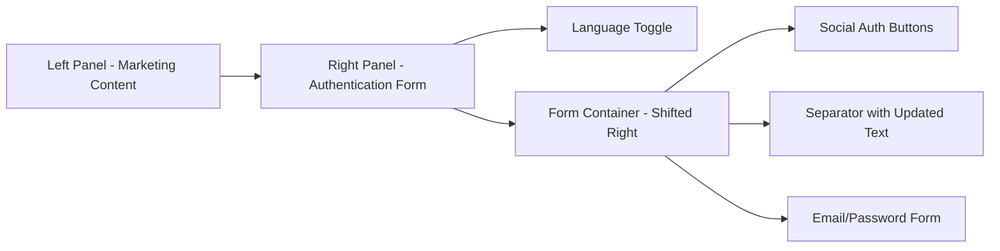

# User Registration and Authentication Pages Design

## Overview

This design outlines the implementation of three separate authentication pages for the MarketGrow application:
- User Registration page (`/user-register`)
- User Login page (`/user-auth`) 
- Password Recovery page (`/user-forgot-password`)

Each page will feature Google and Facebook OAuth buttons with placeholder functionality, proper form positioning, updated text labels, and direct Supabase authentication API integration.

## Repository Type Detection

Based on the codebase analysis, this is a **Full-Stack Application** built with React frontend and Supabase backend, featuring:
- React 18 with TypeScript
- Supabase authentication and database
- Tailwind CSS with shadcn/ui components
- Multi-language support (English/Ukrainian)
- Role-based access control

## Architecture

### Component Structure

```mermaid
graph TD
    A[App.tsx] --> B[BrowserRouter Routes]
    B --> C[/user-register - UserRegister]
    B --> D[/user-auth - UserAuth] 
    B --> E[/user-forgot-password - UserForgotPassword]
    
    C --> F[RegistrationForm]
    C --> G[SocialAuthButtons]
    D --> H[LoginForm]
    D --> I[SocialAuthButtons]
    E --> J[PasswordResetForm]
    
    F --> K[UserAuthService.register]
    H --> L[UserAuthService.login]
    J --> M[UserAuthService.resetPassword]
    
    K --> N[Supabase Auth API]
    L --> N
    M --> N
```

### Page Layout Architecture

Each authentication page follows a consistent layout pattern:



## Technology Stack & Dependencies

### Core Technologies
- **React 18**: Component-based UI framework
- **TypeScript**: Type safety and development experience
- **React Router**: Client-side routing
- **Tailwind CSS + shadcn/ui**: Styling and component library
- **Supabase**: Authentication and backend services
- **React Hook Form + Zod**: Form handling and validation

### Authentication Libraries
- **@supabase/supabase-js**: Supabase client integration
- **@hookform/resolvers**: Form validation resolvers
- **zod**: Schema validation
- **sonner**: Toast notifications

### Icons and UI
- **lucide-react**: Icon library (Chrome, Facebook icons)
- **shadcn/ui components**: Card, Input, Button, Label, Separator

## Page Specifications

### 1. User Registration Page (`/user-register`)

#### Component Structure
```
UserRegister.tsx
├── Language Toggle (Top Right)
├── Left Panel (Marketing Content)
└── Right Panel (Registration Form)
    ├── Social Auth Buttons
    │   ├── Google Button (Chrome icon + placeholder)
    │   └── Facebook Button (Facebook icon + placeholder)
    ├── Separator ("or sign in with")
    └── Registration Form
        ├── Full Name Field
        ├── Email Field
        ├── Password Field
        ├── Confirm Password Field
        ├── Terms Acceptance
        └── Submit Button
```

#### Form Validation Schema
- **Name**: Required, minimum 2 characters
- **Email**: Valid email format, required
- **Password**: Minimum 8 characters, required
- **Confirm Password**: Must match password
- **Terms**: Must be accepted

#### Social Authentication
- **Google Button**: Chrome icon + "Sign up with Google" text
- **Facebook Button**: Facebook icon + "Sign up with Facebook" text
- **Behavior**: Display toast notification "Social authentication is disabled"

### 2. User Login Page (`/user-auth`)

#### Component Structure
```
UserAuth.tsx
├── Language Toggle (Top Right)
├── Left Panel (Marketing Content)
└── Right Panel (Login Form)
    ├── Social Auth Buttons
    │   ├── Google Button (Chrome icon + placeholder)
    │   └── Facebook Button (Facebook icon + placeholder)
    ├── Separator ("or sign in with")
    └── Login Form
        ├── Email Field
        ├── Password Field
        ├── Submit Button
        └── Navigation Links
            ├── Link to Registration
            └── Link to Password Recovery
```

#### Authentication API Integration
```typescript
// Direct Supabase API call configuration
const SUPABASE_AUTH_URL = "https://ehznqzaumsnjkrntaiox.supabase.co/auth/v1/token"
const API_KEY = "eyJhbGciOiJIUzI1NiIsInR5cCI6IkpXVCJ9..."

// Login request payload
{
  grant_type: "password",
  email: userEmail,
  password: userPassword
}
```

#### Form Validation Schema
- **Email**: Valid email format, required
- **Password**: Required, minimum 8 characters

### 3. Password Recovery Page (`/user-forgot-password`)

#### Component Structure
```
UserForgotPassword.tsx
├── Language Toggle (Top Right)
├── Left Panel (Marketing Content)
└── Right Panel (Password Reset Form)
    ├── Email Field
    ├── Submit Button
    └── Navigation Links
        └── Back to Login Link
```

#### Form Validation Schema
- **Email**: Valid email format, required

#### Reset Flow
1. User enters email address
2. System sends password reset email via Supabase
3. Success message displayed
4. User receives email with reset link
5. Redirect to password update page

## Internationalization (i18n)

### Text Labels Update

#### Current Label Changes
- **Replace**: "Or continue with email" 
- **With**: "or sign in with"

#### Language Variants
```typescript
// English
"or_sign_in_with": "or sign in with"
"google_signup": "Sign up with Google"
"facebook_signup": "Sign up with Facebook" 
"google_signin": "Sign in with Google"
"facebook_signin": "Sign in with Facebook"

// Ukrainian  
"or_sign_in_with": "або увійдіть за допомогою"
"google_signup": "Зареєструватися через Google"
"facebook_signup": "Зареєструватися через Facebook"
"google_signin": "Увійти через Google" 
"facebook_signin": "Увійти через Facebook"
```

### Language Toggle
- Positioned in top-right corner of each page
- Switches between English (EN) and Ukrainian (UA)
- Persists language selection across pages

## Form Positioning & Styling

### Layout Adjustments

#### Form Container Positioning
```css
/* Current positioning */
.form-container {
  display: flex;
  justify-content: center;
}

/* Updated positioning - shifted right */
.form-container {
  display: flex;
  justify-content: flex-start;
  padding-left: 2rem; /* Shift forms right */
}

/* Responsive adjustments */
@media (max-width: 768px) {
  .form-container {
    justify-content: center; /* Center on mobile */
    padding-left: 0;
  }
}
```

#### Visual Layout
```
┌─────────────────────────────────────────────────────────┐
│  [Language Toggle - Top Right]                         │
├─────────────────────┬───────────────────────────────────┤
│                     │                                   │
│   Marketing         │     ┌─────────────────────┐       │
│   Content           │     │                     │       │
│   (Left Panel)      │     │  Authentication     │       │
│                     │     │  Form               │       │
│                     │     │  (Shifted Right)    │       │
│                     │     │                     │       │
│                     │     └─────────────────────┘       │
│                     │                                   │
└─────────────────────┴───────────────────────────────────┘
```

## API Integration Details

### Authentication Service Updates

#### Direct API Call Implementation
```typescript
class UserAuthService {
  private static readonly AUTH_URL = "https://ehznqzaumsnjkrntaiox.supabase.co/auth/v1/token";
  private static readonly API_KEY = "eyJhbGciOiJIUzI1NiIsInR5cCI6IkpXVCJ9...";

  static async loginDirect(email: string, password: string) {
    const response = await fetch(`${this.AUTH_URL}?grant_type=password`, {
      method: 'POST',
      headers: {
        'apikey': this.API_KEY,
        'Content-Type': 'application/json'
      },
      body: JSON.stringify({ email, password })
    });
    
    if (!response.ok) {
      throw new Error(`Authentication failed: ${response.status}`);
    }
    
    return await response.json();
  }
}
```

### Error Handling

#### Common Error Scenarios
- **400 Bad Request**: Invalid credentials or malformed request
- **422 Unprocessable Entity**: Validation errors
- **429 Too Many Requests**: Rate limiting
- **500 Internal Server Error**: Server issues

#### Error Message Mapping
```typescript
const errorMessages = {
  400: { 
    en: "Invalid email or password", 
    uk: "Неправильний email або пароль" 
  },
  422: { 
    en: "Please check your input", 
    uk: "Перевірте введені дані" 
  },
  429: { 
    en: "Too many attempts. Please try again later", 
    uk: "Забагато спроб. Спробуйте пізніше" 
  }
};
```

## Social Authentication Integration

### OAuth Button Implementation

#### Google Authentication
```typescript
const GoogleAuthButton = ({ disabled = true, text, lang }) => {
  const handleGoogleAuth = () => {
    if (disabled) {
      toast.info(
        lang === 'uk' 
          ? "Авторизація через Google тимчасово недоступна" 
          : "Google authentication is temporarily disabled"
      );
      return;
    }
    // Future OAuth implementation
  };

  return (
    <Button 
      variant="outline" 
      className="w-full" 
      onClick={handleGoogleAuth}
      disabled={disabled}
    >
      <Chrome className="mr-2 h-4 w-4" />
      {text}
    </Button>
  );
};
```

#### Facebook Authentication
```typescript
const FacebookAuthButton = ({ disabled = true, text, lang }) => {
  const handleFacebookAuth = () => {
    if (disabled) {
      toast.info(
        lang === 'uk'
          ? "Авторизація через Facebook тимчасово недоступна"
          : "Facebook authentication is temporarily disabled"
      );
      return;
    }
    // Future OAuth implementation
  };

  return (
    <Button 
      variant="outline" 
      className="w-full" 
      onClick={handleFacebookAuth}
      disabled={disabled}
    >
      <Facebook className="mr-2 h-4 w-4" />
      {text}
    </Button>
  );
};
```

## Routing Configuration

### Route Updates in App.tsx
```typescript
// Add new routes to the routing configuration
<Routes>
  <Route path="/" element={<Index />} />
  
  {/* Separate Authentication Routes */}
  <Route path="/user-register" element={<UserRegister />} />
  <Route path="/user-auth" element={<UserAuth />} />
  <Route path="/user-forgot-password" element={<UserForgotPassword />} />
  
  {/* Existing routes... */}
  <Route path="/admin-auth" element={<AdminAuth />} />
  <Route path="/admin" element={<AdminProtected />}>
    <Route path="*" element={<AdminLayout />} />
  </Route>
  
  <Route path="/user" element={<UserProtected />}>
    <Route path="*" element={<UserLayout />} />
  </Route>
  
  <Route path="*" element={<NotFound />} />
</Routes>
```

### Navigation Flow
```mermaid
flowchart TD
    A[Landing Page] --> B{User Intent}
    B -->|Register| C[/user-register]
    B -->|Login| D[/user-auth]
    B -->|Forgot Password| E[/user-forgot-password]
    
    C -->|Success| F[/user/dashboard]
    C -->|Has Account| D
    
    D -->|Success| F
    D -->|No Account| C
    D -->|Forgot Password| E
    
    E -->|Email Sent| G[Check Email]
    E -->|Back to Login| D
    
    F --> H[User Dashboard]
```

## Testing Strategy

### Unit Testing Requirements

#### Form Validation Tests
- Test required field validation
- Test email format validation  
- Test password strength requirements
- Test password confirmation matching
- Test terms acceptance requirement

#### Authentication Flow Tests
- Test successful registration
- Test successful login
- Test password reset request
- Test error handling for various scenarios
- Test language switching
- Test social auth placeholder behavior

#### Responsive Design Tests
- Test mobile layout adaptation
- Test form positioning on different screen sizes
- Test touch interactions on mobile devices

### Integration Testing

#### API Integration Tests
- Test direct Supabase API authentication
- Test error response handling
- Test token management
- Test session persistence

#### Navigation Tests
- Test route transitions between auth pages
- Test redirect after successful authentication
- Test protected route access control

## Implementation Checklist

### Page Creation
- [ ] Create `UserRegister.tsx` component
- [ ] Create `UserAuth.tsx` component  
- [ ] Create `UserForgotPassword.tsx` component

### Routing Setup
- [ ] Add routes to `App.tsx`
- [ ] Update navigation links
- [ ] Test route accessibility

### Form Implementation
- [ ] Implement registration form with validation
- [ ] Implement login form with validation
- [ ] Implement password reset form with validation
- [ ] Add form positioning styles (shift right)

### Social Authentication
- [ ] Add Google OAuth button with placeholder
- [ ] Add Facebook OAuth button with placeholder
- [ ] Implement toast notifications for disabled state

### Internationalization
- [ ] Update text labels ("or sign in with")
- [ ] Add Ukrainian translations
- [ ] Test language switching

### API Integration
- [ ] Implement direct Supabase API calls
- [ ] Add error handling and mapping
- [ ] Test authentication flow

### Styling & UX
- [ ] Apply consistent styling across pages
- [ ] Implement responsive design
- [ ] Test mobile compatibility
- [ ] Verify accessibility standards