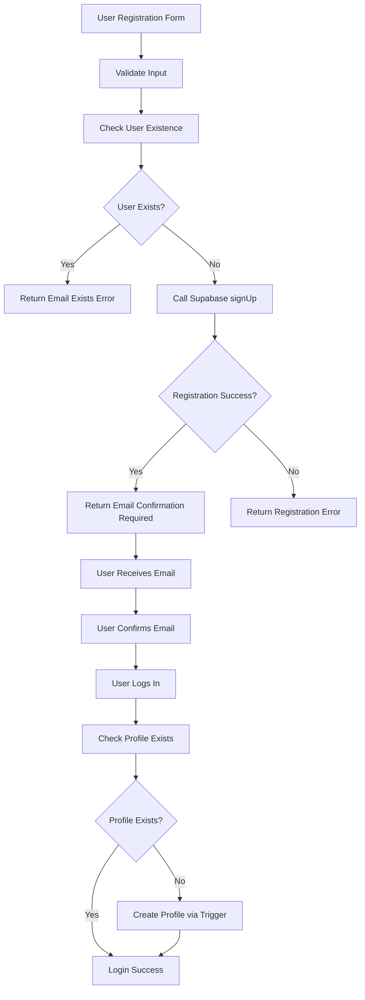

# User Registration Fix Design Document

## 1. Overview

This document outlines the design for fixing user registration issues in the `/user-register` page. The current implementation has several problems that prevent proper user registration, including incorrect profile creation timing, improper error handling, and conflicts with database triggers.

### Current Issues:
1. Profile is created immediately after registration, which conflicts with the email confirmation flow
2. Database triggers already handle profile creation, causing duplicate attempts
3. Error handling is inconsistent and doesn't properly differentiate between registration states
4. Session management during registration is not properly handled
5. User existence checking is inefficient and can cause false positives

## 2. Architecture

The registration flow will follow Supabase best practices:
1. User submits registration form
2. System validates input and checks for existing users
3. Supabase `auth.signUp()` is called to create the auth user
4. Email confirmation is required before profile creation
5. Profile is created during the first login after email confirmation
6. Database triggers handle profile creation to ensure consistency



## 3. Component Architecture

### 3.1 UserRegister Component
The registration page component will be simplified to focus only on form handling and UI presentation.

#### Props/State Management:
- `loading`: Boolean state to track registration process
- `formData`: Object containing name, email, password, confirmPassword
- `errors`: Object containing validation errors

#### Lifecycle Methods/Hooks:
- `useForm` for form validation
- `useState` for loading state
- `useNavigate` for navigation
- `useI18n` for internationalization

### 3.2 UserAuthService
The authentication service will be refactored to properly handle the registration flow.

#### Methods:
- `register(data: RegistrationData)`: Handles user registration with proper flow
- `login(data: LoginData)`: Handles user login with profile creation
- `handleOAuthCallback()`: Handles OAuth callback with profile creation

## 4. Data Models

### 4.1 RegistrationData
```typescript
interface RegistrationData {
  name: string;
  email: string;
  password: string;
  confirmPassword: string;
  acceptTerms: boolean;
}
```

### 4.2 UserProfile
```typescript
interface UserProfile {
  id: string;
  email: string;
  name: string;
  phone?: string;
  role: 'admin' | 'manager' | 'user';
  status: 'active' | 'inactive';
  avatar_url?: string;
  created_at: string;
  updated_at: string;
}
```

### 4.3 AuthResponse
```typescript
interface AuthResponse {
  user: UserProfile | null;
  session: any | null;
  error: string | null;
}
```

## 5. Business Logic Layer

### 5.1 Registration Flow
1. **Validation**: Validate form data using Zod schema
2. **Existence Check**: Check if user already exists via profile lookup
3. **Auth Registration**: Call Supabase `signUp` method
4. **Email Confirmation**: Return appropriate status for email confirmation
5. **Profile Creation**: Handled by database triggers during login

### 5.2 Error Handling
- `EMAIL_EXISTS`: When user already exists
- `EMAIL_CONFIRMATION_REQUIRED`: When registration succeeds but email confirmation is needed
- `REGISTRATION_FAILED`: For general registration failures
- `NETWORK_ERROR`: For connectivity issues
- `WEAK_PASSWORD`: For password policy violations

### 5.3 Profile Creation Flow
1. **Trigger-Based Creation**: Database trigger `handle_new_user()` creates profile
2. **Login-Based Creation**: If trigger fails, profile created during login
3. **Validation**: Ensure profile has all required fields

## 6. Implementation Details

### 6.1 User Registration Service Changes

The `UserAuthService.register()` method will be refactored to:

1. **Remove Immediate Profile Creation**: Eliminate the immediate profile creation that conflicts with database triggers
2. **Implement Proper Email Confirmation Flow**: Return `EMAIL_CONFIRMATION_REQUIRED` status for all successful registrations
3. **Fix User Existence Checking**: Use only profile-based checking instead of unreliable auth checking
4. **Improve Error Handling**: Provide clearer error messages and status codes

### 6.2 Database Trigger Integration

The `handle_new_user()` database trigger will:

1. **Automatically Create Profiles**: Create user profiles when auth users are created
2. **Assign Proper Roles**: Assign 'user' role by default for new registrations
3. **Handle Errors Gracefully**: Log errors but not fail user creation
4. **Set Default Values**: Ensure all required fields have appropriate defaults

### 6.3 Profile Service Updates

The `ProfileService` will be updated to:

1. **Simplify Profile Creation**: Remove redundant retry logic that conflicts with triggers
2. **Improve Error Handling**: Better differentiate between different error types
3. **Optimize Caching**: Improve cache invalidation for user existence checks

## 7. API Integration Layer

### 7.1 Supabase Auth Integration
```typescript
// Registration call
const { data, error } = await supabase.auth.signUp({
  email: data.email,
  password: data.password,
  options: {
    emailRedirectTo: `${window.location.origin}/auth/callback`,
    data: {
      name: data.name
    }
  }
});

// Profile creation (handled by trigger)
// INSERT INTO public.profiles triggered by handle_new_user() function
```

### 7.2 Profile Service Integration
```typescript
// Profile lookup during registration
const existingProfile = await ProfileService.getProfileByEmail(data.email);

// Profile creation during login (fallback)
const profile = await ProfileService.createProfileWithAuth({
  id: session.user.id,
  email: data.email,
  name: session.user.user_metadata?.name || session.user.email || 'User'
}, session.access_token);
```

## 8. Specific Fixes Implementation

### 8.1 User Registration Service Fixes

The `UserAuthService.register()` method will be refactored with these specific changes:

1. **Remove Immediate Profile Creation**: 
   - Eliminate the code that immediately creates profiles after registration
   - This prevents conflicts with database triggers that automatically create profiles
   - Profile creation will be handled either by database triggers or during first login

2. **Implement Proper Email Confirmation Flow**:
   - Always return `EMAIL_CONFIRMATION_REQUIRED` for successful registrations
   - Never attempt to create sessions immediately after registration
   - Clear user existence cache after successful registration

3. **Fix User Existence Checking**:
   - Use only `ProfileService.getProfileByEmail()` for existence checks
   - Remove unreliable auth-based user checking
   - Implement proper caching to prevent redundant database calls

4. **Improve Error Handling**:
   - Map Supabase errors to specific user-friendly messages
   - Handle network errors gracefully
   - Provide consistent error responses across all registration scenarios

### 8.2 Database Trigger Fixes

The `handle_new_user()` database trigger will be enhanced:

1. **Ensure Proper Profile Creation**:
   - Always create profiles with required fields (id, email, name, role, status)
   - Set default role to 'user' for all new registrations
   - Set default status to 'active'

2. **Improve Error Handling**:
   - Log errors but don't fail the registration process
   - Handle missing metadata gracefully
   - Ensure profile creation even if some data is missing

3. **Fix Role Assignment Logic**:
   - First user gets 'admin' role automatically
   - All other users get 'user' role by default
   - Remove complex role assignment logic that can cause issues

### 8.3 Profile Service Fixes

The `ProfileService` will be updated:

1. **Simplify Profile Creation**:
   - Remove complex retry logic that conflicts with database triggers
   - Focus on verification rather than creation during login
   - Improve caching for better performance

2. **Improve Session Handling**:
   - Ensure proper access tokens are used for database operations
   - Validate sessions before profile operations
   - Handle session refresh automatically

## 9. Monitoring and Logging Improvements

### 9.1 Registration Flow Monitoring

1. **Detailed Logging**:
   - Log each step of the registration process
   - Track user existence checks
   - Monitor profile creation success/failure
   - Log authentication errors with context

2. **Performance Metrics**:
   - Track registration completion times
   - Monitor error rates and types
   - Measure database query performance
   - Track cache hit/miss ratios

3. **Error Tracking**:
   - Log all registration errors with full context
   - Track recurring issues for debugging
   - Monitor authentication failures
   - Track profile creation failures

### 9.2 Debugging Enhancements

1. **Session Validation Logging**:
   - Log session state during registration
   - Track token validity and expiration
   - Monitor refresh token usage
   - Debug RLS policy issues

2. **Database Operation Monitoring**:
   - Log profile creation attempts
   - Track trigger execution success/failure
   - Monitor database query performance
   - Log constraint violations

## 10. Testing Strategy

### 10.1 Unit Tests
- Form validation logic
- User existence checking
- Error handling scenarios
- Profile creation fallback logic

### 10.2 Integration Tests
- Complete registration flow
- Email confirmation workflow
- Login with profile creation
- Duplicate user prevention

### 10.3 Edge Case Tests
- Network failures during registration
- Database trigger failures
- Session timeout scenarios
- Concurrent registration attempts