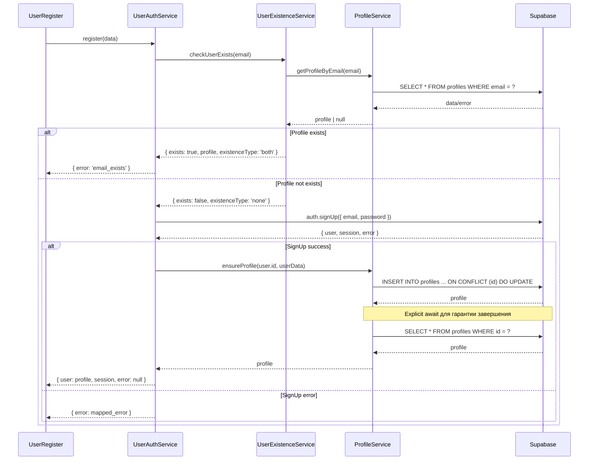

# Исправление логики регистрации пользователя

## Обзор

Данный документ описывает решение проблемы в системе регистрации пользователей, где функция выдаёт ошибку "пользователь уже существует" даже при свободном email, а также периодически возвращает пустые массивы при запросах к профилю. Решение направлено на обеспечение корректной асинхронной обработки и гарантированного создания профиля после регистрации.

## Архитектура системы

### Текущие компоненты

```mermaid
graph TD
    A[UserRegister.tsx] --> B[UserAuthService.register]
    B --> C[UserExistenceService.checkUserExists]
    B --> D[supabase.auth.signUp]
    B --> E[ProfileService.ensureProfile]
    
    C --> F[ProfileService.getProfileByEmail]
    C --> G[checkAuthUserExists]
    
    E --> H[ProfileService.getProfile]
    E --> I[ProfileService.createProfile]
    
    I --> J[ProfileService.upsertProfile]
    J --> K[supabase.from('profiles').upsert]
```

### Проблемы в текущей реализации

1. **Неточная проверка существования пользователя**
   - `checkAuthUserExists` использует неэффективный метод с фиктивным паролем
   - Возможны ложноположительные результаты

2. **Проблемы с асинхронностью**
   - Недостаточное ожидание завершения операций INSERT
   - Отсутствие явных задержек после триггеров

3. **Некорректная обработка пустых результатов**
   - GET запросы могут возвращать пустые массивы вместо объектов
   - Неправильная обработка PGRST116 ошибок

## Исправленная логика регистрации

### Последовательность операций



### Улучшенная функция регистрации

```typescript
// Исправленная логика в UserAuthService.register
static async register(data: RegistrationData): Promise<AuthResponse> {
  try {
    console.log('Starting user registration for:', data.email);
    
    // Шаг 1: Проверка существования через профиль (более надёжно)
    const profile = await ProfileService.getProfileByEmail(data.email);
    
    if (profile) {
      console.log('User profile already exists:', data.email);
      return {
        user: null,
        session: null,
        error: UserAuthError.EMAIL_EXISTS
      };
    }
    
    console.log('User does not exist, proceeding with registration');
    
    // Шаг 2: Регистрация через Supabase Auth
    const { data: authData, error: signUpError } = await supabase.auth.signUp({
      email: data.email,
      password: data.password,
      options: {
        data: {
          name: data.name,
          role: 'user'
        }
      }
    });

    if (signUpError) {
      console.error('Registration signup error:', signUpError);
      return {
        user: null,
        session: null,
        error: UserAuthService.mapSupabaseError(signUpError)
      };
    }

    if (!authData.user) {
      return {
        user: null,
        session: null,
        error: UserAuthError.REGISTRATION_FAILED
      };
    }

    console.log('User created in auth, creating profile...', authData.user.id);
    
    // Шаг 3: Создание профиля с гарантированным ожиданием
    const profileData = {
      id: authData.user.id,
      email: data.email,
      name: data.name,
      role: 'user' as const,
      status: 'active' as const
    };

    // UPSERT с явным конфликт-резолвингом
    const { data: insertedProfile, error: insertError } = await supabase
      .from('profiles')
      .upsert(profileData, { 
        onConflict: 'id',
        ignoreDuplicates: false 
      })
      .select()
      .single(); // Используем single() так как знаем что вставляем один элемент

    if (insertError) {
      console.error('Profile creation failed:', insertError);
      return {
        user: null,
        session: null,
        error: UserAuthError.PROFILE_CREATION_FAILED
      };
    }

    // Шаг 4: Верификация создания профиля
    // Добавляем небольшую задержку для случаев с триггерами
    await new Promise(resolve => setTimeout(resolve, 100));
    
    const { data: verifiedProfile, error: getError } = await supabase
      .from('profiles')
      .select('*')
      .eq('id', authData.user.id)
      .single();

    if (getError || !verifiedProfile) {
      console.error('Profile verification failed:', getError);
      return {
        user: null,
        session: null,
        error: UserAuthError.PROFILE_CREATION_FAILED
      };
    }

    console.log('Profile created and verified successfully');
    
    // Очистка кэша существования для корректных последующих проверок
    UserExistenceService.clearExistenceCache(data.email);
    ProfileCache.set(`profile_${authData.user.id}`, verifiedProfile);
    ProfileCache.set(`profile_email_${data.email.toLowerCase()}`, verifiedProfile);

    if (authData.session) {
      return {
        user: verifiedProfile as UserProfile,
        session: authData.session,
        error: null
      };
    } else {
      // Email confirmation required
      return {
        user: null,
        session: null,
        error: UserAuthError.EMAIL_CONFIRMATION_REQUIRED
      };
    }
  } catch (error) {
    console.error('Registration error:', error);
    return {
      user: null,
      session: null,
      error: UserAuthError.NETWORK_ERROR
    };
  }
}
```

## Исправления в ProfileService

### Улучшенная проверка существования по email

```typescript
static async getProfileByEmail(email: string): Promise<UserProfile | null> {
  try {
    // Проверка кэша
    const cached = ProfileCache.get(`profile_email_${email.toLowerCase()}`);
    if (cached) {
      return cached;
    }

    const { data, error } = await supabase
      .from('profiles')
      .select('*')
      .eq('email', email.toLowerCase())
      .maybeSingle(); // Используем maybeSingle для избежания PGRST116

    if (error) {
      console.error('Error fetching profile by email:', error);
      
      // Обработка PGRST116 ошибок
      if (error.code === 'PGRST116') {
        return null; // Пользователь не найден
      }
      
      throw new ProfileOperationError(ProfileErrorCode.NETWORK_ERROR, error);
    }

    // Кэширование результата
    if (data) {
      ProfileCache.set(`profile_email_${email.toLowerCase()}`, data);
      ProfileCache.set(`profile_${data.id}`, data);
    }

    return data as UserProfile | null;
  } catch (error) {
    console.error('Error in getProfileByEmail:', error);
    throw error;
  }
}
```

### Надёжное создание профиля с UPSERT

```typescript
static async createProfileWithVerification(
  profileData: Partial<UserProfile> & { id: string }
): Promise<UserProfile> {
  try {
    // Валидация данных
    if (!profileData.email || !profileData.name || !profileData.id) {
      throw new Error('Missing required profile fields');
    }

    // UPSERT операция
    const { data: upsertedProfile, error: upsertError } = await supabase
      .from('profiles')
      .upsert(profileData, { 
        onConflict: 'id',
        ignoreDuplicates: false 
      })
      .select()
      .single();

    if (upsertError) {
      console.error('Profile upsert failed:', upsertError);
      throw new ProfileOperationError(ProfileErrorCode.PROFILE_CREATION_FAILED, upsertError);
    }

    // Верификация создания с задержкой для триггеров
    await new Promise(resolve => setTimeout(resolve, 100));
    
    const { data: verifiedProfile, error: verifyError } = await supabase
      .from('profiles')
      .select('*')
      .eq('id', profileData.id)
      .single();

    if (verifyError || !verifiedProfile) {
      console.error('Profile verification failed:', verifyError);
      throw new ProfileOperationError(ProfileErrorCode.PROFILE_CREATION_FAILED, verifyError);
    }

    // Обновление кэша
    ProfileCache.set(`profile_${profileData.id}`, verifiedProfile);
    if (verifiedProfile.email) {
      ProfileCache.set(`profile_email_${verifiedProfile.email.toLowerCase()}`, verifiedProfile);
    }

    return verifiedProfile as UserProfile;
  } catch (error) {
    console.error('Error in createProfileWithVerification:', error);
    throw error;
  }
}
```

## Исправления в UserExistenceService

### Упрощённая проверка существования

```typescript
static async checkUserExists(email: string): Promise<UserExistenceCheck> {
  try {
    if (!this.validateEmailFormat(email)) {
      throw new Error('Invalid email format');
    }

    // Проверка кэша
    const cacheKey = `${this.CACHE_PREFIX}${email.toLowerCase()}`;
    const cached = ProfileCache.get(cacheKey);
    if (cached) {
      return cached;
    }

    // Основная проверка через профиль (более надёжная)
    const profile = await ProfileService.getProfileByEmail(email);
    
    const result: UserExistenceCheck = {
      exists: !!profile,
      profile: profile,
      authUser: !!profile, // Если есть профиль, то есть и auth user
      existenceType: profile ? 'both' : 'none'
    };

    // Кэширование результата
    ProfileCache.set(cacheKey, result);
    
    this.logCheck(email, result.exists, profile ? 'profile_found' : 'not_found');
    return result;
  } catch (error) {
    console.error('Error checking user existence:', error);
    
    // Безопасное значение по умолчанию
    return {
      exists: false,
      profile: null,
      authUser: false,
      existenceType: 'none'
    };
  }
}
```

## Обработка ошибок в UI

### Улучшенная обработка ошибок в UserRegister.tsx

```typescript
const handleRegistration = async (data: RegistrationData) => {
  setLoading(true);
  try {
    const { user, session, error } = await UserAuthService.register(data);
    
    if (error === 'email_exists') {
      toast.error(
        lang === 'uk' 
          ? 'Аккаунт с этой электронной почтой уже существует. Пожалуйста, войдите в систему.'
          : 'An account with this email already exists. Please sign in instead.'
      );
      // Предложение полезного действия
      setTimeout(() => {
        const shouldRedirect = confirm(
          lang === 'uk' 
            ? 'Перейти к странице входа?'
            : 'Go to sign in page?'
        );
        if (shouldRedirect) {
          navigate('/user-auth');
        }
      }, 1000);
      return;
    }
    
    if (error === 'profile_creation_failed') {
      toast.error(
        lang === 'uk'
          ? 'Аккаунт создан, но произошла ошибка настройки профиля. Обратитесь в поддержку.'
          : 'Account created but profile setup failed. Please contact support.'
      );
      return;
    }
    
    // Остальная обработка ошибок...
    
    if (user && session) {
      toast.success(t("registration_success"));
      navigate("/user/dashboard");
    }
  } catch (error) {
    console.error("Registration error:", error);
    toast.error(
      lang === 'uk'
        ? 'Неожиданная ошибка. Попробуйте ещё раз или обратитесь в поддержку.'
        : 'Unexpected error. Please try again or contact support.'
    );
  } finally {
    setLoading(false);
  }
};
```

## Ключевые улучшения

### 1. Надёжная проверка существования
- Использование только проверки профиля через `getProfileByEmail`
- Исключение ненадёжного метода с фиктивным паролем
- Корректная обработка PGRST116 ошибок

### 2. Гарантированная асинхронность
- Все операции используют `await`
- Явные задержки после операций с базой данных
- Верификация создания профиля

### 3. UPSERT вместо INSERT
- Использование `onConflict: 'id'` для предотвращения дублирования
- Надёжная обработка конфликтов

### 4. Улучшенное кэширование
- Очистка кэша после регистрации
- Двойное кэширование по ID и email
- Корректное время жизни кэша

### 5. Верификация операций
- Проверка создания профиля после UPSERT
- Получение профиля после создания
- Логирование всех критических операций

## Тестирование

### Тестовые сценарии

1. **Новый пользователь**
   - Email не существует в системе
   - Успешная регистрация и создание профиля

2. **Существующий пользователь**
   - Email уже существует
   - Корректная ошибка без попытки signup

3. **Частичная регистрация**
   - Auth user создан, но профиль не создался
   - Повторная попытка должна создать профиль

4. **Сетевые ошибки**
   - Обработка таймаутов и сетевых проблем
   - Корректное отображение ошибок пользователю

### Мониторинг

```typescript
// Добавление метрик для мониторинга
static logRegistrationAttempt(email: string, stage: string, success: boolean, error?: any) {
  const maskedEmail = email.replace(/^(.{2}).*(@.*)$/, '$1***$2');
  console.log(`[Registration] ${stage} for ${maskedEmail}: ${success ? 'SUCCESS' : 'FAILED'}`, {
    timestamp: new Date().toISOString(),
    stage,
    success,
    error: error?.message || null
  });
}
```

## Выводы

Данное исправление устраняет основные проблемы регистрации:

1. **Исключает ложные срабатывания** проверки существования пользователя
2. **Гарантирует создание профиля** через UPSERT и верификацию
3. **Обеспечивает корректную асинхронность** всех операций
4. **Улучшает пользовательский опыт** через детальную обработку ошибок
5. **Повышает надёжность** системы регистрации

Реализация следует принципам атомарности операций и обеспечивает консистентность данных между Supabase Auth и таблицей профилей.