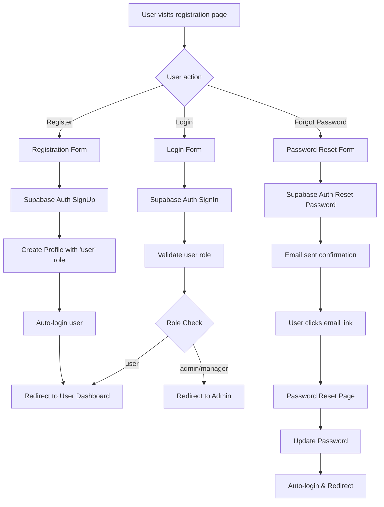
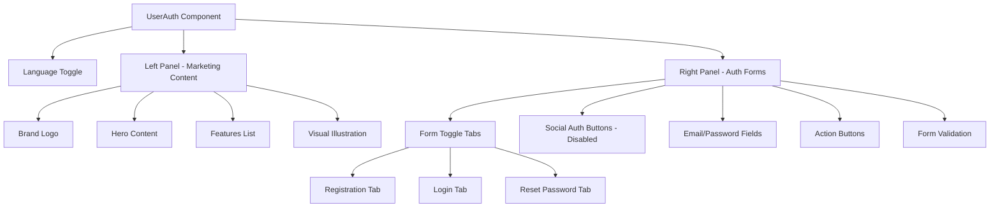
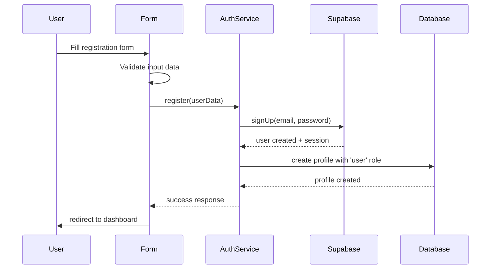
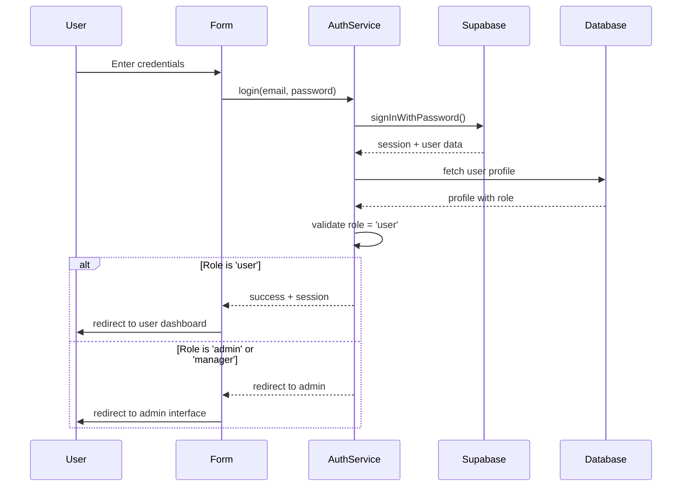

# User Registration Page Design

## Overview

This design document outlines the implementation of a user registration system for the MarketGrow application, including registration, login, and password recovery functionality for end users. The system will mirror the admin authentication interface design but with user-specific role management and simplified feature access.

## Architecture

### Authentication Flow Architecture



### Component Architecture



## Technology Stack & Dependencies

- **Frontend Framework**: React 18 with TypeScript
- **Styling**: Tailwind CSS with shadcn-ui components
- **Authentication**: Supabase Auth
- **Form Management**: React Hook Form with Zod validation
- **Routing**: React Router DOM
- **State Management**: React Context (i18n provider)
- **Icons**: Lucide React
- **Notifications**: Sonner toast system

## Component Hierarchy

### UserAuth Component Structure

```
UserAuth/
├── LanguageToggle
├── LeftPanel/
│   ├── BrandHeader
│   ├── MarketingContent
│   ├── FeaturesList
│   └── IllustrationArea
└── RightPanel/
    ├── AuthCard/
    │   ├── CardHeader
    │   ├── FormTabs
    │   ├── SocialButtons (disabled)
    │   ├── AuthForm/
    │   │   ├── RegistrationForm
    │   │   ├── LoginForm
    │   │   └── ResetPasswordForm
    │   └── FormFooter
    └── ValidationMessages
```

### Form Components Definition

#### RegistrationForm Props
```typescript
interface RegistrationFormProps {
  onSubmit: (data: RegistrationData) => Promise<void>;
  loading: boolean;
  error: string | null;
}

interface RegistrationData {
  name: string;
  email: string;
  password: string;
  confirmPassword: string;
}
```

#### LoginForm Props
```typescript
interface LoginFormProps {
  onSubmit: (data: LoginData) => Promise<void>;
  loading: boolean;
  error: string | null;
}

interface LoginData {
  email: string;
  password: string;
}
```

#### ResetPasswordForm Props
```typescript
interface ResetPasswordFormProps {
  onSubmit: (data: ResetData) => Promise<void>;
  loading: boolean;
  success: boolean;
  error: string | null;
}

interface ResetData {
  email: string;
}
```

## Routing & Navigation

### Route Structure
```
/user-auth - User authentication page
/user/dashboard - User dashboard (protected)
/user/profile - User profile management (protected)
/user/reset-password - Password reset page (with token)
```

### Navigation Guards
- **UserProtected**: Guards user routes, validates 'user' role
- **UserAuth**: Redirects authenticated users to dashboard
- **AdminRedirect**: Redirects admin/manager roles to admin interface

### Route Implementation
```typescript
// Add to App.tsx routes
<Route path="/user-auth" element={<UserAuth />} />
<Route path="/user" element={<UserProtected />}>
  <Route path="dashboard" element={<UserDashboard />} />
  <Route path="profile" element={<UserProfile />} />
</Route>
<Route path="/reset-password" element={<PasswordReset />} />
```

## Data Models & ORM Mapping

### Database Schema Updates

#### Enum Extension
```sql
-- Extend user_role enum to include 'user'
ALTER TYPE user_role ADD VALUE 'user';
```

#### Profile Table Schema
```sql
-- The profiles table structure (already exists)
public.profiles (
  id uuid PRIMARY KEY,
  email text NOT NULL UNIQUE,
  name text NOT NULL,
  phone text NULL,
  role user_role NOT NULL DEFAULT 'user',
  status user_status NOT NULL DEFAULT 'active',
  created_at timestamp with time zone DEFAULT now(),
  updated_at timestamp with time zone DEFAULT now(),
  avatar_url text NULL,
  FOREIGN KEY (id) REFERENCES auth.users (id) ON DELETE CASCADE
)
```

### TypeScript Type Updates

#### Supabase Types Extension
```typescript
// Update src/integrations/supabase/types.ts
export type Database = {
  public: {
    Enums: {
      user_role: "admin" | "manager" | "user"
      user_status: "active" | "inactive"
    }
  }
}
```

#### User Profile Types
```typescript
interface UserProfile {
  id: string;
  email: string;
  name: string;
  phone?: string;
  role: 'user';
  status: 'active' | 'inactive';
  avatar_url?: string;
  created_at: string;
  updated_at: string;
}
```

## Business Logic Layer

### Authentication Service Architecture

#### UserAuthService
```typescript
class UserAuthService {
  // Registration with automatic profile creation
  async register(data: RegistrationData): Promise<AuthResponse>
  
  // Login with role validation
  async login(data: LoginData): Promise<AuthResponse>
  
  // Password reset initiation
  async resetPassword(email: string): Promise<void>
  
  // Password update with token
  async updatePassword(token: string, password: string): Promise<void>
  
  // Profile creation for new users
  private async createUserProfile(userId: string, userData: UserData): Promise<void>
}
```

#### Registration Flow Logic


#### Login Flow Logic


### Form Validation Logic

#### Registration Validation Rules
```typescript
const registrationSchema = z.object({
  name: z.string().min(2, "Name must be at least 2 characters"),
  email: z.string().email("Invalid email address"),
  password: z.string().min(8, "Password must be at least 8 characters"),
  confirmPassword: z.string()
}).refine(data => data.password === data.confirmPassword, {
  message: "Passwords don't match",
  path: ["confirmPassword"]
});
```

#### Login Validation Rules
```typescript
const loginSchema = z.object({
  email: z.string().email("Invalid email address"),
  password: z.string().min(1, "Password is required")
});
```

## Styling Strategy

### Design System Consistency
- **Color Palette**: Emerald-based theme matching admin interface
- **Typography**: Consistent with existing design system
- **Spacing**: Tailwind spacing scale (4, 6, 8, 12, 16)
- **Components**: Reuse shadcn-ui components from admin interface

### Layout Structure
```css
.user-auth-layout {
  display: grid;
  grid-template-columns: 1.1fr 0.9fr; /* Desktop */
  min-height: 100vh;
}

@media (max-width: 768px) {
  .user-auth-layout {
    grid-template-columns: 1fr; /* Mobile */
  }
}
```

### Color Scheme Implementation
```css
:root {
  --user-primary: rgb(5, 150, 105); /* emerald-600 */
  --user-primary-light: rgb(16, 185, 129); /* emerald-500 */
  --user-accent: rgb(236, 253, 245); /* emerald-50 */
  --user-hover: rgb(4, 120, 87); /* emerald-700 */
}
```

## State Management

### Authentication Context
```typescript
interface UserAuthContextType {
  user: UserProfile | null;
  loading: boolean;
  error: string | null;
  login: (data: LoginData) => Promise<void>;
  register: (data: RegistrationData) => Promise<void>;
  logout: () => Promise<void>;
  resetPassword: (email: string) => Promise<void>;
}

const UserAuthProvider: React.FC<{children: React.ReactNode}> = ({ children }) => {
  // Implementation with useReducer or useState
};
```

### Form State Management
- **React Hook Form**: Form validation and submission
- **Zod**: Schema validation
- **Local State**: Tab switching, loading states
- **Toast Notifications**: Success/error feedback

## API Integration Layer

### Supabase Integration

#### Authentication Methods
```typescript
// Registration
const { data, error } = await supabase.auth.signUp({
  email,
  password,
  options: {
    data: {
      name,
      role: 'user'
    }
  }
});

// Login
const { data, error } = await supabase.auth.signInWithPassword({
  email,
  password
});

// Password Reset
const { error } = await supabase.auth.resetPasswordForEmail(email, {
  redirectTo: `${window.location.origin}/reset-password`
});
```

#### Profile Management
```typescript
// Create user profile after registration
const { error } = await supabase
  .from('profiles')
  .insert({
    id: userId,
    email,
    name,
    role: 'user',
    status: 'active'
  });

// Fetch user profile
const { data, error } = await supabase
  .from('profiles')
  .select('*')
  .eq('id', userId)
  .single();
```

## Internationalization (i18n)

### Translation Keys Extension
```typescript
// Add to i18n-provider.tsx dictionary
const userAuthTranslations = {
  // Registration
  register_title: { uk: "Реєстрація в MarketGrow", en: "Sign up to MarketGrow" },
  register_desc: { uk: "Створіть акаунт для доступу до платформи", en: "Create account to access the platform" },
  register_button: { uk: "Зареєструватися", en: "Sign up" },
  full_name: { uk: "Повне ім'я", en: "Full name" },
  confirm_password: { uk: "Підтвердіть пароль", en: "Confirm password" },
  
  // Login
  login_title_user: { uk: "Вхід в MarketGrow", en: "Sign in to MarketGrow" },
  login_desc_user: { uk: "Доступ до вашого особистого кабінету", en: "Access your personal dashboard" },
  
  // Password Reset
  reset_title: { uk: "Відновлення паролю", en: "Reset password" },
  reset_desc: { uk: "Введіть email для відновлення доступу", en: "Enter email to reset access" },
  reset_button: { uk: "Відправити", en: "Send reset link" },
  reset_success: { uk: "Лист надіслано на пошту", en: "Email sent successfully" },
  
  // Social Auth (disabled)
  google_signup: { uk: "Реєстрація через Google", en: "Sign up with Google" },
  facebook_signup: { uk: "Реєстрація через Facebook", en: "Sign up with Facebook" },
  
  // Navigation
  already_account: { uk: "Вже є акаунт?", en: "Already have account?" },
  no_account_user: { uk: "Немає акаунта?", en: "No account?" },
  forgot_password: { uk: "Забули пароль?", en: "Forgot password?" },
  back_to_login: { uk: "Повернутися до входу", en: "Back to login" },
  
  // Validation Messages
  name_required: { uk: "Ім'я обов'язкове", en: "Name is required" },
  email_invalid: { uk: "Невірний email", en: "Invalid email" },
  password_min: { uk: "Мінімум 8 символів", en: "Minimum 8 characters" },
  passwords_match: { uk: "Паролі не співпадають", en: "Passwords don't match" }
};
```

### Language Detection
```typescript
// Detect language from URL or localStorage
const detectUserLanguage = (): Lang => {
  const urlLang = new URLSearchParams(window.location.search).get('lang');
  const savedLang = localStorage.getItem('user-language');
  return (urlLang as Lang) || (savedLang as Lang) || 'uk';
};
```

## Testing Strategy

### Component Testing
```typescript
// UserAuth.test.tsx
describe('UserAuth Component', () => {
  test('renders registration form by default', () => {});
  test('switches between login and registration tabs', () => {});
  test('validates form inputs correctly', () => {});
  test('handles authentication errors', () => {});
  test('redirects after successful login', () => {});
});
```

### Integration Testing
```typescript
// userAuth.integration.test.tsx
describe('User Authentication Flow', () => {
  test('complete registration flow', async () => {});
  test('login with existing user', async () => {});
  test('password reset flow', async () => {});
  test('language switching persistence', async () => {});
});
```

### E2E Testing Scenarios
- User registration with valid data
- User login with valid credentials
- Password reset request and completion
- Form validation error handling
- Language switching functionality
- Mobile responsive design
- Social button disabled state

## Security Considerations

### Input Validation
- **Client-side**: Zod schema validation
- **Server-side**: Supabase built-in validation
- **Sanitization**: HTML entity encoding for user inputs

### Authentication Security
- **Password Requirements**: Minimum 8 characters
- **Rate Limiting**: Supabase built-in protection
- **Session Management**: Secure JWT tokens
- **CSRF Protection**: Supabase handles token validation

### Authorization Controls
- **Role-based Access**: User role validation on protected routes
- **Route Guards**: Component-level access control
- **API Permissions**: Supabase RLS policies

## Error Handling

### Error Types & Messages
```typescript
enum UserAuthError {
  REGISTRATION_FAILED = 'registration_failed',
  LOGIN_FAILED = 'login_failed',
  INVALID_CREDENTIALS = 'invalid_credentials',
  EMAIL_EXISTS = 'email_exists',
  WEAK_PASSWORD = 'weak_password',
  NETWORK_ERROR = 'network_error',
  VALIDATION_ERROR = 'validation_error'
}

const errorMessages = {
  [UserAuthError.REGISTRATION_FAILED]: {
    uk: "Помилка реєстрації. Спробуйте ще раз",
    en: "Registration failed. Please try again"
  },
  // ... other error messages
};
```

### Error Display Strategy
- **Toast Notifications**: Non-blocking error messages
- **Inline Validation**: Field-level error display
- **Form-level Errors**: Authentication failure messages
- **Fallback UI**: Network error handling

## Performance Considerations

### Code Splitting
```typescript
// Lazy load user authentication components
const UserAuth = lazy(() => import('./pages/UserAuth'));
const UserDashboard = lazy(() => import('./pages/UserDashboard'));
```

### Optimization Strategies
- **Form Debouncing**: Delay validation on input
- **Image Optimization**: WebP format for illustrations
- **Bundle Splitting**: Separate user and admin code
- **Caching**: Supabase session persistence

### Loading States
- **Skeleton Loaders**: Form loading states
- **Progressive Enhancement**: Basic functionality first
- **Optimistic Updates**: Immediate UI feedback