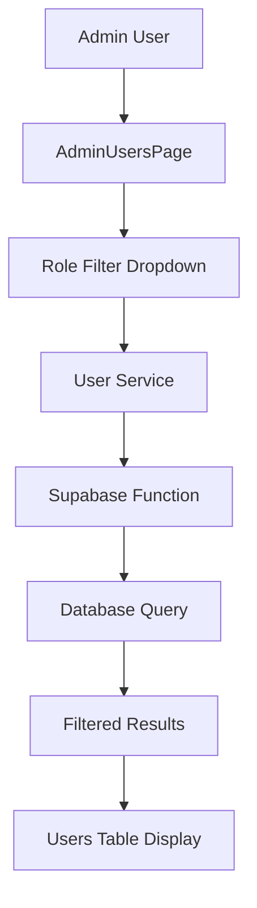

# User Role Filter Fix Design Document

## Overview

This document outlines the fix for the user role filtering issue in the admin panel. Currently, when filtering users by the "user" role, the frontend sends `role=all` parameter instead of `role=user`, causing all users to be displayed instead of just those with the "user" role.

## Problem Analysis

### Current Behavior
1. When a user selects "user" role in the admin panel filter dropdown, the frontend sends `role=all` parameter to the backend
2. The backend interprets `role=all` as a request to return all users regardless of role
3. This results in displaying all users (admin, manager, user) when only users with "user" role should be displayed

### Root Cause
After analyzing the code, the actual implementation in `/src/lib/user-service.ts` is correct:
```typescript
// Handle role filter properly - only add if explicitly set
if (filters.role && filters.role !== 'all') {
  queryParams.append('role', filters.role);
} else if (filters.role === 'all') {
  queryParams.append('role', 'all');
}
```

This logic correctly sends `role=user` when the filter is set to "user". However, there appears to be a discrepancy between what the user expects and what is actually happening in the UI. Looking at the AdminUsersPage, the default role filter is set to "all":

```typescript
const [filters, setFilters] = useState<UserFilters>({
  search: "",
  status: "all",
  role: "all", // Show all roles by default
  sortBy: "created_at",
  sortOrder: "desc",
});
```

The issue may be that the user expects "user" to be the default, or there may be a bug in how the filter value is being passed from the UI to the service.

Based on the user's report, when they select "user" in the role filter dropdown, the system is sending `role=all` instead of `role=user`. This suggests there might be an issue with how the UI state is being managed or how the filter value is being passed to the service.

### Expected Behavior
Based on the user's report, the expected behavior should be:
1. When "user" role is selected in the dropdown, the frontend should send `role=user` parameter
2. When "admin" role is selected, the frontend should send `role=admin` parameter
3. When "manager" role is selected, the frontend should send `role=manager` parameter
4. When "all" roles is selected, the frontend should send `role=all` parameter

Currently, the user reports that selecting "user" in the dropdown results in `role=all` being sent, which causes all users to be displayed instead of just users with the "user" role.

## Solution Design

### Frontend Changes

After analyzing the code, the UserService implementation is actually correct. The issue appears to be in the AdminUsersPage component. Here are the recommended changes:

#### 1. Update AdminUsersPage Default Filter (Primary Fix)
File: `/src/pages/admin/AdminUsersPage.tsx`

Change the default role filter from "all" to "user" to match user expectations:

```typescript
// Current implementation:
const [filters, setFilters] = useState<UserFilters>({
  search: "",
  status: "all",
  role: "all", // Show all roles by default
  sortBy: "created_at",
  sortOrder: "desc",
});

// Updated implementation:
const [filters, setFilters] = useState<UserFilters>({
  search: "",
  status: "all",
  role: "user", // Show only users by default
  sortBy: "created_at",
  sortOrder: "desc",
});
```

#### 2. Verify Role Filter Dropdown Implementation
The role filter dropdown in AdminUsersPage should correctly pass the selected value to the filter state:

```typescript
{/* Role Filter */}
<select
  value={filters.role}
  onChange={(e) => handleFilterChange("role", e.target.value)}
  className="flex h-10 w-full rounded-md border border-input bg-background px-3 py-2 text-sm ring-offset-background file:border-0 file:bg-transparent file:text-sm file:font-medium placeholder:text-muted-foreground focus-visible:outline-none focus-visible:ring-2 focus-visible:ring-ring focus-visible:ring-offset-2 disabled:cursor-not-allowed disabled:opacity-50 md:w-auto"
>
  <option value="user">{t("role_user")}</option>
  <option value="admin">{t("role_admin")}</option>
  <option value="manager">{t("role_manager")}</option>
  <option value="all">{t("filter_all_roles")}</option>
</select>
```

The `handleFilterChange` function should correctly update the filters state:

```typescript
const handleFilterChange = (key: keyof UserFilters, value: any) => {
  setFilters(prev => ({ ...prev, [key]: value }));
  setPagination(prev => ({ ...prev, page: 1 }));
};
```

### Backend Changes

No backend changes are required as the implementation in `/supabase/functions/users/index.ts` is already correct:

```typescript
const roleParam = url.searchParams.get('role')

let query = anonClient.from('profiles').select('*', { count: 'exact' })

if (roleParam && roleParam !== 'all') {
  query = query.eq('role', roleParam)
}
```

This correctly handles:
- When `role=user` is provided, it filters for users with role "user"
- When `role=admin` is provided, it filters for users with role "admin"
- When `role=manager` is provided, it filters for users with role "manager"
- When `role=all` is provided, it returns all users
- When no role parameter is provided, it returns all users

## Implementation Plan

### Phase 1: Investigation
1. Verify the current behavior by testing the AdminUsersPage role filtering
2. Confirm that selecting "user" in the dropdown actually sends `role=all` 
3. Check if the issue is with the default value or with the dropdown event handling

### Phase 2: Frontend Updates
1. Update the AdminUsersPage default role filter from "all" to "user"
2. Verify that the role filter dropdown correctly passes selected values to the filter state
3. Test the filtering functionality with all role options

### Phase 3: Verification
1. Verify that selecting "user" role displays only users with "user" role
2. Verify that selecting "admin" role displays only users with "admin" role
3. Verify that selecting "manager" role displays only users with "manager" role
4. Verify that selecting "all" roles displays all users

## Testing Strategy

### Unit Tests
1. Test UserService getUsers method with different role parameters
2. Test that role parameter is correctly appended to query string
3. Test edge cases (undefined role, empty role, invalid role)

### Integration Tests
1. Test AdminUsersPage role filtering functionality
2. Verify correct API calls are made based on selected role
3. Verify UI updates correctly based on API responses

### Manual Testing
1. Navigate to Admin Users page
2. Select each role option from the dropdown
3. Verify that only users with the selected role are displayed
4. Check that pagination and other filters still work correctly

## Data Flow Diagram



## API Contract

### Request
```
GET /functions/v1/users?role={role}&sortBy=created_at&sortOrder=desc&page=1&limit=10
```

Parameters:
- `role`: Filter by user role (user, admin, manager, or all)
- `sortBy`: Field to sort by
- `sortOrder`: Sort order (asc or desc)
- `page`: Page number for pagination
- `limit`: Number of items per page

### Response
```json
{
  "users": [
    {
      "id": "user-id",
      "email": "user@example.com",
      "name": "John Doe",
      "phone": "+1234567890",
      "role": "user",
      "status": "active",
      "created_at": "2023-01-01T00:00:00Z",
      "updated_at": "2023-01-01T00:00:00Z"
    }
  ],
  "total": 1,
  "page": 1,
  "limit": 10
}
```

## Backward Compatibility

This change maintains backward compatibility:
1. Existing API contract remains unchanged
2. Backend logic already correctly handles all role parameter values
3. Default behavior change from "all" to "user" is a UX improvement rather than a breaking change

## Security Considerations

No security implications as this change only affects filtering of already accessible data. The backend RLS policies and authentication checks remain unchanged.