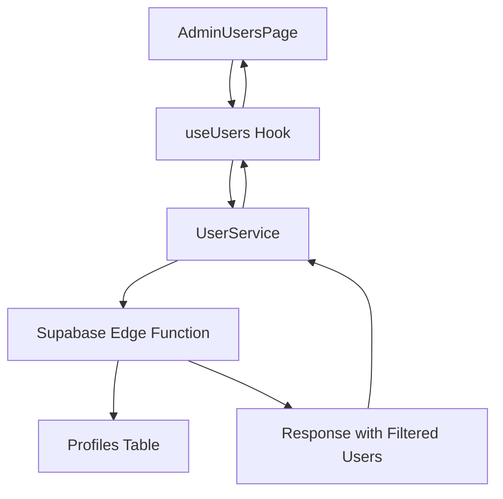

# User Role Filtering Fix Design Document

## 1. Overview

This document outlines the design and implementation of the fix for user role filtering in the admin panel. The issue was that the role filter was not properly applied when requesting users from the Supabase Edge Function, causing all users to be returned regardless of the selected role filter.

## 2. Problem Statement

### Current Behavior
- When requesting users with `GET /functions/v1/users?role=user`, all users (including admin and manager roles) are returned
- The role filter is being ignored in the Supabase Edge Function
- Sorting and pagination work correctly, but filtering does not

### Expected Behavior
- `GET /functions/v1/users?role=user` should return only users with role = "user"
- `GET /functions/v1/users?role=admin` should return only users with role = "admin"
- `GET /functions/v1/users?role=all` should return all users regardless of role
- All existing functionality (sorting, pagination, search, status filtering) should continue to work

## 3. Architecture

### Component Interaction


### Data Flow
1. AdminUsersPage sets default role filter to "user"
2. useUsers hook calls UserService with filter parameters
3. UserService constructs query parameters and calls Supabase Edge Function
4. Edge Function applies role filter to database query
5. Database returns filtered results
6. Edge Function returns filtered users with pagination info
7. Results are displayed in UsersTable component

## 4. Implementation Details

### 4.1 Frontend Changes

#### UserService (src/lib/user-service.ts)
The UserService was modified to always send the role parameter, even when it's "user":
```typescript
// Always include role filter, even for "user" role
if (filters.role) queryParams.append('role', filters.role);
```

#### AdminUsersPage (src/pages/admin/AdminUsersPage.tsx)
Default role filter is set to "user":
```typescript
const [filters, setFilters] = useState<UserFilters>({
  search: "",
  status: "all",
  role: "user", // Default role filter
  sortBy: "created_at",
  sortOrder: "desc",
});
```

### 4.2 Backend Changes

#### Supabase Edge Function (supabase/functions/users/index.ts)
The Edge Function was updated to properly handle role filtering:

1. Role parameter extraction and filtering:
```typescript
const role = searchParams.get('role');
console.log('Received role parameter:', role); // Debug log
if (role && role !== 'all') {
  query = query.eq('role', role);
  console.log('Applied role filter:', role); // Debug log
}
```

2. Count query updated to apply the same filtering logic:
```typescript
let countQueryWithFilters = countQuery;
if (role && role !== 'all') {
  countQueryWithFilters = countQueryWithFilters.eq('role', role);
  console.log('Applied role filter to count query:', role);
}
```

## 5. API Specification

### 5.1 Request Parameters
| Parameter | Type | Required | Description |
|-----------|------|----------|-------------|
| role | string | No | Filter users by role (user, admin, manager, all) |
| search | string | No | Search users by name or email |
| status | string | No | Filter users by status (active, inactive, all) |
| sortBy | string | No | Field to sort by (created_at, name, email) |
| sortOrder | string | No | Sort order (asc, desc) |
| page | number | No | Page number for pagination |
| limit | number | No | Number of items per page |

### 5.2 Response Format
```json
{
  "users": [
    {
      "id": "string",
      "email": "string",
      "name": "string",
      "phone": "string",
      "role": "user|admin|manager",
      "status": "active|inactive",
      "created_at": "string",
      "updated_at": "string",
      "avatar_url": "string"
    }
  ],
  "total": 0,
  "page": 1,
  "limit": 10
}
```

## 6. Testing Strategy

### 6.1 Unit Tests
- Verify that UserService correctly constructs query parameters
- Test that role parameter is always included in requests
- Validate that other filters work in combination with role filter

### 6.2 Integration Tests
- Test Edge Function with different role parameters
- Verify correct filtering for each role value (user, admin, manager, all)
- Test combinations of filters (role + search + status)
- Validate pagination works correctly with filtered results

### 6.3 End-to-End Tests
- Load AdminUsersPage and verify default filter shows only "user" roles
- Change role filter to "admin" and verify only admin users are displayed
- Change role filter to "all" and verify all users are displayed
- Test that sorting and pagination work with filtered results

## 7. Security Considerations

- Role filtering is performed server-side to prevent client-side manipulation
- Only authenticated admin users can access the users endpoint
- Proper error handling for unauthorized access attempts
- Input validation for all query parameters

## 8. Performance Considerations

- Database indexes should exist on the role column for efficient filtering
- Count query is optimized to only count filtered results
- Pagination prevents loading excessive data
- Caching strategies can be implemented at the frontend level using React Query

## 9. Rollback Plan

If issues are discovered after deployment:
1. Revert changes to UserService to previous implementation
2. Restore Edge Function to previous version
3. Monitor application logs for any errors
4. Validate that user management functionality works as expected