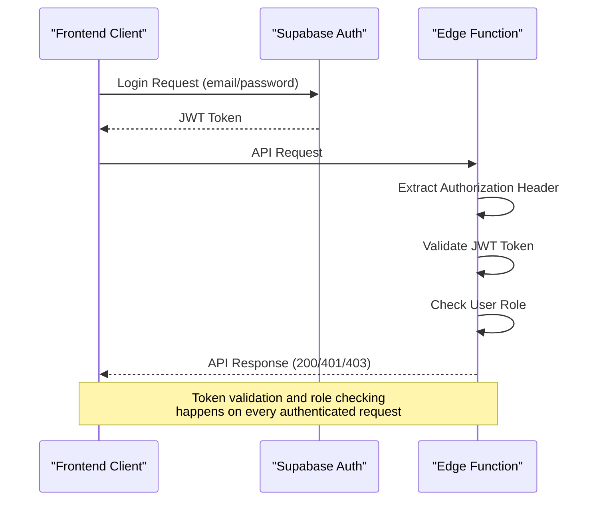
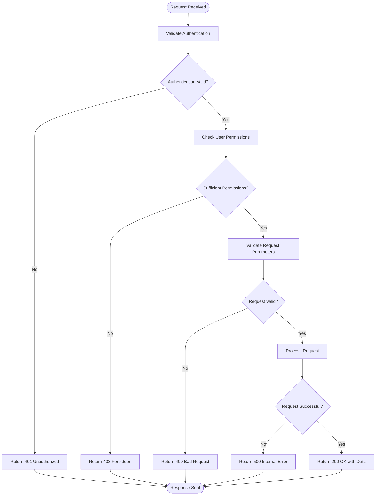

# API Reference

<cite>
**Referenced Files in This Document**   
- [auth-me/index.ts](file://supabase/functions/auth-me/index.ts)
- [menu/index.ts](file://supabase/functions/menu/index.ts)
- [menu-content/index.ts](file://supabase/functions/menu-content/index.ts)
- [permissions/index.ts](file://supabase/functions/permissions/index.ts)
- [templates/index.ts](file://supabase/functions/templates/index.ts)
- [users/index.ts](file://supabase/functions/users/index.ts)
- [ApiDocs.tsx](file://src/pages/ApiDocs.tsx)
- [user-auth-service.ts](file://src/lib/user-auth-service.ts)
</cite>

## Table of Contents
1. [Introduction](#introduction)
2. [Authentication](#authentication)
3. [Edge Functions API](#edge-functions-api)
   - [auth-me](#auth-me)
   - [menu](#menu)
   - [menu-content](#menu-content)
   - [permissions](#permissions)
   - [templates](#templates)
   - [users](#users)
4. [Request/Response Formats](#requestresponse-formats)
5. [Error Handling](#error-handling)
6. [Rate Limiting](#rate-limiting)
7. [Performance Optimization](#performance-optimization)
8. [Security Considerations](#security-considerations)
9. [API Versioning](#api-versioning)
10. [Frontend Integration Examples](#frontend-integration-examples)

## Introduction

The lovable-rise application provides a comprehensive Edge Functions API for managing user authentication, menu structures, permissions, templates, and user data. This API documentation covers all public endpoints with detailed information about HTTP methods, URL patterns, request/response schemas, authentication requirements, and practical usage examples.

The API is built on Supabase Edge Functions, providing secure, serverless endpoints that integrate with the application's PostgreSQL database and authentication system. All endpoints follow RESTful principles and use standard HTTP status codes for responses.

**Section sources**
- [ApiDocs.tsx](file://src/pages/ApiDocs.tsx#L1-L1063)

## Authentication

The lovable-rise API supports two authentication methods: Bearer tokens and API keys. Most endpoints require authentication, with specific requirements based on the operation and user role.

### Bearer Tokens
Bearer tokens are JWT tokens obtained through the Supabase authentication system. They are required for most API operations and must be included in the Authorization header:

```
Authorization: Bearer <token>
```

Tokens are obtained through the standard Supabase authentication flow, either via email/password login or OAuth providers like Google. The token contains user identity and role information used for authorization decisions.

### API Keys
API keys are used for anonymous access to certain endpoints. They are typically the Supabase anon key and are passed in the apikey header:

```
apikey: <api_key>
```

However, for authenticated operations, only Bearer tokens should be used. The client-side code explicitly avoids sending apikey headers for authenticated requests to prevent conflicts.

### Authentication Flow
1. User authenticates via Supabase auth system
2. JWT token is obtained and stored in the client
3. Token is included in the Authorization header for API requests
4. Edge Functions validate the token and extract user information
5. Role-based authorization is applied based on the user's profile

The authentication system follows Supabase recommendations, handling both authenticated user requests and anonymous requests appropriately.



**Diagram sources **
- [auth-me/index.ts](file://supabase/functions/auth-me/index.ts#L44-L86)
- [user-auth-service.ts](file://src/lib/user-auth-service.ts#L1-L799)

**Section sources**
- [auth-me/index.ts](file://supabase/functions/auth-me/index.ts#L44-L86)
- [user-auth-service.ts](file://src/lib/user-auth-service.ts#L1-L799)

## Edge Functions API

### auth-me

The auth-me endpoint provides information about the currently authenticated user, combining data from Supabase auth and the application's profiles table.

**Endpoint**: `GET /functions/v1/auth-me`

**Authentication**: Bearer token required

**Response Schema**:
```json
{
  "user": {
    "id": "string",
    "email": "string",
    "name": "string",
    "phone": "string",
    "role": "admin|manager|user",
    "status": "active|inactive",
    "created_at": "string",
    "updated_at": "string"
  }
}
```

**Example Response**:
```json
{
  "user": {
    "id": "a1b2c3d4-e5f6-7890-g1h2-i3j4k5l6m7n8",
    "email": "user@example.com",
    "name": "John Doe",
    "phone": "+380501234567",
    "role": "user",
    "status": "active",
    "created_at": "2024-01-01T00:00:00Z",
    "updated_at": "2024-01-01T00:00:00Z"
  }
}
```

The endpoint first validates the JWT token, then fetches the user's profile from the profiles table, combining both sets of information in the response.

**Section sources**
- [auth-me/index.ts](file://supabase/functions/auth-me/index.ts#L88-L129)

### menu

The menu endpoint provides access to the application's menu structure, with different behavior based on user role and authentication status.

**Endpoints**:
- `GET /functions/v1/menu` - Get menu for current user
- `GET /functions/v1/menu/:id/children` - Get children of a menu item
- `POST /functions/v1/menu` - Create a new menu item
- `PATCH /functions/v1/menu/:id` - Update a menu item
- `DELETE /functions/v1/menu/:id` - Deactivate a menu item

**Authentication**: Bearer token required

**GET /functions/v1/menu Response Schema**:
```json
{
  "menu": [
    {
      "id": "number",
      "title": "string",
      "path": "string",
      "parent_id": "number|null",
      "order_index": "number",
      "is_active": "boolean",
      "created_at": "string",
      "children": "[menu_item]"
    }
  ]
}
```

**Authorization Rules**:
- Regular users receive only menu items they have permission to view
- Admin users receive the complete menu structure and can manage menu items
- Non-admin users are forbidden from creating, updating, or deleting menu items

The menu structure is returned in a hierarchical format with parent items containing their children in a nested array.

**Section sources**
- [menu/index.ts](file://supabase/functions/menu/index.ts#L88-L182)

### menu-content

The menu-content endpoint provides detailed content for menu items, including page templates and content management.

**Endpoints**:
- `GET /functions/v1/menu-content/by-path?path=/dashboard` - Get menu item by path
- `GET /functions/v1/menu-content/item/:id` - Get specific menu item content by ID
- `PUT /functions/v1/menu-content/item/:id` - Update menu item content
- `POST /functions/v1/menu-content/item` - Create new menu item with content
- `GET /functions/v1/menu-content/templates` - Get available page templates

**Authentication**: Bearer token required

**GET /functions/v1/menu-content/by-path Response Schema**:
```json
{
  "menuItem": {
    "id": "number",
    "title": "string",
    "path": "string",
    "parent_id": "number|null",
    "order_index": "number",
    "is_active": "boolean",
    "page_type": "content|form|dashboard|list|custom",
    "content_data": "object",
    "template_name": "string",
    "meta_data": "object",
    "created_at": "string",
    "updated_at": "string"
  }
}
```

**PUT /functions/v1/menu-content/item/:id Request Body**:
```json
{
  "title": "string",
  "path": "string",
  "page_type": "content|form|dashboard|list|custom",
  "content_data": "object",
  "template_name": "string",
  "meta_data": "object",
  "parent_id": "number|null",
  "order_index": "number",
  "is_active": "boolean"
}
```

**GET /functions/v1/menu-content/templates Response**:
```json
{
  "templates": {
    "content": ["default", "article", "landing"],
    "form": ["contact", "survey", "registration", "custom"],
    "dashboard": ["analytics", "overview", "reports"],
    "list": ["table", "cards", "timeline"],
    "custom": ["custom-component"]
  }
}
```

Only admin users can create, update, or delete menu content. Regular users can only view content for menu items they have permission to access.

**Section sources**
- [menu-content/index.ts](file://supabase/functions/menu-content/index.ts#L89-L354)

### permissions

The permissions endpoint manages user access to menu items, allowing administrators to assign view and edit permissions.

**Endpoints**:
- `GET /functions/v1/permissions/:userId` - Get user permissions
- `POST /functions/v1/permissions/:userId` - Assign permissions to user
- `PATCH /functions/v1/permissions/:userId/:menuItemId` - Update specific permission
- `DELETE /functions/v1/permissions/:userId/:menuItemId` - Remove specific permission

**Authentication**: Bearer token required (admin role)

**GET /functions/v1/permissions/:userId Response Schema**:
```json
{
  "permissions": [
    {
      "id": "number",
      "user_id": "string",
      "menu_item_id": "number",
      "can_view": "boolean",
      "can_edit": "boolean",
      "created_at": "string",
      "menu_items": {
        "id": "number",
        "title": "string",
        "path": "string"
      }
    }
  ]
}
```

**POST /functions/v1/permissions/:userId Request Body**:
```json
{
  "permissions": [
    {
      "menu_item_id": "number",
      "can_view": "boolean",
      "can_edit": "boolean"
    }
  ]
}
```

The endpoint requires admin authentication for all operations. When assigning permissions, it first deletes all existing permissions for the user before inserting the new ones, ensuring a clean state.

**Section sources**
- [permissions/index.ts](file://supabase/functions/permissions/index.ts#L98-L189)

### templates

The templates endpoint manages XML templates for marketplace integrations, with functionality for template deletion.

**Endpoints**:
- `DELETE /functions/v1/templates/:id` - Delete a template (soft delete)

**Authentication**: Bearer token required (admin role)

**DELETE /functions/v1/templates/:id Response**:
```json
{
  "success": "boolean",
  "message": "string"
}
```

The endpoint verifies that the requesting user is an admin before performing the soft delete operation, which sets the template's is_active field to false rather than removing it from the database.

**Section sources**
- [templates/index.ts](file://supabase/functions/templates/index.ts#L0-L126)

### users

The users endpoint provides comprehensive user management capabilities, with different access levels based on user role.

**Endpoints**:
- `GET /functions/v1/users` - Get list of users with pagination
- `GET /functions/v1/users/:id` - Get specific user
- `POST /functions/v1/users` - Create new user
- `PATCH /functions/v1/users/:id` - Update user
- `DELETE /functions/v1/users/:id` - Delete user

**Authentication**: Bearer token required

**GET /functions/v1/users Query Parameters**:
- `page`: Page number (default: 1)
- `limit`: Items per page (default: 10)
- `sortBy`: Field to sort by (default: created_at)
- `sortOrder`: Sort order (asc/desc, default: desc)
- `search`: Search term for name or email
- `role`: Filter by user role

**GET /functions/v1/users Response Schema**:
```json
{
  "users": [
    {
      "id": "string",
      "email": "string",
      "name": "string",
      "phone": "string",
      "role": "admin|manager|user",
      "status": "active|inactive",
      "created_at": "string",
      "updated_at": "string",
      "subscription": {
        "tariff_name": "string",
        "is_active": "boolean"
      }
    }
  ],
  "total": "number",
  "page": "number",
  "limit": "number"
}
```

**POST /functions/v1/users Request Body**:
```json
{
  "email": "string",
  "password": "string",
  "name": "string",
  "phone": "string",
  "role": "admin|manager|user"
}
```

**Authorization Rules**:
- Admin users can perform all operations
- Regular users can only view their own user data
- User creation requires admin privileges
- The endpoint integrates with Supabase Auth for user management

**Section sources**
- [users/index.ts](file://supabase/functions/users/index.ts#L0-L489)

## Request/Response Formats

### HTTP Methods
The API follows standard RESTful conventions for HTTP methods:

- **GET**: Retrieve resources
- **POST**: Create new resources
- **PUT**: Update existing resources (full update)
- **PATCH**: Update existing resources (partial update)
- **DELETE**: Delete resources (soft delete)

### Content Types
All requests and responses use JSON format with the appropriate Content-Type header:

```
Content-Type: application/json
```

### Request Headers
Required headers vary by endpoint and authentication method:

- `Authorization: Bearer <token>` - For authenticated requests
- `Content-Type: application/json` - For requests with a body
- `apikey: <api_key>` - For anonymous access (rarely used)

### Response Structure
Successful responses follow a consistent pattern with data wrapped in appropriate property names:

```json
{
  "users": [...],
  "total": 10,
  "page": 1,
  "limit": 10
}
```

```json
{
  "user": { ... }
}
```

```json
{
  "menu": [ ... ]
}
```

Error responses use a standard format:

```json
{
  "error": "Error description"
}
```

### Example Requests

**Get Current User**:
```bash
curl -X GET https://ehznqzaumsnjkrntaiox.supabase.co/functions/v1/auth-me \
  -H "Authorization: Bearer <token>" \
  -H "Content-Type: application/json"
```

**Get User Menu**:
```bash
curl -X GET https://ehznqzaumsnjkrntaiox.supabase.co/functions/v1/menu \
  -H "Authorization: Bearer <token>" \
  -H "Content-Type: application/json"
```

**Get Users List**:
```bash
curl -X GET "https://ehznqzaumsnjkrntaiox.supabase.co/functions/v1/users?page=1&limit=10&sortBy=created_at&sortOrder=desc" \
  -H "Authorization: Bearer <token>" \
  -H "Content-Type: application/json"
```

**Create User**:
```bash
curl -X POST https://ehznqzaumsnjkrntaiox.supabase.co/functions/v1/users \
  -H "Authorization: Bearer <token>" \
  -H "Content-Type: application/json" \
  -d '{
    "email": "newuser@example.com",
    "password": "securepassword123",
    "name": "New User",
    "role": "user"
  }'
```

**Section sources**
- [ApiDocs.tsx](file://src/pages/ApiDocs.tsx#L1-L1063)

## Error Handling

The API uses standard HTTP status codes to indicate the result of requests:

### Success Codes
- **200 OK**: Request successful
- **201 Created**: Resource created successfully
- **204 No Content**: Request successful but no content to return

### Client Error Codes
- **400 Bad Request**: Invalid request parameters or body
- **401 Unauthorized**: Missing or invalid authentication
- **403 Forbidden**: Insufficient permissions for the operation
- **404 Not Found**: Requested resource not found
- **405 Method Not Allowed**: HTTP method not supported for the endpoint
- **409 Conflict**: Resource already exists or conflict with current state

### Server Error Codes
- **500 Internal Server Error**: Unexpected server error
- **502 Bad Gateway**: External service error
- **503 Service Unavailable**: Service temporarily unavailable

### Error Response Format
Error responses follow a consistent format:

```json
{
  "error": "Error description"
}
```

Some endpoints include additional debug information in error responses, particularly for authentication issues.

### Common Error Scenarios

**Authentication Required**:
```json
{
  "error": "Missing authentication"
}
```

**Insufficient Permissions**:
```json
{
  "error": "Forbidden - Admin access required"
}
```

**Resource Not Found**:
```json
{
  "error": "User not found"
}
```

**Validation Error**:
```json
{
  "error": "Email, password, and name are required"
}
```

The API includes comprehensive error logging for debugging purposes, with detailed error messages returned in development environments.



**Diagram sources **
- [auth-me/index.ts](file://supabase/functions/auth-me/index.ts#L44-L129)
- [menu/index.ts](file://supabase/functions/menu/index.ts#L44-L302)

**Section sources**
- [ApiDocs.tsx](file://src/pages/ApiDocs.tsx#L972-L1062)

## Rate Limiting

The lovable-rise API does not implement explicit rate limiting at the Edge Function level. Instead, it relies on Supabase's built-in rate limiting and the application's authentication system to prevent abuse.

### Current Rate Limiting Behavior
- Supabase Auth has built-in rate limiting for authentication endpoints
- Database operations are subject to connection limits and query performance
- No explicit rate limiting headers are returned by the API
- Abuse detection is primarily handled at the infrastructure level

### Best Practices for Consumers
API consumers should implement their own rate limiting to avoid overwhelming the system:

1. **Implement exponential backoff** for retry logic
2. **Cache responses** when possible to reduce request frequency
3. **Batch operations** instead of making multiple individual requests
4. **Monitor response times** and adjust request frequency accordingly

### Monitoring and Alerts
The application includes monitoring for unusual access patterns, with alerts configured for:
- Sudden spikes in API request volume
- Repeated failed authentication attempts
- Unusual access patterns from specific IP addresses

Administrators can monitor API usage through Supabase's analytics dashboard and set up custom alerts for specific endpoints.

**Section sources**
- [ApiDocs.tsx](file://src/pages/ApiDocs.tsx#L1-L1063)

## Performance Optimization

### Caching Strategies
The API supports several caching strategies to improve performance:

**Client-Side Caching**:
- Cache user data after initial fetch
- Cache menu structure for the duration of a session
- Implement stale-while-revalidate pattern for frequently accessed data

**Example Implementation**:
```typescript
// Cache user data in localStorage
const CACHE_KEY = 'user_data';
const CACHE_DURATION = 5 * 60 * 1000; // 5 minutes

function getCachedUser() {
  const cached = localStorage.getItem(CACHE_KEY);
  if (!cached) return null;
  
  const { data, timestamp } = JSON.parse(cached);
  if (Date.now() - timestamp > CACHE_DURATION) {
    localStorage.removeItem(CACHE_KEY);
    return null;
  }
  
  return data;
}

function setCachedUser(user) {
  localStorage.setItem(CACHE_KEY, JSON.stringify({
    data: user,
    timestamp: Date.now()
  }));
}
```

### Batch Operations
For operations that involve multiple records, consider implementing batch processing:

**User Management**:
- Fetch multiple users in a single request with pagination
- Update multiple user permissions in a single transaction
- Bulk assign menu access permissions

**Example Batch Permission Update**:
```json
POST /functions/v1/permissions/:userId
{
  "permissions": [
    {
      "menu_item_id": 1,
      "can_view": true,
      "can_edit": false
    },
    {
      "menu_item_id": 2,
      "can_view": true,
      "can_edit": true
    }
  ]
}
```

### Connection Management
- Reuse authenticated client instances when possible
- Implement connection pooling for database operations
- Use Supabase's real-time subscriptions for data that changes frequently

### Query Optimization
- Use specific field selection instead of selecting all fields
- Implement proper indexing on frequently queried fields
- Use pagination for large result sets
- Filter results on the server side rather than retrieving all data

The API is designed to be efficient, with most operations completing in under 200ms under normal conditions.

**Section sources**
- [ApiDocs.tsx](file://src/pages/ApiDocs.tsx#L1-L1063)

## Security Considerations

### Authentication Security
- Use HTTPS for all API requests
- Store tokens securely (httpOnly cookies or secure storage)
- Implement token expiration and refresh mechanisms
- Never expose service role keys in client-side code

### Data Protection
- All sensitive data is encrypted at rest
- Role-Based Access Control (RBAC) enforces data isolation
- PII (Personally Identifiable Information) is protected with additional security measures
- Regular security audits are performed on the codebase

### Input Validation
All API endpoints perform rigorous input validation:

- Validate data types and formats
- Sanitize input to prevent injection attacks
- Enforce business rules and constraints
- Implement maximum length limits for text fields

### Error Handling Security
- Avoid exposing sensitive information in error messages
- Use generic error messages in production
- Log detailed error information only on the server side
- Implement proper error monitoring and alerting

### CORS Configuration
The API has a permissive CORS configuration for development:

```
Access-Control-Allow-Origin: *
Access-Control-Allow-Headers: authorization, x-client-info, apikey, content-type, accept
Access-Control-Allow-Methods: GET, POST, PATCH, DELETE, OPTIONS
```

In production, this should be restricted to trusted domains.

### Security Headers
The API should implement standard security headers:
- Content-Security-Policy
- X-Content-Type-Options
- X-Frame-Options
- Strict-Transport-Security

These are currently handled by the Supabase platform.

**Section sources**
- [auth-me/index.ts](file://supabase/functions/auth-me/index.ts#L0-L129)
- [config.toml](file://supabase/config.toml#L0-L12)

## API Versioning

The lovable-rise API uses URL-based versioning with the following pattern:

```
/functions/v1/endpoint
```

### Versioning Strategy
- **v1**: Current stable version
- Future versions will be released as v2, v3, etc.
- Backward compatibility is maintained for at least 6 months after a new version release
- Deprecation notices are provided 3 months before endpoint removal

### Version Management
- New features are added to the current version when possible
- Breaking changes require a new version
- Documentation is updated with each version release
- API consumers are notified of upcoming changes

### Current Version
All documented endpoints are part of the v1 API. No other versions are currently available.

### Future Versioning Plans
- Implement API version negotiation via headers
- Provide automated migration tools for breaking changes
- Maintain a public roadmap for API evolution
- Implement feature flags for gradual rollout of new functionality

**Section sources**
- [ApiDocs.tsx](file://src/pages/ApiDocs.tsx#L1-L1063)

## Frontend Integration Examples

### React Component Integration

The application provides several examples of how frontend components call the API:

**User Menu Component**:
```typescript
import { UserMenuService } from "@/lib/user-menu-service";

// Get user menu items
const menuItems = await UserMenuService.getUserMenuItems(userId);

// Create a new menu item
const newItem = await UserMenuService.createMenuItem(userId, {
  title: "New Page",
  path: "/new-page",
  page_type: "content"
});
```

**User Management Component**:
```typescript
import { UserService } from "@/lib/user-service";

// Get list of users
const users = await UserService.getUsers({
  page: 1,
  limit: 10,
  sortBy: "created_at",
  sortOrder: "desc"
});

// Create a new user
const newUser = await UserService.createUser({
  email: "newuser@example.com",
  password: "securepassword123",
  name: "New User",
  role: "user"
});
```

### Authentication Integration

**Login Flow**:
```typescript
import { UserAuthService } from "@/lib/user-auth-service";

// Login user
const result = await UserAuthService.login({
  email: "user@example.com",
  password: "password123"
});

if (result.user) {
  // Store user data and redirect
  setCurrentUser(result.user);
  navigate("/dashboard");
} else {
  // Handle error
  setError(result.error);
}
```

### Error Handling in Components

**Robust Error Handling**:
```typescript
async function fetchUserData() {
  try {
    const response = await UserService.getUser(userId);
    setUser(response);
  } catch (error) {
    if (error.status === 401) {
      // Handle unauthorized access
      handleUnauthorized();
    } else if (error.status === 403) {
      // Handle insufficient permissions
      handleForbidden();
    } else {
      // Handle other errors
      showError("Failed to load user data");
    }
  }
}
```

### Real-World Usage Patterns

The ApiDocs.tsx component demonstrates practical API usage with Postman-style examples and interactive testing:

- Configuration of API keys and authentication tokens
- Generation of cURL commands for API testing
- Creation of Postman collections for comprehensive API testing
- Storage of configuration in localStorage for convenience

These examples show how developers can test and explore the API endpoints directly from the application interface.

**Section sources**
- [ApiDocs.tsx](file://src/pages/ApiDocs.tsx#L1-L1063)
- [user-auth-service.ts](file://src/lib/user-auth-service.ts#L1-L799)
- [user-service.ts](file://src/lib/user-service.ts#L1-L262)