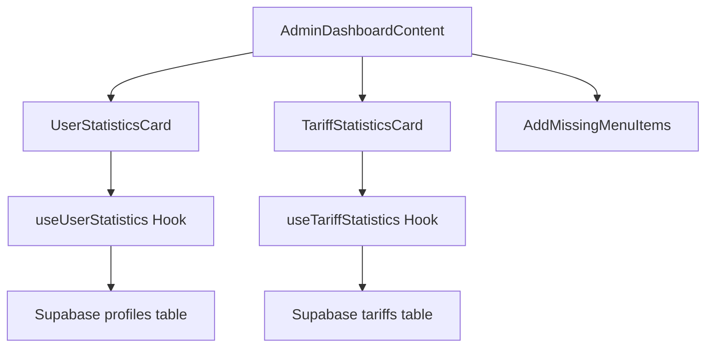
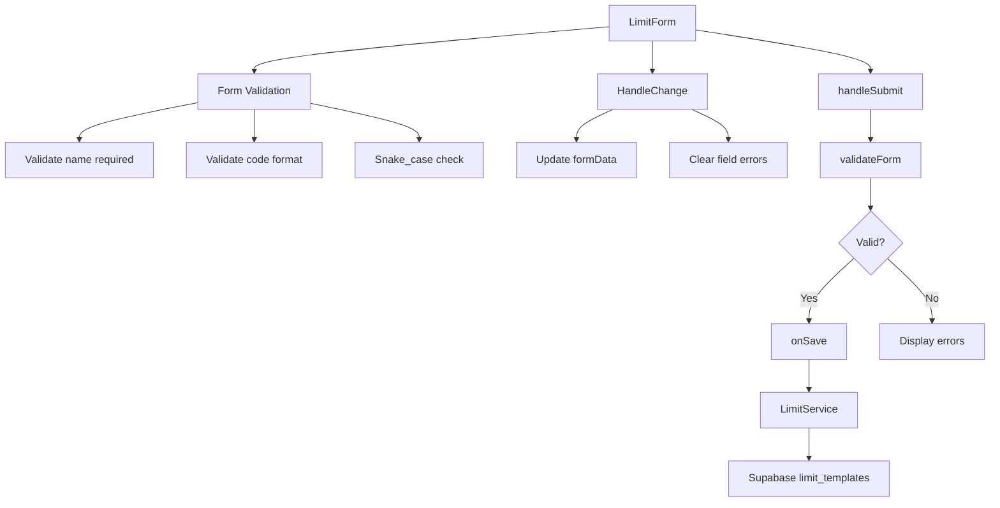
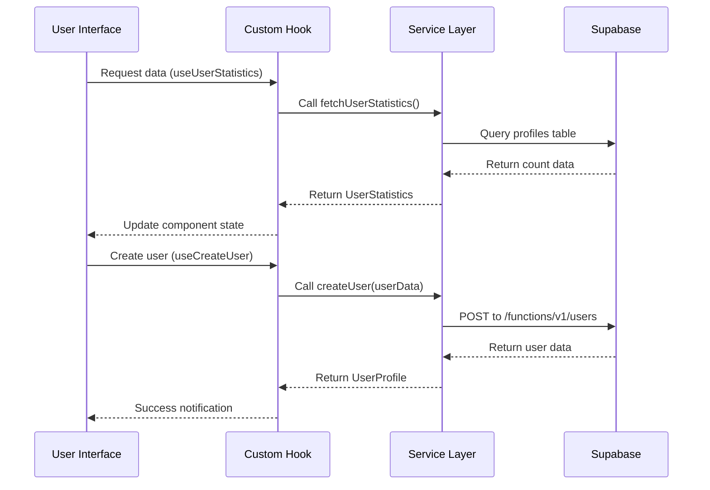
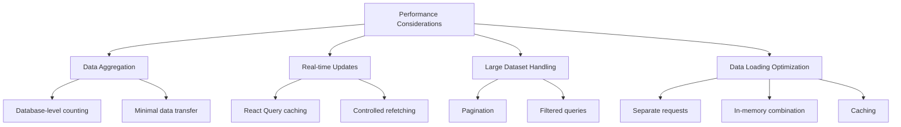

# Admin Features

<cite>
**Referenced Files in This Document**   
- [UserStatisticsCard.tsx](file://src/components/admin/UserStatisticsCard.tsx)
- [TariffStatisticsCard.tsx](file://src/components/admin/TariffStatisticsCard.tsx)
- [AddMissingMenuItems.tsx](file://src/components/admin/AddMissingMenuItems.tsx)
- [AdminDashboardContent.tsx](file://src/pages/AdminDashboardContent.tsx)
- [LimitForm.tsx](file://src/components/admin/limits/LimitForm.tsx)
- [useUserStatistics.ts](file://src/hooks/useUserStatistics.ts)
- [useTariffStatistics.ts](file://src/hooks/useTariffStatistics.ts)
- [user-service.ts](file://src/lib/user-service.ts)
- [tariff-service.ts](file://src/lib/tariff-service.ts)
- [limit-service.ts](file://src/lib/limit-service.ts)
- [UsersTable.tsx](file://src/components/admin/UsersTable.tsx)
- [CreateUserDialog.tsx](file://src/components/admin/CreateUserDialog.tsx)
- [EditUserDialog.tsx](file://src/components/admin/EditUserDialog.tsx)
- [DeleteUserDialog.tsx](file://src/components/admin/DeleteUserDialog.tsx)
- [StatusToggle.tsx](file://src/components/admin/StatusToggle.tsx)
</cite>

## Table of Contents
1. [Dashboard Statistics](#dashboard-statistics)
2. [User Management](#user-management)
3. [System Configuration and Maintenance](#system-configuration-and-maintenance)
4. [Interface Components and Backend Integration](#interface-components-and-backend-integration)
5. [Data Synchronization Issues and Solutions](#data-synchronization-issues-and-solutions)
6. [Performance Considerations](#performance-considerations)

## Dashboard Statistics

The admin dashboard provides comprehensive statistical insights through specialized components that visualize key platform metrics. The primary statistical components are `UserStatisticsCard` and `TariffStatisticsCard`, which display real-time data about user activity and subscription plans.

The `UserStatisticsCard` component renders two key metrics: total registered users and active users. It utilizes the `useUserStatistics` hook to fetch data from the Supabase backend, specifically querying the `profiles` table filtered by role 'user'. The component displays these metrics in a responsive grid layout with appropriate loading skeletons and error handling. When data is being fetched, skeleton loaders provide visual feedback, and in case of errors, a descriptive error message is displayed with the specific error details.

The `TariffStatisticsCard` component focuses on subscription plan metrics, specifically displaying the count of active tariffs. It leverages the `useTariffStatistics` hook which retrieves data from the `tariffs` table, counting records where `is_active` equals true. Similar to the user statistics component, it implements proper loading states with skeleton placeholders and comprehensive error handling that displays both the error message and technical details when data retrieval fails.

Both statistical components are integrated into the `AdminDashboardContent` component, which orchestrates their layout in a responsive grid system. The dashboard arranges the `UserStatisticsCard` to occupy two columns on larger screens while the `TariffStatisticsCard` and maintenance tools each occupy one column, creating an optimal information hierarchy.



**Diagram sources**
- [AdminDashboardContent.tsx](file://src/pages/AdminDashboardContent.tsx)
- [UserStatisticsCard.tsx](file://src/components/admin/UserStatisticsCard.tsx)
- [TariffStatisticsCard.tsx](file://src/components/admin/TariffStatisticsCard.tsx)
- [useUserStatistics.ts](file://src/hooks/useUserStatistics.ts)
- [useTariffStatistics.ts](file://src/hooks/useTariffStatistics.ts)

**Section sources**
- [UserStatisticsCard.tsx](file://src/components/admin/UserStatisticsCard.tsx)
- [TariffStatisticsCard.tsx](file://src/components/admin/TariffStatisticsCard.tsx)
- [AdminDashboardContent.tsx](file://src/pages/AdminDashboardContent.tsx)

## User Management

The user management system provides administrators with comprehensive tools to manage user accounts through a feature-rich interface. The core component is `UsersTable`, which displays user data in a tabular format with sorting capabilities, status controls, and action menus. The table shows essential user information including name, email, phone number, subscription details, and creation date, with responsive design that adapts to different screen sizes.

User status management is facilitated through the `StatusToggle` component, which combines a visual switch control with a status badge. This component allows administrators to activate or deactivate user accounts with a simple toggle interaction. The toggle state is synchronized with the backend through the `onStatusToggle` callback, which ultimately calls the `UserService.toggleUserStatus` method.

The system includes three modal dialogs for user operations: `CreateUserDialog`, `EditUserDialog`, and `DeleteUserDialog`. The `CreateUserDialog` provides a form for creating new user accounts with validation for required fields including email, password, and name. It includes a password visibility toggle and options for email notifications. The `EditUserDialog` allows modification of user details such as name and phone number, with the email field displayed as read-only for security reasons. The `DeleteUserDialog` implements a safety confirmation pattern with a warning icon and a list of consequences to prevent accidental deletions.

These components integrate with the `useUsers` hook which provides React Query mutations for user operations. The `useCreateUser`, `useUpdateUser`, and `useDeleteUser` mutations handle the respective operations, with proper loading states and error handling. The underlying `UserService` class in the `user-service.ts` library handles the actual API communication with Supabase Edge Functions, ensuring proper authentication and error handling.

```mermaid
classDiagram
class UsersTable {
+users : UserProfile[]
+onEditUser() : void
+onDeleteUser() : void
+onViewUserDetails() : void
+onStatusToggle() : void
}
class StatusToggle {
+userId : string
+status : "active"|"inactive"
+onToggle() : void
}
class CreateUserDialog {
+open : boolean
+onOpenChange() : void
+onSuccess() : void
}
class EditUserDialog {
+user : UserProfile
+onSuccess() : void
}
class DeleteUserDialog {
+user : UserProfile
+onSuccess() : void
}
class UserService {
+getUsers() : Promise~UsersResponse~
+createUser() : Promise~UserProfile~
+updateUser() : Promise~UserProfile~
+deleteUser() : Promise~{success, deletedAuth, deletedProfile}~
+toggleUserStatus() : Promise~UserProfile~
}
UsersTable --> StatusToggle : "uses"
UsersTable --> CreateUserDialog : "triggers"
UsersTable --> EditUserDialog : "triggers"
UsersTable --> DeleteUserDialog : "triggers"
CreateUserDialog --> UserService : "mutate"
EditUserDialog --> UserService : "mutate"
DeleteUserDialog --> UserService : "mutate"
```

**Diagram sources**
- [UsersTable.tsx](file://src/components/admin/UsersTable.tsx)
- [StatusToggle.tsx](file://src/components/admin/StatusToggle.tsx)
- [CreateUserDialog.tsx](file://src/components/admin/CreateUserDialog.tsx)
- [EditUserDialog.tsx](file://src/components/admin/EditUserDialog.tsx)
- [DeleteUserDialog.tsx](file://src/components/admin/DeleteUserDialog.tsx)
- [user-service.ts](file://src/lib/user-service.ts)

**Section sources**
- [UsersTable.tsx](file://src/components/admin/UsersTable.tsx)
- [CreateUserDialog.tsx](file://src/components/admin/CreateUserDialog.tsx)
- [EditUserDialog.tsx](file://src/components/admin/EditUserDialog.tsx)
- [DeleteUserDialog.tsx](file://src/components/admin/DeleteUserDialog.tsx)
- [StatusToggle.tsx](file://src/components/admin/StatusToggle.tsx)
- [user-service.ts](file://src/lib/user-service.ts)

## System Configuration and Maintenance

The system administration tools include both user interface components and maintenance operations that ensure the platform functions correctly. The `AddMissingMenuItems` component serves as a maintenance utility that automatically adds essential menu items to user accounts that are missing them. This component runs silently in the background, checking for users with the 'user' role and ensuring they have access to key sections like Tariff, Reports, and Settings.

The `LimitForm` component provides a configuration interface for managing system limits and templates. It includes comprehensive form validation to ensure data integrity, requiring a name and code for each limit. The code field is validated to follow snake_case format using a regular expression pattern /^[a-z][a-z0-9_]*$/. The form supports both creation and editing of limit templates, with appropriate validation messages displayed for each field. The component uses controlled inputs with real-time error clearing as users type, providing a smooth user experience.

These configuration tools integrate with the `LimitService` class which handles the backend operations for limit templates. The service provides methods for retrieving, creating, updating, and deleting limit templates through Supabase's database interface. It includes proper error handling for unique constraint violations and other database errors, ensuring data consistency.



**Diagram sources**
- [LimitForm.tsx](file://src/components/admin/limits/LimitForm.tsx)
- [limit-service.ts](file://src/lib/limit-service.ts)

**Section sources**
- [AddMissingMenuItems.tsx](file://src/components/admin/AddMissingMenuItems.tsx)
- [LimitForm.tsx](file://src/components/admin/limits/LimitForm.tsx)
- [limit-service.ts](file://src/lib/limit-service.ts)

## Interface Components and Backend Integration

The admin interface components are designed with a clear separation between presentation and data logic, following React best practices. The components leverage React Hook Form for form state management and Zod for schema validation, ensuring type safety and proper input validation. The UI components are built using a shared component library that maintains consistent styling and behavior across the application.

Data integration is handled through custom hooks that abstract the complexity of API interactions. The `useUserStatistics` and `useTariffStatistics` hooks use React Query to manage data fetching, caching, and synchronization. These hooks define query keys for proper cache invalidation and set appropriate stale and garbage collection times (5 minutes stale time, 10 minutes gc time) to balance data freshness with performance.

The backend integration relies on Supabase as the primary data source, with direct database queries for statistics and Edge Functions for user management operations. The `UserService` class uses fetch requests to interact with Supabase Edge Functions, ensuring proper authentication through Bearer tokens. The service validates user sessions before each operation and handles various error scenarios with appropriate error messages.

For tariff management, the `TariffService` class provides comprehensive functionality including retrieving tariffs with associated features and limits, creating and updating tariff plans, and managing tariff statistics. The service optimizes data loading by making separate requests for tariffs, currencies, features, and limits, then combining the results to avoid complex joins that could impact performance.



**Diagram sources**
- [useUserStatistics.ts](file://src/hooks/useUserStatistics.ts)
- [useTariffStatistics.ts](file://src/hooks/useTariffStatistics.ts)
- [user-service.ts](file://src/lib/user-service.ts)
- [tariff-service.ts](file://src/lib/tariff-service.ts)

**Section sources**
- [useUserStatistics.ts](file://src/hooks/useUserStatistics.ts)
- [useTariffStatistics.ts](file://src/hooks/useTariffStatistics.ts)
- [user-service.ts](file://src/lib/user-service.ts)
- [tariff-service.ts](file://src/lib/tariff-service.ts)

## Data Synchronization Issues and Solutions

The application addresses several data synchronization challenges between the frontend statistics and backend source data. One key issue is the potential for data staleness in the statistical components. This is mitigated through React Query's caching mechanism with a 5-minute stale time, which balances data freshness with performance by reducing unnecessary network requests while ensuring statistics are updated regularly.

Another synchronization challenge involves user status updates. When an administrator toggles a user's status, the change must be reflected immediately in the UI without requiring a full page refresh. This is achieved through React Query's cache invalidation mechanism, where successful status updates trigger a refetch of the user list data, ensuring the table displays the current status.

The `AddMissingMenuItems` component addresses a data consistency issue where new users might not have the complete set of menu items. This maintenance operation runs automatically, checking for missing items and adding them as needed. The component uses Supabase's `.maybeSingle()` method to handle cases where records don't exist, preventing 406 "Not Acceptable" errors that would occur with `.single()` when no matching record is found.

Error handling is implemented consistently across components to provide meaningful feedback when synchronization fails. Network errors, authentication issues, and database constraints are caught and translated into user-friendly messages through the error handling system. The toast notifications provide immediate feedback on operation success or failure, enhancing the user experience.

**Section sources**
- [UserStatisticsCard.tsx](file://src/components/admin/UserStatisticsCard.tsx)
- [useUserStatistics.ts](file://src/hooks/useUserStatistics.ts)
- [AddMissingMenuItems.tsx](file://src/components/admin/AddMissingMenuItems.tsx)
- [error-handler.ts](file://src/lib/error-handler.ts)

## Performance Considerations

The admin operations are optimized for performance through several strategies. Data aggregation for statistics is handled efficiently at the database level using Supabase's count functionality with filters, minimizing the amount of data transferred over the network. The `fetchUserStatistics` function uses `{ count: 'exact', head: true }` parameters to retrieve only the count without the actual records, significantly improving query performance.

Real-time updates are managed through React Query's refetch mechanisms rather than WebSocket connections, reducing server load while still providing timely data updates. The `refetchOnWindowFocus` option is disabled for statistical queries to prevent unnecessary requests when users switch browser tabs, with manual refetch controls provided where appropriate.

For large datasets, the user management system implements pagination through the `UserService.getUsers` method, which accepts pagination parameters to limit the number of records retrieved in each request. This prevents performance degradation when dealing with large numbers of users.

The tariff service employs data loading optimization by making separate requests for tariffs, currencies, features, and limits, then combining the results in memory. This approach avoids complex joins that could impact database performance, especially as the number of records grows. The service also uses caching mechanisms to store frequently accessed data like currency information.



**Diagram sources**
- [useUserStatistics.ts](file://src/hooks/useUserStatistics.ts)
- [user-service.ts](file://src/lib/user-service.ts)
- [tariff-service.ts](file://src/lib/tariff-service.ts)

**Section sources**
- [useUserStatistics.ts](file://src/hooks/useUserStatistics.ts)
- [user-service.ts](file://src/lib/user-service.ts)
- [tariff-service.ts](file://src/lib/tariff-service.ts)