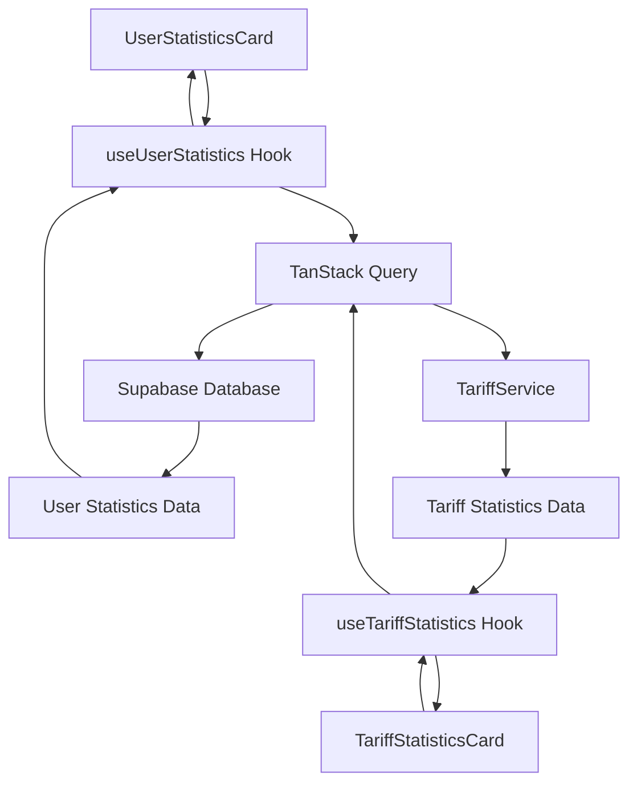
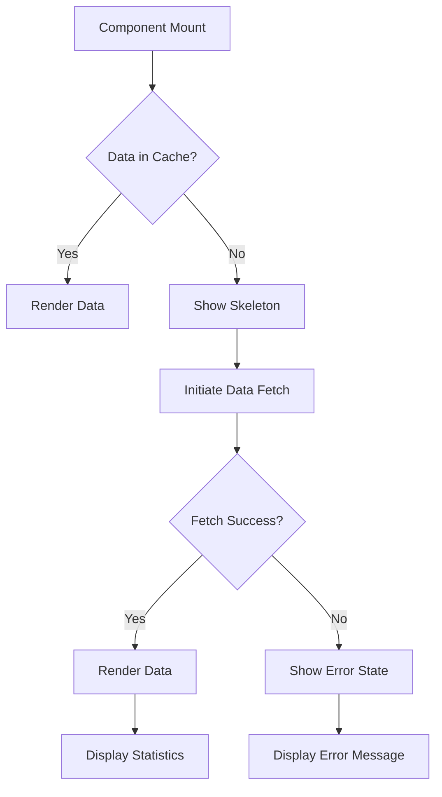
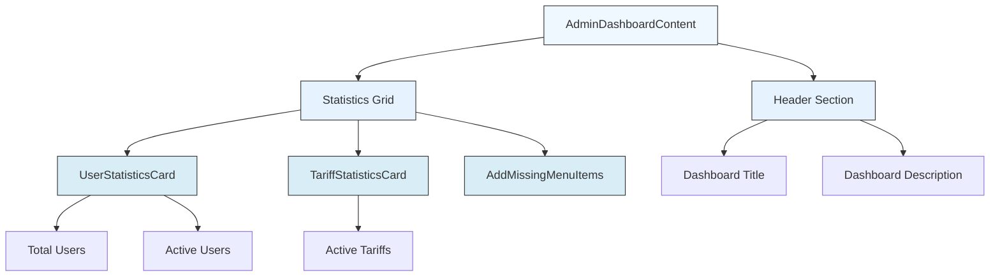

# Dashboard Statistics

<cite>
**Referenced Files in This Document**   
- [UserStatisticsCard.tsx](file://src/components/admin/UserStatisticsCard.tsx)
- [TariffStatisticsCard.tsx](file://src/components/admin/TariffStatisticsCard.tsx)
- [useUserStatistics.ts](file://src/hooks/useUserStatistics.ts)
- [useTariffStatistics.ts](file://src/hooks/useTariffStatistics.ts)
- [AdminDashboardContent.tsx](file://src/pages/AdminDashboardContent.tsx)
- [skeleton.tsx](file://src/components/ui/skeleton.tsx)
- [i18n-provider.tsx](file://src/providers/i18n-provider.tsx)
- [tariff-service.ts](file://src/lib/tariff-service.ts)
</cite>

## Table of Contents
1. [Introduction](#introduction)
2. [Core Statistical Components](#core-statistical-components)
3. [Data Fetching Architecture](#data-fetching-architecture)
4. [Real-time Data Visualization](#real-time-data-visualization)
5. [Loading States and Skeleton Components](#loading-states-and-skeleton-components)
6. [Error Handling with i18n Support](#error-handling-with-i18n-support)
7. [Dashboard Layout and Composition](#dashboard-layout-and-composition)
8. [Common Issues and Solutions](#common-issues-and-solutions)
9. [Performance Considerations](#performance-considerations)
10. [Conclusion](#conclusion)

## Introduction
The dashboard statistics features in the lovable-rise application provide administrators with real-time insights into user and tariff metrics. This documentation details the architecture and implementation of statistical components including UserStatisticsCard and TariffStatisticsCard, which display key performance indicators through an intuitive interface. These components leverage modern React patterns with TanStack Query for efficient data fetching, caching, and state management. The system incorporates responsive design principles, real-time data visualization, comprehensive error handling with internationalization support, and optimized performance characteristics to ensure a seamless administrative experience.

## Core Statistical Components

The dashboard statistics functionality is built around two primary components: UserStatisticsCard and TariffStatisticsCard. These components serve as visual representations of key system metrics, designed with a consistent architecture pattern that emphasizes reusability, maintainability, and user experience.

The UserStatisticsCard component displays user-related statistics including total users and active users, while the TariffStatisticsCard component focuses on tariff-related metrics such as active tariffs. Both components follow a similar architectural pattern, implementing a three-state rendering system: loading, error, and success states. This ensures a smooth user experience regardless of data availability or network conditions.

These components are designed with responsive layouts that adapt to different screen sizes, utilizing CSS grid systems to maintain visual consistency across devices. The visual design incorporates iconography from the Lucide React library, color-coded indicators, and typography hierarchy to enhance data comprehension. The components are also optimized for accessibility, ensuring proper contrast ratios and semantic HTML structure.

**Section sources**
- [UserStatisticsCard.tsx](file://src/components/admin/UserStatisticsCard.tsx#L1-L87)
- [TariffStatisticsCard.tsx](file://src/components/admin/TariffStatisticsCard.tsx#L1-L58)

## Data Fetching Architecture

The statistical components leverage a robust data fetching architecture built on TanStack Query, which provides a declarative approach to data management. This architecture is implemented through custom hooks useUserStatistics and useTariffStatistics, which encapsulate the complexity of data retrieval, caching, and error handling.

The useUserStatistics hook retrieves user statistics from the Supabase database by executing count queries on the profiles table, filtering by role and status. It defines a structured query key system using TypeScript const assertions to ensure type safety and prevent query key collisions. Similarly, the useTariffStatistics hook fetches tariff statistics by delegating to the TariffService class, which performs count operations on the tariffs table with appropriate filters.

Both hooks implement identical configuration options for consistency:
- **staleTime**: 5 minutes (300,000 milliseconds) - determines how long data remains fresh before being considered stale
- **gcTime**: 10 minutes (600,000 milliseconds) - specifies how long inactive queries are kept in memory
- **refetchOnWindowFocus**: false - prevents automatic refetching when the window regains focus
- **retry**: 1 - configures a single retry attempt on query failure

This configuration balances data freshness with network efficiency, preventing excessive database queries while ensuring administrators have access to reasonably current information.

**Diagram sources**
- [useUserStatistics.ts](file://src/hooks/useUserStatistics.ts#L1-L50)
- [useTariffStatistics.ts](file://src/hooks/useTariffStatistics.ts#L1-L30)
- [UserStatisticsCard.tsx](file://src/components/admin/UserStatisticsCard.tsx#L1-L87)
- [TariffStatisticsCard.tsx](file://src/components/admin/TariffStatisticsCard.tsx#L1-L58)

## Real-time Data Visualization

The statistical components implement real-time data visualization through a combination of React state management and TanStack Query's background refetching capabilities. When the components mount, they automatically initiate data fetching operations, and the retrieved statistics are displayed in a visually engaging format that emphasizes key metrics.

The visualization design follows data presentation best practices, using large, bold typography for numerical values and contextual labels to provide meaning. Each statistic is accompanied by a relevant icon that reinforces the data type being displayed, creating a visual association that aids comprehension. The color scheme leverages the application's primary color for positive metrics, with appropriate contrast for readability.

The components are designed to handle real-time updates gracefully. When data becomes stale after the configured 5-minute period, TanStack Query automatically initiates a background refetch without disrupting the user interface. During this process, the previously displayed data remains visible, providing continuity while the updated information is retrieved. This approach prevents the jarring experience of content flickering or disappearing during refresh cycles.

The responsive design ensures optimal visualization across different viewport sizes, with font sizes and spacing adjusting appropriately to maintain readability. On smaller screens, the layout shifts to a single column format, while larger screens utilize multi-column layouts to present information more efficiently.

**Section sources**
- [UserStatisticsCard.tsx](file://src/components/admin/UserStatisticsCard.tsx#L1-L87)
- [TariffStatisticsCard.tsx](file://src/components/admin/TariffStatisticsCard.tsx#L1-L58)

## Loading States and Skeleton Components

The dashboard statistics components implement sophisticated loading state management using skeleton screens to enhance perceived performance and user experience. When data is being fetched, the components render skeleton placeholders that mimic the final layout, providing users with immediate visual feedback and reducing perceived wait times.

The skeleton implementation leverages the Skeleton component from the application's UI library, which creates animated placeholder elements with a pulsing effect. This animation signals to users that content is loading, preventing the perception of a frozen interface. The skeleton layout closely mirrors the final component structure, with placeholder elements for icons, labels, and numerical values positioned in their expected locations.

For the UserStatisticsCard, which displays two statistics, the loading state renders two card placeholders in a grid layout, maintaining the same spatial relationships as the final content. The TariffStatisticsCard, displaying a single statistic, renders one card placeholder with appropriately sized elements. This approach ensures a smooth transition from loading state to fully rendered content, as elements appear to "materialize" into their designated positions.

The skeleton components are styled with a subtle background color (bg-primary/10) and rounded corners to match the application's design language. The animation is implemented through CSS classes that create a subtle pulsing effect, drawing attention to the loading areas without being distracting. This loading strategy aligns with modern web performance best practices, prioritizing user experience during data retrieval operations.

**Diagram sources**
- [UserStatisticsCard.tsx](file://src/components/admin/UserStatisticsCard.tsx#L1-L87)
- [TariffStatisticsCard.tsx](file://src/components/admin/TariffStatisticsCard.tsx#L1-L58)
- [skeleton.tsx](file://src/components/ui/skeleton.tsx#L1-L15)

## Error Handling with i18n Support

The statistical components implement comprehensive error handling with full internationalization (i18n) support to ensure accessibility for users across different language preferences. When data fetching operations fail, the components gracefully transition to an error state that provides meaningful feedback and maintains application usability.

Error handling is implemented through conditional rendering based on the error property returned by TanStack Query. When an error occurs, the components display a dedicated error card with a visual indicator (an Activity or Package icon in destructive color) and descriptive text. The error message incorporates i18n support through the useI18n hook, which provides access to translated strings based on the user's language preference.

The error state displays two pieces of information: a primary error message translated via the i18n system (e.g., "error_fetch_users" or "error_fetch_tariffs") and secondary technical details from the error object itself. This dual-layer approach caters to both end-users who need simple explanations and administrators who may require additional context for troubleshooting.

The error UI is designed with accessibility in mind, using appropriate color contrast (destructive text on a lightly tinted background) and clear visual hierarchy. The error messages are localized through the i18n dictionary, which contains translations for both Ukrainian and English languages, ensuring that users receive error information in their preferred language.

**Section sources**
- [UserStatisticsCard.tsx](file://src/components/admin/UserStatisticsCard.tsx#L1-L87)
- [TariffStatisticsCard.tsx](file://src/components/admin/TariffStatisticsCard.tsx#L1-L58)
- [i18n-provider.tsx](file://src/providers/i18n-provider.tsx#L1-L1009)

## Dashboard Layout and Composition

The dashboard statistics components are integrated into the application through the AdminDashboardContent component, which orchestrates their placement within a responsive grid layout. This composition demonstrates the application's modular design principles, where specialized components are combined to create a comprehensive administrative interface.

The AdminDashboardContent component implements a flexible grid system that adapts to different screen sizes, utilizing CSS grid with responsive breakpoints. On small screens, the layout displays components in a single column, while medium screens use a two-column layout, and large screens employ a four-column structure. This responsive design ensures optimal use of available screen real estate across devices.

The statistical components are strategically positioned within the grid to emphasize their importance. The UserStatisticsCard spans two columns (or the full width on smaller screens) to accommodate its dual metrics, while the TariffStatisticsCard occupies a single column. This layout prioritizes user statistics as the primary metric while maintaining visual balance with other dashboard elements.

The composition includes proper spacing and typography hierarchy, with a header section containing the dashboard title and description followed by the statistical widgets. This structure creates a logical information flow, guiding the administrator's attention from general context to specific metrics. The component composition also allows for easy extension, as additional widgets can be added to the grid without disrupting the existing layout.

**Diagram sources**
- [AdminDashboardContent.tsx](file://src/pages/AdminDashboardContent.tsx#L1-L31)
- [UserStatisticsCard.tsx](file://src/components/admin/UserStatisticsCard.tsx#L1-L87)
- [TariffStatisticsCard.tsx](file://src/components/admin/TariffStatisticsCard.tsx#L1-L58)

## Common Issues and Solutions

The dashboard statistics implementation addresses several common issues related to data management and user experience in web applications. Understanding these issues and their solutions is crucial for maintaining a reliable and performant administrative interface.

**Stale Data**: One potential issue is the display of stale data, which could lead to incorrect decision-making by administrators. This is mitigated through the configured staleTime of 5 minutes, which ensures that data is refreshed regularly without overwhelming the database with excessive queries. The background refetching mechanism ensures that users always have access to reasonably current information.

**Loading Performance**: Slow loading times can negatively impact user experience, especially on slower network connections. The implementation addresses this through skeleton screens that provide immediate visual feedback, reducing perceived wait times. Additionally, the caching strategy (gcTime of 10 minutes) ensures that returning users experience faster load times as data is served from cache when possible.

**Error Recovery**: Network failures or database issues could prevent data retrieval, potentially leaving the dashboard in a non-functional state. The error handling implementation ensures that the interface remains usable even when data cannot be fetched, providing clear error messages and maintaining the overall layout. The single retry configuration provides resilience against transient network issues.

**Memory Management**: Inefficient data caching could lead to memory bloat, particularly in long-running administrative sessions. The gcTime configuration of 10 minutes ensures that inactive queries are cleaned up from memory, preventing unbounded memory growth while still providing reasonable cache retention for active users.

**Section sources**
- [useUserStatistics.ts](file://src/hooks/useUserStatistics.ts#L1-L50)
- [useTariffStatistics.ts](file://src/hooks/useTariffStatistics.ts#L1-L30)
- [UserStatisticsCard.tsx](file://src/components/admin/UserStatisticsCard.tsx#L1-L87)
- [TariffStatisticsCard.tsx](file://src/components/admin/TariffStatisticsCard.tsx#L1-L58)

## Performance Considerations

The dashboard statistics implementation incorporates several performance optimizations to ensure a responsive and efficient user experience. These considerations span data fetching, caching, rendering, and resource management strategies.

**Data Fetching Optimization**: The implementation minimizes database load by using count queries with the { count: 'exact', head: true } option in Supabase, which returns only the count without retrieving actual records. This approach significantly reduces database processing time and network bandwidth usage compared to retrieving full datasets and counting client-side.

**Caching Strategy**: The caching configuration strikes a balance between data freshness and performance. With a staleTime of 5 minutes and gcTime of 10 minutes, the system ensures that data is refreshed regularly while maximizing cache hits for returning users. This reduces the number of database queries and improves overall system responsiveness.

**Network Efficiency**: By setting refetchOnWindowFocus to false, the implementation prevents unnecessary refetching when users switch between browser tabs. This conserves bandwidth and reduces server load, particularly beneficial for administrators who may have multiple tabs open simultaneously.

**UI Responsiveness**: The skeleton loading pattern enhances perceived performance by providing immediate visual feedback. The animated placeholders maintain user engagement during data retrieval, reducing the perception of slow loading times. The responsive grid layout ensures optimal rendering performance across different devices by adapting the number of columns based on screen size.

**Resource Management**: The implementation efficiently manages memory resources through TanStack Query's built-in garbage collection. The gcTime configuration ensures that inactive queries are removed from memory after 10 minutes, preventing memory leaks in long-running administrative sessions.

**Section sources**
- [useUserStatistics.ts](file://src/hooks/useUserStatistics.ts#L1-L50)
- [useTariffStatistics.ts](file://src/hooks/useTariffStatistics.ts#L1-L30)
- [UserStatisticsCard.tsx](file://src/components/admin/UserStatisticsCard.tsx#L1-L87)
- [TariffStatisticsCard.tsx](file://src/components/admin/TariffStatisticsCard.tsx#L1-L58)

## Conclusion
The dashboard statistics features in the lovable-rise application demonstrate a well-architected approach to data visualization and management in modern web applications. By leveraging TanStack Query for data fetching and state management, implementing responsive design principles, and incorporating comprehensive error handling with i18n support, the system provides administrators with reliable and actionable insights.

The modular component design, exemplified by UserStatisticsCard and TariffStatisticsCard, promotes reusability and maintainability while ensuring a consistent user experience. The thoughtful performance optimizations, including strategic caching, efficient data fetching, and skeleton loading patterns, contribute to a responsive and efficient interface.

This implementation serves as a model for building data-intensive administrative interfaces, balancing the need for real-time information with performance considerations and user experience requirements. The architecture is extensible, allowing for the addition of new statistical components and metrics as the application evolves, while maintaining the established patterns and best practices.