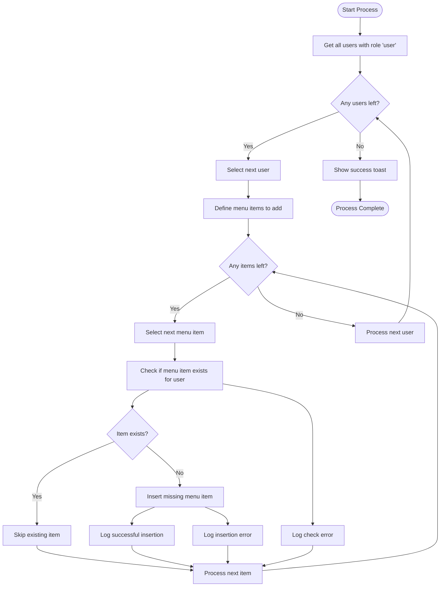
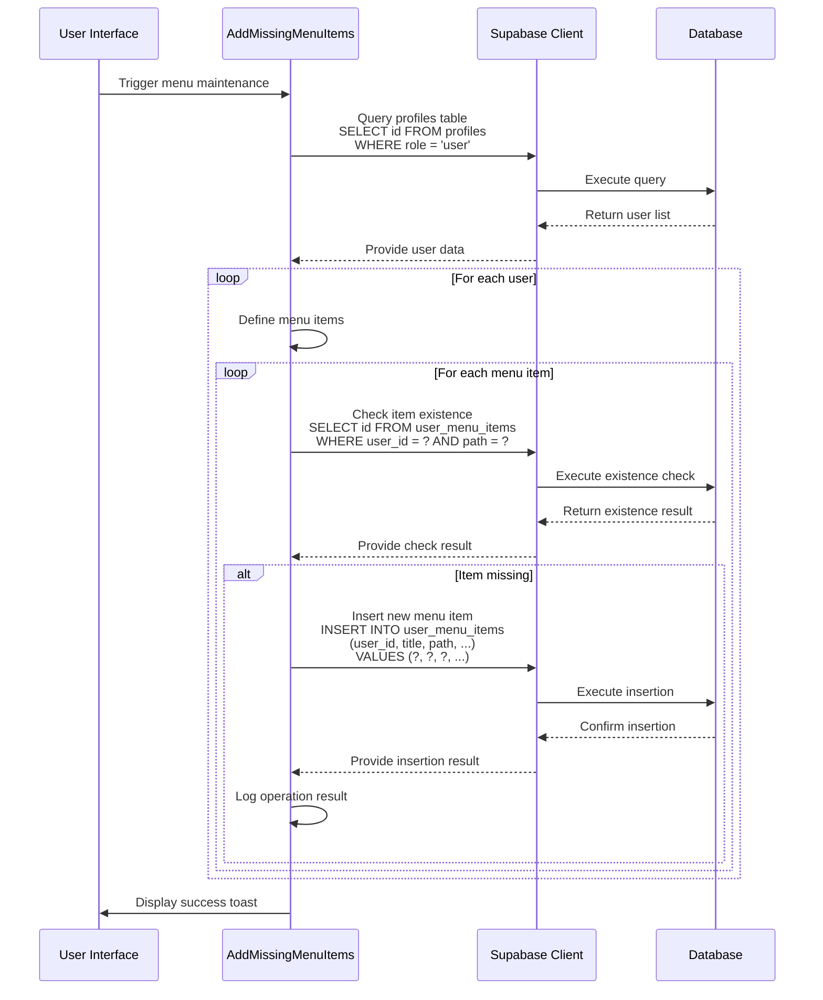
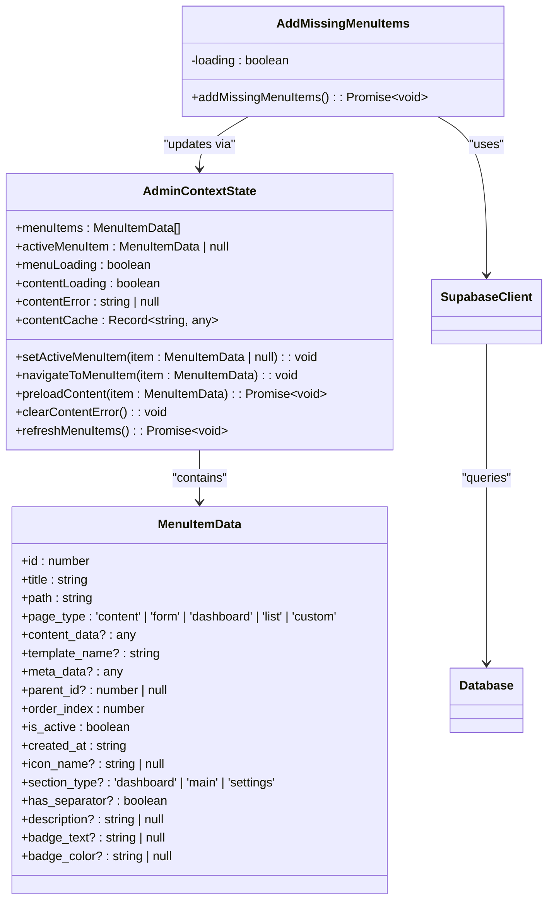
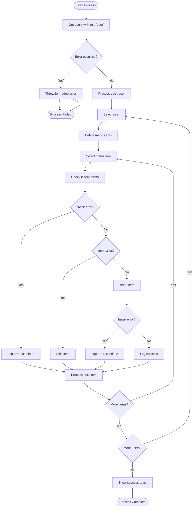

# Menu Management

<cite>
**Referenced Files in This Document**   
- [AddMissingMenuItems.tsx](file://src/components/admin/AddMissingMenuItems.tsx)
- [user-menu-service.ts](file://src/lib/user-menu-service.ts)
- [admin-provider.tsx](file://src/providers/admin-provider.tsx)
- [types.ts](file://src/integrations/supabase/types.ts)
</cite>

## Table of Contents
1. [Introduction](#introduction)
2. [Core Implementation](#core-implementation)
3. [Data Flow and Database Operations](#data-flow-and-database-operations)
4. [Integration with Admin Context](#integration-with-admin-context)
5. [Error Handling and Race Conditions](#error-handling-and-race-conditions)
6. [Performance Considerations](#performance-considerations)
7. [Conclusion](#conclusion)

## Introduction
The menu management system in the lovable-rise application ensures consistent user interface configurations across all users by maintaining standardized menu items. The AddMissingMenuItems utility plays a critical role in this system by automatically adding missing tariff, reports, and settings menu items for all users with the 'user' role. This documentation details the implementation of this utility, its integration with the Supabase database, and its relationship with the admin-provider context for comprehensive menu state management.

**Section sources**
- [AddMissingMenuItems.tsx](file://src/components/admin/AddMissingMenuItems.tsx#L7-L104)

## Core Implementation
The AddMissingMenuItems component implements a systematic approach to ensure all users have the required menu items in their navigation. The utility queries the database for all users with the 'user' role and then checks for the existence of three specific menu items: Tariff, Reports, and Settings. For each user, it verifies whether these items already exist in the user_menu_items table, and if not, inserts them with predefined metadata including proper ordering, page types, and icon assignments.

The implementation follows a two-step verification process: first retrieving all target users, then iterating through each user to check and potentially insert missing menu items. Each menu item is configured with specific attributes such as title, path, order_index, page_type, icon_name, and description to ensure consistent presentation across the application. The ordering is carefully designed with Tariff at position 3, Reports at 4, and Settings at 5 to maintain a logical navigation flow.

**Diagram sources**
- [AddMissingMenuItems.tsx](file://src/components/admin/AddMissingMenuItems.tsx#L10-L99)

**Section sources**
- [AddMissingMenuItems.tsx](file://src/components/admin/AddMissingMenuItems.tsx#L7-L104)

## Data Flow and Database Operations
The data flow for the AddMissingMenuItems utility begins with a query to the profiles table to retrieve all users with the 'user' role. This initial database operation uses Supabase's select and eq methods to filter users by role. Once the user list is obtained, the system iterates through each user, performing individual checks against the user_menu_items table to determine if the required menu items already exist.

For each menu item verification, the system executes a targeted query using the user_id and path as filters to check for existing records. This approach prevents duplicate entries while maintaining referential integrity. When a missing item is identified, the system performs an insert operation into the user_menu_items table with comprehensive metadata including the user_id, title, path, order_index, page_type, icon_name, and description.

The database schema, as defined in the Supabase types, specifies the structure of the user_menu_items table with essential fields such as id, created_at, is_active, order_index, parent_id, path, and title. The implementation leverages these schema constraints to ensure data consistency and proper relationships between menu items.

**Diagram sources**
- [AddMissingMenuItems.tsx](file://src/components/admin/AddMissingMenuItems.tsx#L10-L99)
- [types.ts](file://src/integrations/supabase/types.ts#L267-L333)

**Section sources**
- [AddMissingMenuItems.tsx](file://src/components/admin/AddMissingMenuItems.tsx#L10-L99)
- [types.ts](file://src/integrations/supabase/types.ts#L267-L333)

## Integration with Admin Context
The AddMissingMenuItems utility integrates with the admin-provider context to ensure menu consistency across the application. The admin-provider maintains the global menu state through the AdminContext, which includes the menuItems array, activeMenuItem, and various state management functions. When new menu items are added by the utility, they become available in the global menu state, ensuring immediate visibility to administrators.

The MenuItemData interface defined in the admin-provider specifies the structure of menu items with properties including id, title, path, page_type, order_index, is_active, and icon_name. This interface ensures type safety and consistency between the database records and the React component state. The AddMissingMenuItems utility creates menu items that conform to this interface, enabling seamless integration with the existing menu rendering components.

The admin-provider's loadMenuItems function periodically refreshes the menu items from the database, ensuring that any changes made by the AddMissingMenuItems utility are reflected in the UI. This synchronization mechanism maintains data consistency between the backend database and frontend presentation layer.

**Diagram sources**
- [admin-provider.tsx](file://src/providers/admin-provider.tsx#L162-L215)
- [AddMissingMenuItems.tsx](file://src/components/admin/AddMissingMenuItems.tsx#L7-L104)

**Section sources**
- [admin-provider.tsx](file://src/providers/admin-provider.tsx#L162-L215)
- [AddMissingMenuItems.tsx](file://src/components/admin/AddMissingMenuItems.tsx#L7-L104)

## Error Handling and Race Conditions
The AddMissingMenuItems utility implements comprehensive error handling to address potential issues during bulk operations. The implementation uses try-catch blocks to capture and handle errors at multiple levels, providing detailed logging for debugging purposes. When querying users, any errors are thrown with descriptive messages that include the original error message from Supabase.

For individual menu item operations, the utility employs a continue strategy when encountering errors during existence checks, allowing the process to proceed with other items rather than failing entirely. This approach ensures maximum resilience, as the failure to check one menu item does not prevent the processing of others. Insertion errors are logged individually without halting the entire process, enabling partial success when some operations fail.

The system addresses race conditions through its verification-before-insert pattern, which checks for existing items before attempting insertion. This prevents duplicate entries even if multiple instances of the utility run simultaneously. However, the current implementation processes users sequentially within a single execution, which could be optimized for better performance with large user bases.

Error notifications are provided through the toast utility, with success messages for complete operations and error messages for failures. This user feedback mechanism ensures administrators are informed of the operation's outcome regardless of success or failure.

**Diagram sources**
- [AddMissingMenuItems.tsx](file://src/components/admin/AddMissingMenuItems.tsx#L10-L99)

**Section sources**
- [AddMissingMenuItems.tsx](file://src/components/admin/AddMissingMenuItems.tsx#L10-L99)

## Performance Considerations
The current implementation of AddMissingMenuItems has performance implications when dealing with large numbers of users, as it uses nested loops that result in O(n*m) database operations where n is the number of users and m is the number of menu items to check. Each user-menu item combination requires at least one database query, leading to potentially hundreds or thousands of individual operations for large user bases.

To optimize performance, batch operations could be implemented to reduce the number of round trips to the database. Instead of checking and inserting items individually, the system could query for all existing user-menu item combinations in a single operation and then insert all missing combinations in another batch operation. This approach would significantly reduce database load and execution time.

The utility currently lacks progress indication for long-running operations, which could lead to user frustration when processing large datasets. Implementing a progress tracking mechanism with periodic updates would improve the user experience. Additionally, the operation could be moved to a background job or serverless function to prevent UI blocking during execution.

Resource usage considerations include memory consumption for storing user and menu item data, network bandwidth for database communications, and database connection pooling. The current implementation does not include rate limiting or pagination, which could cause issues with database connection limits when processing very large user sets.

**Section sources**
- [AddMissingMenuItems.tsx](file://src/components/admin/AddMissingMenuItems.tsx#L10-L99)

## Conclusion
The AddMissingMenuItems utility provides a reliable mechanism for maintaining consistent menu configurations across all users in the lovable-rise application. By systematically verifying and adding missing tariff, reports, and settings items, it ensures a uniform user experience and prevents configuration drift. The implementation effectively integrates with the Supabase database and admin context, leveraging proper error handling to maintain data integrity.

While the current implementation is functionally sound, there are opportunities for performance optimization, particularly in reducing the number of database operations through batching. Future enhancements could include progress tracking, background processing, and more sophisticated conflict resolution strategies. The utility serves as a critical maintenance tool for administrators, ensuring that all users have access to essential application features through a consistent navigation interface.