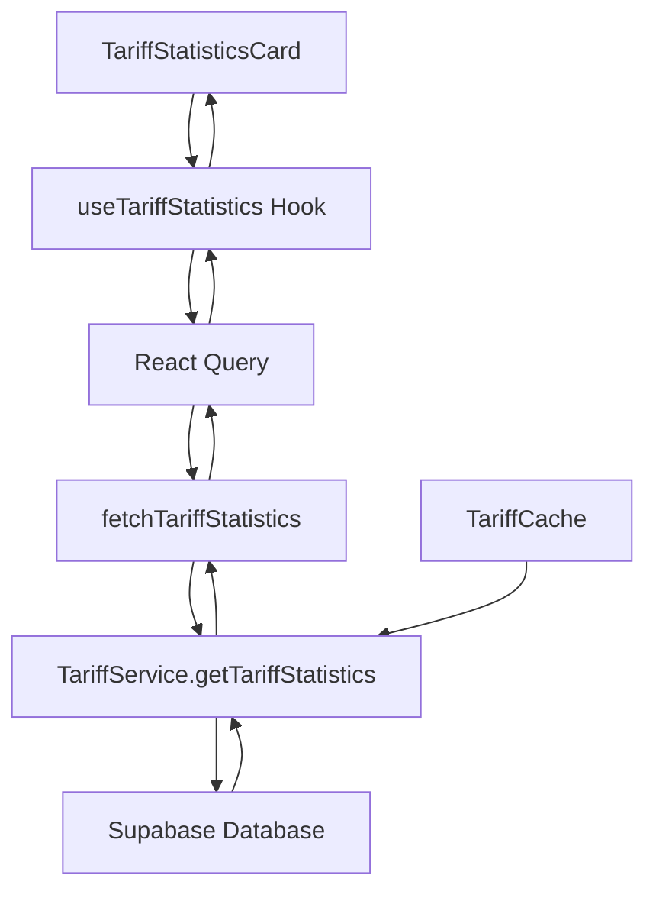
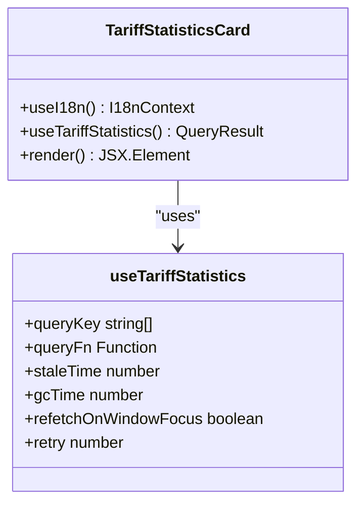
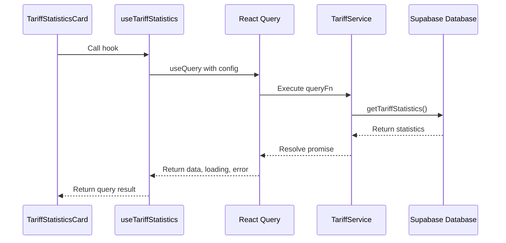
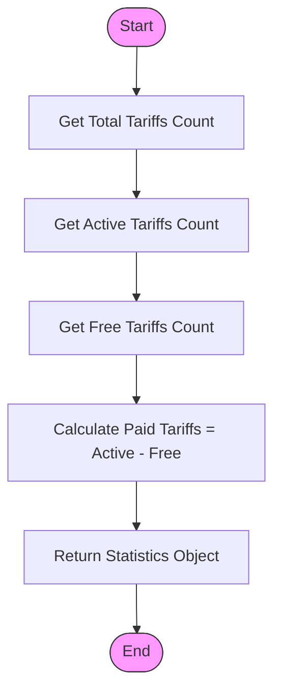
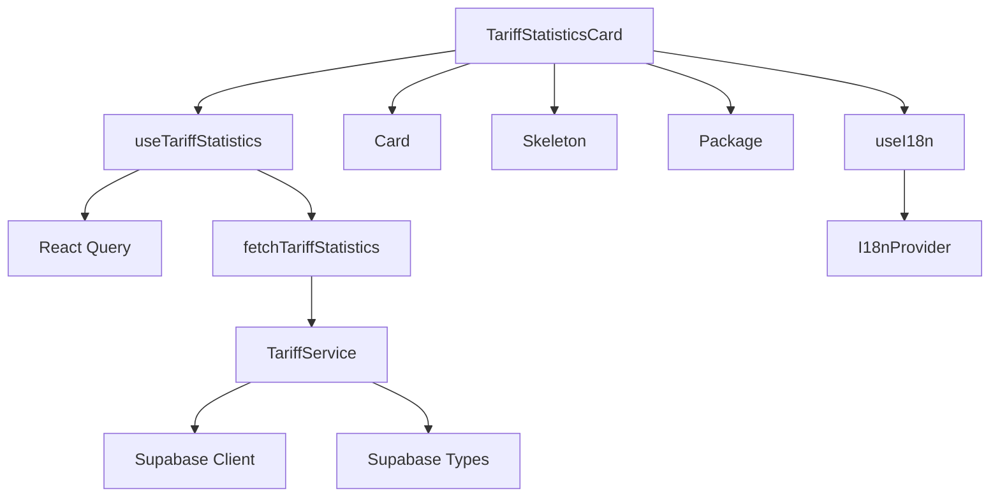

# Tariff Statistics

<cite>
**Referenced Files in This Document**   
- [TariffStatisticsCard.tsx](file://src/components/admin/TariffStatisticsCard.tsx)
- [useTariffStatistics.ts](file://src/hooks/useTariffStatistics.ts)
- [tariff-service.ts](file://src/lib/tariff-service.ts)
- [tariff-cache.ts](file://src/lib/tariff-cache.ts)
</cite>

## Table of Contents
1. [Introduction](#introduction)
2. [Core Components](#core-components)
3. [Architecture Overview](#architecture-overview)
4. [Detailed Component Analysis](#detailed-component-analysis)
5. [Dependency Analysis](#dependency-analysis)
6. [Performance Considerations](#performance-considerations)
7. [Troubleshooting Guide](#troubleshooting-guide)

## Introduction
The Tariff Statistics feature in the lovable-rise admin dashboard provides real-time insights into tariff subscription metrics through a dedicated statistics card component. This documentation details the implementation of the TariffStatisticsCard component and its integration with the useTariffStatistics hook, which together deliver accurate tariff count information to administrators. The system is designed to efficiently aggregate tariff data from the database, handle various UI states including loading and error conditions, and provide meaningful visual feedback. The implementation follows a layered architecture with clear separation between presentation, data fetching, and service layers, ensuring maintainability and scalability of the feature.

## Core Components
The tariff statistics functionality is built around two primary components: the TariffStatisticsCard component responsible for UI presentation and the useTariffStatistics hook that manages data fetching and state. These components work in concert to display active tariff counts while handling loading states, errors, and internationalization. The system leverages React Query for data fetching and caching, ensuring optimal performance and automatic background synchronization. The design incorporates responsive layouts that adapt to different screen sizes and follows accessibility best practices through proper semantic HTML structure and ARIA attributes.

**Section sources**
- [TariffStatisticsCard.tsx](file://src/components/admin/TariffStatisticsCard.tsx#L6-L56)
- [useTariffStatistics.ts](file://src/hooks/useTariffStatistics.ts#L21-L30)

## Architecture Overview
The tariff statistics feature follows a clean architectural pattern with distinct layers of responsibility. At the presentation layer, the TariffStatisticsCard component renders the UI and handles user interface states. The data layer is managed by the useTariffStatistics custom hook, which uses React Query to orchestrate data fetching, caching, and state management. The service layer, implemented in tariff-service.ts, contains the business logic for interacting with the Supabase database and performing data aggregation. This layered approach ensures separation of concerns, making the codebase more maintainable and testable. The architecture also incorporates caching mechanisms to reduce database load and improve response times for frequently accessed tariff statistics.

**Diagram sources **
- [TariffStatisticsCard.tsx](file://src/components/admin/TariffStatisticsCard.tsx#L6-L56)
- [useTariffStatistics.ts](file://src/hooks/useTariffStatistics.ts#L21-L30)
- [tariff-service.ts](file://src/lib/tariff-service.ts#L700-L739)

## Detailed Component Analysis

### TariffStatisticsCard Analysis
The TariffStatisticsCard component implements a responsive design pattern that adapts to various screen sizes while maintaining visual consistency. It handles three distinct states: loading, error, and success. During loading, skeleton components provide visual feedback to users, maintaining layout stability and improving perceived performance. In error states, the component displays a clear error message with descriptive text and an appropriate icon to help administrators understand and address issues. The success state presents the active tariff count in a prominent, easily readable format with appropriate typography and spacing. The component uses internationalization to support multiple languages, ensuring accessibility for global administrators.

#### For Object-Oriented Components:

**Diagram sources **
- [TariffStatisticsCard.tsx](file://src/components/admin/TariffStatisticsCard.tsx#L6-L56)

### useTariffStatistics Hook Analysis
The useTariffStatistics custom hook encapsulates the data fetching logic for tariff statistics, providing a clean API to consuming components. It leverages React Query's useQuery hook to manage the asynchronous data fetching process, including loading states, error handling, and caching. The hook defines specific query keys for cache invalidation and uses a stale time of 5 minutes, meaning data is considered fresh for this duration before requiring refresh. The garbage collection time is set to 10 minutes, after which unused query data is automatically cleaned up. The hook disables automatic refetching when the window regains focus to prevent unnecessary database queries, and implements a single retry attempt in case of transient failures.

#### For API/Service Components:

**Diagram sources **
- [useTariffStatistics.ts](file://src/hooks/useTariffStatistics.ts#L21-L30)
- [tariff-service.ts](file://src/lib/tariff-service.ts#L700-L739)

### Service Layer Analysis
The TariffService class provides the business logic for retrieving tariff statistics from the database. The getTariffStatistics method executes multiple database queries to count different categories of tariffs: total tariffs, active tariffs, and free tariffs. These counts are then used to calculate the number of paid tariffs by subtracting free tariffs from active tariffs. Each query uses Supabase's count functionality with appropriate filters to ensure accurate results. The service layer handles errors gracefully, logging them to the console and propagating them to the calling code for appropriate UI handling. The implementation follows security best practices by using parameterized queries and adhering to the application's role-based access control policies.

#### For Complex Logic Components:

**Diagram sources **
- [tariff-service.ts](file://src/lib/tariff-service.ts#L700-L739)

## Dependency Analysis
The tariff statistics feature has well-defined dependencies between its components and external services. The TariffStatisticsCard component depends on the useTariffStatistics hook for data, which in turn depends on React Query for state management and the TariffService for data retrieval. The TariffService depends on the Supabase client for database access and uses type definitions from the Supabase types file. The component also depends on UI primitives like Card, Skeleton, and Package icon from the application's component library. Internationalization is handled through the useI18n hook, which provides translation functions. These dependencies are managed through ES6 module imports, ensuring clear visibility of component relationships and facilitating tree-shaking for optimal bundle size.

**Diagram sources **
- [TariffStatisticsCard.tsx](file://src/components/admin/TariffStatisticsCard.tsx#L1-L58)
- [useTariffStatistics.ts](file://src/hooks/useTariffStatistics.ts#L1-L30)
- [tariff-service.ts](file://src/lib/tariff-service.ts#L1-L739)

## Performance Considerations
The tariff statistics implementation incorporates several performance optimizations to ensure efficient data retrieval and presentation. The use of React Query provides built-in caching with a 5-minute stale time, reducing the frequency of database queries and improving response times for subsequent requests. The getTariffStatistics method in the TariffService class uses Supabase's count functionality with the head parameter, which optimizes database performance by returning only the count without fetching actual records. The component implements skeleton loading states to provide immediate visual feedback, enhancing perceived performance. Additionally, the system could benefit from implementing the tariff-cache.ts module for frequently accessed tariff data, although this is currently used primarily for full tariff lists rather than statistics. For high-traffic scenarios, consider implementing database-level caching or using materialized views to pre-compute tariff statistics.

**Section sources**
- [useTariffStatistics.ts](file://src/hooks/useTariffStatistics.ts#L25-L28)
- [tariff-service.ts](file://src/lib/tariff-service.ts#L700-L739)
- [tariff-cache.ts](file://src/lib/tariff-cache.ts#L1-L46)

## Troubleshooting Guide
Common issues with the tariff statistics feature typically involve data synchronization, caching inconsistencies, or API errors. When statistics appear incorrect, first verify that the database queries in TariffService.getTariffStatistics are using the correct filters for active and free tariffs. Check the Supabase logs for any database errors that might prevent successful query execution. If the UI shows loading states indefinitely, ensure that the React Query configuration in useTariffStatistics has appropriate retry settings and that network requests are completing successfully. For caching issues, the TariffCache can be manually cleared by calling its clear() method, forcing a fresh data fetch on the next request. Error states should display meaningful messages to administrators, with detailed error information logged to the console for debugging purposes. When troubleshooting, verify that the Supabase client is properly authenticated and has the necessary permissions to read from the tariffs table.

**Section sources**
- [TariffStatisticsCard.tsx](file://src/components/admin/TariffStatisticsCard.tsx#L20-L38)
- [useTariffStatistics.ts](file://src/hooks/useTariffStatistics.ts#L29-L30)
- [tariff-service.ts](file://src/lib/tariff-service.ts#L700-L739)