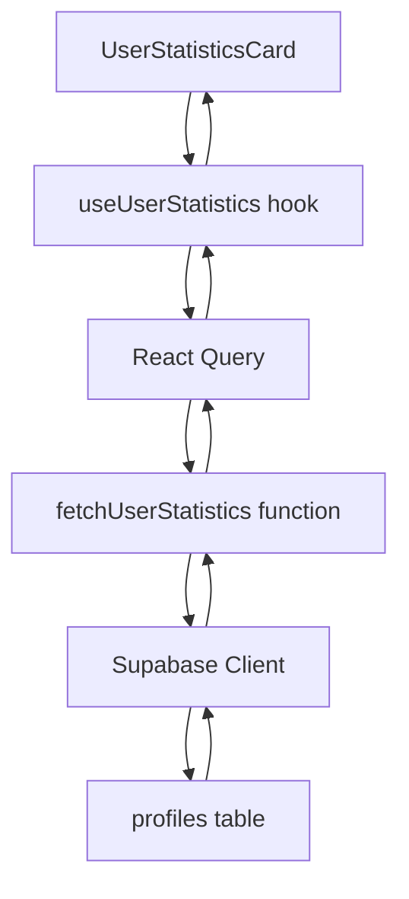
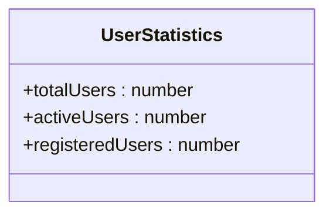
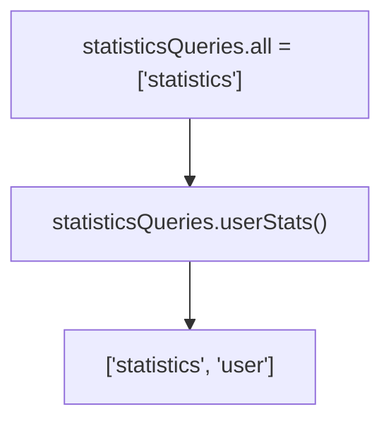
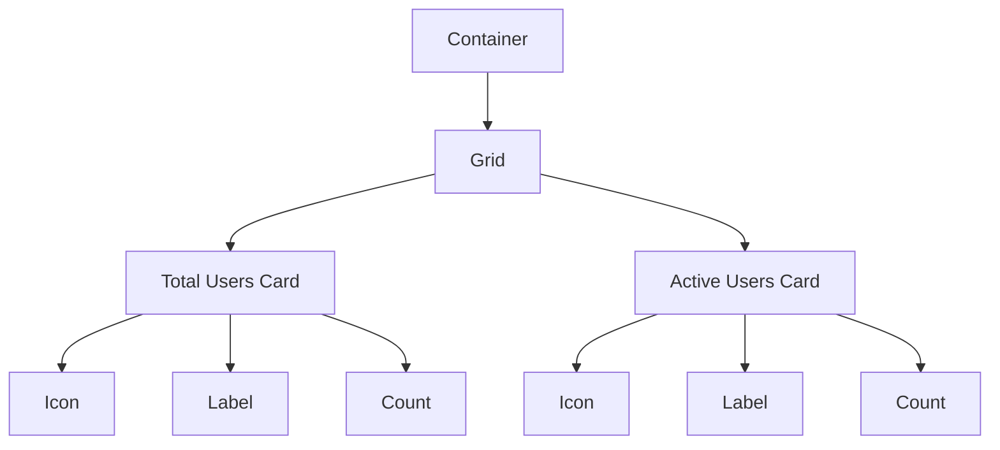
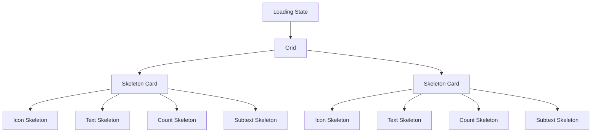
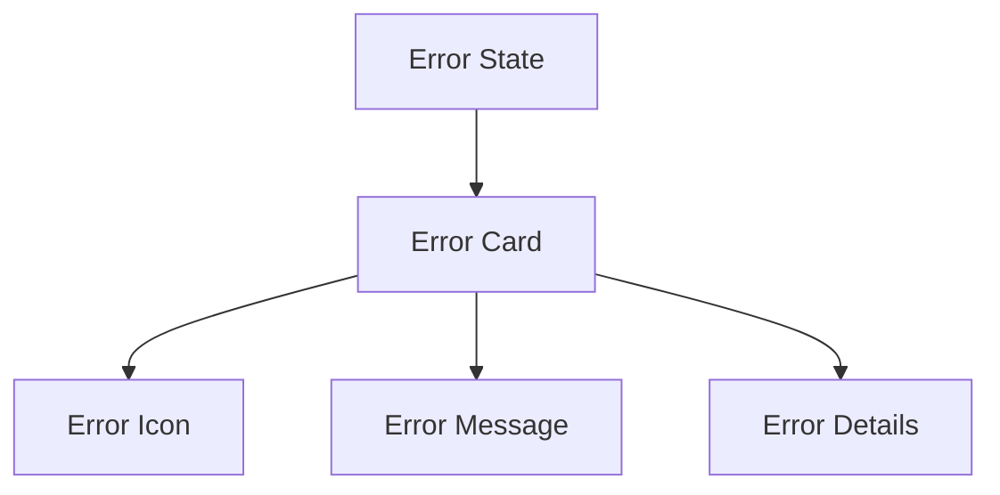
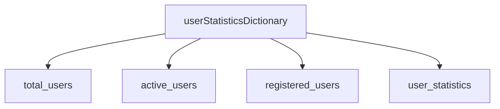

# User Statistics

<cite>
**Referenced Files in This Document**   
- [UserStatisticsCard.tsx](file://src/components/admin/UserStatisticsCard.tsx)
- [useUserStatistics.ts](file://src/hooks/useUserStatistics.ts)
- [i18n-provider.tsx](file://src/providers/i18n-provider.tsx)
</cite>

## Table of Contents
1. [Introduction](#introduction)
2. [Core Components](#core-components)
3. [Data Flow and Architecture](#data-flow-and-architecture)
4. [Domain Model](#domain-model)
5. [UI Implementation](#ui-implementation)
6. [Error Handling and Internationalization](#error-handling-and-internationalization)
7. [Performance Considerations](#performance-considerations)
8. [Security and Access Control](#security-and-access-control)

## Introduction
The User Statistics feature in the lovable-rise admin dashboard provides administrators with key metrics about user base growth and engagement. This document details the implementation of the UserStatisticsCard component, which displays total and active user counts through a data flow that spans from UI components to database queries. The system leverages React Query for efficient data fetching and caching, implements responsive design principles, and incorporates comprehensive error handling with internationalized messages.

## Core Components

The User Statistics monitoring system consists of three primary components that work together to provide user metrics to the admin dashboard:

1. **UserStatisticsCard**: The UI component that renders the statistics in a visually appealing card format
2. **useUserStatistics hook**: The custom React hook that manages data fetching, caching, and state
3. **Statistics service layer**: The underlying data access layer that queries the database

The implementation follows a clean separation of concerns, with each component responsible for a specific aspect of functionality. The UserStatisticsCard focuses solely on presentation, while the useUserStatistics hook handles all data-related logic, including error states, loading indicators, and cache management.

**Section sources**
- [UserStatisticsCard.tsx](file://src/components/admin/UserStatisticsCard.tsx#L7-L85)
- [useUserStatistics.ts](file://src/hooks/useUserStatistics.ts#L41-L50)

## Data Flow and Architecture

The data flow for user statistics follows a unidirectional pattern from the database to the UI component:

**Diagram sources** 
- [UserStatisticsCard.tsx](file://src/components/admin/UserStatisticsCard.tsx#L7-L85)
- [useUserStatistics.ts](file://src/hooks/useUserStatistics.ts#L41-L50)

The process begins when the UserStatisticsCard component mounts and calls the useUserStatistics hook. This hook leverages React Query's useQuery function to manage the asynchronous data fetching operation. The query is configured with a specific queryKey structure that enables efficient caching and automatic refetching when appropriate.

The data fetching function, fetchUserStatistics, makes two separate Supabase queries to the profiles table - one to count total users with the 'user' role, and another to count active users with both the 'user' role and 'active' status. These queries use Supabase's count functionality with { count: 'exact', head: true } options to optimize performance by returning only the count without the actual records.

## Domain Model

The user statistics domain model is defined by the UserStatistics interface, which contains three key fields:

**Diagram sources** 
- [useUserStatistics.ts](file://src/hooks/useUserStatistics.ts#L3-L7)

The primary fields used in the UserStatisticsCard are:
- **totalUsers**: Represents the total number of users with the 'user' role in the system
- **activeUsers**: Represents the number of users with both the 'user' role and 'active' status

The queryKey structure is carefully designed to enable effective caching and cache invalidation:

**Diagram sources** 
- [useUserStatistics.ts](file://src/hooks/useUserStatistics.ts#L10-L13)

This hierarchical structure allows for targeted cache invalidation - for example, if other statistics need to be refreshed, the base ['statistics'] key can be invalidated without affecting user statistics specifically.

The React Query configuration includes several performance optimizations:
- **staleTime**: 5 minutes (300,000 milliseconds) - determines how long data is considered fresh before a background refetch
- **gcTime**: 10 minutes (600,000 milliseconds) - specifies how long inactive queries are kept in memory
- **refetchOnWindowFocus**: false - prevents unnecessary refetching when users return to the tab
- **retry**: 1 - allows for one retry attempt if the initial request fails

**Section sources**
- [useUserStatistics.ts](file://src/hooks/useUserStatistics.ts#L41-L50)

## UI Implementation

The UserStatisticsCard implements a responsive grid layout that adapts to different screen sizes:

**Diagram sources** 
- [UserStatisticsCard.tsx](file://src/components/admin/UserStatisticsCard.tsx#L7-L85)

The component uses Tailwind CSS classes to create a responsive design:
- On mobile devices: single column layout (grid-cols-1)
- On small screens and above: two-column layout (sm:grid-cols-2)
- Responsive spacing with different gap sizes based on screen size (gap-3 sm:gap-4 md:gap-6)

The loading state is implemented with skeleton screens that maintain the same layout structure as the final content, providing a smooth user experience:

**Diagram sources** 
- [UserStatisticsCard.tsx](file://src/components/admin/UserStatisticsCard.tsx#L7-L85)

The skeleton implementation uses the UI library's Skeleton component with carefully sized elements that match the final design, ensuring a seamless transition from loading to loaded state.

**Section sources**
- [UserStatisticsCard.tsx](file://src/components/admin/UserStatisticsCard.tsx#L7-L85)

## Error Handling and Internationalization

The UserStatisticsCard implements comprehensive error handling with user-friendly messages:

**Diagram sources** 
- [UserStatisticsCard.tsx](file://src/components/admin/UserStatisticsCard.tsx#L34-L66)

When an error occurs during data fetching, the component displays a visually distinct error card with:
- A warning icon (Activity from lucide-react)
- A red color scheme to indicate the error state
- An internationalized error message
- Technical details about the specific error

The internationalization system is implemented through the useI18n hook, which provides translation capabilities throughout the application. The relevant translation keys are defined in the i18n-provider:

**Diagram sources** 
- [i18n-provider.tsx](file://src/providers/i18n-provider.tsx#L825-L840)

The error message key "error_fetch_users" is translated into both Ukrainian and English, allowing the application to support multiple languages. This approach ensures that error messages are consistent with the rest of the application's localization strategy.

**Section sources**
- [UserStatisticsCard.tsx](file://src/components/admin/UserStatisticsCard.tsx#L34-L66)
- [i18n-provider.tsx](file://src/providers/i18n-provider.tsx#L825-L840)

## Performance Considerations

The user statistics implementation includes several performance optimizations to ensure efficient data retrieval at scale:

1. **Database-level optimization**: The Supabase queries use the count parameter with { count: 'exact', head: true } to retrieve only the count value without fetching actual records, significantly reducing network payload and database load.

2. **Caching strategy**: React Query's caching mechanism with a 5-minute stale time prevents unnecessary database queries while ensuring data remains reasonably fresh.

3. **Separate queries**: The implementation uses two separate queries for total and active users rather than a single query with conditional counting. This allows for more efficient database execution plans and better cache utilization.

4. **Connection reuse**: The Supabase client maintains a persistent connection, avoiding the overhead of establishing new connections for each request.

For very large user bases, additional optimizations could include:
- Implementing database-level materialized views that pre-compute user counts
- Using approximate counting algorithms for near-real-time statistics
- Implementing a background job that updates statistics periodically rather than calculating them on-demand

The current implementation strikes a balance between accuracy and performance, providing up-to-date statistics without placing excessive load on the database.

## Security and Access Control

Access to user statistics is protected by several security mechanisms:

1. **Authentication**: The Supabase client automatically includes authentication tokens in requests, ensuring only authenticated users can access the data.

2. **Row Level Security (RLS)**: The profiles table is protected by RLS policies that restrict access based on user roles and permissions.

3. **Error handling**: The system gracefully handles permission errors by displaying appropriate error messages rather than exposing sensitive information about the underlying data structure.

Common issues when accessing user data typically relate to permission errors, which can occur when:
- The user's session has expired
- The user lacks sufficient privileges to view user statistics
- RLS policies are misconfigured

Solutions include:
- Implementing proper session management and refresh mechanisms
- Ensuring administrators have the appropriate roles and permissions
- Regularly auditing and testing RLS policies to ensure they function as intended
- Providing clear error messages that guide users toward resolution (e.g., suggesting they contact an administrator if they lack permissions)

The implementation follows security best practices by never exposing raw error details to end users and by using standardized error handling throughout the application.